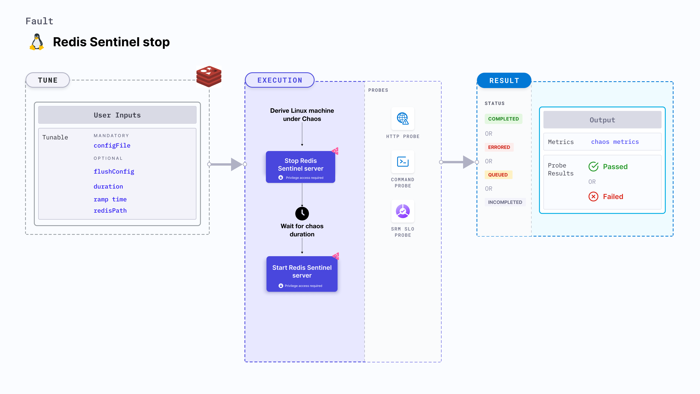

import Ossupport from './shared/note-supported-os.md'
import FaultPermissions from './shared/fault-permissions.md'
import AuthenticationDetails from './shared/redis-auth.md'

Redis Sentinel stop fault stops the [Redis Sentinel server](https://redis.io/docs/latest/operate/oss_and_stack/management/sentinel) for a specific chaos duration and then starts it.



## Use cases
Determines the resilience of Redis-dependant application when the Redis server is unavailable.

<Ossupport />

<FaultPermissions />

<AuthenticationDetails />

### Mandatory tunables

<table>
  <tr>
    <th> Tunable </th>
    <th> Description </th>
    <th> Notes </th>
  </tr>
  <tr>
    <td> configFile </td>
    <td> Path to the file where the Redis Sentinel config is stored. If <code>startSentinel</code> is set to <code>true</code>, this variable is required. </td>
    <td> For more information, go to <a href="#configuration-file"> configuration file</a>.</td>
  </tr>
</table>

### Optional tunables
<table>
  <tr>
    <th> Tunable </th>
    <th> Description </th>
    <th> Notes </th>
  </tr>
  <tr>
    <td> flushConfig </td>
    <td> It flushes the initial configuration before starting the Sentinel server if set to <code>true</code>. </td>
    <td> Default: true. You can set it to <code>true</code> or <code>false</code>.</td>
  </tr>
  <tr>
    <td> redisPath </td>
    <td> The file path of the Redis server. Not required until the binary is added to the path. </td>
    <td> </td>
  </tr>
  <tr>
    <td> startSentinel </td>
    <td> Decide whether the server should start on its own after stopping it or the fault should explicitly start the server.</td>
    <td> Default: false. You can set it to <code>true</code> or <code>false</code>.</td>
  </tr>
  <tr>
    <td> duration </td>
    <td> Duration through which chaos is injected into the target resource. Should be provided in <code>[numeric-hours]h[numeric-minutes]m[numeric-seconds]s</code> format. </td>
    <td> Default: <code>30s</code>. Examples: <code>1m25s</code>, <code>1h3m2s</code>, <code>1h3s</code>. For more information, go to <a href="/docs/chaos-engineering/use-harness-ce/chaos-faults/common-tunables-for-all-faults#duration-of-the-chaos">duration.</a></td>
  </tr>
  <tr>
    <td> rampTime </td>
    <td> Period to wait before and after injecting chaos. Should be provided in <code>[numeric-hours]h[numeric-minutes]m[numeric-seconds]s</code> format. </td>
    <td> Default: <code>0s</code>. Examples: <code>1m25s</code>, <code>1h3m2s</code>, <code>1h3s</code>. For more information, go to <a href="/docs/chaos-engineering/use-harness-ce/chaos-faults/common-tunables-for-all-faults#ramp-time">ramp time</a>. </td>
  </tr>
</table>

### Configuration file

The `configFile` input variable stores the path to the file where the Redis Sentinel config is stored. If `startSentinel` is set to **false**, this variable is not required.

The following YAML snippet illustrates the use of this input variable:

[embedmd]:# (./static/manifests/redis-sentinel-stop/config-file.yaml yaml)
```yaml
apiVersion: litmuchaos.io/v1alpha1
kind: LinuxFault
metadata:
  name: redis-sentinel-stop
  labels:
    name: sentinel-stop
spec:
  redisChaos/inputs:
    duration: 30s
    configFile: "/etc/redis/sentinel.conf"
    flushConfig: true
    redisPath: ""
    rampTime: ""
    startSentinel: false
```
