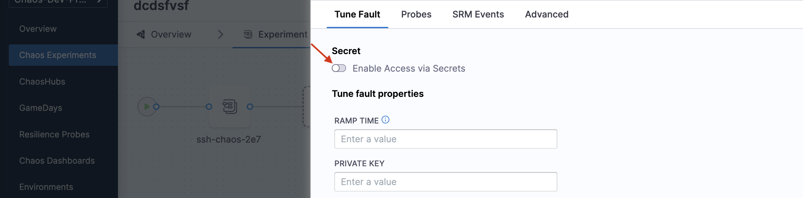
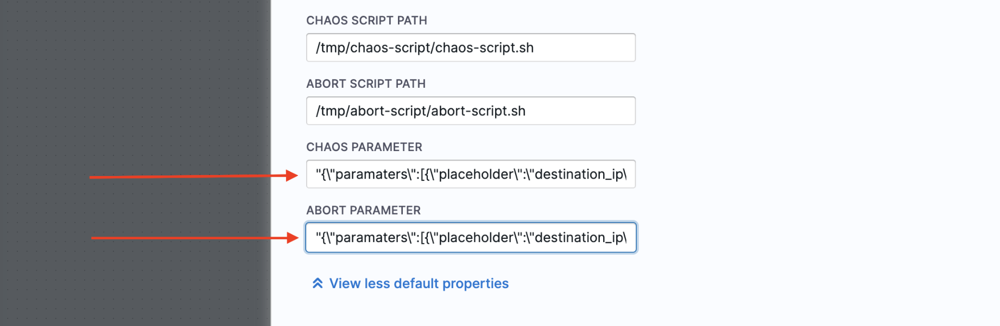
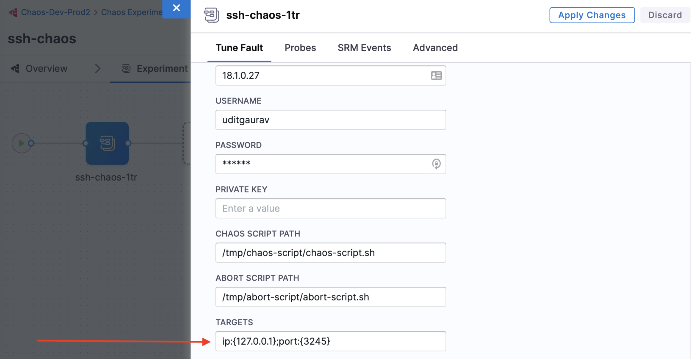
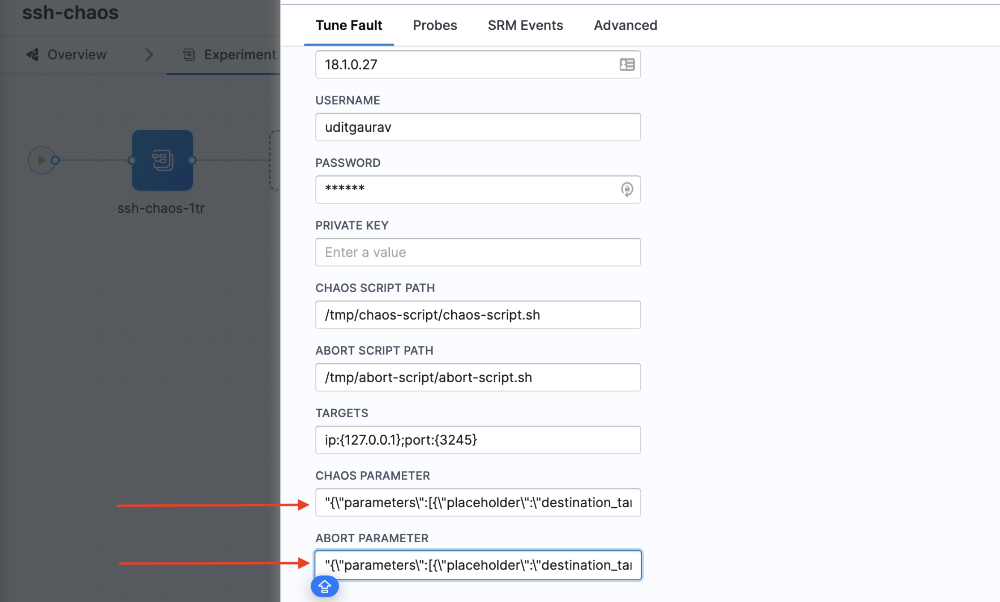
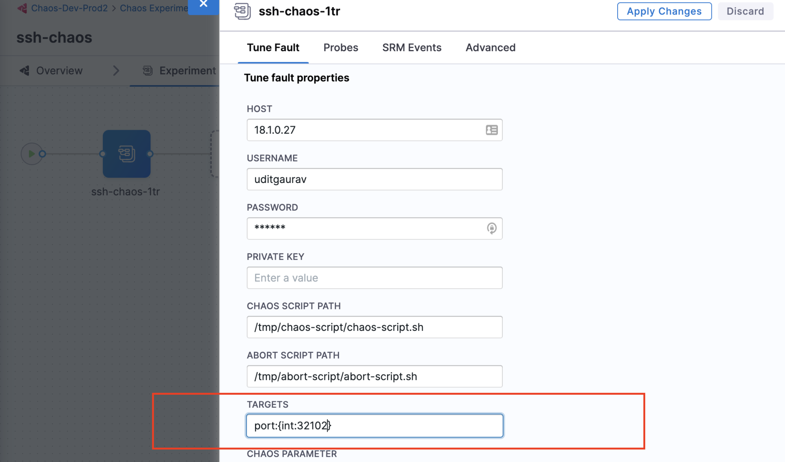

Before executing the chaos experiment, ensure that you have the following set-up ready.

## Create ConfigMap and secret

### 1. Create ConfigMap from scripts
The scripts used to create ConfigMap are **Chaos script** and **Abort script**.
**Chaos script** contains the chaos logic, and **abort script** contains the logic to restore the system to its original state if the chaos script fails prematurely.

a. To create the ConfigMap from the chaos scripts, use the following command:
```
kubectl create configmap chaos-script --from-file=script.sh -n <INFRA-NAMESPACE>
```
Here, `chaos-script` is the name of the ConfigMap for chaos script, `script.sh` is the bash script that contains the chaos logic, and `<INFRA-NAMESPACE>` is the namespace where the chaos infrastructure is installed.

b. To create the ConfigMap from the abort script, use the following command:
```
kubectl create configmap abort-script --from-file=abort-script.sh -n<INFRA-NAMESPACE>
```
Here, `abort-script` is the name of the ConfigMap for abort script, and `abort-script.sh` is the bash script that contains the abort logic.

:::tip
After executing both commands, verify if the ConfigMaps have been created using the following command:
```
kubectl get configmap -n <INFRA-NAMESPACE>
```
If the names of the configmaps appear, this indicates the successful creation of the ConfigMaps.
:::

### 2. Create a secret for SSH
You can create a secret for SSH in two ways:

1. Using a private key
If you use a private key file for SSH access to the target host or VM, prepare the secret as shown:
```
kubectl create secret generic ssh-secret --from-file=key-file.pem -n<INFRA-NAMESPACE>
```
Here, `ssh-secret` is the name of the secret, and `key-file.pem` is the private key for SSH access.

:::tip
To verify if the secret has been created, execute the following command and identify the value for `ssh-secret`.
```
kubectl get secret -n <INFRA-NAMESPACE>
```
:::

2. Using a password
If you use a password for SSH access, provide the value for PASSWORD environment variable while tuning the fault.
For secure password transmission, create a secret with the password and pass it as the environment variable, as mentioned below.
  * Create a file named `my-secret.yaml`, with the below content.

    ```yaml
    apiVersion: v1
    kind: Secret
    metadata:
      name: my-secret
    type: Opaque
    stringData:
      password: "mypassword"
    ```
  The key is `password` and the value is the actual password string `mypassword`.

  * Apply the secret to the specific namespace using the following command:
    ```
    kubectl apply -f my-secret.yaml -n <INFRA-NAMESPACE>
    ```

## Configure secret mount from the UI
You can configure the secret mount from the UI by selecting or deselecting the button depending on your use of the secret references.



## Setup chaos parameters

You can use two different methods to pass parameters within a chaos experiment, depending on various chaos scenarios. The two approaches for parameter passing are:
1. Declarative parameter definition
2. Single environment variable parameters

Both the approaches involve creating a JSON string for parameters and utilizing the `CHAOS_PARAMETER` and `ABORT_PARAMETER` environment variables for chaos and abort scripts, respectively.

### 1. Declarative parameter definition

This approach allows for explicit parameter validation within the JSON, ensuring that each parameter expects certain data types.

#### Steps involved
* **Parameter preparation:** You can define parameters within a JSON object, specifying placeholders, data types, and values.
* **String escaping:** The JSON object is converted into an escaped string format, that is suitable to passing into experiments through environment variables.

Consider the following example, that passes two parameters, an IP address and a port number to the chaos experiment.

1. JSON object would look like below:

```
{
    "parameters": [
        {
            "placeholder": "destination_ip",
            "data_type": "string",
            "value": "HOST_IP"
        },
        {
            "placeholder": "port",
            "data_type": "int",
            "value": "3258"
        }
      ]
}
```

2. JSON escaping

* Convert the JSON to a string format using `jq` or any other online JSON converter:

> `jq -c . input.json >> escaped-input.json`

* Display the results:

> `cat escaped-input.json`

The output would look like:

  ```
  jq -c '@json' escaped-input.json
  "{\"paramaters\":[{\"placeholder\":\"destination_ip\",
  \"data_type\":\"string\",\"value\":\"HOST_IP\"},
  {\"placeholder\":\"port\",\"data_type\":\"int\",
  \"value\":\"3258\"}]}"
  ```

* The resulting string is utilised in the `CHAOS_PARAMETER` and `ABORT_PARAMETER` as shown below.

  

#### Advantages of declarative parameter definition
* It enables data validation for each parameter thereby enhancing experiment reliability.
* It prevents script execution with invalid parameters with the help of pre-check validations.

#### Disadvantages of declarative parameter definition
* This method requires you to prepare the JSON string for each parameter.

### 2. Single environment variable parameters

This approach consolidates all parameters into a single environment variable thereby simplifying the parameter passing process. This section lists two use cases of the approach:

1. Parameters defined in a single environment variable

You can specify the values of the parameters in a single environment variable, `PARAM_VALS` as shown below:

`ip:{127.0.0.1};port:{3245}`



* JSON object would look like:

```
{
    "parameters": [
        {
            "placeholder": "destination_target",
            "data_type": "env",
            "value": "PARAM_VALS"
        }
    ]
}
```

:::note
The `CHAOS_PARAMETER` and `ABORT_PARAMETER` will be same for all chaos experiments that use the `PARAM_VALS` environment variable to pass parameters.


:::

2. Placeholders and their values in the environment variable.

You can pass the placeholders and their values (data types) to the environment variable for self-validation purposes.

To define `PARAM_VALS` as the placeholder `{<data-type>:<value>}`, you can pass the same value to the `PARAM_VALS` environment variable.



You can pass the port details and the placeholders in the environment variable. The chaos script contains the logic to extract the details of the environment variable.

For example, set `PARAM_VALS` with `dest_ip=127.0.0.1` and `source_ip=198.168.12.0`. You can pass the value in the environment variable and use the `CHAOS_PARAMETER` as shown [here](#steps-involved).

#### Advantages of single environment variable parameters

* It simplifies parameter management by consolidating the parameters into a single environment variable.
* It eliminates the need for multiple JSON parameter definitions.

#### Disadvantages of single environment variable parameters

* This method lacks out-of-the-box data type validation, and required manual validation within the chaos script.