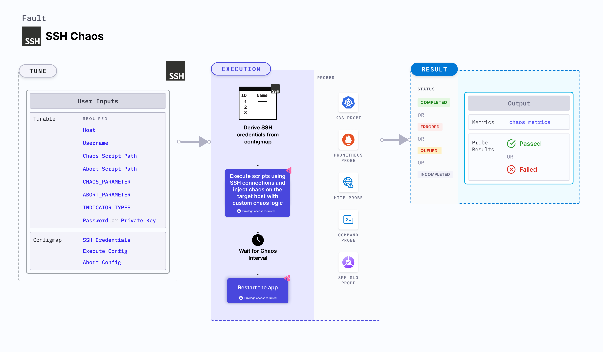
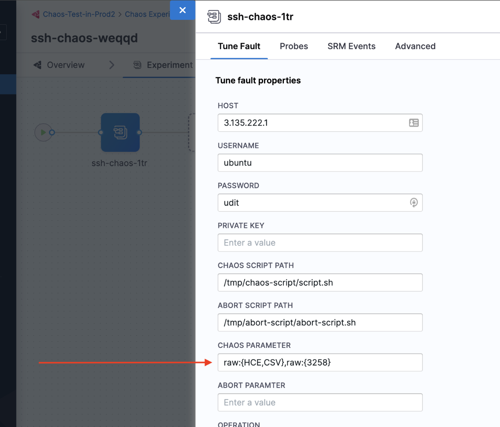
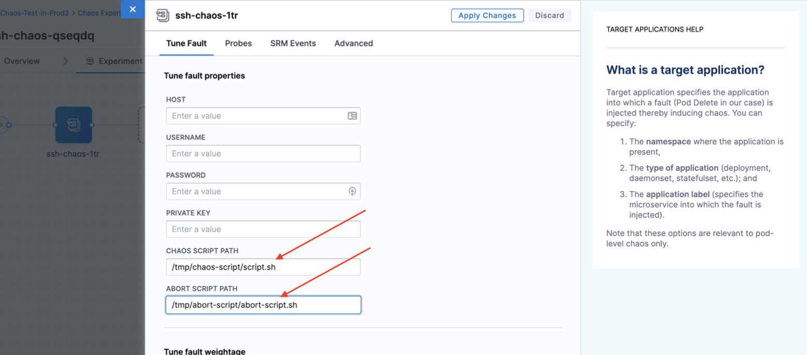

SSH chaos injects chaos on the target host using SSH connections by passing custom chaos logic through a ConfigMap. These scripts are executed using SSH credentials, which are securely referenced in the ConfigMap. This enables direct fault injection on the target host. This experiment offers customisation for the chaos injection logic, providing flexibility and control over chaos experiments.



## Use cases

SSH chaos can be used with custom chaos logic and transferred to a target VM (to execute network chaos experiments, power off, and so on).
- This serves as a framework that can be customised to perform other chaos experiments, such as network stress, HTTP, DNS, restart services, and so on.
- This framework can be used to roll back to the original state of an abort event.

## Executing the SSH chaos experiment
Before executing the SSH chaos experiment, ensure that you follow the steps in the [prerequisites](/docs/chaos-engineering/use-harness-ce/chaos-faults/ssh/prerequisites) section. This generates two experiment YAML files, namely `ssh-chaos-with-key.yaml` and `ssh-chaos-with-pass.yaml`. You can use one of them based on the authentication method you choose.

* Use `ssh-chaos-with-key.yaml` for private key authentication. This file references secrets in its YAML view. The `PASSWORD` environment variable should be empty.

* Use `ssh-chaos-with-pass.yaml` for password authentication. This file fetches the `PASSWORD` environment variable from the secret.

:::tip
If you use the default names for ConfigMap and secrets, you won't need to modify the experiment. If you use different names, update the respective environment variables with their names. For example, if your script file is `test.sh` instead of `script.sh`, update the `CHAOS SCRIPT PATH` environment variable with the correct value.
:::

### Mandatory tunables
   <table>
        <tr>
            <th> Variables </th>
            <th> Description </th>
            <th> Notes </th>
        </tr>
        <tr>
            <td> HOST </td>
            <td> Name of the target host under chaos. </td>
            <td> Provide the name of the target host, for example, <code>https://google.com</code>.</td>
        </tr>
        <tr>
            <td> USERNAME </td>
            <td> Username of the target VM. </td>
            <td> For example, "username".</td>
        </tr>
        <tr>
            <td> PASSWORD </td>
            <td> Password used for authentication. Either <code>PASSWORD</code> or <code>PRIVATE KEY</code> is used. </td>
            <td> For example: "abcd".</td>
        </tr>
        <tr>
            <td> PRIVATE KEY </td>
            <td> Key used for file-based authentication. Either <code>PASSWORD</code> or <code>PRIVATE KEY</code> is used. </td>
            <td> For example: key-file.pem </td>
        </tr>
        <tr>
            <td> CHAOS SCRIPT PATH </td>
            <td> Path to the chaos script. </td>
            <td> For more information, go to <a href="#chaos-script-path"> chaos script path.</a></td>
        </tr>
        <tr>
            <td> ABORT SCRIPT PATH </td>
            <td> Path to the abort script. </td>
            <td> For more information, go to <a href="#abort-script-path"> abort script path.</a></td>
        </tr>
        <tr>
            <td> CHAOS_PARAMETER </td>
            <td> Parameter for the chaos script. </td>
            <td> For more information, go to <a href="#chaos-parameter"> chaos parameter.</a></td>
        </tr>
        <tr>
            <td> ABORT_PARAMETER </td>
            <td> Parameter for the abort script. </td>
            <td> For more information, go to <a href="#abort-parameter"> abort parameter.</a></td>
        </tr>
        <tr>
            <td> INDICATOR_TYPES </td>
            <td> Comma-separated indicator types for customisation of parameter indicators. </td>
            <td> For more information, go to <a href="#indicator-types"> indicator types.</a></td>
        </tr>
    </table>

:::info note
HCE recommends using the format `env:{$ENV_NAME}` to pass confidential parameters. In this method, the environment variable is retrieved from a secure source (such as a secret). This ensures that the sensitive information remains uncompromised.
:::

### Chaos script path

Path to the chaos script (the chaos script is used to create the ConfigMap). Tune it by using the `CHAOS_SCRIPT_PATH` environment variable.

The following YAML snippet illustrates the environment variable:

[embedmd]:# (./static/manifests/ssh-chaos/chaos-script-path.yaml yaml)
```yaml
apiVersion: litmuschaos.io/v1alpha1
kind: ChaosEngine
metadata:
  name: load-nginx
spec:
  engineState: "active"
  chaosServiceAccount: litmus-admin
  experiments:
  - name: ssh-chaos
    spec:
      components:
        env:
        - name: CHAOS_SCRIPT_PATH
          value: /tmp/chaos-script/chaos-script.sh
```

### Abort script path

Path to the abort script (the abort script is used to create the ConfigMap). Tune it by using the `ABORT_SCRIPT_PATH` environment variable.

The following YAML snippet illustrates the environment variable:

[embedmd]:# (./static/manifests/ssh-chaos/abort-script-path.yaml yaml)
```yaml
apiVersion: litmuschaos.io/v1alpha1
kind: ChaosEngine
metadata:
  name: load-nginx
spec:
  engineState: "active"
  chaosServiceAccount: litmus-admin
  experiments:
  - name: ssh-chaos
    spec:
      components:
        env:
        - name: ABORT_SCRIPT_PATH
          value: /tmp/abort-script/abort-script.sh
```

### Chaos parameter

Parameter for the chaos script. Tune it by using the `CHAOS_PARAMETER` environment variable.

The following YAML snippet illustrates the environment variable:

[embedmd]:# (./static/manifests/ssh-chaos/chaos-parameter.yaml yaml)
```yaml
apiVersion: litmuschaos.io/v1alpha1
kind: ChaosEngine
metadata:
  name: load-nginx
spec:
  engineState: "active"
  chaosServiceAccount: litmus-admin
  experiments:
  - name: ssh-chaos
    spec:
      components:
        env:
        - name: CHAOS_PARAMETER
          value: "{\"parameters\":[{\"placeholder\":\"destination_ip\",
                    \"data_type\":\"string\",\"value\":\"HOST_IP\"},
                    {\"placeholder\":\"port\",\"data_type\":\"int\",
                      \"value\":\"3258\"}]}"
```

### Abort parameter

Parameter for the abort script. Tune it by using the `ABORT_PARAMETER` environment variable.

The following YAML snippet illustrates the environment variable:

[embedmd]:# (./static/manifests/ssh-chaos/abort-parameter.yaml yaml)
```yaml
apiVersion: litmuschaos.io/v1alpha1
kind: ChaosEngine
metadata:
  name: load-nginx
spec:
  engineState: "active"
  chaosServiceAccount: litmus-admin
  experiments:
  - name: ssh-chaos
    spec:
      components:
        env:
        - name: ABORT_PARAMETER
          value: "{\"parameters\":[{\"placeholder\":\"destination_ip\",
                    \"data_type\":\"string\",\"value\":\"HOST_IP\"},
                    {\"placeholder\":\"port\",\"data_type\":\"int\",
                      \"value\":\"3258\"}]}"
```

:::tip
Input parameters can be specified in different formats.
1. Raw value format: `raw:{value}`. Example:
```yaml
- name: CHAOS_PARAMETER
   value: "raw:{value}"
```

2. Environment variable format: `env:{$ENV1}`. Example:
```yaml
- name: CHAOS_PARAMETER
   value: "env:{$ENV1}"
```

3. Combination format: `raw:{value},env:{$ENV1}`. Example:
```yaml
- name: CHAOS_PARAMETER
   value: "raw:{value},env:{$ENV1}"
```
:::

### Indicator types

Comma-separated indicator types that allow for the customisation of parameter indicators. This customisation enhances the flexibility of parameter specification. Tune it by using the `INDICATOR_TYPES` environment variable.
Customisable indicators include:
1. `raw:` - String parameter
2. `env:` - Environment variable parameter
3. `$` - Variable

Following are examples of default and customised formats:
1. The default format is `raw:{HCE,CSV},env:{$OPERATION},raw:{para3}`.
2. The customised format is `string:{HCE,CSV},environment:{&OPERATION},raw:{para3}`. 

To implement a customised format, set the `INDICATOR_TYPES` to `string,environment,&`. This setting allows modifying the indicators for `raw`, `environment`, and `$` values, thereby providing a tailored approach to parameter passing.



## Customising ConfigMap and Secret names
SSH chaos is equipped to support custom names for ConfigMap and secrets by making a minor modification to the corresponding YAML file.

Suppose you wish to name the ConfigMap names as `chaos-cm` and `abort-cm` instead of the default `chaos-script` and `abort-script`, update the section below in the **experiment builder**:
```yaml
configMaps:
  - name: chaos-script
    mountPath: /tmp/chaos-script
  - name: abort-script
    mountPath: /tmp/abort-script
```

to:
```yaml
configMaps:
  - name: chaos-cm
    mountPath: /tmp/chaos-script
  - name: abort-cm
    mountPath: /tmp/abort-script
```

After you make the above changes, **Save** the updated file and **Run** the updated experiment.

### Customizing environment variables

If you wish to use the default ConfigMap and secret names but the script has a different name, you can update the environment variables (ENV) to align with the correct script by updating the script name in the chaos-script path or abort-script path.


