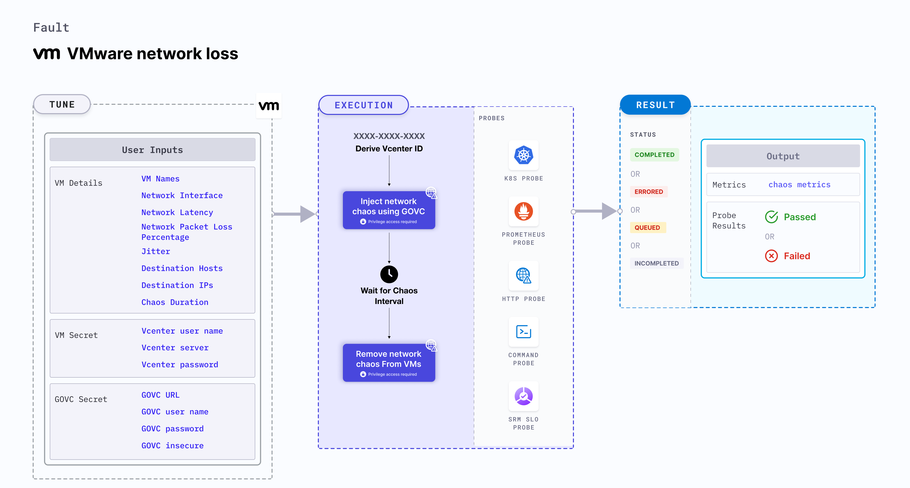

VMware network loss injects network packet loss from the VMware VM(s) into the application (or service). This results in flaky access to the application. It checks the performance of the application (or process) running on the VMware VM(s).



:::info note
HCE doesn't support injecting VMWare Windows faults on Bare metal server.
:::

## Use cases
VMware network loss:
- Simulates issues within the VM network (or microservice) communication across services in different hosts.
- Determines the impact of degradation while accessing a microservice.
- Limits the impact (blast radius) to the traffic that you wish to test by specifying the IP addresses, if the VM stalls or gets corrupted while waiting endlessly for a packet.
- Simulates degraded network with varied percentages of dropped packets between microservices.
- Simulates loss of access to specific third party (or dependent) services (or components).
- Simulates blackhole against traffic to a given availability zone, that is, failure simulation of availability zones.
- Simulates network partitions (split-brain) between peer replicas for a stateful application.

### Prerequisites
- Kubernetes > 1.16 is required to execute this fault.
- Appropriate vCenter permissions should be provided to start and stop the VMs.
- The VM should be in a healthy state before and after injecting chaos.
- Kubernetes secret has to be created that has the Vcenter credentials in the `CHAOS_NAMESPACE`. VM credentials can be passed as secrets or as a `ChaosEngine` environment variable. Below is a sample secret file:
```yaml
apiVersion: v1
kind: Secret
metadata:
  name: vcenter-secret
  namespace: litmus
type: Opaque
stringData:
    VCENTERSERVER: XXXXXXXXXXX
    VCENTERUSER: XXXXXXXXXXXXX
    VCENTERPASS: XXXXXXXXXXXXX
```

### Mandatory tunables

   <table>
      <tr>
        <th> Tunable </th>
        <th> Description </th>
        <th> Notes </th>
      </tr>
      <tr>
        <td> VM_NAMES </td>
        <td> Names of the target VMs as comma-separated values.</td>
        <td> For example, <code> vm-1,vm-2</code>. </td>
      </tr>
      <tr>
        <td> VM_USER_NAME </td>
        <td> Username of the target VM(s).</td>
        <td> Multiple usernames can be provided as comma-separated values which corresponds to more than one VM under chaos. It is used to run the govc command. </td>
      </tr>
      <tr>
        <td> VM_PASSWORD </td>
        <td> Password for the target VM(s).</td>
        <td> It is used to run the govc command. </td>
      </tr>
    </table>

### Optional tunables

   <table>
      <tr>
        <th> Tunable </th>
        <th> Description </th>
        <th> Notes </th>
      </tr>
      <tr>
        <td> TOTAL_CHAOS_DURATION </td>
        <td> Duration that you specify, through which chaos is injected into the target resource (in seconds). </td>
        <td> Defaults to 30s. For more information, go to <a href="/docs/chaos-engineering/use-harness-ce/chaos-faults/common-tunables-for-all-faults#duration-of-the-chaos"> duration of the chaos. </a></td>
      </tr>
      <tr>
        <td> CHAOS_INTERVAL </td>
        <td> Time interval between two successive instance terminations (in seconds). </td>
        <td> Default: 30s. For more information, go to <a href="/docs/chaos-engineering/use-harness-ce/chaos-faults/common-tunables-for-all-faults#chaos-interval"> chaos interval. </a></td>
      </tr>
      <tr>
        <td> NETWORK_PACKET_LOSS_PERCENTAGE </td>
        <td> Packets lost during transmission (in percent).</td>
        <td> Default: 100%. For more information, go to <a href="#network-packet-loss"> network packet loss. </a></td>
      </tr>
      <tr>
        <td> DESTINATION_IPS </td>
        <td> IP addresses of the services or pods whose accessibility you want to affect. You can also specify a CIDR block. </td>
        <td> Comma-separated IPs (or CIDRs) can be provided. If it has not been provided, network chaos is induced on all IPs (or destinations). For more information, go to <a href="#run-with-destination-ips-and-destination-hosts"> run with destination IPs.</a></td>
      </tr>
      <tr>
        <td> DESTINATION_HOSTS </td>
        <td> DNS names (or FQDN names) of the services whose accessibility is affected. </td>
        <td> If it has not been provided, network chaos is induced on all IPs (or destinations). For more information, go to <a href="#run-with-destination-ips-and-destination-hosts"> run with destination hosts. </a></td>
      </tr>
       <tr>
        <td> SOURCE_PORTS </td>
        <td> Comma-separated ports of the target application, the accessibility to which is impacted. If not provided, it will induce network chaos for all ports. For Example: <code>5000,8080</code> </td>
        <td> Alternatively, the source ports that should be exempted from the chaos can also be provided by prepending a <code>!</code> before the list of ports. For example: <code>!5000,8080</code>. For more information, go to <a href="#source-and-destination-ports"> source ports. </a></td>
      </tr>
      <tr>
        <td> DESTINATION_PORTS </td>
        <td> Ports of the destination services or pods or the CIDR blocks(range of IPs) whose accessibility is impacted. If not provided, network chaos is induced on all ports. For example, <code>5000,8080</code>. </td>
        <td> Alternatively, the destination ports to be exempted from the chaos can be provided by prepending a <code>!</code> to the list of ports. For example, <code>!5000,8080</code>. For more information, go to <a href="#source-and-destination-ports"> destination ports. </a></td>
      </tr>
      <tr>
        <td> SEQUENCE </td>
        <td> Sequence of chaos execution for multiple instances. </td>
        <td> Defaults to parallel. Supports serial sequence as well. For more information, go to <a href="/docs/chaos-engineering/use-harness-ce/chaos-faults/common-tunables-for-all-faults#sequence-of-chaos-execution"> sequence of chaos execution.</a></td>
      </tr>
      <tr>
        <td> RAMP_TIME </td>
        <td> Period to wait before and after injecting chaos (in seconds). </td>
        <td> For example, 30s. For more information, go to <a href="/docs/chaos-engineering/use-harness-ce/chaos-faults/common-tunables-for-all-faults#ramp-time"> ramp time. </a></td>
      </tr>
      <tr>
      <td>DEFAULT_HEALTH_CHECK</td>
      <td>Determines if you wish to run the default health check which is present inside the fault. </td>
      <td> Default: 'true'. For more information, go to <a href="/docs/chaos-engineering/use-harness-ce/chaos-faults/common-tunables-for-all-faults#default-health-check"> default health check.</a></td>
      </tr>
    </table>

### Secret tunables
   <table>
      <tr>
        <th> Tunable </th>
        <th> Description </th>
        <th> Notes </th>
      </tr>
      <tr>
        <td> GOVC_URL </td>
        <td> vCenter server URL used to perform API calls using the govc command. </td>
        <td> It is derived from a secret. </td>
      </tr>
        <tr>
        <td> GOVC_USERNAME </td>
        <td> Username of the vCenter server used for authentication purposes. </td>
        <td> It can be set up using a secret. </td>
      </tr>
      <tr>
        <td> GOVC_PASSWORD </td>
        <td> Password of the vCenter server used for authentication purposes. </td>
        <td> It can be set up using a secret. </td>
      </tr>
      <tr>
        <td> GOVC_INSECURE </td>
        <td> Runs the govc command in insecure mode. It is set to <code>true</code>. </td>
        <td> It can be set up using a secret. </td>
      </tr>
     </table>

:::tip
If the environment variables `DESTINATION_HOSTS` or `DESTINATION_IPS` are left empty, the default behaviour is to target all hosts. To limit the impact on all the hosts, you can specify the IP addresses of the service (use commas to separate multiple values) or the DNS or the FQDN names of the services in `DESTINATION_HOSTS`.
:::

### Network packet loss

Network packet loss (in percentage) injected to the VM. Tune it by using the `NETWORK_PACKET_LOSS_PERCENTAGE` environment variable.

The following YAML snippet illustrates the use of this environment variable:

[embedmd]:# (./static/manifests/vmware-network-loss/network-packet-loss-percentage.yaml yaml)
```yaml
apiVersion: litmuschaos.io/v1alpha1
kind: ChaosEngine
metadata:
  name: VMware-engine
spec:
  engineState: "active"
  chaosServiceAccount: litmus-admin
  experiments:
  - name: VMware-network-loss
    spec:
      components:
        env:
        # network packet loss percentage
        - name: NETWORK_PACKET_LOSS_PERCENTAGE
          value: '100'
        - name: VM_NAME
          value: 'vm-1,vm-2'
        - name: VM_USER_NAME
          value: 'ubuntu,debian'
        - name: VM_PASSWORD
          value: '123,123'
```

### Run with destination IPs and destination hosts

IPs or hosts that interrupt traffic by default. Tune them by using the `DESTINATION_IPS` and `DESTINATION_HOSTS` environment variables, respectively.

`DESTINATION_IPS`: IP addresses of the services or the CIDR blocks (range of IPs) whose accessibility is impacted.
`DESTINATION_HOSTS`: DNS names of the services whose accessibility is impacted.

The following YAML snippet illustrates the use of this environment variable:

[embedmd]:# (./static/manifests/vmware-network-loss/destination-host-and-ip.yaml yaml)
```yaml
## it injects the chaos for the ingress/egress traffic for specific ips/hosts
apiVersion: litmuschaos.io/v1alpha1
kind: ChaosEngine
metadata:
  name: VMware-engine
spec:
  engineState: "active"
  chaosServiceAccount: litmus-admin
  experiments:
  - name: VMware-network-loss
    spec:
      components:
        env:
        # supports comma separated destination ips
        - name: DESTINATION_IPS
          value: '8.8.8.8,192.168.5.6'
        # supports comma separated destination hosts
        - name: DESTINATION_HOSTS
          value: 'google.com'
        - name: VM_NAME
          value: 'vm-1,vm-2'
        - name: VM_USER_NAME
          value: 'ubuntu,debian'
        - name: VM_PASSWORD
          value: '123,123'
```

### Source and destination ports

By default, the network experiments disrupt traffic for all the source and destination ports. Interrupt the specific port(s) using the `SOURCE_PORTS` and `DESTINATION_PORTS` environment variables, respectively.

- `SOURCE_PORTS`: Ports of the target application whose accessibility is impacted.
- `DESTINATION_PORTS`: Ports of the destination services or pods or the CIDR blocks(range of IPs) whose accessibility is impacted.

The following YAML snippet illustrates the use of this environment variable:

[embedmd]:# (./static/manifests/vmware-network-loss/source-and-destination-ports.yaml yaml)
```yaml
# it inject the chaos for the ingress/egress traffic for specific ports
apiVersion: litmuschaos.io/v1alpha1
kind: ChaosEngine
metadata:
  name: VMware-engine
spec:
  engineState: "active"
  annotationCheck: "false"
  chaosServiceAccount: litmus-admin
  experiments:
  - name: vmware-network-loss
    spec:
      components:
        env:
        # supports comma separated source ports
        - name: SOURCE_PORTS
          value: '80'
        # supports comma separated destination ports
        - name: DESTINATION_PORTS
          value: '8080,9000'
        - name: TOTAL_CHAOS_DURATION
          value: '60'
```

### Ignore source and destination ports

By default, the network experiments disrupt traffic for all the source and destination ports. Ignore the specific ports using the `SOURCE_PORTS` and `DESTINATION_PORTS` environment variables, respectively.

- `SOURCE_PORTS`: Source ports that are not subject to chaos as comma-separated values preceded by `!`.
- `DESTINATION_PORTS`: Destination ports that are not subject to chaos as comma-separated values preceded by `!`.

The following YAML snippet illustrates the use of this environment variable:

[embedmd]:# (./static/manifests/vmware-network-loss/ignore-source-and-destination-ports.yaml yaml)
```yaml
# ignore the source and destination ports
apiVersion: litmuschaos.io/v1alpha1
kind: ChaosEngine
metadata:
  name: engine-nginx
spec:
  engineState: "active"
  annotationCheck: "false"
  chaosServiceAccount: litmus-admin
  experiments:
  - name: vmware-network-loss
    spec:
      components:
        env:
        # it will ignore 80 and 8080 source ports
        - name: SOURCE_PORTS
          value: '!80,8080'
        # it will ignore 8080 and 9000 destination ports
        - name: DESTINATION_PORTS
          value: '!8080,9000'
        - name: TOTAL_CHAOS_DURATION
          value: '60'
```

###  Network interface

Name of the ethernet interface that shapes the traffic. Tune it by using the `NETWORK_INTERFACE` environment variable. Its default value is `eth0`.

The following YAML snippet illustrates the use of this environment variable:

[embedmd]:# (./static/manifests/vmware-network-loss/network-interface.yaml yaml)
```yaml
## it injects the chaos for the ingress/egress traffic for specific ips/hosts
apiVersion: litmuschaos.io/v1alpha1
kind: ChaosEngine
metadata:
  name: VMware-engine
spec:
  engineState: "active"
  chaosServiceAccount: litmus-admin
  experiments:
  - name: VMware-network-loss
    spec:
      components:
        env:
        # name of the network interface
        - name: NETWORK_INTERFACE
          value: 'eth0'
        - name: VM_NAME
          value: 'vm-1,vm-2'
        - name: VM_USER_NAME
          value: 'ubuntu,debian'
        - name: VM_PASSWORD
          value: '123,123'
```
