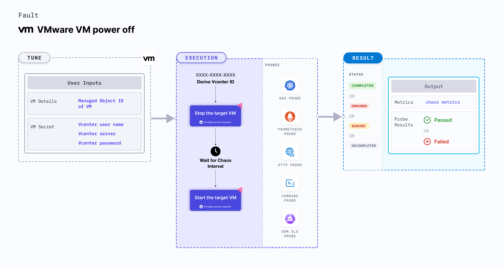

VMware VM power off stops (or powers off) the VMware VMs for a specific duration. After the duration, the VMs are back to original state. It checks the performance of the application running on the VMware VMs.



:::info note
HCE doesn't support injecting VMWare Windows faults on Bare metal server.
:::

## Use cases
VMware VM power off:
- Determines the resilience of an application to random power failures.
- Determines how efficiently an application recovers and restarts the services.

### Prerequisites
- Kubernetes >= 1.17 is required to execute this fault.
- Appropriate vCenter permissions should be provided to start and stop the VMs.
- The VM should be in a healthy state before and after injecting chaos.
- Kubernetes secret has to be created that has the Vcenter credentials in the `CHAOS_NAMESPACE`. VM credentials can be passed as secrets or as a `ChaosEngine` environment variable. Below is a sample secret file:

```yaml
apiVersion: v1
kind: Secret
metadata:
  name: vcenter-secret
  namespace: litmus
type: Opaque
stringData:
    VCENTERSERVER: XXXXXXXXXXX
    VCENTERUSER: XXXXXXXXXXXXX
    VCENTERPASS: XXXXXXXXXXXXX
```
:::

### Mandatory tunables

   <table>
      <tr>
        <th> Tunable </th>
        <th> Description </th>
        <th> Notes </th>
      </tr>
      <tr>
        <td> APP_VM_MOIDS </td>
        <td> MOIDs of the VMware instance. After you open the VM in VCenter WebClient, you can find the MOID in the address field (VirtualMachine:vm-5365). Alternatively you can use the CLI to fetch the MOID. </td>
        <td> For example, <code>vm-5365</code>. For more information, go to <a href="#stoppoweroff-the-vm-by-moid"> stop VM based on MOID. </a></td>
      </tr>
    </table>

### Optional tunables

   <table>
      <tr>
        <th> Tunable </th>
        <th> Description </th>
        <th> Notes </th>
      </tr>
      <tr>
        <td> TOTAL_CHAOS_DURATION </td>
        <td> Duration that you specify, through which chaos is injected into the target resource (in seconds). </td>
        <td> Defaults to 30s. For more information, go to <a href="/docs/chaos-engineering/use-harness-ce/chaos-faults/common-tunables-for-all-faults#duration-of-the-chaos"> duration of the chaos. </a></td>
      </tr>
      <tr>
        <td> CHAOS_INTERVAL </td>
        <td> Time interval between two successive instance terminations (in seconds). </td>
        <td> Defaults to 30s. For more information, go to <a href="/docs/chaos-engineering/use-harness-ce/chaos-faults/common-tunables-for-all-faults#chaos-interval"> chaos interval. </a></td>
      </tr>
      <tr>
        <td> SEQUENCE </td>
       <td> Sequence of chaos execution for multiple instances. </td>
        <td> Defaults to parallel. Supports serial sequence as well. For more information, go to <a href="/docs/chaos-engineering/use-harness-ce/chaos-faults/common-tunables-for-all-faults#sequence-of-chaos-execution"> sequence of chaos execution.</a></td>
      </tr>
      <tr>
        <td> RAMP_TIME </td>
        <td> Period to wait before and after injecting chaos (in seconds). </td>
        <td> For example, 30s. For more information, go to <a href="/docs/chaos-engineering/use-harness-ce/chaos-faults/common-tunables-for-all-faults#ramp-time"> ramp time. </a></td>
      </tr>
      <tr>
      <td>DEFAULT_HEALTH_CHECK</td>
      <td>Determines if you wish to run the default health check which is present inside the fault. </td>
      <td> Default: 'true'. For more information, go to <a href="/docs/chaos-engineering/use-harness-ce/chaos-faults/common-tunables-for-all-faults#default-health-check"> default health check.</a></td>
      </tr>
    </table>


### Stop/Poweroff the VM by MOID

It contains the MOID of the VM instance. Tune it by using the `APP_VM_MOIDS` environment variable.

Use the following example to tune it:

[embedmd]:# (./static/manifests/vm-poweroff/app-vm-moid.yaml yaml)
```yaml
# power-off the VMware VM
apiVersion: litmuschaos.io/v1alpha1
kind: ChaosEngine
metadata:
  name: engine-nginx
spec:
  engineState: "active"
  chaosServiceAccount: litmus-admin
  experiments:
  - name: vm-poweroff
    spec:
      components:
        env:
        # MOID of the VM
        - name: APP_VM_MOIDS
          value: 'vm-53,vm-65'
        - name: TOTAL_CHAOS_DURATION
          VALUE: '60'
```
