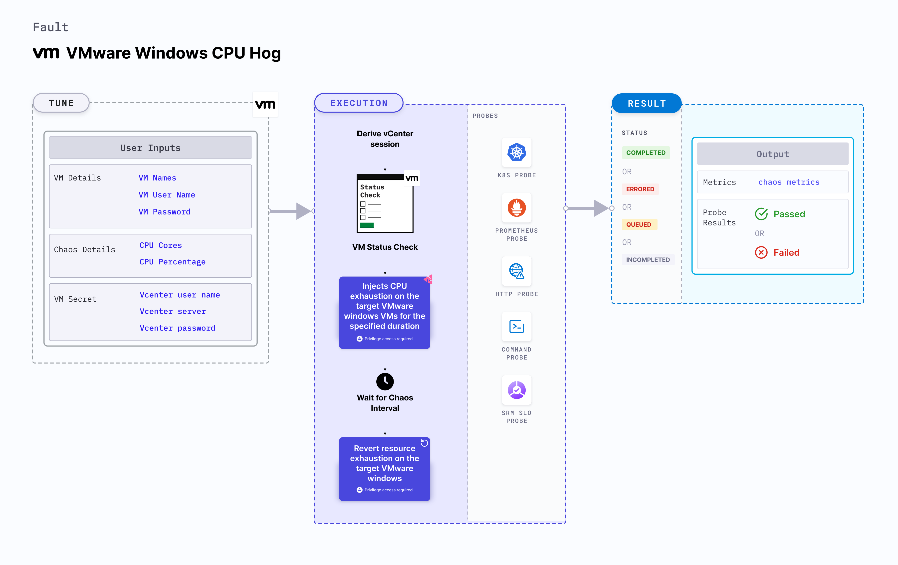

VMware Windows CPU hog applies stress on the CPU resources on Windows OS based VMware VM. It checks the performance of the application running on the VMware Windows VMs.



:::info note
HCE doesn't support injecting VMWare Windows faults on Bare metal server.
:::

## Use cases
VMware Windows CPU hog:
- Determines the resilience of an application when stress is applied on the CPU resources of a VMware Windows virtual machine.
- Simulates the situation of lack of CPU for processes running on the application, which degrades their performance.
- Helps verify metrics-based horizontal pod autoscaling as well as vertical autoscale, that is, demand based CPU addition.
- Verifies the autopilot functionality of cloud managed clusters.

### Prerequisites
- Kubernetes > 1.16 is required to execute this fault.
- Execution plane should be connected to vCenter and host vCenter on port 443.
- Adequate vCenter permissions should be provided to access the hosts and the VMs.
- VMware tool should be installed on the target VM with remote execution enabled.
- The VM should be in a healthy state before and after injecting chaos.
- Kubernetes secret has to be created that has the Vcenter credentials in the `CHAOS_NAMESPACE`.


- VM credentials can be passed as secrets or as a chaos engine environment variable.
```yaml
apiVersion: v1
kind: Secret
metadata:
  name: vcenter-secret
  namespace: litmus
type: Opaque
stringData:
    VCENTERSERVER: XXXXXXXXXXX
    VCENTERUSER: XXXXXXXXXXXXX
    VCENTERPASS: XXXXXXXXXXXXX
```

### Mandatory tunables

   <table>
      <tr>
        <th> Tunable </th>
        <th> Description </th>
        <th> Notes </th>
      </tr>
      <tr>
        <td> VM_NAME </td>
        <td> Name of the target VM. </td>
        <td> For example, <code>ubuntu-vm-1</code> </td>
      </tr>
      <tr>
          <td> VM_USER_NAME </td>
          <td> Username of the target VM.</td>
          <td> For example, <code>vm-user</code>. </td>
      </tr>
      <tr>
          <td> VM_PASSWORD </td>
          <td> User password for the target VM. </td>
          <td> For example, <code>1234</code>. Note: You can take the password from secret as well. </td>
      </tr>
    </table>

### Optional tunables

   <table>
      <tr>
        <th> Tunable </th>
        <th> Description </th>
        <th> Notes </th>
      </tr>
      <tr>
        <td> CPU_CORES </td>
        <td> Number of CPU cores subject to CPU stress. </td>
        <td> Default: 0. Indicates that all the avaialble CPU resources are consumed. For more information, go to <a href="#cpu-cores"> CPU cores.</a></td>
        </tr>
      <tr>
        <td> TOTAL_CHAOS_DURATION </td>
        <td> Duration that you specify, through which chaos is injected into the target resource (in seconds).</td>
        <td> Default: 60s. For more information, go to <a href="/docs/chaos-engineering/use-harness-ce/chaos-faults/common-tunables-for-all-faults#duration-of-the-chaos"> duration of the chaos. </a></td>
      </tr>
      <tr>
        <td> RAMP_TIME </td>
        <td> Period to wait before and after injecting chaos (in seconds). </td>
        <td> For example, 30s. For more information, go to <a href="/docs/chaos-engineering/use-harness-ce/chaos-faults/common-tunables-for-all-faults#ramp-time"> ramp time. </a></td>
      </tr>
      <tr>
        <td> SEQUENCE </td>
        <td> Sequence of chaos execution for multiple instances. </td>
        <td> Default: parallel. Supports serial sequence as well. For more information, go to <a href="/docs/chaos-engineering/use-harness-ce/chaos-faults/common-tunables-for-all-faults#sequence-of-chaos-execution"> sequence of chaos execution.</a></td>
      </tr>
      <tr>
      <td>DEFAULT_HEALTH_CHECK</td>
      <td>Determines if you wish to run the default health check which is present inside the fault. </td>
      <td> Default: 'true'. For more information, go to <a href="/docs/chaos-engineering/use-harness-ce/chaos-faults/common-tunables-for-all-faults#default-health-check"> default health check.</a></td>
      </tr>
    </table>


### CPU cores
The `CPU_CORE` environment variable applies stress on the target Windows VM for a specific duration. If the variable is set to `0`, the fault consumes all the available CPU resources.

Use the following example to specify CPU cores:

[embedmd]:# (./static/manifests/vmware-windows-cpu-hog/vm-cpu-hog-core.yaml yaml)
```yaml
# CPU hog in the VMware VM
apiVersion: litmuschaos.io/v1alpha1
kind: ChaosEngine
metadata:
  name: engine-nginx
spec:
  engineState: "active"
  chaosServiceAccount: litmus-admin
  experiments:
  - name: vmware-windows-cpu-hog
    spec:
      components:
        env:
        # Name of the VM
        - name: VM_NAME
          value: 'test-vm-01'
       # CPU cores for stress
        - name: CPU_CORES
          value: '1'
```
