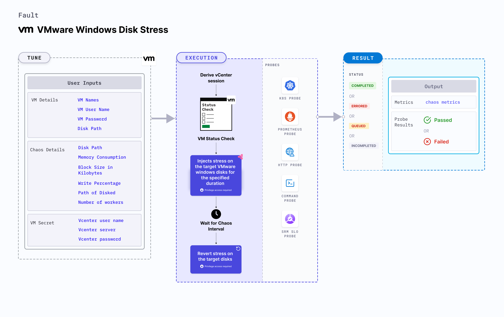

VMware Windows disk stress applies stress on the disk resources on Windows OS based VMware VM. It checks the performance of the application running on the VMware Windows VMs under disk stress conditions.



:::info note
HCE doesn't support injecting VMWare Windows faults on Bare metal server.
:::

## Use cases
VMware Windows disk stress
- Determines the resilience of an application when stress is applied on the disk resources of a VMware Windows virtual machine.
- Simulates the situation of high disk usage for processes running on the application, which degrades their performance.
- Helps verify the application's ability to handle disk failures and its failover mechanisms.

### Prerequisites
- Kubernetes > 1.16 is required to execute this fault.
- Execution plane should be connected to vCenter and host vCenter on port 443.
- VMware tool should be installed on the target VM with remote execution enabled.
- Use built-in Administrator user for the experiment. [Learn how to enable the built-in Administrator user in Windows](https://learn.microsoft.com/en-us/windows-hardware/manufacture/desktop/enable-and-disable-the-built-in-administrator-account?view=windows-11).
- The VM should be in a healthy state before and after injecting chaos.
- Kubernetes secret has to be created that has the Vcenter credentials in the `CHAOS_NAMESPACE`.
- Ensure the installation of [Diskspd](https://learn.microsoft.com/en-us/azure-stack/hci/manage/diskspd-overview#quick-start-install-and-run-diskspd), a critical dependency for this experiment. Refer to the linked documentation for installation guidance.

- VM credentials can be passed as secrets or as a chaos engine environment variable.

```yaml
apiVersion: v1
kind: Secret
metadata:
  name: vcenter-secret
  namespace: litmus
type: Opaque
stringData:
    VCENTERSERVER: XXXXXXXXXXX
    VCENTERUSER: XXXXXXXXXXXXX
    VCENTERPASS: XXXXXXXXXXXXX
```

### Mandatory tunables

   <table>
      <tr>
        <th> Tunable </th>
        <th> Description </th>
        <th> Notes </th>
      </tr>
      <tr>
        <td> VM_NAME </td>
        <td> Name of the target VM. </td>
        <td> For example, <code>win-vm-1</code> </td>
      </tr>
      <tr>
          <td> VM_USER_NAME </td>
          <td> Username of the target VM.</td>
          <td> For example, <code>vm-user</code>. </td>
      </tr>
      <tr>
          <td> VM_PASSWORD </td>
          <td> User password for the target VM. </td>
          <td> For example, <code>1234</code>. Note: You can take the password from secret as well. </td>
      </tr>
    </table>

### Optional tunables

   <table>
      <tr>
        <th> Tunable </th>
        <th> Description </th>
        <th> Notes </th>
      </tr>
      <tr>
        <td> MEMORY_CONSUMPTION </td>
        <td> Amount of Memory to consume in MB. </td>
        <td> Default: 1024. For more information, go to <a href="#memory-consumption"> memory consumption. </a></td>
      </tr>
      <tr>
        <td> BLOCK_SIZE_IN_KILOBYTES </td>
        <td> Block size for disk write in KB. </td>
        <td> Default: 128. For more information, go to <a href="#block-size"> block size. </a></td>
      </tr>
      <tr>
        <td> WRITE_PERCENTAGE </td>
        <td> Percentage of total disk write. </td>
        <td> Default: 100. For more information, go to <a href="#write-percentage"> write percentage. </a></td>
      </tr>
      <tr>
        <td> NUMBER_OF_WORKERS </td>
        <td> Number of workers involved in disk write. </td>
        <td> Default: 2. For more information, go to <a href="#number-of-workers"> number of workers. </a></td>
      </tr>
      <tr>
        <td> DISK_PATH </td>
        <td> Path of disk to apply stress. </td>
        <td> For example, <code>C:\\</code>. For more information, go to <a href="#disk-path"> disk path. </a></td>
      </tr>
      <tr>
        <td> PATH_OF_DISKSPD </td>
        <td> Path of the Diskspd binary in the VM. </td>
        <td> For example, <code>C:\\Program Files\\Diskspd\\</code>. For more information, go to <a href="#path-of-diskpd"> path of Diskpd. </a></td>
      </tr>
      <tr>
        <td> TOTAL_CHAOS_DURATION </td>
        <td> Duration that you specify, through which chaos is injected into the target resource (in seconds).</td>
        <td> Default: 60 s. For more information, go to <a href="/docs/chaos-engineering/use-harness-ce/chaos-faults/common-tunables-for-all-faults#duration-of-the-chaos"> duration of the chaos. </a></td>
      </tr>
      <tr>
        <td> RAMP_TIME </td>
        <td> Period to wait before and after injecting chaos (in seconds). </td>
        <td> Default: 0 s. For more information, go to <a href="/docs/chaos-engineering/use-harness-ce/chaos-faults/common-tunables-for-all-faults#ramp-time"> ramp time. </a></td>
      </tr>
      <tr>
        <td> SEQUENCE </td>
        <td> Sequence of chaos execution for multiple instances. </td>
        <td> Default: parallel. Supports serial and parallel sequence. For more information, go to <a href="/docs/chaos-engineering/use-harness-ce/chaos-faults/common-tunables-for-all-faults#sequence-of-chaos-execution"> sequence of chaos execution.</a></td>
      </tr>
      <tr>
      <td>DEFAULT_HEALTH_CHECK</td>
      <td>Determines if you wish to run the default health check which is present inside the fault. </td>
      <td> Default: 'true'. For more information, go to <a href="/docs/chaos-engineering/use-harness-ce/chaos-faults/common-tunables-for-all-faults#default-health-check"> default health check.</a></td>
      </tr>
    </table>

### Memory consumption

The `MEMORY_CONSUMPTION` environment variable applies stress on the target Windows VM for a specific duration.

Use the following example to specify Memory consumption:

[embedmd]:# (./static/manifests/vmware-windows-disk-stress/vm-disk-stress-memory-consumption.yaml yaml)

```yaml
apiVersion: litmuschaos.io/v1alpha1
kind: ChaosEngine
metadata:
  name: engine-nginx
spec:
  engineState: "active"
  chaosServiceAccount: litmus-admin
  experiments:
  - name: vmware-windows-disk-stress
    spec:
      components:
        env:
        # Name of the VM
        - name: VM_NAME
          value: 'test-vm-01'
       # Memory consumption in MB
        - name: MEMORY_CONSUMPTION
          value: '1024'
```

### Block size

The `BLOCK_SIZE_IN_KILOBYTES` environment variable specifies the block size for disk write in KB.

Use the following example to specify block size:

[embedmd]:# (./static/manifests/vmware-windows-disk-stress/vm-disk-stress-block-size.yaml yaml)

```yaml
apiVersion: litmuschaos.io/v1alpha1
kind: ChaosEngine
metadata:
  name: engine-nginx
spec:
  engineState: "active"
  chaosServiceAccount: litmus-admin
  experiments:
  - name: vmware-windows-disk-stress
    spec:
      components:
        env:
        # Name of the VM
        - name: VM_NAME
          value: 'test-vm-01'
       # Block size for disk write in KB
        - name: BLOCK_SIZE_IN_KILOBYTES
          value: '128'
```

### Write percentage

The `WRITE_PERCENTAGE` environment variable specifies the percentage of total disk write.

Use the following example to specify write percentage:

[embedmd]:# (./static/manifests/vmware-windows-disk-stress/vm-disk-stress-write-percentage.yaml yaml)

```yaml
apiVersion: litmuschaos.io/v1alpha1
kind: ChaosEngine
metadata:
  name: engine-nginx
spec:
  engineState: "active"
  chaosServiceAccount: litmus-admin
  experiments:
  - name: vmware-windows-disk-stress
    spec:
      components:
        env:
        # Name of the VM
        - name: VM_NAME
          value: 'test-vm-01'
       # Percentage of total disk write
        - name: WRITE_PERCENTAGE
          value: '100'
```

### Number of workers

The `NUMBER_OF_WORKERS` environment variable specifies the number of workers involved in disk write.

Use the following example to specify the number of workers:

[embedmd]:# (./static/manifests/vmware-windows-disk-stress/vm-disk-stress-number-of-workers.yaml yaml)
```yaml
apiVersion: litmuschaos.io/v1alpha1
kind: ChaosEngine
metadata:
  name: engine-nginx
spec:
  engineState: "active"
  chaosServiceAccount: litmus-admin
  experiments:
  - name: vmware-windows-disk-stress
    spec:
      components:
        env:
        # Name of the VM
        - name: VM_NAME
          value: 'test-vm-01'
       # Number of workers involved in disk write
        - name: NUMBER_OF_WORKERS
          value: '2'
```

### Disk path

The `DISK_PATH` environment variable specifies the path of disk to apply stress.

Use the following example to specify the disk path:

[embedmd]:# (./static/manifests/vmware-windows-disk-stress/vm-disk-stress-disk-path.yaml yaml)
```yaml
apiVersion: litmuschaos.io/v1alpha1
kind: ChaosEngine
metadata:
  name: engine-nginx
spec:
  engineState: "active"
  chaosServiceAccount: litmus-admin
  experiments:
  - name: vmware-windows-disk-stress
    spec:
      components:
        env:
        # Name of the VM
        - name: VM_NAME
          value: 'test-vm-01'
       # Path of disk to apply stress
        - name: DISK_PATH
          value: 'C:\\'
```

### Path of Diskspd

The `PATH_OF_DISKSPD` environment variable specifies the path of the Diskspd tool in the VM.

Use the following example to specify the path of Diskspd:

[embedmd]:# (./static/manifests/vmware-windows-disk-stress/vm-disk-stress-path-of-diskspd.yaml yaml)
```yaml
apiVersion: litmuschaos.io/v1alpha1
kind: ChaosEngine
metadata:
  name: engine-nginx
spec:
  engineState: "active"
  chaosServiceAccount: litmus-admin
  experiments:
  - name: vmware-windows-disk-stress
    spec:
      components:
        env:
        # Name of the VM
        - name: VM_NAME
          value: 'test-vm-01'
       # Path of the Diskspd tool in the VM
        - name: PATH_OF_DISKSPD
          value: 'C:\\Program Files\\Diskspd\\'
```
