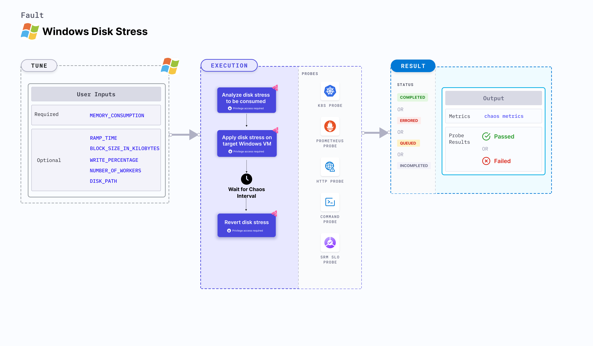

Windows disk stress injects disk stress into a Windows OS based VM, by consuming and exhausting the disk resources on the target Windows machine.



## Use cases
Windows disk stress:
- Simulates a lack of disk for processes running on the application, causing performance degradation and system slowdowns.
- Simulates slow application traffic or resource exhaustion, leading to degradation in the performance of processes on the machine.

### Prerequisites
- Ensure that the [prerequisites](/docs/chaos-engineering/use-harness-ce/chaos-faults/windows/prerequisites) are fulfilled before executing the experiment.

### External packages
This fault uses [Diskspd](https://learn.microsoft.com/en-us/azure/azure-local/manage/diskspd-overview), which is installed as part of the infrastructure installation.

### Mandatory tunables

<table>
  <tr>
    <th> Tunable </th>
    <th> Description </th>
    <th> Notes </th>
  </tr>
      <tr>
        <td> MEMORY_CONSUMPTION </td>
        <td> Amount of stress applied on target Windows VM (in MB). </td>
        <td> Default: 1024.</td>
      </tr>
</table>

### Optional tunables
   <table>
      <tr>
        <th> Tunable </th>
        <th> Description </th>
        <th> Notes </th>
      </tr>
      <tr>
        <td> BLOCK_SIZE_IN_KILOBYTES </td>
        <td> Data block size used to fill the disk (in KB). </td>
        <td> Default: 128. </td>
      </tr>
      <tr>
        <td> WRITE_PERCENTAGE </td>
        <td> Percentage of total disk write. </td>
        <td> Default: 100. </td>
      </tr>
    <tr>
        <td> NUMBER_OF_WORKERS </td>
        <td> Number of workers used to run the stress process. </td>
        <td> Default: 2. </td>
    </tr>
    <tr>
        <td> DISK_PATH </td>
        <td> Path in the Windows VM to apply stress. </td>
        <td> Default: C:\\. </td>
    </tr>
    <tr>
        <td> DURATION </td>
        <td> Duration that you specify, through which chaos is injected into the target resource (in seconds).</td>
        <td> Default: 30s. For more information, go to <a href="/docs/chaos-engineering/use-harness-ce/chaos-faults/common-tunables-for-all-faults#duration-of-the-chaos"> duration of the chaos. </a></td>
      </tr>
      <tr>
        <td> RAMP_TIME </td>
        <td> Period to wait before and after injecting chaos (in seconds). </td>
        <td> For example, 30 s. For more information, go to <a href="/docs/chaos-engineering/use-harness-ce/chaos-faults/common-tunables-for-all-faults#ramp-time"> ramp time. </a></td>
      </tr>
    </table>

### Parameters

Following YAML snippet illustrates the use of the input variables described earlier.

[embedmd]:# (./static/manifests/windows-disk-stress/params.yaml yaml)
```yaml
apiVersion: litmuchaos.io/v1alpha1
kind: MachineFault
metadata:
  name: windows-disk-stress
  labels:
    name: disk-stress
spec:
  infraType: windows
  env:
    - name: MEMORY_CONSUMPTION
      value: "1024"
    - name: BLOCK_SIZE_IN_KILOBYTES
      value: "128"
    - name: WRITE_PERCENTAGE
      value: "100"
    - name: NUMBER_OF_WORKERS
      value: "2"
    - name: DISK_PATH
      value: "C:\\"
    - name: DURATION
      value: "30s"
    - name: RAMP_TIME  # optional tunable
      value: ""
```
