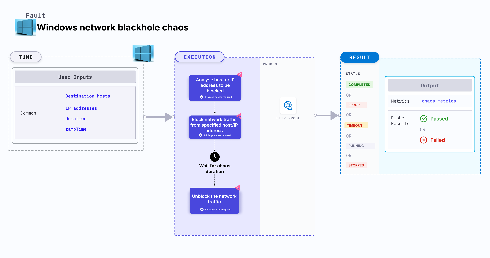

Windows network blackhole chaos simulates a network blackhole scenario on Windows OS based VM.
- It checks the performance of the application running on the Windows VMs under network blackhole conditions.



## Use cases

- Windows network blackhole chaos determines the resilience of an application when a network blackhole scenario is simulated on a Windows VM.
- It simulates the situation of network isolation for processes running on the application, which degrades their performance.
- It helps verify the application's ability to handle network failures and its failover mechanisms.

### Prerequisites
- Ensure that the [prerequisites](/docs/chaos-engineering/use-harness-ce/chaos-faults/windows/prerequisites) are fulfilled before executing the experiment.

### Mandatory tunables

   <table>
      <tr>
        <th> Tunable </th>
        <th> Description </th>
        <th> Notes </th>
      </tr>
      <tr>
        <td> TOTAL_CHAOS_DURATION </td>
        <td> Duration that you specify, through which chaos is injected into the target resource (in seconds).</td>
        <td> Default: 60s. For more information, go to <a href="/docs/chaos-engineering/use-harness-ce/chaos-faults/common-tunables-for-all-faults#duration-of-the-chaos"> duration of the chaos. </a></td>
      </tr>
    </table>

### Optional tunables

   <table>
      <tr>
        <th> Tunable </th>
        <th> Description </th>
        <th> Notes </th>
      </tr>
      <tr>
        <td> DESTINATION_HOSTS </td>
        <td> Comma-separated list of destination hosts to block. </td>
        <td> For example, <code>github.com,harness.io</code>. For more information, go to <a href="#destination-hosts-and-ip-addresses"> destination hosts. </a> </td>
      </tr>
      <tr>
        <td> IP_ADDRESSES </td>
        <td> Comma-separated list of IP addresses to block. </td>
        <td> For example, <code>10.0.0.1,10.0.0.2</code>. For more information, go to <a href="#destination-hosts-and-ip-addresses"> IP addresses. </a> </td>
      </tr>
      <tr>
        <td> SERVER_HOST </td>
        <td> Provide the server host when running global blackhole chaos that is without destination hosts and IP addresses. </td>
        <td> For example, <code>app.harness.io</code>. For more information, go to <a href="#global-blackhole-chaos"> server host. </a> </td>
      </tr>
      <tr>
        <td> RAMP_TIME </td>
        <td> Period to wait before and after injecting chaos (in seconds). </td>
        <td> Default: 0 s. For more information, go to <a href="/docs/chaos-engineering/use-harness-ce/chaos-faults/common-tunables-for-all-faults#ramp-time"> ramp time. </a></td>
      </tr>
    </table>

:::tip
If the environment variables `DESTINATION_HOSTS` or `IP_ADDRESSES` are left empty, the default behaviour is to target all hosts. To limit the impact on all the hosts, you can specify the IP addresses of the service (use commas to separate multiple values) or the DNS or the FQDN names of the services in `DESTINATION_HOSTS`.
:::

### Destination hosts and IP addresses
The `DESTINATION_HOSTS` environment variable specifies the destination hosts that are to be blocked on the target Windows VM.
The `IP_ADDRESSES` environment variable specifies the IP addresses to block on the target Windows VM.

Following YAML snippet illustrates the use of this input variable.

[embedmd]:# (./static/manifests/windows-network-blackhole-chaos/destination-host-ip-address.yaml yaml)
```yaml
apiVersion: litmuschaos.io/v1alpha1
kind: MachineChaosExperiment
metadata:
  name: windows-blackhole-chaos-4ap
  labels:
    context: windows-blackhole-chaos
    name: windows-blackhole-chaos-4ap
spec:
  infraType: "windows"
  steps:
    - - name: windows-blackhole-chaos-4ap
  tasks:
    - name: windows-blackhole-chaos-4ap
      infraId: ""
      definition:
        chaos:
          fault: windows-blackhole-chaos
          env:
            - name: DESTINATION_HOSTS
              value: "github.com"
            - name: IP_ADDRESSES
              value: "10.0.0.1"
            - name: DURATION
              value: "30s"
            - name: RAMP_TIME
              value: ""
```

### Global blackhole chaos

When neither the `DESTINATION_HOSTS` nor the `IP_ADDRESSES` environment variables are provided, the experiment initiates a global blackhole chaos. This means all the network traffic will be blocked except for communication with a specific server infrastructure. You can specify the host for the server infrastructure using the `SERVER_HOST` environment variable, as demonstrated in the following example.

Following YAML snippet illustrates the use of this input variable.

[embedmd]:# (./static/manifests/windows-network-blackhole-chaos/server-host.yaml yaml)
```yaml
apiVersion: litmuschaos.io/v1alpha1
kind: MachineChaosExperiment
metadata:
  name: windows-blackhole-chaos-4ap
  labels:
    context: windows-blackhole-chaos
    name: windows-blackhole-chaos-4ap
spec:
  infraType: "windows"
  steps:
    - - name: windows-blackhole-chaos-4ap
  tasks:
    - name: windows-blackhole-chaos-4ap
      infraId: ""
      definition:
        chaos:
          fault: windows-blackhole-chaos
          env:
            - name: DESTINATION_HOSTS
              value: ""
            - name: IP_ADDRESSES
              value: ""
            - name: SERVER_HOST
              value: ""
            - name: DURATION
              value: "30s"
            - name: RAMP_TIME
              value: ""
```
