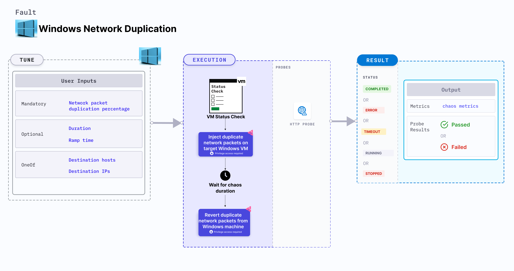

Windows network duplication duplicates network packets on Windows VM for the target hosts or IP addresses using [Clumsy](https://jagt.github.io/clumsy/). It checks the performance of the services running on the Windows VMs.



:::tip
When Clumsy is downloaded, the path is exported which is used while executing the experiment. 
:::

## Use cases

Windows network duplication:
- Determines the resilience of an application when a network duplication scenario is simulated on a Windows virtual machine.
- Simulates the situation of network duplication on the application, which degrades their performance.
- Helps verify the application's ability to handle network failures and its failover mechanisms.

## Prerequisites
- Ensure that the [prerequisites](/docs/chaos-engineering/use-harness-ce/chaos-faults/windows/prerequisites) are fulfilled before executing the experiment.
- Verify that [Clumsy](https://app.harness.io/public/shared/tools/chaos/windows/clumsy-0.3-win64-a.zip) is installed on the Windows VM.

### Mandatory tunables

   <table>
      <tr>
        <th> Tunable </th>
        <th> Description </th>
        <th> Notes </th>
      </tr>
      <tr>
        <td> NETWORK_PACKET_DUPLICATION_PERCENTAGE </td>
        <td> The percentage of data packets duplicated during transmission. </td>
        <td> For example, 100. For more information, go to <a href="#network-packet-duplication"> network packet duplication. </a></td>
      </tr>
      <tr>
          <td> DESTINATION_HOSTS </td>
          <td> DNS or FQDN names of services whose access is affected. You can specify multiple inputs as comma-separated values. </td>
          <td> For example, "abc.com,github.com". It is mutually exclusive with <code>DESTINATION_IPS</code> variable. For more information, go to <a href="#destination-hosts"> destination hosts. </a></td>
      </tr>
      <tr>
        <td> DESTINATION_IPS </td>
        <td> IP addresses of the target destination services. You can specify multiple inputs as comma-separated values.</td>
        <td> It is mutually exclusive with <code>DESTINATION_HOSTS</code> variable. For example, '0.8.0.8,192.168.5.6'. For more information, go to <a href="#destination-ips"> destination IPs. </a></td>
      </tr>
    </table>

### Optional tunables
   <table>
      <tr>
        <th> Tunable </th>
        <th> Description </th>
        <th> Notes </th>
      </tr>
      <tr>
        <td> DURATION </td>
        <td> Duration that you specify, through which chaos is injected into the target resource (in seconds).</td>
        <td> Default: 60s. For more information, go to <a href="/docs/chaos-engineering/use-harness-ce/chaos-faults/common-tunables-for-all-faults#duration-of-the-chaos"> duration of the chaos. </a></td>
      </tr>
      <tr>
        <td> RAMP_TIME </td>
        <td> Period to wait before and after injecting chaos (in seconds). </td>
        <td> For example, 30s. For more information, go to <a href="/docs/chaos-engineering/use-harness-ce/chaos-faults/common-tunables-for-all-faults#ramp-time"> ramp time. </a></td>
      </tr>
    </table>

### Network packet duplication

The `NETWORK_PACKET_DUPLICATION_PERCENTAGE` environment variable specifies the percentage of data packets duplicated during transmission.

Use the following example to specify network packet duplication:

[embedmd]:# (./static/manifests/windows-network-duplication/network-packet-duplication.yaml yaml)
```yaml
apiVersion: litmuschaos.io/v1alpha1
kind: MachineChaosExperiment
metadata:
  name: windows-network-duplication
spec:
  engineState: "active"
  chaosServiceAccount: litmus-admin
  experiments:
    infraType: windows
    steps:
      - - name: windows-network-duplication
    tasks:
    - definition:
        chaos:
          env:
            - name: NETWORK_PACKET_DUPLICATION_PERCENTAGE
              value: "100"
```

### Destination hosts
The `DESTINATION_HOSTS` environment variable specifies the destination hosts to induce network duplication on the target Windows VM. You can provide multiple values using comma-separated list. 
`DESTINATION_HOSTS` and `DESTINATION_IPS` environment variables are mutually exclusive.

Use the following example to specify destination hosts:

[embedmd]:# (./static/manifests/windows-network-duplication/destination-hosts.yaml yaml)
```yaml
apiVersion: litmuschaos.io/v1alpha1
kind: MachineChaosExperiment
metadata:
  name: windows-network-duplication
spec:
  engineState: "active"
  chaosServiceAccount: litmus-admin
  experiments:
    infraType: windows
    steps:
      - - name: windows-network-duplication
    tasks:
    - definition:
        chaos:
          env:
            - name: DESTINATION_HOSTS
              value: "aws.amazon.com,github.com"
```

### Destination IPS

The `DESTINATION_IPS` environment variable specifies the IP addresses of target destination services. You can specify multiple inputs as comma-separated values. 
`DESTINATION_IPS` and `DESTINATION_HOSTS` environment variables are mutually exclusive.

Use the following example to specify destination IPS:

[embedmd]:# (./static/manifests/windows-network-duplication/destination-ips.yaml yaml)
```yaml
apiVersion: litmuschaos.io/v1alpha1
kind: MachineChaosExperiment
metadata:
  name: windows-network-duplication
spec:
  engineState: "active"
  chaosServiceAccount: litmus-admin
  experiments:
    infraType: windows
    steps:
      - - name: windows-network-duplication
    tasks:
    - definition:
        chaos:
          env:
            - name: DESTINATION_IPS
              value: '0.8.0.8,192.168.5.6'
```