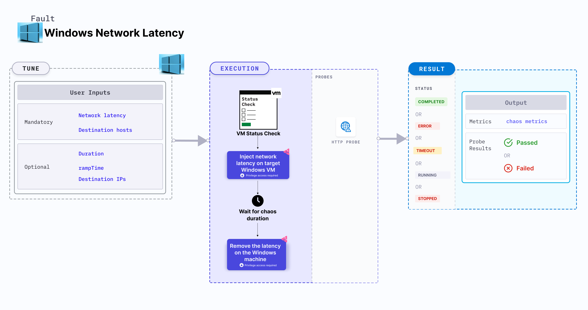

Windows Network Latency causes a network packet delay on Windows VMs for the target hosts by causing network packet delay using clumsy. It checks the performance of the application running on the Windows VMs.



## Use cases
- Determines the resilience of an application when a network delay scenario is simulated on a Windows virtual machine.
- Simulates the situation of network delay for dependent processes and microservices running on the application, which degrades their performance.
- Helps verify the application's ability to handle network failures and its failover mechanisms.

## Prerequisites
- Ensure that the [prerequisites](/docs/chaos-engineering/use-harness-ce/chaos-faults/windows/prerequisites) are fulfilled before executing the experiment.
- Verify that [clumsy](https://jagt.github.io/clumsy/download.html) is installed on the Windows VM, since it is essential for this experiment.

### Mandatory tunables

   <table>
      <tr>
        <th> Tunable </th>
        <th> Description </th>
        <th> Notes </th>
      </tr>
      <tr>
        <td> NETWORK_LATENCY </td>
        <td> The network latency (or delay) that you want to introduce during chaos, in milliseconds. </td>
        <td> For example, 2000. </td>
      </tr>
      <tr>
          <td> DESTINATION_HOSTS </td>
          <td> DNS or FQDN names of services whose access is affected. </td>
          <td> You can specify multiple inputs as comma-separated values. For example, "abc.com,github.com".</td>
      </tr>
    </table>

### Optional tunables
   <table>
      <tr>
        <th> Tunable </th>
        <th> Description </th>
        <th> Notes </th>
      </tr>
      <tr>
        <td> DESTINATION_IPS </td>
        <td> IP addresses of services (or pods) or CIDR block whose access is affected. </td>
        <td> `DESTINATION_HOSTS` and `DESTINATION_IPS` are mutually exclusive, which means you can specify one of the values at a given time. </td>
      </tr>
      <tr>
        <td> DURATION </td>
        <td> Duration that you specify, through which chaos is injected into the target resource (in seconds).</td>
        <td> Default: 60s. For more information, go to <a href="/docs/chaos-engineering/use-harness-ce/chaos-faults/common-tunables-for-all-faults#duration-of-the-chaos"> duration of the chaos. </a></td>
      </tr>
      <tr>
        <td> RAMP_TIME </td>
        <td> Period to wait before and after injecting chaos (in seconds). </td>
        <td> For example, 30s. For more information, go to <a href="/docs/chaos-engineering/use-harness-ce/chaos-faults/common-tunables-for-all-faults#ramp-time"> ramp time. </a></td>
      </tr>
      <tr>
        <td> PATH_OF_CLUMSY </td>
        <td> Path of the Clumsy tool in the VM. </td>
        <td> For example, <code>C:\\Program Files\\Clumsy\\</code>.</td>
      </tr>
    </table>


### Network latency

The `NETWORK_LATENCY` environment variable specifies the amount of delay to induce (in ms).

Use the following example to specify network latency:

[embedmd]:# (./static/manifests/windows-network-latency/network-latency.yaml yaml)
```yaml
apiVersion: litmuschaos.io/v1alpha1
kind: MachineChaosExperiment
metadata:
  name: windows-network-latency
spec:
  engineState: "active"
  chaosServiceAccount: litmus-admin
  experiments:
    infraType: windows
    steps:
      - - name: windows-network-latency
    tasks:
    - definition:
        chaos:
          env:
            - name: NETWORK_LATENCY
              value: "2000"
            - name: DESTINATION_IPS
              value: '0.8.0.8,192.168.5.6'
```

### Destination hosts

The `DESTINATION_HOSTS` environment variable specifies the destination hosts to induce latency on the target Windows VM.

Use the following example to specify destination hosts:

[embedmd]:# (./static/manifests/windows-network-latency/destination-hosts.yaml yaml)
```yaml
apiVersion: litmuschaos.io/v1alpha1
kind: MachineChaosExperiment
metadata:
  name: windows-network-latency
spec:
  engineState: "active"
  chaosServiceAccount: litmus-admin
  experiments:
    infraType: windows
    steps:
      - - name: windows-network-latency
    tasks:
    - definition:
        chaos:
          env:
            - name: NETWORK_LATENCY
              value: "2000"
            - name: DESTINATION_HOSTS
              value: "aws.amazon.com,github.com"
```