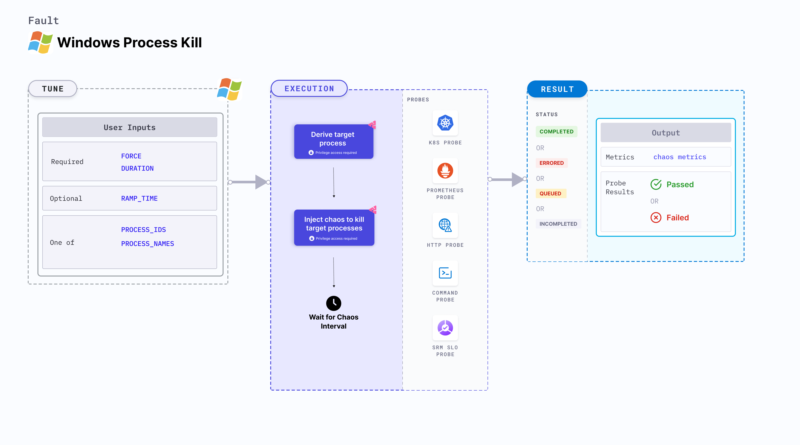

Windows process kill kills the target processes that are running as a part of a Windows OS based VM. The services that are disrupted might be running in the VM, and this fault kills their underlying processes or threads.



## Use cases
Windows process kill:
- Determines the resilience of an application (or process) running on the Windows VMs.
- Induces process kill using the process IDs and process name on the target Windows machines.
- Simulates loss of processes, leading to degradation in the performance of application on the machine.

## Prerequisites
- Ensure that the [prerequisites](/docs/chaos-engineering/use-harness-ce/chaos-faults/windows/prerequisites) are fulfilled before executing the experiment.

### Mandatory tunables

   <table>
      <tr>
        <th> Tunable </th>
        <th> Description </th>
        <th> Notes </th>
      </tr>
      <tr>
          <td> FORCE </td>
          <td> If set to "enable", the process is forcefully killed. </td>
          <td> Default: disable. </td>
      </tr>
     <tr>
        <td> DURATION </td>
        <td> Duration that you specify, through which chaos is injected into the target resource (in seconds).</td>
        <td> Default: 30s. For more information, go to <a href="/docs/chaos-engineering/use-harness-ce/chaos-faults/common-tunables-for-all-faults#duration-of-the-chaos">duration of the chaos</a>.</td>
      </tr>
    </table>

### Optional tunables
   <table>
      <tr>
        <th> Tunable </th>
        <th> Description </th>
        <th> Notes </th>
      </tr>
      <tr>
        <td> PROCESS_IDS </td>
        <td> Process IDs of the target processes provided as comma-separated values. </td>
        <td> For example, 183,253,857. </td>
      </tr>
      <tr>
        <td> PROCESS_NAMES </td>
        <td> Comma separated list of process names to kill. </td>
        <td> For example, <code>chrome,firefox</code>. </td>
      </tr>
      <tr>
        <td> RAMP_TIME </td>
        <td> Period to wait before and after injecting chaos (in seconds). </td>
        <td> For example, 30s. For more information, go to <a href="/docs/chaos-engineering/use-harness-ce/chaos-faults/common-tunables-for-all-faults#ramp-time"> ramp time. </a></td>
      </tr>
    </table>

### Parameters

Following YAML snippet illustrates the use of these input variables.

[embedmd]:# (./static/manifests/windows-process-stress/params.yaml yaml)
```yaml
apiVersion: litmuchaos.io/v1alpha1
kind: MachineFault
metadata:
  name: windows-process-kill
  labels:
    name: process-kill
spec:
  infraType: windows
  env:
    - name: PROCESS_IDS
      value: ""
    - name: PROCESS_NAMES
      value: ""
    - name: FORCE
      value: "disable"
    - name: DURATION
      value: "30s"
    - name: RAMP_TIME
      value: ""
```