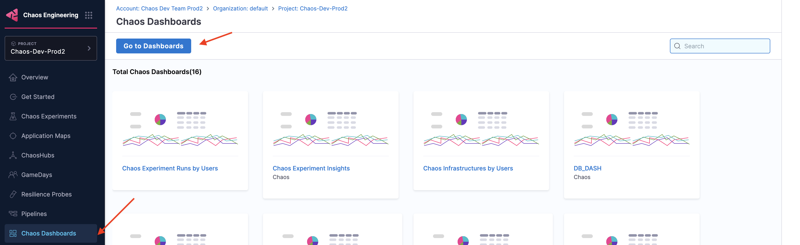
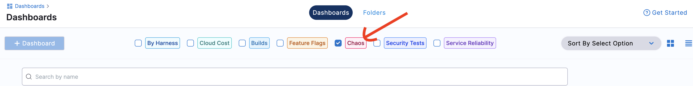
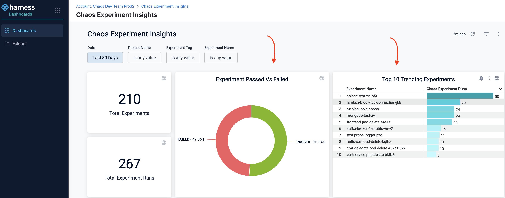
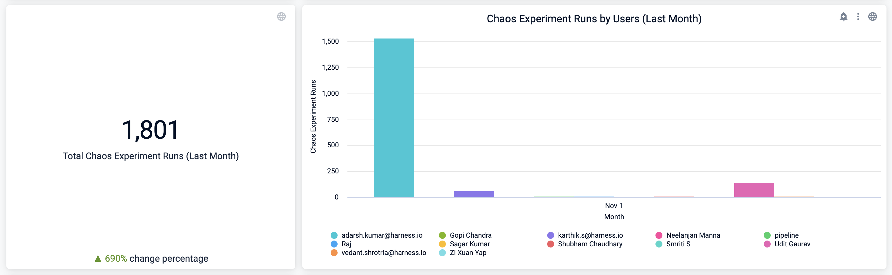
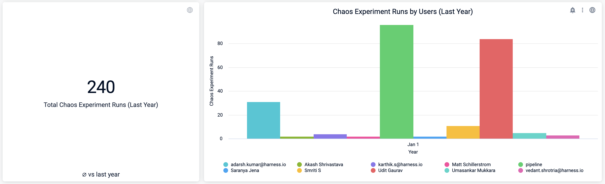
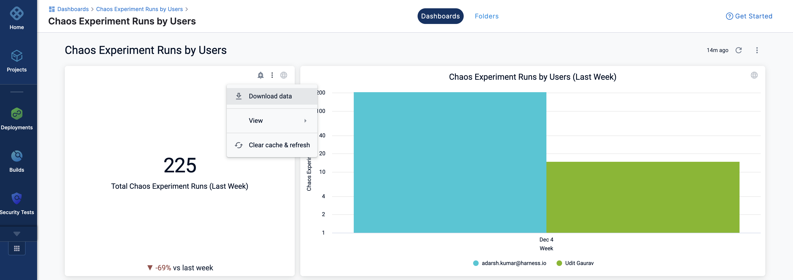

## Before you begin, review the following

- [Chaos Dashboard](/docs/chaos-engineering/concepts/explore-features#resilience-insights)

## View Chaos Dashboard

1. Go to **Chaos Dashboards** and click **Go to Dashboards**.

    

2. From the modules displayed at the top, select **Chaos**. You can see a number of predefined chaos dashboards. You can either select one of the experiments or [create a new dashboard](/docs/chaos-engineering/use-harness-ce/dashboards/create-new). Here, you can select a predefined chaos dashboard.

    

You will see multiple visualizations in this predefined dashboard.

:::tip
The values represented in the dashboards refer to previous week, month, and year. These visualizations don't consider the ongoing (or current) week, month, or year.
:::

:::info note
You can view the data, and download the data in different formats (such as JSON, excel, and so on.)

:::

## Next steps

