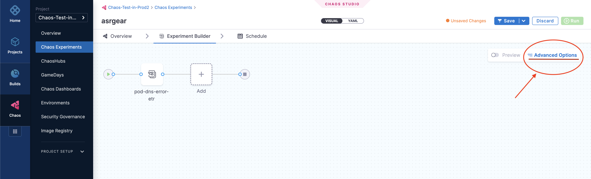
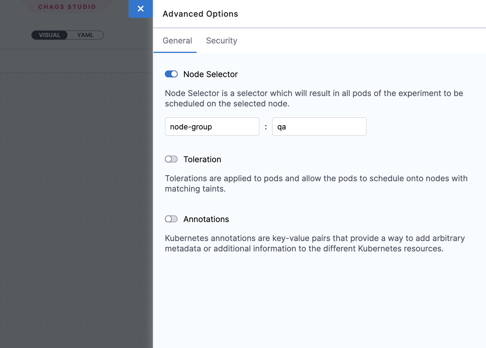
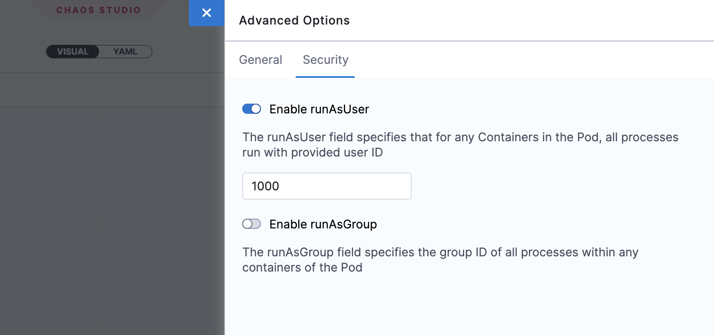
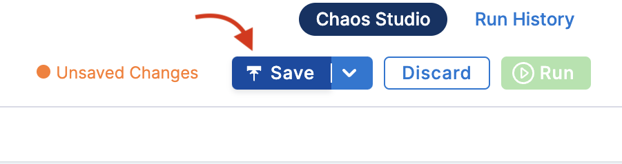

## Prerequisites

- [Create an experiment](/docs/chaos-engineering/use-harness-ce/experiments/create-experiments)

This topic describes how you use some advanced settings to configure your chaos experiments.

## Advanced Experiment Setup Options

On the Experiment Builder tab, you can click **Advanced Options** to configure the following advanced options when creating an experiment for a Kubernetes chaos infrastructure:

### General Options

**Node Selector**

Specify the node on which the experiment pods will be scheduled by providing the node label as a key-value pair.

- This can be used with node-level faults to avoid scheduling the experiment pod on the target node(s).
- It can also be used to limit the scheduling of experiment pods on nodes with an unsupported OS.

    

**Toleration**

Specify the tolerations that must be satisfied by a tainted node to schedule the experiment pods. For more information on taints and tolerations, refer to the [Kubernetes documentation](https://kubernetes.io/docs/concepts/scheduling-eviction/taint-and-toleration/).

- This can be used with node-level faults to avoid scheduling the experiment pod on the target node(s).
- It can also be used to limit the scheduling of the experiment pods on nodes with an unsupported OS.

    

**Annotations**

Specify the annotations to be added to the experiment pods by providing them as key-value pairs. For more information on annotations, refer to the [Kubernetes documentation](https://kubernetes.io/docs/concepts/overview/working-with-objects/annotations/).

Annotations can be used to bypass network proxies enforced by service mesh tools like Istio.

    

### Security Options

**Enable runAsUser**

Specify the user ID to start all the processes in the experiment pod containers. By default, the user ID `1000` is used.
This option allows privileged or restricted access for experiment pods.

    

**Enable runAsGroup**

Specify the group ID to start all the processes in the experiment pod containers instead of a user ID.
This option allows privileged or restricted access for experiment pods.

    

## Execute Experiment With Advanced Options

You can execute the chaos experiment with advanced security options: **runAsUser** or **runAsGroup**. Both the options allow privileged or restricted access to experiment pods.

1. **runAsUser**: Specifies the user ID used to start all the processes in the experiment pod containers. Default user ID is 1000.

2. **runAsGroup**: Specifies the group ID used to start all the processes in the experiment pod containers. Default group ID is 0.

To select one of the options,

1. Click **Experiment builder** tab. Click **Advanced Options** on the right side of the screen.

    

2. Click **Security** tab and select/unselect one or both the options.

    

3. Click **Save**.

    
    
## Next Steps

- [Run or Schedule Experiments](/docs/chaos-engineering/use-harness-ce/experiments/run-schedule-exp)
- [Edit or Update Experiment](/docs/chaos-engineering/use-harness-ce/experiments/edit-chaos-experiment)