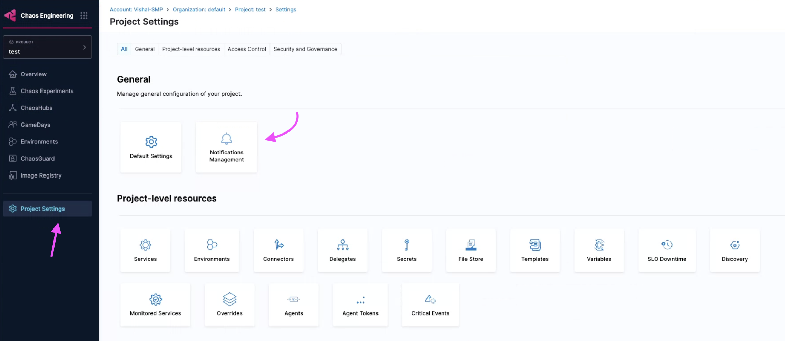
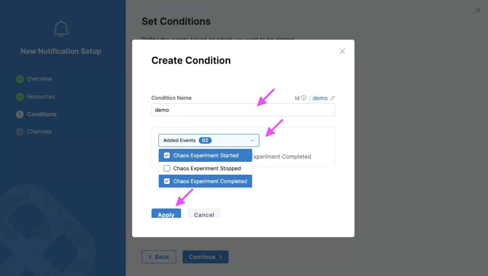

This topic describes how you can create email alerts for your chaos experiments.

## What are alerts?
Alerts are a form of communication that provide updates about your experiment runs. These alerts are provided in the form of email updates that describe your chaos experiments that started, stopped, and completed (depending on which type of experiment events you have configured to receive the alerts for).

## Why are they required?
Alerts provide the status of the chaos experiments and other details (such as run details, fault configurations, probes used, and so on) that might be required when making important business decisions. You can also use alerts as historical data for the earlier chaos experiment runs.

## How to create and use alerts?
You can create an alert by [creating a channel](#create-a-channel) and [creating conditions](#create-a-condition). You can [apply these conditions](#select-channel-for-alerts) to a rule.

:::note
This feature is currently behind the feature flag `PL_CENTRAL_NOTIFICATIONS`. Contact [Harness Support](mailto:support@harness.io) to enable this feature.
:::

:::tip
- Ensure that you have SMTP configured on your account. HCE configures SMTP for you as a part of the basic setup for your application.
- To configure SMTP, ensure your account is connected to one delegate (irrespective of the scope).
:::

### Ensure SMTP is configured

1. To ensure that SMTP is configured for your account, navigate to **Administrative Settings**.

    

2. Validate if **SMTP Configuration** shows the status as **Configured**.

    

### Create a channel

1. Navigate to **Chaos Engineering** module.

    

2. Select **Project Settings** and then **Notifications Management**.

    

:::tip
The notification management should be configured at the project settings in the **chaos engineering** module only. This is because HCE currently supports chaos experiments which is a project-level entity, thereby making the rule a project-level entity.
:::

3. Select **Channels** and **+ New Channel**.

    

4. Provide a **Channel Name**, **Channel Type** (currently supports email only), and associated value for channel type (email in this case). Select **Apply**.

    

This creates a new channel for you.

    

:::tip
Ensure you create a channel before creating a rule because a channel decides which method (email, slack, and so on) you wish to receive the alerts.
:::

### Create a rule

1. To create a new rule, select **+ New Notification**.

    

2. Provide a **Notification Name** and select **Continue**.

    

3. Select the **Resource Type** as **Chaos Experiments**, because HCE currently supports alerting for chaos experiments only. Select **Continue**.

    

:::tip
HCE currently supports selecting resource types as chaos experiments from Kubernetes and Linux chaos experiments.
:::

4. You can associate a rule with one or more conditions. select **+ Add Condition**. In this modal, you can either create a condition or select one or more conditions that you created earlier. Select **Continue**.

    

### Create a condition

1. Provide the **Condition Name**, events (such as chaos experiment started, stopped, or completed) for which you wish to receive the alerts. Select **Apply**.

    

2. You can see some conditions configured for your rule. Select **Continue**.

    

### Select channel for alerts

1. Select **Select Channels**.

    

2. Select one of the channel/s that you configured earlier and select **Apply Selected**. To create a new channel, select **New Channel**.

    

3. You can **Enable** or disable the rule based on whether you select or de-select the radio button. By default, it is **Enable on Save**. Select **Submit**.

    

:::tip
If you try to create multiple rules on the same chaos experiment, you can seamlessly do so, and this results in you receiving multiple alerts (one per rule) for the same chaos experiment.
:::

### Sample run report

Once you set up your email to receive alerts for chaos experiments that are completed events as a part of [creating conditions](#create-a-condition) and the feature flag is enabled, you should receive a run report as an attachment similar to the below report. This report will describe the run details, fault details, and so on.

    

:::tip
Currently, you will receive the report if and only if you configure a condition to receive alerts for chaos experiments that are **Completed**. You can't choose to not receive an alert for completed chaos experiments.
:::

### Delete a rule

Select the rule and select **Delete**. Select **Delete** to confirm.

    

