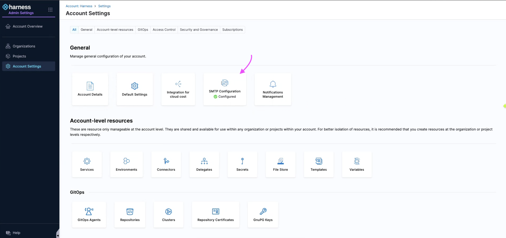

This topic describes how you can create email alerts for your chaos experiments.

## Experiment Alerts

Alerts provide crucial updates about your experiment runs, keeping you informed about  the start, stop, and completion of your chaos experiments based on the experiment event you have configured to receive the alerts for).

### Importance of Alerts

Alerts provide the status of the chaos experiments and other details, including run details, fault configurations, probes used, and so on). These updates can be valuable for making informed business decisions and serve as historical data for previous experiment runs.

### Create and Use Alerts

You can setup alerts by [creating a channel](#create-a-channel) and [defining conditions](#create-a-condition). Once setup, you can [apply these conditions](#select-channel-for-alerts) to a rule.

:::note
This feature is currently behind the feature flag `PL_CENTRAL_NOTIFICATIONS`. Contact [Harness Support](mailto:support@harness.io) to enable this feature.
:::

:::tip
- Ensure that SMTP is configured on your account. HCE configures SMTP for you as a part of the basic setup for your application.
- To configure SMTP, ensure your account is connected to at least one delegate, regardless of the scope.
:::

### Ensure SMTP is Configured

1. To verify SMTP configuration for your account, navigate to **Administrative Settings**.

    

2. Check if **SMTP Configuration** is marked as **Configured**.

    

### Create a Channel

1. Navigate to **Chaos Engineering** module. Select **Project Settings** and then **Notifications Management**.

    

:::tip
Notification management should be configured at the project settings level within the **Chaos Engineering** module. This is because HCE supports chaos experiments as a project-level entity, making the rule a project-level entity.
:::

2. Select **Channels** and then **+ New Channel**.

    

3. Enter a **Channel Name**, select **Channel Type** (currently supports email only), and provide the associated value for channel type (email in this case). Select **Apply**.

    

This creates a new channel.

    

:::tip
Ensure you create a channel before creating a rule because a channel decides which method (email, slack, and so on) you wish to receive the alerts.
:::

### Create a Rule

1. To create a new rule, select **+ New Notification**.

    

2. Enter a **Notification Name** and select **Continue**. Select **Chaos Experiments** as **Resource Type** because HCE currently supports alerting for chaos experiments only. Click **Continue**.

    

:::tip
HCE currently supports selecting resource types as chaos experiments for both Kubernetes and Linux chaos experiments.
:::

4. You can associate a rule with one or more conditions. Select **+ Add Condition**. In the modal that appears, you can either create a condition or select one or more existing conditions. Select **Continue**.

### Create a Condition

1. Provide a **Condition Name**, select the events (such as chaos experiment started, stopped, or completed) for which you want to receive the alerts. Select **Apply**.

    

2. Review the conditions configured for your rule and click **Continue**.

### Select Channel for Alerts

1. Click **Select Channels**. Choose channel/s that you configured earlier and select **Apply Selected**. To create a new channel, select **New Channel**.

    

2. Select **Apply Selected**.

    

3. You can **Enable** or disable the rule based by selecting or deselecting the radio button. By default, it is set to **Enable on Save**. Select **Submit**.

    

:::tip
You can create multiple rules on the same chaos experiment, which will result in receiving multiple alerts (one per rule) for that experiment.
:::

## Sample Run report

Once you've set up your email to receive alerts for completed chaos experiments (as part of [creating conditions](#create-a-condition)) and the feature flag is enabled, you'll receive a run report as an attachment. This report will include details like run information, fault details, and more.

    

:::tip
Currently, you will only receive the report if you've configured a condition to receive alerts for **Completed** chaos experiments. You can't opt-out of receiving alerts for completed experiments.
:::

## Delete a Rule

Select the rule and click **Delete**. Confirm by selecting **Delete**.

    

