This topic describes how you can create chaos experiments that consist of chaos faults and execute them to build and improve the resilience of your application.

## Before you begin

- [What is a chaos experiment?](/docs/chaos-engineering/concepts/chaos101)
- [What are chaos faults?](/docs/chaos-engineering/use-harness-ce/experiments/#chaos-fault)
- [What are resilience probes?](/docs/chaos-engineering/concepts/explore-features/resilience-probes/)
- [How to create a resilience probe?](/docs/chaos-engineering/use-harness-ce/probes/use-probe)

### Create Environment

Before you create an experiment, you need to create an environment where you have to [enable a chaos infrastructure](/docs/chaos-engineering/use-harness-ce/infrastructures/enable-disable).

1. To create an environment, go to **Chaos** module, and click **Environments**. Select **New Environment**.

	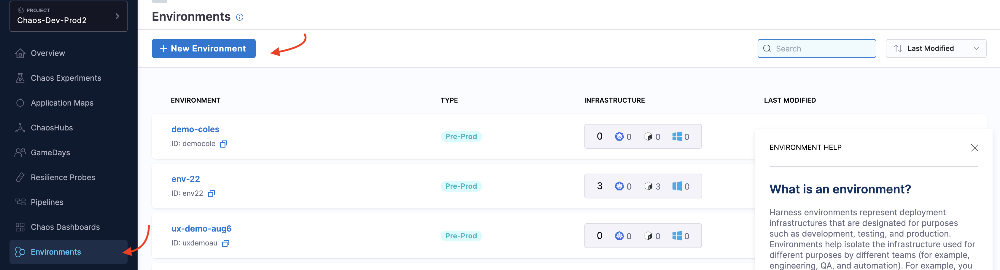

2. Provide a name, and click **Create**. This creates an environment.

	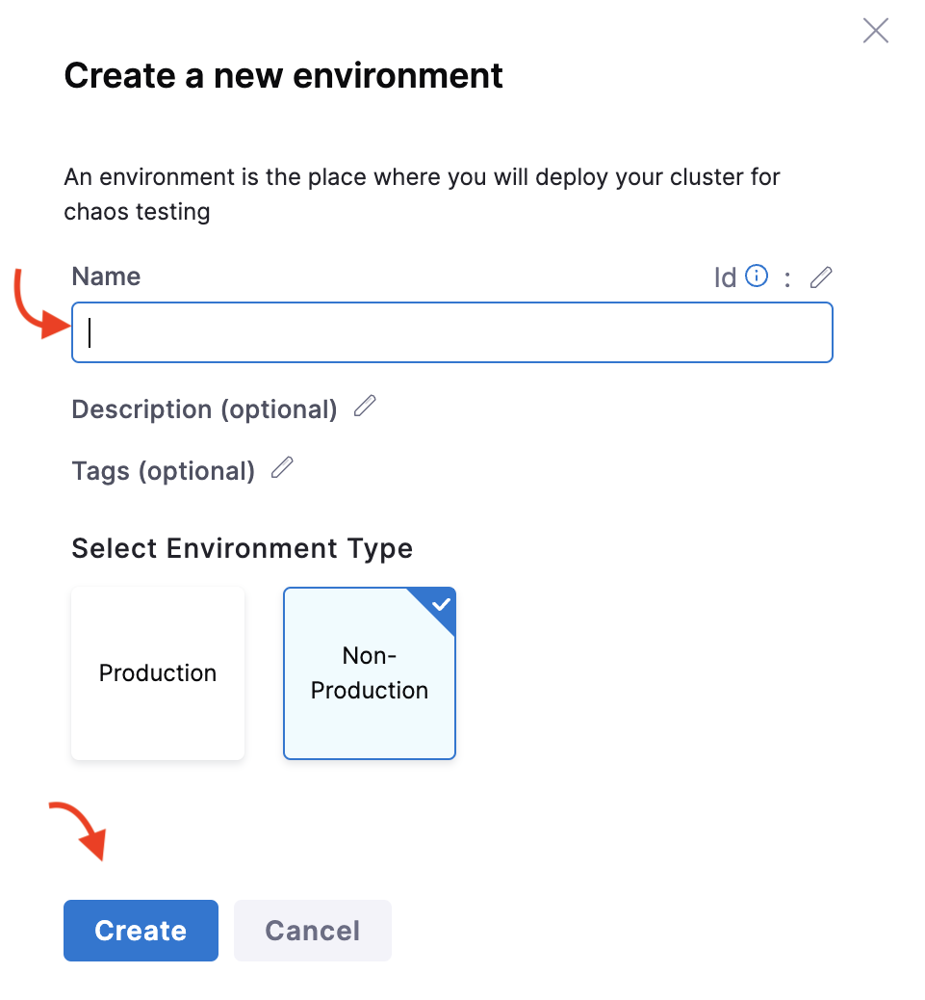

:::info note
To edit or delete the environment, select the **`⋮`** icon against the name of the environment.

	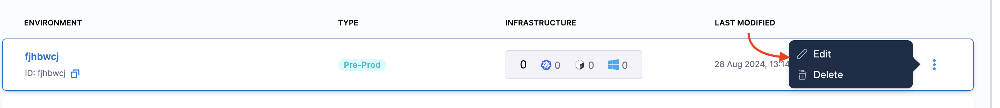
:::
### Create a Chaos Experiment

You can add one or more chaos faults to a chaos experiment and execute it. Follow the interactive guide or the [step-by-step](#step-by-step-guide) guide below create a chaos experiment with one chaos fault, namely, pod delete, which has one resilience probe associated with it.

<iframe
  src="https://app.tango.us/app/embed/898a3ef8-968d-4882-a465-6376479f752e"
  title="Creating a Chaos Experiment Using Harness.io"
  style={{minHeight:'640px'}}
  width="100%"
  height="100%"
  referrerpolicy="strict-origin-when-cross-origin"
  frameborder="0"
  webkitallowfullscreen="webkitallowfullscreen"
  mozallowfullscreen="mozallowfullscreen"
  allowfullscreen="allowfullscreen"></iframe>

#### Step-by-step guide

To add a chaos experiment:

1. In Harness, navigate to **Chaos > Chaos Experiments**. Click **+ New Experiment**.

	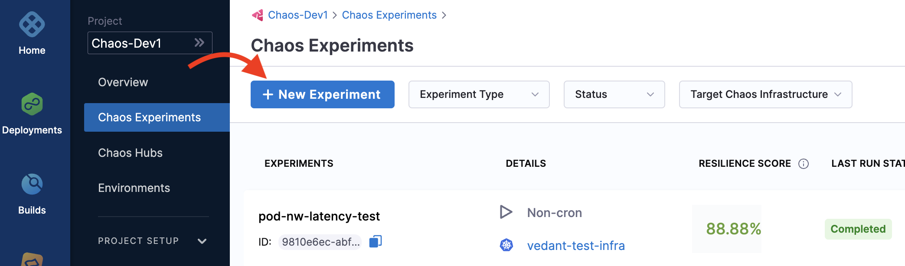

2. 	In the **Experiment Overview**, enter the experiment **Name** and optional **Description** and **Tags**. In **Select a Chaos Infrastructure**, select the infrastructure where the target resources reside, then click **Next**.

	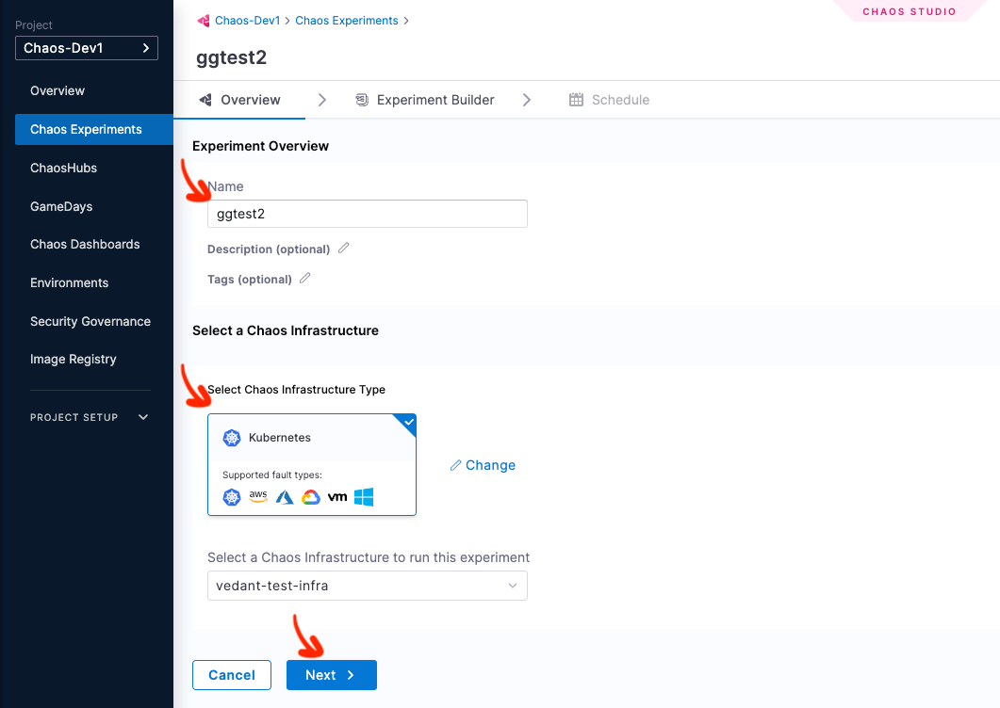

:::tip
For more information on infrastructure, see [Connect chaos infrastructures](/docs/chaos-engineering/use-harness-ce/infrastructures/enable-disable).
:::

3. This takes you to the **Experiment Builder** tab, where you can start building your experiment.

	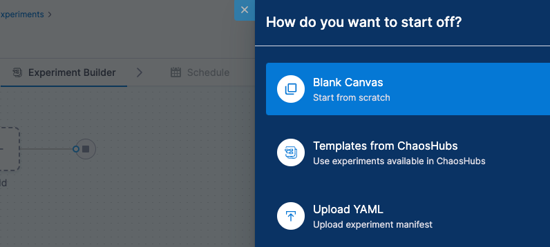

4. Choose how you want to build the experiment. The options, explained later, are:

	* **[Blank Canvas](#using-blank-canvas)** - Lets you build the experiment from scratch, adding the specific faults you want.
	* **[Templates from ChaosHubs](#using-templates-from-chaoshubs)** - Lets you preview and select and experiment from pre-curated experiment templates available in [ChaosHubs](/docs/chaos-engineering/concepts/explore-features/chaoshub).
	* **[Upload YAML](#upload-yaml)** - Lets you upload an experiment manifest YAML file.

	These options are explained below.

### Using Blank Canvas

1. On the **Experiment Builder** tab, click **Add** to add a fault to the experiment.

	

2. Select the fault you want to add to the experiment.

	

3. For each fault, tune the properties. The properties will vary depending on the faults.

	* To tune each fault:

		* **Specify the target application (only for pod-level Kubernetes faults):** This allows the corresponding pods of the application to be targeted.

			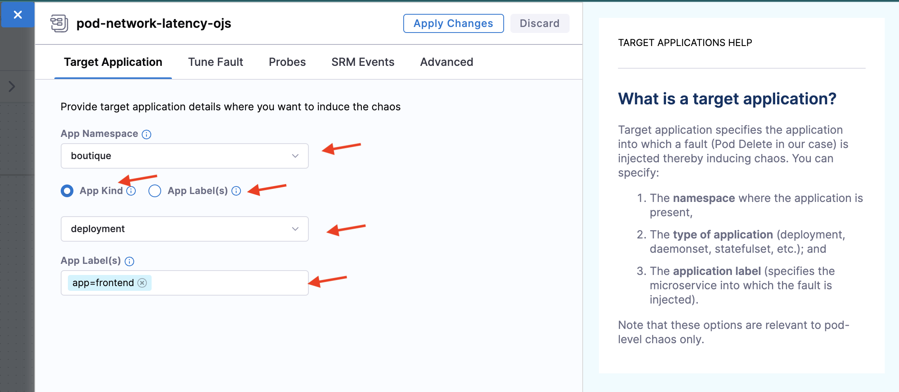

		* **Tune fault parameters:** Each fault has a set of common parameters, like **chaos duration** and **ramp time**, and unique parameters that you can customize as needed.

		* **Add chaos probes:** (Optional) On the **Probes** tab, add [resilience probes](/docs/chaos-engineering/use-harness-ce/probes/use-probe) to automate the chaos hypothesis checks for a fault during the experiment execution. Probes are declarative checks that validate specific criteria, that help determine if an experiment **passed**.

    * **Tune Fault Weightage**: Set the weight for the fault, which determines its importance relative to other faults in the experiment. This weight is used to calculate the experiment's resilience score.

			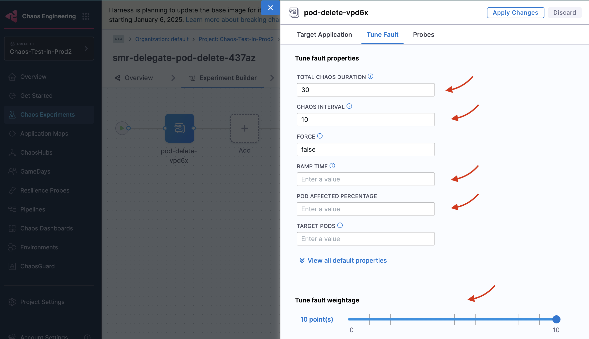

### Using Templates from ChaosHubs

1. Select an experiment template from a [ChaosHub](/docs/chaos-engineering/use-harness-ce/chaoshubs/add-chaos-hub).

	* Choose **Experiment Type** to see the available ChaosHubs.
	* Select a template to preview the faults included.

		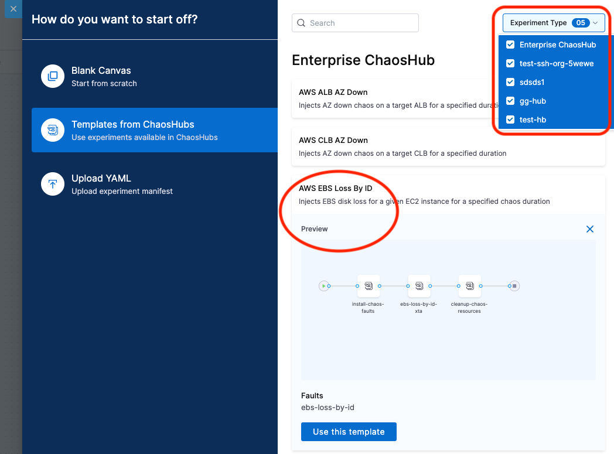

:::info note
You can edit the template to add more faults or update the existing faults.
:::

### Upload YAML

1. Upload an experiment manifest YAML file to create the experiment.

:::info note
You can edit the experiment to update the existing faults or add more.
:::

After constructing the chaos experiment using one of the three options, save the experiment.

	

	* Click **Save** to save the experiment to the Chaos Experiments page. You can add it to a [ChaosHub](/docs/chaos-engineering/use-harness-ce/chaoshubs/add-chaos-hub) later.
	* Select **Add Experiment to ChaosHub** to save this experiment as a template in a selected [ChaosHub](/docs/chaos-engineering/use-harness-ce/chaoshubs/add-chaos-hub).

## Run or Schedule the Experiment

You can choose to run the experiment immediately by clicking the **Run** button, or schedule it to run at a specific time by selecting the **Schedule** tab.

### Execute Experiment Once

To execute the experiment once, select **Non-Cron(Single run)**, click **Save**, and then click **Run**.

	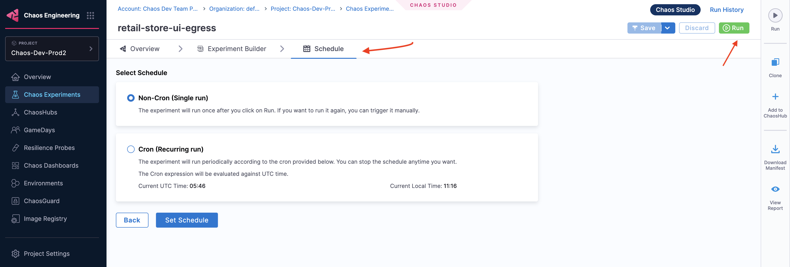

### Execute Experiment on a Schedule

1. To schedule the experiment to run periodically, select **Cron(Recurring run)**, and set the schedule using the **Minutes**, **Hourly**, **Daily**, **Monthly** or **Yearly** options. The **Cron Expression** will be automatically generated.

2. Click **Set Schedule**.

	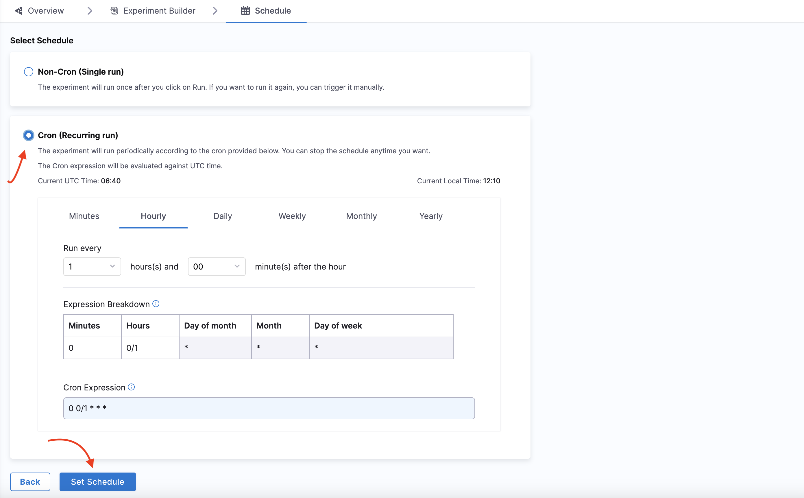

## Advanced Experiment Setup Options

On the Experiment Builder tab, you can click **Advanced Options** to configure the following advanced options when creating an experiment for a Kubernetes chaos infrastructure:

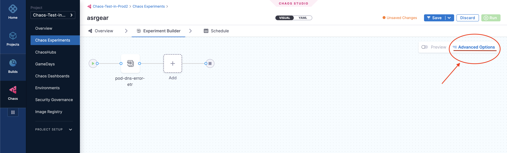

### General Options

**Node Selector**

Specify the node on which the experiment pods will be scheduled by providing the node label as a key-value pair.

- This can be used with node-level faults to avoid scheduling the experiment pod on the target node(s).
- It can also be used to limit the scheduling of experiment pods on nodes with an unsupported OS.

	

**Toleration**

Specify the tolerations that must be satisfied by a tainted node to schedule the experiment pods. For more information on taints and tolerations, refer to the [Kubernetes documentation](https://kubernetes.io/docs/concepts/scheduling-eviction/taint-and-toleration/).

- This can be used with node-level faults to avoid scheduling the experiment pod on the target node(s).
- It can also be used to limit the scheduling of the experiment pods on nodes with an unsupported OS.

	

**Annotations**

Specify the annotations to be added to the experiment pods by providing them as key-value pairs. For more information on annotations, refer to the [Kubernetes documentation](https://kubernetes.io/docs/concepts/overview/working-with-objects/annotations/).

Annotations can be used to bypass network proxies enforced by service mesh tools like Istio.

	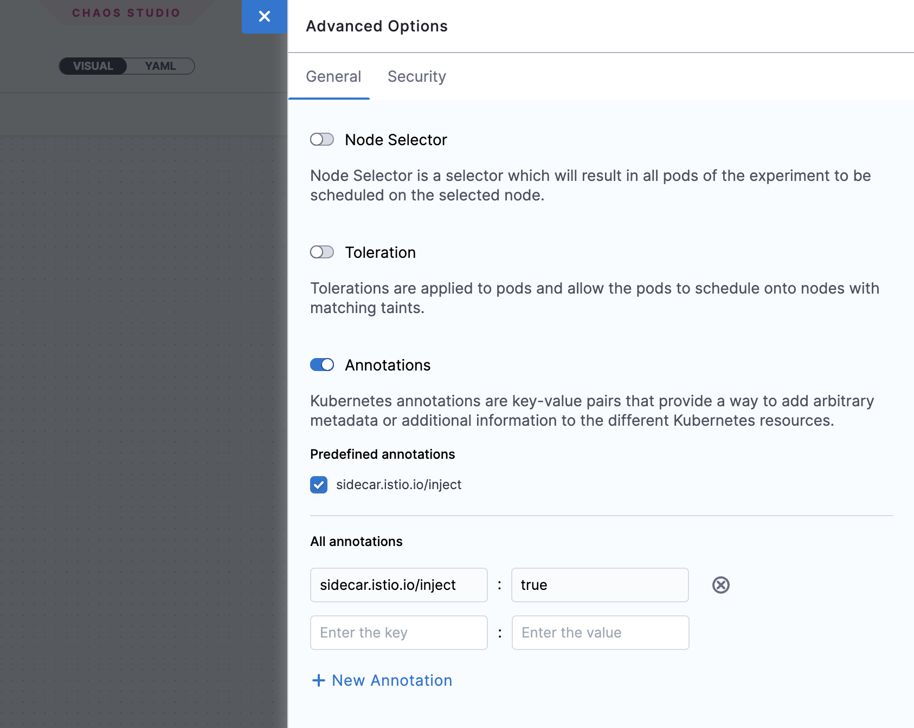

### Security Options

**Enable runAsUser**

Specify the user ID to start all the processes in the experiment pod containers. By default, the user ID `1000` is used.
This option allows privileged or restricted access for experiment pods.

	

**Enable runAsGroup**

Specify the group ID to start all the processes in the experiment pod containers instead of a user ID.
This option allows privileged or restricted access for experiment pods.

	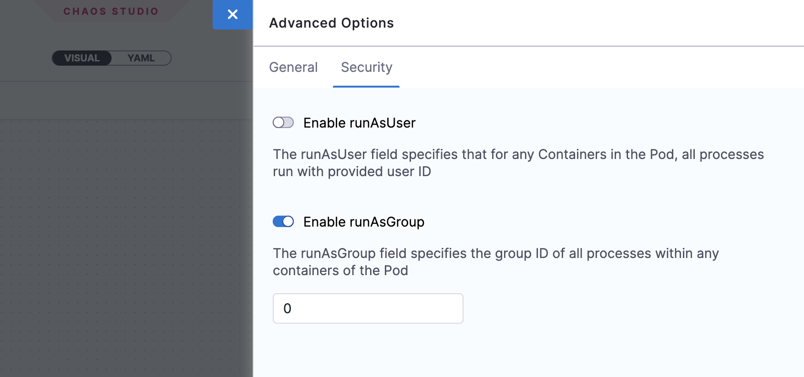

## Add serial and parallel faults
You can add multiple faults in a single chaos experiment that is scaled efficiently by HCE during execution.

:::tip
Consider the overall impact that these faults have on the application. Your experience in production environments may differ due to lack of resources when a number of parallel faults are being executed.
:::

1. To add a fault that runs in parallel to another fault, point your mouse below an existing fault, and then select **Add**. You can follow the same process to add a serial fault.

	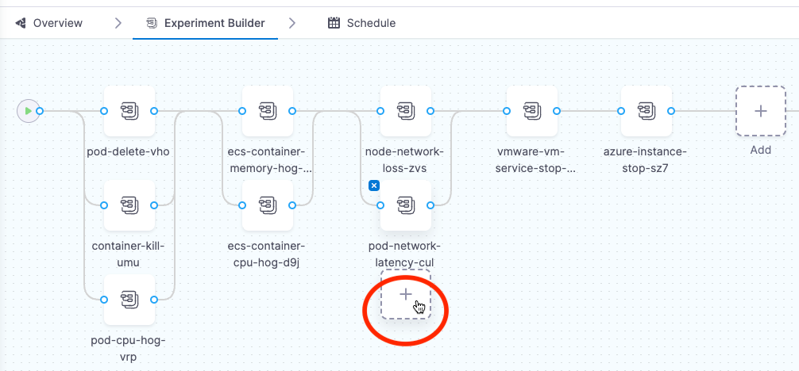

:::note
For Linux, experiments with a parallel fault are currently not supported.
:::

The image below shows a single experiment that consists of serial and parallel faults.
* Faults **A**, **B**, and **C** are parallel faults. They begin execution at the same time.
* Faults **A**, **B**, **C** and faults **D** and **E** are serial. **A**, **B**, and **C**  complete execution and then  **D** and **E** begin execution.
* Similarly, faults **H** and **I** are serial faults, where **H** completes execution, and **I** begins.

	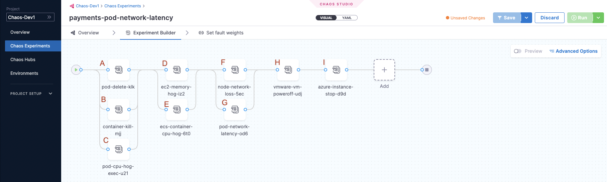

## Analyze experiment
You can observe the status of execution of fault/s of a chaos experiment during its run. The screen shows the experiment pipeline on the right hand side, and details such as **Environment**, **Infrastructure Name**, and the runs that have passed and failed on the left hand side.

When the experiment completes execution, it displays the [**Resilience Score**](/docs/chaos-engineering/use-harness-ce/experiments/#determine-the-resilience-of-target-environment-using-resilience-score). This score describes how resilient your application is to unplanned failures.
The **probe success percentage** helps determine the outcome of every fault in the chaos experiment. Probes (if any) associated with the experiment are used to understand how the application fared.

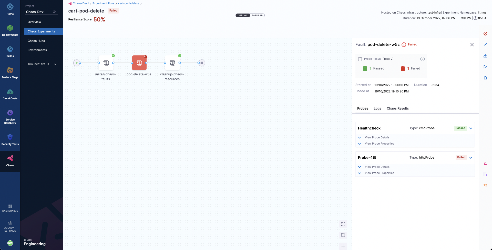

If any of the faults fail, you can find the **Fail Step** that elaborates on the reason why the fault failed.

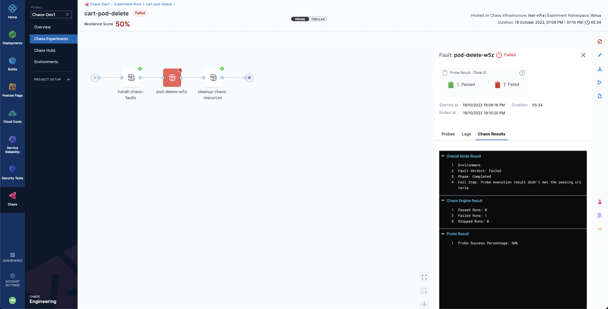
