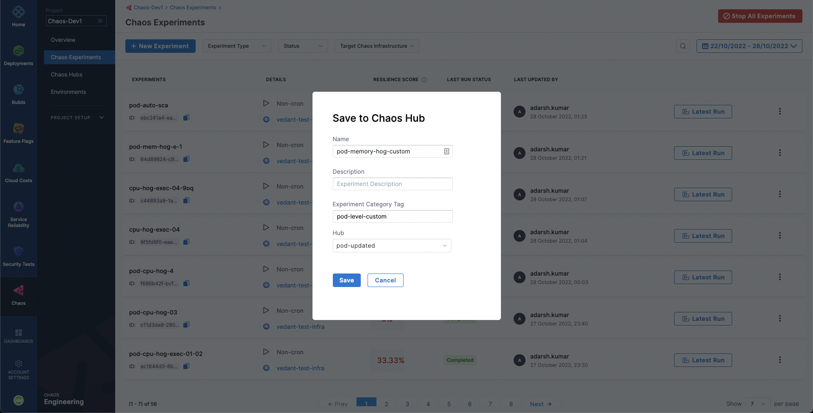

Chaos experiments can be exported for future use. While creating or running an experiment in Chaos Studio automatically saves it for later access through the **Chaos Experiments** sidebar, you also have the option to download the experiment as a manifest file to your machine or save it in a ChaosHub.

## Download Experiment Manifest File

1. To download the manifest file for an experiment, select the **Chaos Experiments** sidebar option. You can access all the experiments that have been created or run in the past.

2. To export an experiment, select the **`⋮`** icon against the name of the experiment.
Select **Download Experiment**. This downloads the experiment file to your machine.

	

3. You can directly upload this manifest file while creating a new experiment to use it as a template for the new experiment. Otherwise, a better way to save, manage, and distribute the experiments as templates is to use chaos hubs.

## Add an Experiment to ChaosHub

1. To add an experiment to ChaosHub, select the **`⋮`** icon against the name of the experiment.

2. Select **Add to Chaos Hub**. Then, add an experiment name, optionally a description and a category tag, and choose the ChaosHub to add the experiment to from the list of added chaos hubs.

	

3. Select **Save**. Now, you should be able to see this experiment added to your chaos hub. You can access it and use it as a template for your new experiments.

	
