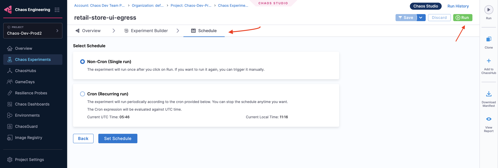

## Prerequisites

- [What is a Chaos Experiment?](/docs/chaos-engineering/use-harness-ce/experiments/)
- [Create an experiment](/docs/chaos-engineering/use-harness-ce/experiments/create-experiments)

This topic describes how you can run or schedule experiments.

After configuring your chaos experiment, you can run the experiment immediately by clicking the **Run** button, or schedule it to run at a specific time by selecting the **Schedule** tab.

## Execute Experiment Once

- To execute the experiment once, select **Non-Cron (Single run)**, click **Set Schedule**, and then select **Run**.

- To run the experiment once, and at a specific time, select the **Run Once at a specific time**, choose the date and time, click apply, and select **Set Schedule**.

    

## Execute Experiment on a Schedule

1. To schedule the experiment to run periodically, select **Cron (Recurring run)**, and set the schedule using the **Minutes**, **Hourly**, **Daily**, **Monthly** or **Yearly** options. The **Cron Expression** will be automatically generated.

2. Click **Set Schedule**.

    

## Next Steps

- [Edit or Update Experiment](/docs/chaos-engineering/use-harness-ce/experiments/edit-chaos-experiment)
- [Halt or Delete Experiment](/docs/chaos-engineering/use-harness-ce/experiments/halt-delete-experiments)