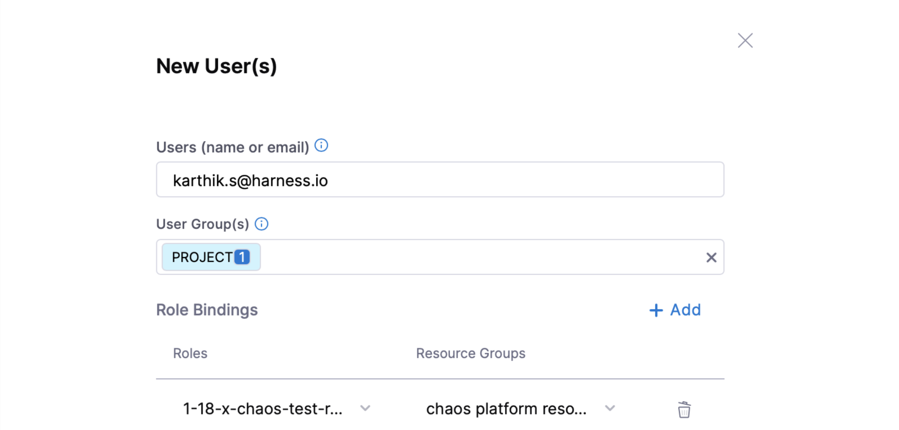
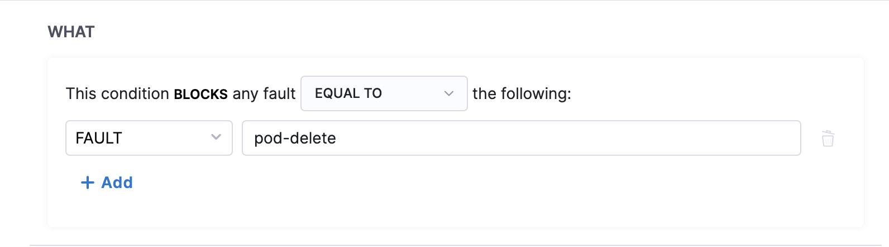
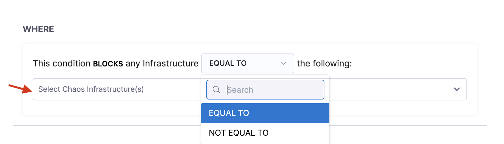
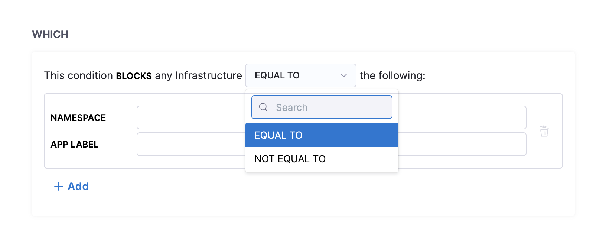
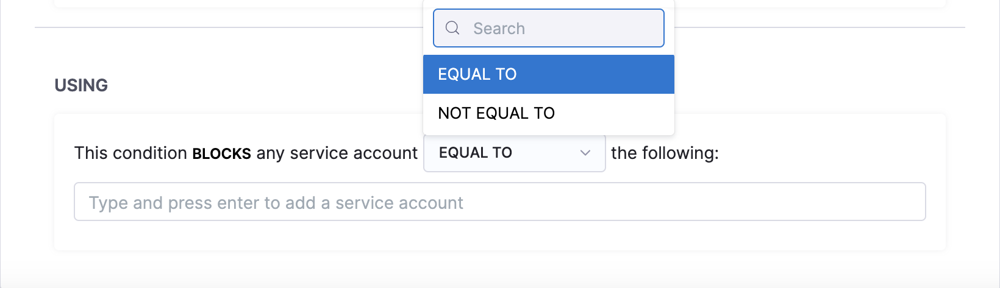
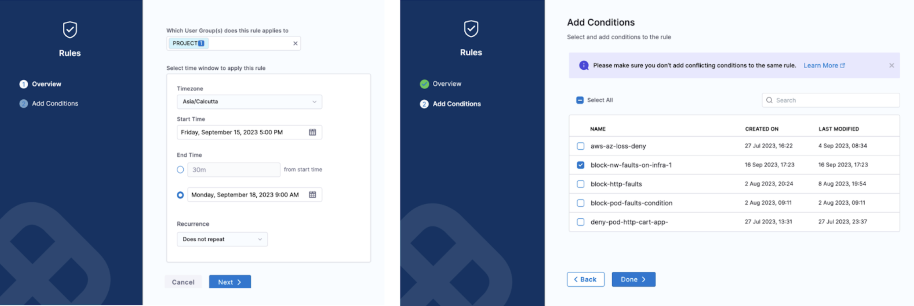

This section introduces you to ChaosGuard and describes how Harness provides RBAC (role-based access control) to users or user groups to access the **chaos resources** at different levels using **ChaosGuard**.

## What is ChaosGuard?

ChaosGuard, as the name suggests, is an additional level of security that guards chaos experiments from chaos-enabled users (users who have permission to execute chaos experiments).

Advanced environments require higher governance policies, and this level of security aims to minimize the blast radius (or disruption) and mitigate potential security threats from **chaos-enabled** users with malicious intent. This way, users with permission to execute chaos experiments will be subjected to further levels of security policy enforcement.

The different levels of security policy enforcement include (but are not limited to):
1. Regulating access to chaos infrastructure (i.e., namespace and clusters) within the environment,
2. Controlling the types of faults that can be used within these infrastructures,
3. Freezing runtime permissions accorded for experiment execution within the target infrastructure.

## Low-level security governance requirements
The table below elaborates on the regulatory requirements required for advanced environments.

| Constraint | Description                                                                                    | Source                            | Importance                                                                                  |
|------------|------------------------------------------------------------------------------------------------|-----------------------------------|---------------------------------------------------------------------------------------------|
| What       | Faults that are allowed or disallowed                                                          | ChaosHub Fault Spec(s)            | Prevent disruptive faults from being injected                                               |
| Where      | Cluster or namespace where the faults will be injected                                         | User action or Agent manifest     | Protect critical infrastructure                                                             |
| Which      | Workloads or microservices which will be subjected to faults (Service Names, AppNS, AppLabels) | Dynamic or Real-time Discovery    | Isolate faults to lowest possible blast radius                                              |
| How        | The service account on the Kubernetes cluster that is leveraged to run the fault pods          | User Input or Experiment manifest | Prevent malicious code or embedded in "custom" faults from running                          |
| Who        | Users who are subjected to the above conditions                                                | Harness DB or Identity store      | Selective application of conditions to users (for example, contractors, other team members) |
| When       | The time window in which chaos is allowed to be executed                                       | User Input or Harness DB          | Minimize windows for disruptive activity, upon approval/authorization                       |

With ChaosGuard, each experiment run consists of a security step wherein one or more [rules](/docs/chaos-engineering/use-harness-ce/governance/governance-in-execution/#rule) are evaluated before execution. Each rule contains one or more [conditions](/docs/chaos-engineering/use-harness-ce/governance/governance-in-execution/#condition) describing the constraints specified in the table above. The experiment can proceed only upon a successful evaluation of all the rules.

## RBAC at different levels

Harness allows users to exercise fine-grained control, which is sufficient for environments that are local to a team or group. You can perform the following operations:

1. View/Add (by connecting to the relevant Git repo)/Edit (the access information, refresh durations, etc.)/Delete the **chaos artifact sources** ([ChaosHub](/docs/chaos-engineering/use-harness-ce/chaoshubs/add-chaos-hub)).

2. View/Add (by installing the chaos agent)/Edit/Delete the target infrastructure, where the chaos experiments are carried out ([Chaos infrastructure](/docs/chaos-engineering/use-harness-ce/infrastructures/enable-disable)).

3. View/Add (by selecting fault templates and providing app data)/Edit (fault tunables, validation/probe constraints, execution properties)/Execute (run saved experiments)/Delete the chaos experiments ([Chaos Experiment](/docs/chaos-engineering/use-harness-ce/experiments/#create-experiments)).

4. View/Add (by selecting one or more experiments against one or more target infrastructures)/Edit (objectives, descriptions, tags, selected experiments)/Delete [chaos gamedays](/docs/chaos-engineering/concepts/explore-concepts/GameDay).

    

The Harness project admin persona can create a custom role by selecting the desired permissions against the chaos platform resources and binding it to a user.

[Harness RBAC functionality](/docs/chaos-engineering/security/) acts as a first-level security check (or deterrent) that you can leverage to prevent config-time security issues. It is a platform-wide, generic framework that counts resources from other Harness modules (such as CI/CD/Cloud Cost/Service Reliability, etc.) under its purview. However, chaos has additional requirements to enforce [execution-time security restrictions](/docs/chaos-engineering/use-harness-ce/governance/governance-in-execution/).

## ChaosGuard concepts

ChaosGuard consists two elements: **Condition** and **Rule**.

### Condition

Condition is an execution plane construct that is static, meaning it is often pre-defined (typically configured by the admin personas) and you can store it offline (such as in a conditions library or repository).

The default structure of a condition is to block or deny a fault or set of faults on a given **execution context** associated with a cluster (or namespace), the service(s), and the service account used for the injection process.

* **WHAT** clause describes the attribute (in this case, chaos fault) on which you can apply the condition. This field takes a regex-like pattern, that is, the * symbol, to indicate all characters preceding or succeeding a particular string.

    

* **WHERE** clause describes the name of the Kubernetes infrastructure where you can apply the condition.

    

* **WHICH** clause describes the namespace and the app label in which you can apply the condition. You can have more than one namespace and app label associated with a condition.

    

* **USING** clause describes the service account under which you apply the condition. You can have more than one service account configured for a condition.

    

:::tip
The service account refers to the Kubernetes or Openshift service account. This account is backed by a role (or ClusterRole) and is associated with a native or third-party security policy or admission controller within the cluster, such as PodSecurityPolicy (PSP), SecurityContextConstraint (SCC), Kyverno, OPA Gatekeeper, etc.
With ChaosGuard, by limiting the service account you (as a user) can use within your experiment definitions, HCE limits the privileges you can have within the cluster.
:::

### Rule
Rule is a high-level construct that controls the users to whom a given condition applies and for what period. It can be in an active (enabled) or passive (disabled) state. A rule can contain multiple conditions, and to ensure a successful evaluation, all constituent conditions must be fulfilled.

The example below describes the rule as **applicable on the cluster chaosday-k8s-cluster between [5 PM, Friday, Sept 15th] to [9 AM, Monday, Sept 18th] for the specific condition**.

:::tip
Creating the ChaosGuard rules is subject to Harness RBAC policies. By default, these rules are enabled only for the project admin. However, the admin can delegate this to trusted users (typically in multi- or secondary admin scenarios).

:::

## Flow of control
The security evaluation step iterates over every active (or enabled) rule for every experiment run in the project. If the evaluation is successful, you can proceed with the experiment. Upon failure, you can't iterate further in the experiment. Below is a flowchart that summarizes the flow of control when you enable a ChaosGuard rule for a fault or set of faults.

