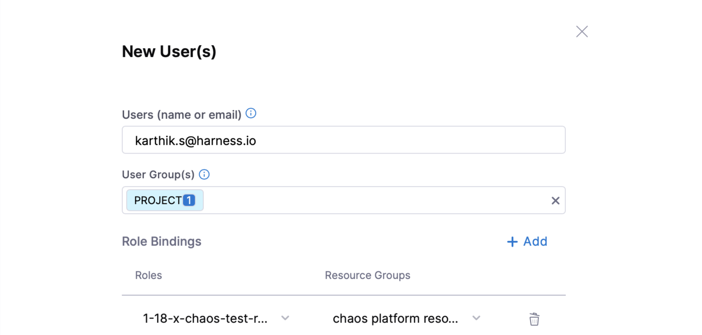

This topic describes how Harness CE leverages RBAC to ensure that you have the right access to chaos engineering resources.

## User authentication

Harness platform is fully integrated with several public OAuth providers with support for two-factor authentication and domain-whitelisting.
Go to [Authentication Overview](/docs/platform/authentication/authentication-overview.md) to learn more.

### User authorization and role-based access control

The chaos module leverages [Harness access control](/docs/platform/role-based-access-control/rbac-in-harness) capabilities to restrict user action on chaos resources, which adhere to the same account-organization-project identification as the rest of the platform resources.

The foundational elements of the chaos engineering process, chaos infrastructure, chaos hubs, chaos experiments, and chaos GameDays are registered as the module resources, with permissions exercised against them. These resources are scoped at the project level.

If you (as a user) have administrative privileges on a project, you can create predefined role(s) pertaining to chaos resource access.

To view the permissions you have, go to **Project Settings**-> **Access Control** -> **Roles**. Click the role name and go to **Chaos** module. This will list the resources and the operations you can perform on them.

## RBAC at different levels

Harness allows users to exercise fine-grained control, which is sufficient for environments that are local to a team or group. You can perform the following operations:

1. View/Add (by connecting to the relevant Git repo)/Edit (the access information, refresh durations, etc.)/Delete the **chaos artifact sources** ([ChaosHub](/docs/chaos-engineering/use-harness-ce/chaoshubs/add-chaos-hub)).

2. View/Add (by installing the chaos agent)/Edit/Delete the target infrastructure, where the chaos experiments are carried out ([Chaos infrastructure](/docs/chaos-engineering/use-harness-ce/infrastructures/enable-disable)).

3. View/Add (by selecting fault templates and providing app data)/Edit (fault tunables, validation/probe constraints, execution properties)/Execute (run saved experiments)/Delete the chaos experiments ([Chaos Experiment](/docs/chaos-engineering/use-harness-ce/experiments/#create-experiments)).

4. View/Add (by selecting one or more experiments against one or more target infrastructures)/Edit (objectives, descriptions, tags, selected experiments)/Delete [chaos gamedays](/docs/chaos-engineering/use-harness-ce/GameDay).

    

The Harness project admin persona can create a custom role by selecting the desired permissions against the chaos platform resources and binding it to a user.

[Harness RBAC functionality](/docs/chaos-engineering/security/) acts as a first-level security check (or deterrent) that you can leverage to prevent config-time security issues. It is a platform-wide, generic framework that counts resources from other Harness modules (such as CI/CD/Cloud Cost/Service Reliability, etc.) under its purview. However, chaos has additional requirements to enforce [execution-time security restrictions](/docs/chaos-engineering/use-harness-ce/governance/governance-in-execution/).

## Conclusion

RBAC in Harness Chaos Engineering ensures that chaos experiments are executed in a controlled manner. Assigning roles with specific permissions improves security and ensures that chaos engineering practices align with governance and compliance standards.