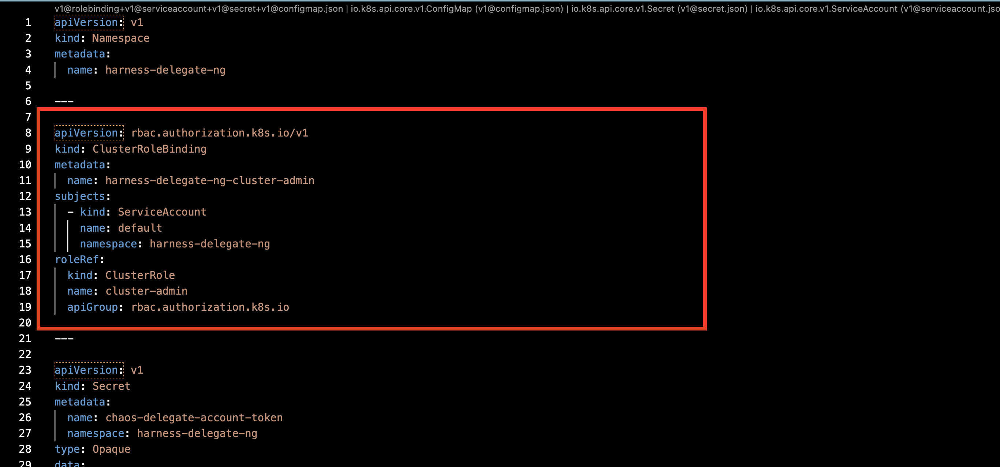
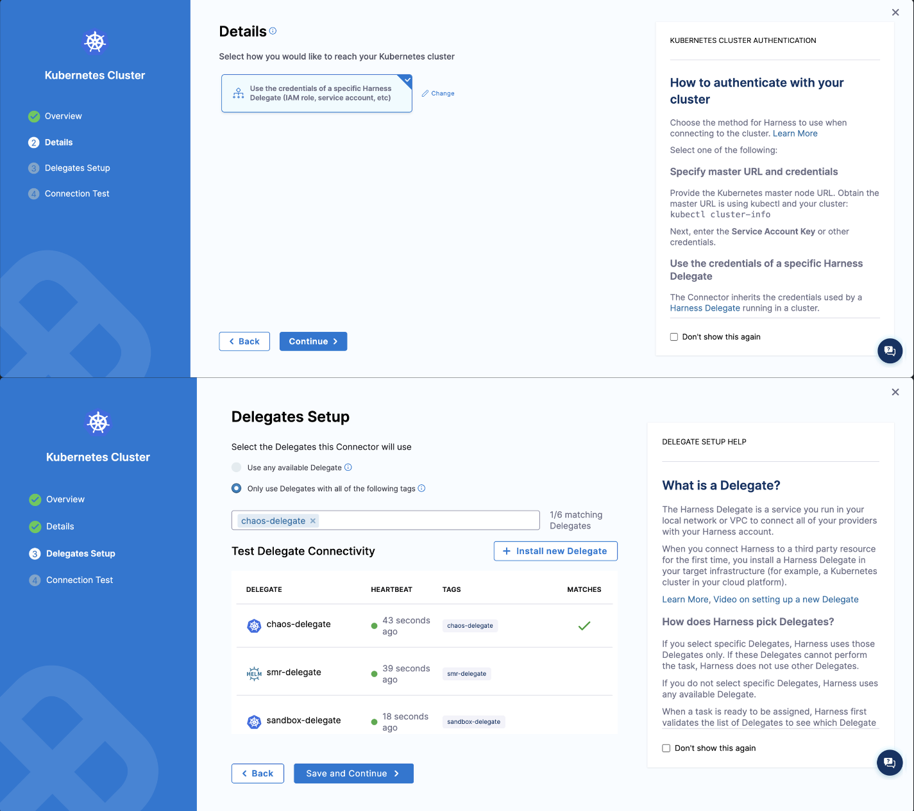
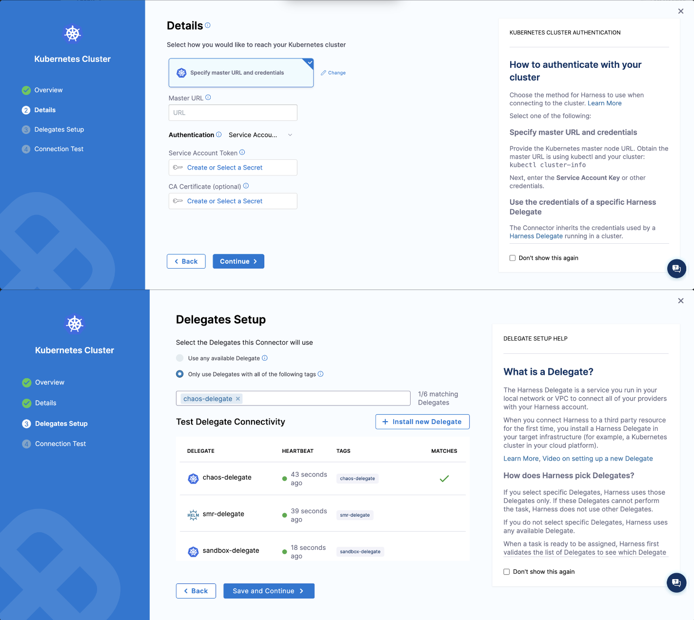
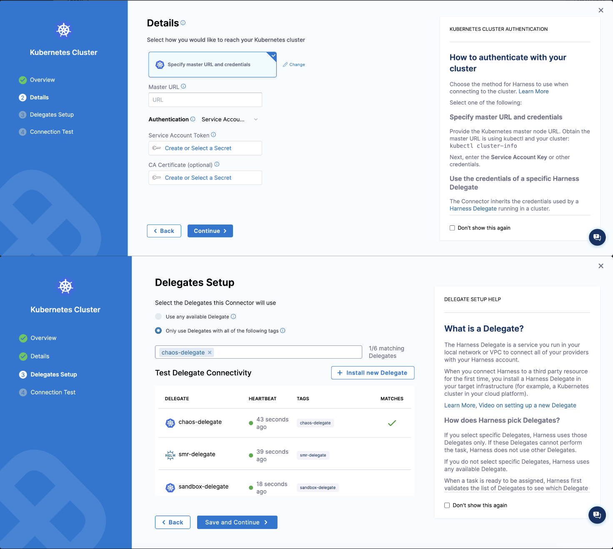

This topic describes how to:
1. Install the Harness Delegate with limited permissions.
2. Use the infrastructure to run chaos experiments in single or multiple namespaces in a Kubernetes cluster.

## Before you begin, review the following:

- [What is DDCR?](/docs/chaos-engineering/use-harness-ce/infrastructures/#what-is-ddcr)
- [Install Delegate to execute chaos experiments](/docs/chaos-engineering/use-harness-ce/infrastructures/enable-disable#enable-chaos)

## Why service accounts matter

A service account is required in the Delegate YAML when Delegate is installed in the **target cluster** to execute chaos experiments, because Delegate has to assume a role to execute chaos experiments.

In case the Delegate is deployed in a **centralized infrastructure** (and connected to the target cluster), service account is not required in the Delegate YAML because the Kubernetes connectors already have the role permissions, and Delegate only orchestrates the tasks.

### Attach a service account to the Delegate

By default, Delegate uses the **cluster admin** role. To limit the permissions for the Delegate, follow the steps below.

1. Remove the cluster role binding from the Delegate manifest, as shown in the diagram.

  

2. Create a new service account for the Delegate (to which you can assign a role further).

```yaml
apiVersion: v1
kind: ServiceAccount
metadata:
  name: chaos-delegate
  namespace: harness-delegate-ng
```

3. Attach the service account to the Delegate YAML, as shown in the diagram.

  

## Enable Chaos in Namespaces

### Case 1: One Infrastructure, Multiple Namespaces

One of the use cases of enabling chaos in selected namespaces is to use one infrastructure to execute chaos experiments in these selected (multiple) namespaces.

Execute the below one-time steps.

1. Create a Kubernetes cluster connector: A connector describes how the delegate communicates with the target cluster.
  
Two cases arise when a Delegate communicates with target cluster:
a. [When the target application and the delegate are running in the same cluster](#target-application-and-delegate-running-in-same-cluster).

b. [When the target application and the delegate are running on different clusters](#target-application-and-delegate-running-on-different-clusters).

#### Target application and delegate running in same cluster 

After creating a Kubernetes cluster, follow the steps below:

1. Add permissions to manage the discovery and transient chaos pods in the delegate namespace (`harness-delegate-ng` in the example below). Harness recommends you keep the delegate and chaos infrastructure in the delegate namespace.

  ```yaml
    apiVersion: rbac.authorization.k8s.io/v1
    kind: Role
    metadata:
      namespace: harness-delegate-ng
      name: chaos-delegate
    rules:
    - apiGroups:
      - "*"
      resources:
      - "*"
      verbs:
      - "*"
    ---
    apiVersion: rbac.authorization.k8s.io/v1
    kind: RoleBinding
    metadata:
      name: chaos-delegate
      namespace: harness-delegate-ng
    subjects:
    - kind: ServiceAccount
      name: chaos-delegate
      namespace: harness-delegate-ng
    roleRef:
      kind: Role
      name: chaos-delegate
      apiGroup: rbac.authorization.k8s.io
  ```

2. Create a Kubernetes cluster connector using the delegate permissions you added in the previous step.

  

#### Target application and delegate running on different clusters

1. Create a service account in the target cluster with the permissions mentioned below. These permissions allow the Harness chaos transient pods to be present in a dedicated namespace. Harness recommends you keep the delegate and chaos infrastructure in the delegate namespace.

  ```yaml
  apiVersion: v1
  kind: ServiceAccount
  metadata:
    name: targetclustersa
    namespace: harness-delegate-ng
  ---
  apiVersion: v1
  kind: Secret
  metadata:
    name: targetclustersa-secret
    namespace: harness-delegate-ng
    annotations:
      kubernetes.io/service-account.name: targetclustersa
  type: kubernetes.io/service-account-token
  ---
  apiVersion: rbac.authorization.k8s.io/v1
  kind: Role
  metadata:
    namespace: harness-delegate-ng
    name: transient-pod-role
  rules:
  - apiGroups:
    - "*"
    resources:
    - "*"
    verbs:
    - "*"
  ---
  apiVersion: rbac.authorization.k8s.io/v1
  kind: RoleBinding
  metadata:
    name: tranisent-pod-rolebinding
    namespace: harness-delegate-ng
  subjects:
  - kind: ServiceAccount
    name: targetclustersa
    namespace: harness-delegate-ng
  roleRef:
    kind: Role
    name: transient-pod-role
    apiGroup: rbac.authorization.k8s.io
  ```

2. Create a Kubernetes cluster connector using service account based authentication. Obtain the master URL by executing the command `kubectl cluster-info` and get the service account token and secret from the Kubernetes secret.

  

3. Create Harness infrastructure definition using the same Kubernetes cluster connector.

4. Create a cluster role that you can use later to onboard application namespaces, as shown below.

```yaml
apiVersion: rbac.authorization.k8s.io/v1
kind: ClusterRole
metadata:
  name: agentless-model-clusterrole
rules:
# Discovery permissions
- apiGroups:
  - apps
  resources:
  - deployments
  - replicasets
  - daemonsets
  - statefulsets
  verbs:
  - watch
  - list
  - get
- apiGroups:
  - ""
  resources:
  - pods
  - replicationcontrollers
  - services
  - statefulsets
  verbs:
  - watch
  - list
  - get
- apiGroups:
  - batch
  resources:
  - jobs
  - cronjobs
  verbs:
  - watch
  - list
  - get
# Chaos permissions
- apiGroups:
  - ""
  resources:
  - pods
  verbs:
  - create
  - delete
  - get
  - list
  - patch
  - update
  - watch
  - deletecollection
- apiGroups:
  - networking.k8s.io
  resources:
  - networkpolicies
  verbs:
  - create
  - delete
  - get
  - list
- apiGroups:
  - apps
  resources:
  - deployments
  - replicasets
  - daemonsets
  - statefulsets
  verbs:
  - list
  - get
  - update
- apiGroups:
  - ""
  resources:
  - replicationcontrollers
  - services
  verbs:
  - get
  - list
- apiGroups:
  - apps.openshift.io
  resources:
  - deploymentconfigs
  verbs:
  - list
  - get
- apiGroups:
  - argoproj.io
  resources:
  - rollouts
  verbs:
  - list
  - get
``` 

5. You can onboard a namespace by creating a role binding in the application namespace (Onboarding `app1` namespace).

```yaml
apiVersion: rbac.authorization.k8s.io/v1
kind: RoleBinding
metadata:
  name: agentless-model-rolebinding-app1
  namespace: app1
roleRef:
  apiGroup: rbac.authorization.k8s.io
  kind: ClusterRole
  name: agentless-model-clusterrole
subjects:
- kind: ServiceAccount
  name: targetclustersa
  namespace: harness-delegate-n
```

:::info note
To onboard a new application namespace, create another role binding in the application namespace (Onboarding `app2` namespace, replace the `namepsace` field in the above YAML spec with `app2`.)
:::

### Case 2: One Infrastructure, One Namespace

To use one infrastructure to execute multiple experiments in one namespace, follow the steps below.

1. Create a service account and role to execute chaos experiments, and ensure they are in the application namespace.

```yaml
apiVersion: v1
kind: ServiceAccount
metadata:
  name: chaos-delegate
  namespace: app3
---
apiVersion: v1
kind: Secret
metadata:
  name: chaos-delegate
  namespace: app3
  annotations:
    kubernetes.io/service-account.name: chaos-delegate
type: kubernetes.io/service-account-token
---
apiVersion: rbac.authorization.k8s.io/v1
kind: Role
metadata:
  name: chaos-delegate
  namespace: app3
rules:
# Discovery management permissions
- apiGroups:
  - ""
  resources:
  - pods
  verbs:
  - create
  - delete
  - get
  - list
- apiGroups:
  - ""
  resources:
  - pods/log
  verbs:
  - get
  - list
  - watch
- apiGroups:
  - apps
  resources:
  - deployments
  verbs:
  - create
  - delete
  - get
  - list
  - patch
  - update
# Discovery process permissions
- apiGroups:
  - apps
  resources:
  - deployments
  - replicasets
  - daemonsets
  - statefulsets
  verbs:
  - watch
  - list
  - get
- apiGroups:
  - ""
  resources:
  - pods
  - replicationcontrollers
  - services
  - statefulsets
  verbs:
  - watch
  - list
  - get
- apiGroups:
  - batch
  resources:
  - jobs
  - cronjobs
  verbs:
  - watch
  - list
  - get
# Chaos management permissions
- apiGroups:
  - ""
  resources:
  - pods
  - secrets
  - configmaps
  - services
  verbs:
  - create
  - delete
  - get
  - list
  - patch
  - update
  - watch
  - deletecollection
- apiGroups:
  - batch
  resources:
  - jobs
  verbs:
  - create
  - delete
  - get
  - list
  - patch
  - update
  - watch
  - deletecollection
- apiGroups:
  - ""
  resources:
  - pods/log
  verbs:
  - get
  - list
  - watch
- apiGroups:
  - ""
  resources:
  - pods/exec
  verbs:
  - get
  - list
  - create
- apiGroups:
  - apps
  resources:
  - deployments
  verbs:
  - create
  - delete
  - get
  - list
  - patch
  - update
  - deletecollection
# Chaos execution permissions
- apiGroups:
  - ""
  resources:
  - pods
  verbs:
  - create
  - delete
  - get
  - list
  - patch
  - update
  - watch
  - deletecollection
- apiGroups:
  - networking.k8s.io
  resources:
  - networkpolicies
  verbs:
  - create
  - delete
  - get
  - list
- apiGroups:
  - apps
  resources:
  - deployments
  - replicasets
  - daemonsets
  - statefulsets
  verbs:
  - list
  - get
  - update
- apiGroups:
  - ""
  resources:
  - replicationcontrollers
  - services
  verbs:
  - get
  - list
- apiGroups:
  - apps.openshift.io
  resources:
  - deploymentconfigs
  verbs:
  - list
  - get
- apiGroups:
  - argoproj.io
  resources:
  - rollouts
  verbs:
  - list
  - get
---
apiVersion: rbac.authorization.k8s.io/v1
kind: RoleBinding
metadata:
  name: chaos-delegate
  namespace: app3
roleRef:
  apiGroup: rbac.authorization.k8s.io
  kind: Role
  name: chaos-delegate
subjects:
- kind: ServiceAccount
  name: chaos-delegate
  namespace: app3
```

2. Create a Kubernetes cluster connector with the service account credentials. Obtain the master URL by executing the command `kubectl cluster-info` and get the service account token and secret from the Kubernetes secret.

  

3. Create Harness infrastructure definition using the same Kubernetes cluster connector.

4. Ensure to use the application namespace as chaos infrastructure namespace and update the service account name accordingly.