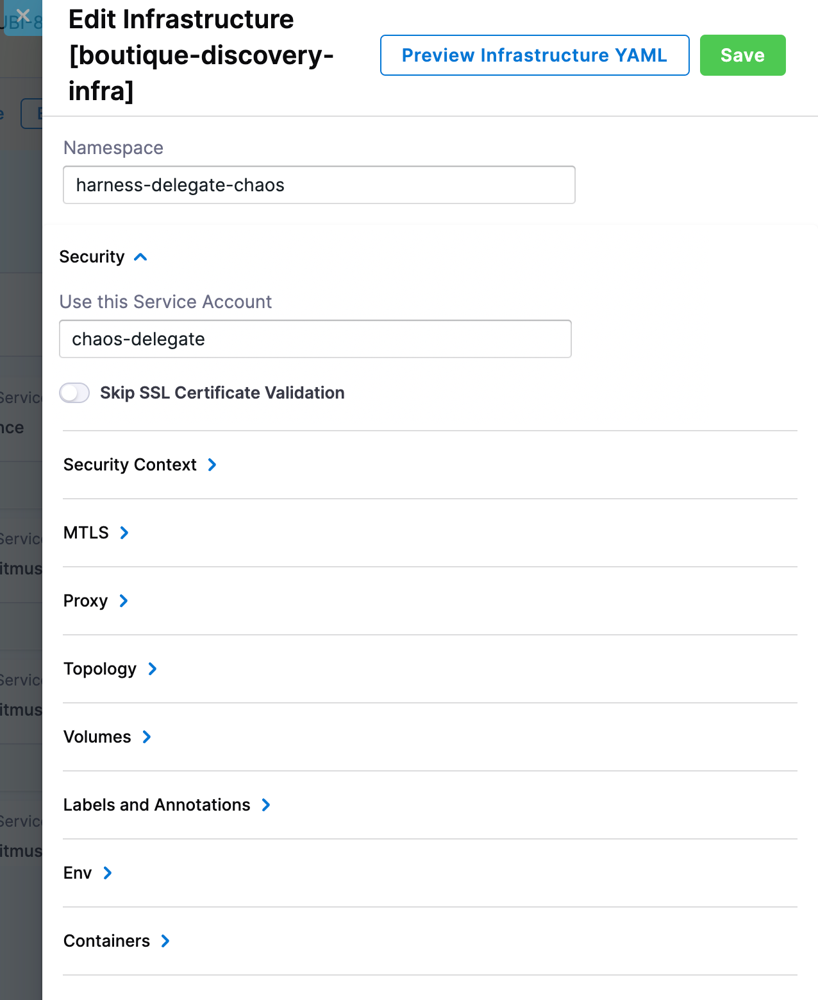

This topic describes how to:
1. Install the Harness Delegate with limited permissions.
2. Use the infrastructure to run chaos experiments in [single](#case-2-one-infrastructure-one-namespace) or [multiple](#case-1-one-infrastructure-multiple-namespaces) namespaces in a Kubernetes cluster.

## Before you begin, review the following:

- [What is DDCR?](/docs/chaos-engineering/use-harness-ce/infrastructures/#what-is-ddcr)
- [Install Delegate to execute chaos experiments](/docs/chaos-engineering/use-harness-ce/infrastructures/enable-disable#enable-chaos)

## Why service accounts matter

A service account is required in the Delegate YAML when Delegate is installed in the **target cluster** to execute chaos experiments, because Delegate has to assume a role to execute chaos experiments.

In case the Delegate is deployed in a **centralized infrastructure** (and connected to the target cluster), service account is not required in the Delegate YAML because the Kubernetes connectors already have the role permissions, and Delegate only orchestrates the tasks.

## Dedicated Delegate installed on Target Cluster

By default, Delegate uses the **cluster admin** role. To limit the permissions for the Delegate, follow the steps below.

1. Create a dedicated namespace for Harness delegate during installation. For example `harness-delegate-ng`.

2. Remove the cluster role binding from the Delegate manifest, as shown in the diagram.

    

3. Create a new service account for the Delegate (to which you can assign a role further) in the dedicated namespace where the Delegate is installed.
Here, `chaos-delegate` refers to the name of the service account in the Delegate.

    ```yaml
    apiVersion: v1
    kind: ServiceAccount
    metadata:
      name: chaos-delegate
      namespace: harness-delegate-ng 
    ```

4. Attach the service account you created earlier to the Delegate YAML, as shown in the diagram.

    

5. Apply the below RBAC to configure the permissions to create chaos runners (that is, transient pods).

    ```yaml
    apiVersion: rbac.authorization.k8s.io/v1
    kind: Role
    metadata:
      namespace: harness-delegate-ng
      name: chaos-runner-role
    rules:
    - apiGroups:
      - apps
      resources:
      - deployments
      - replicasets
      - daemonsets
      - statefulsets
      verbs:
      - create
      - delete
      - get
      - list
      - patch
      - update
      - watch
      - deletecollection
    - apiGroups:
      - ""
      resources:
      - pods
      - pods/log
      - pods/exec
      - secrets
      - services
      - configmaps
      verbs:
      - create
      - delete
      - get
      - list
      - patch
      - update
      - watch
      - deletecollection
    - apiGroups:
      - batch
      resources:
      - jobs
      - cronjobs
      verbs:
      - create
      - delete
      - get
      - list
      - patch
      - update
      - watch
      - deletecollection
    ---
    apiVersion: rbac.authorization.k8s.io/v1
    kind: RoleBinding
    metadata:
      name: chaos-runner-rolebinding
      namespace: harness-delegate-ng
    subjects:
    - kind: ServiceAccount
      name: chaos-delegate
      namespace: harness-delegate-ng
    roleRef:
      kind: Role
      name: chaos-runner-role
      apiGroup: rbac.authorization.k8s.io
    ```

6. Create a cluster role that will be used later to onboard application namespaces.

    ```yaml
    apiVersion: rbac.authorization.k8s.io/v1
    kind: ClusterRole
    metadata:
      name: chaos-clusterrole
    rules:
    # Discovery permissions
    - apiGroups:
      - apps
      resources:
      - deployments
      - replicasets
      - daemonsets
      - statefulsets
      verbs:
      - watch
      - list
      - get
    - apiGroups:
      - ""
      resources:
      - pods
      - replicationcontrollers
      - services
      - statefulsets
      - nodes                 #(nodes and namespaces permission is required to create automatic network experiments)
      - namespaces
      verbs:
      - watch
      - list
      - get
    - apiGroups:
      - batch
      resources:
      - jobs
      - cronjobs
      verbs:
      - watch
      - list
      - get
    # Chaos permissions
    - apiGroups:
      - ""
      resources:
      - pods
      verbs:
      - create
      - delete
      - get
      - list
      - patch
      - update
      - watch
      - deletecollection
    - apiGroups:
      - networking.k8s.io
      resources:
      - networkpolicies
      verbs:
      - create
      - delete
      - get
      - list
    - apiGroups:
      - apps
      resources:
      - deployments
      - replicasets
      - daemonsets
      - statefulsets
      verbs:
      - list
      - get
      - update
    - apiGroups:
      - ""
      resources:
      - replicationcontrollers
      - services
      verbs:
      - get
      - list
    - apiGroups:
      - apps.openshift.io
      resources:
      - deploymentconfigs
      verbs:
      - list
      - get
    - apiGroups:
      - argoproj.io
      resources:
      - rollouts
      verbs:
      - list
      - get
    ```

7. If you wish to provide access to all namespaces, create a cluster role binding.

    ```yaml
    apiVersion: rbac.authorization.k8s.io/v1
    kind: ClusterRoleBinding
    metadata:
      name: chaos-rolebinding
    roleRef:
      apiGroup: rbac.authorization.k8s.io
      kind: ClusterRole
      name: chaos-clusterrole
    subjects:
    - kind: ServiceAccount
      name: chaos-delegate
      namespace: harness-delegate-ng
    ```

  - Now, you can onboard a namespace by creating a role binding in the application namespace (For example, Onboarding app1, app2 and so on)

      ```yaml
      apiVersion: rbac.authorization.k8s.io/v1
      kind: RoleBinding
      metadata:
        name: chaos-rolebinding
        namespace: app1 #for app2, provide namespace as app2
      roleRef:
        apiGroup: rbac.authorization.k8s.io
        kind: ClusterRole
        name: chaos-clusterrole
      subjects:
      - kind: ServiceAccount
        name: chaos-delegate
        namespace: harness-delegate-ng
    ```

8. Create a Kubernetes connector using Delegate permissions.

    
    


9. Finally create the Kubernetes infrastructure using the Kubernetes connectors created in the step 8.

    
    

10. Edit the infrastructure you created in step 9 to provide the details of dedicated namespace that was created earlier. This is the namespaace where the chaos runner will be launched along with the Service Account to ensure that experiments run with relevant permissions.

    
  


### Permissions to manage Delegate resources

While using Harness Delegate, transient pods are created. Harness recommends you provide dedicated namespace for the transient resources. Delegate manages the resources, that require specific permissions in the dedicated namespace.


```yaml
apiVersion: v1
kind: ServiceAccount
metadata:
  name: chaos-delegate
  namespace: harness-delegate-ng
---
apiVersion: rbac.authorization.k8s.io/v1
kind: Role
metadata:
  namespace: harness-delegate-ng
  name: chaos-delegate
rules:
- apiGroups:
  - apps
  resources:
  - deployments
  - replicasets
  - daemonsets
  - statefulsets
  verbs:
  - create
  - delete
  - get
  - list
  - patch
  - update
  - watch
  - deletecollection
- apiGroups:
  - ""
  resources:
  - pods
  - secrets
  - services
  - configmaps
  verbs:
  - create
  - delete
  - get
  - list
  - patch
  - update
  - watch
  - deletecollection
- apiGroups:
  - batch
  resources:
  - jobs
  - cronjobs
  verbs:
  - create
  - delete
  - get
  - list
  - patch
  - update
  - watch
  - deletecollection
---
apiVersion: rbac.authorization.k8s.io/v1
kind: RoleBinding
metadata:
  name: chaos-delegate
  namespace: harness-delegate-ng
subjects:
- kind: ServiceAccount
  name: chaos-delegate
  namespace: harness-delegate-ng
roleRef:
  kind: Role
  name: chaos-delegate
  apiGroup: rbac.authorization.k8s.io
---
apiVersion: rbac.authorization.k8s.io/v1
kind: ClusterRole
metadata:
  name: chaos-delegate
rules:
- apiGroups:
  - ""
  resources:
  - namespaces
  - events
  verbs:
  - watch
  - list
  - get
- apiGroups:
  - ""
  resources:
  - namespaces
  verbs:
  - patch
  resourceNames:
  - harness-delegate-ng
---
apiVersion: rbac.authorization.k8s.io/v1
kind: ClusterRoleBinding
metadata:
  name: chaos-delegate
roleRef:
  apiGroup: rbac.authorization.k8s.io
  kind: ClusterRole
  name: chaos-delegate
subjects:
- kind: ServiceAccount
  name: chaos-delegate
  namespace: harness-delegate-ng
```

## Enable Chaos in Namespaces

### Case 1: One Infrastructure, Multiple Namespaces

One of the use cases of enabling chaos in selected namespaces is to use one infrastructure to execute chaos experiments in these selected (multiple) namespaces.

Execute the below one-time steps.

1. Create a Kubernetes cluster connector: A connector describes how the Delegate communicates with the target cluster.
  
Two cases arise when a Delegate communicates with target cluster:

a. [When the target application and the Delegate are running in the same cluster](#target-application-and-delegate-running-in-same-cluster).

b. [When the target application and the Delegate are running on different clusters](#target-application-and-delegate-running-on-different-clusters).

#### Target Application and Delegate Running in Same Cluster 

After creating a Kubernetes cluster, follow the steps below:

1. Add permissions to manage the discovery and transient chaos pods in the Delegate namespace (`harness-delegate-ng` in the example below). Harness recommends you keep the Delegate and chaos infrastructure in the Delegate namespace.

  ```yaml
    apiVersion: rbac.authorization.k8s.io/v1
    kind: Role
    metadata:
      namespace: harness-delegate-ng
      name: chaos-delegate
    rules:
    - apiGroups:
      - "*"
      resources:
      - "*"
      verbs:
      - "*"
    ---
    apiVersion: rbac.authorization.k8s.io/v1
    kind: RoleBinding
    metadata:
      name: chaos-delegate
      namespace: harness-delegate-ng
    subjects:
    - kind: ServiceAccount
      name: chaos-delegate
      namespace: harness-delegate-ng
    roleRef:
      kind: Role
      name: chaos-delegate
      apiGroup: rbac.authorization.k8s.io
  ```

2. Create a Kubernetes cluster connector using the Delegate permissions you added in the previous step.

  

#### Target Application and Delegate Running on Different Clusters

The diagram below describes how the Harness environment and your (user) environment communicate with the help of Harness Delegate to execute chaos experiments.

    

1. Create a service account in the target cluster with the permissions mentioned below. These permissions allow the Harness chaos transient pods to be present in a dedicated namespace. Harness recommends you keep the Delegate and chaos infrastructure in the Delegate namespace.
Also ensure the following are fulfilled:
- Delegate should be installed in your **centralised infrastructure**.
- Network connectivity between centralised infrastructure and target cluster infrastructure (where chaos runs) 

  ```yaml
  apiVersion: v1
  kind: ServiceAccount
  metadata:
    name: chaos-sa
    namespace: harness-delegate-chaos # our recommendation is to create a dedicated namespace in the target cluster for delegate
  ---
  apiVersion: v1
  kind: Secret
  metadata:
    name: chaos-sa-secret
    namespace: harness-delegate-chaos
    annotations:
      kubernetes.io/service-account.name: chaos-sa
  type: kubernetes.io/service-account-token
  ---
  apiVersion: rbac.authorization.k8s.io/v1
  kind: Role
  metadata:
    namespace: harness-delegate-chaos
    name: chaosrunner-pod-role
  rules:
  - apiGroups:
    - apps
    resources:
    - deployments
    - replicasets
    - daemonsets
    - statefulsets
    verbs:
    - create
    - delete
    - get
    - list
    - patch
    - update
    - watch
    - deletecollection
  - apiGroups:
    - ""
    resources:
    - pods
    - pods/log
    - pods/exec
    - secrets
    - services
    - configmaps
    verbs:
    - create
    - delete
    - get
    - list
    - patch
    - update
    - watch
    - deletecollection
  - apiGroups:
    - batch
    resources:
    - jobs
    - cronjobs
    verbs:
    - create
    - delete
    - get
    - list
    - patch
    - update
    - watch
    - deletecollection
  ---
  apiVersion: rbac.authorization.k8s.io/v1
  kind: RoleBinding
  metadata:
    name: chaosrunner-pod-rolebinding
    namespace: harness-delegate-chaos
  subjects:
  - kind: ServiceAccount
    name: chaos-sa
    namespace: harness-delegate-chaos
  roleRef:
    kind: Role
    name: chaosrunner-pod-role
    apiGroup: rbac.authorization.k8s.io
  ```

2. Create a Kubernetes cluster connector using service account based authentication. Obtain the master URL by executing the command `kubectl cluster-info` and get the service account token and secret from the Kubernetes secret.

    

3. Create a cluster role and provide cluster-wide access or cluster role binding for selected namespaces using role binding, depending on your usage. You can use this configuration to onboard application namespaces.
To discover the resources and run chaos, use the permissions (described below) in each namespace.

    ```yaml
    apiVersion: rbac.authorization.k8s.io/v1
    kind: ClusterRole
    metadata:
      name: chaos-clusterrole
    rules:
    # Discovery permissions
    - apiGroups:
      - apps
      resources:
      - deployments
      - replicasets
      - daemonsets
      - statefulsets
      verbs:
      - watch
      - list
      - get
    - apiGroups:
      - ""
      resources:
      - pods
      - replicationcontrollers
      - services
      - statefulsets
      - nodes
      - namespaces     #(nodes and namespace permissions are required to autocreate network experiments)
      verbs:
      - watch
      - list
      - get
    - apiGroups:
      - batch
      resources:
      - jobs
      - cronjobs
      verbs:
      - watch
      - list
      - get
    # Chaos permissions
    - apiGroups:
      - ""
      resources:
      - pods
      verbs:
      - create
      - delete
      - get
      - list
      - patch
      - update
      - watch
      - deletecollection
    - apiGroups:
      - networking.k8s.io
      resources:
      - networkpolicies
      verbs:
      - create
      - delete
      - get
      - list
    - apiGroups:
      - metrics.k8s.io
      resources:
      - pods
      verbs:
      - get
      - list
    - apiGroups:
      - apps
      resources:
      - deployments
      - replicasets
      - daemonsets
      - statefulsets
      verbs:
      - list
      - get
      - update
    - apiGroups:
      - ""
      resources:
      - replicationcontrollers
      - services
      verbs:
      - get
      - list
    - apiGroups:
      - apps.openshift.io
      resources:
      - deploymentconfigs
      verbs:
      - list
      - get
    - apiGroups:
      - argoproj.io
      resources:
      - rollouts
      verbs:
      - list
      - get
    ``` 

4. You can onboard a namespace by creating a role binding in the application namespace (Onboarding `app1` namespace).

    ```yaml
    apiVersion: rbac.authorization.k8s.io/v1
    kind: RoleBinding
    metadata:
      name: agentless-model-rolebinding-app1
      namespace: app1
    roleRef:
      apiGroup: rbac.authorization.k8s.io
      kind: ClusterRole
      name: agentless-model-clusterrole
    subjects:
    - kind: ServiceAccount
      name: targetclustersa
      namespace: harness-delegate-n
    ```

:::info note
- To onboard a new application namespace, create another role binding in the application namespace (Onboarding `app2` namespace, replace the `namepsace` field in the above YAML spec with `app2`.)
- To give access to all namespaces, use the following YAML configuration:

  ```yaml
  apiVersion: rbac.authorization.k8s.io/v1
  kind: CluesterRoleBinding
  metadata:
    name: agentless-model-rolebinding
  roleRef:
    apiGroup: rbac.authorization.k8s.io
    kind: ClusterRole
    name: agentless-model-rolebinding
  subjects:
  - kind: ServiceAccount
    name: chaos-delegate
    namespace: harness-delegate-ng
  ```

- For the above setting to work, ensure you update the namespace and the service account in the Harness portal service discovery agent setting and chaos infrastructure settings.
:::

5. Create Harness infrastructure definition using the same Kubernetes cluster connector that was created in Step 2.

    

    

6. Edit the infrastructure you created in step 5 to provide the details of the dedicated namespace that was created. This is the namespace where the chaos runner is launched along with the Service Account to ensure that experiments are executed with relevant permissions.

    

### Case 2: One Infrastructure, One Namespace

To use one infrastructure to execute multiple experiments in one namespace, follow the steps below.

1. Create a service account and role to execute chaos experiments, and ensure they are in the application namespace.

    ```yaml
    apiVersion: v1
    kind: ServiceAccount
    metadata:
      name: chaos-delegate
      namespace: app3
    ---
    apiVersion: v1
    kind: Secret
    metadata:
      name: chaos-delegate
      namespace: app3
      annotations:
        kubernetes.io/service-account.name: chaos-delegate
    type: kubernetes.io/service-account-token
    ---
    apiVersion: rbac.authorization.k8s.io/v1
    kind: Role
    metadata:
      name: chaos-delegate
      namespace: app3
    rules:
    # Discovery management permissions
    - apiGroups:
      - ""
      resources:
      - pods
      verbs:
      - create
      - delete
      - get
      - list
    - apiGroups:
      - ""
      resources:
      - pods/log
      verbs:
      - get
      - list
      - watch
    - apiGroups:
      - apps
      resources:
      - deployments
      verbs:
      - create
      - delete
      - get
      - list
      - patch
      - update
    # Discovery process permissions
    - apiGroups:
      - apps
      resources:
      - deployments
      - replicasets
      - daemonsets
      - statefulsets
      verbs:
      - watch
      - list
      - get
    - apiGroups:
      - ""
      resources:
      - pods
      - replicationcontrollers
      - services
      - statefulsets
      verbs:
      - watch
      - list
      - get
    - apiGroups:
      - batch
      resources:
      - jobs
      - cronjobs
      verbs:
      - watch
      - list
      - get
    # Chaos management permissions
    - apiGroups:
      - ""
      resources:
      - pods
      - secrets
      - configmaps
      - services
      verbs:
      - create
      - delete
      - get
      - list
      - patch
      - update
      - watch
      - deletecollection
    - apiGroups:
      - batch
      resources:
      - jobs
      verbs:
      - create
      - delete
      - get
      - list
      - patch
      - update
      - watch
      - deletecollection
    - apiGroups:
      - ""
      resources:
      - pods/log
      verbs:
      - get
      - list
      - watch
    - apiGroups:
      - ""
      resources:
      - pods/exec
      verbs:
      - get
      - list
      - create
    - apiGroups:
      - apps
      resources:
      - deployments
      verbs:
      - create
      - delete
      - get
      - list
      - patch
      - update
      - deletecollection
    # Chaos execution permissions
    - apiGroups:
      - ""
      resources:
      - pods
      verbs:
      - create
      - delete
      - get
      - list
      - patch
      - update
      - watch
      - deletecollection
    - apiGroups:
      - networking.k8s.io
      resources:
      - networkpolicies
      verbs:
      - create
      - delete
      - get
      - list
    - apiGroups:
      - apps
      resources:
      - deployments
      - replicasets
      - daemonsets
      - statefulsets
      verbs:
      - list
      - get
      - update
    - apiGroups:
      - ""
      resources:
      - replicationcontrollers
      - services
      verbs:
      - get
      - list
    - apiGroups:
      - apps.openshift.io
      resources:
      - deploymentconfigs
      verbs:
      - list
      - get
    - apiGroups:
      - argoproj.io
      resources:
      - rollouts
      verbs:
      - list
      - get
    ---
    apiVersion: rbac.authorization.k8s.io/v1
    kind: RoleBinding
    metadata:
      name: chaos-delegate
      namespace: app3
    roleRef:
      apiGroup: rbac.authorization.k8s.io
      kind: Role
      name: chaos-delegate
    subjects:
    - kind: ServiceAccount
      name: chaos-delegate
      namespace: app3
    ```

2. Create a Kubernetes cluster connector with the service account credentials. Obtain the master URL by executing the command `kubectl cluster-info` and get the service account token and secret from the Kubernetes secret.

    

3. Create Harness infrastructure definition using the same Kubernetes cluster connector.

4. Ensure to use the application namespace as chaos infrastructure namespace and update the service account name accordingly.