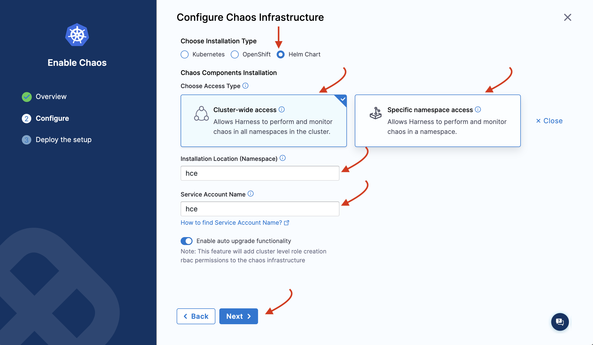

This topic describes how you can enable and disable a Harness Delegate to use with chaos experiments.

## Before you begin, review the following:

- [Chaos infrastructure and different types](/docs/chaos-engineering/concepts/chaos101#chaos-infrastructure).
- [Why is a chaos infrastructure required?](/docs/chaos-engineering/use-harness-ce/infrastructures/)

## Install Infrastructure

You can install chaos infrastructure as a Kubernetes service, as a Linux daemon, or as a Windows agent, based on the targets. Before creating an infrastructure, [create an environment](/docs/chaos-engineering/use-harness-ce/experiments/create-experiments#create-environment) because a chaos infrastructure is created within an environment.

:::tip
If you want to delete your environment, remove the environment references, that is, the infrastructure(s) associated with it first.
:::

### Enable Chaos

#### Use Helm Template to Install Chaos Infrastructure

Harness CE provides Helm support to install chaos infrastructure, in addition to installing with the help of a manifest (as explained earlier).

To use Helm to install a chaos infrastructure,

1. Navigate to **Chaos Experiments** -> **Environment**. Select **New environment** and create an environment and install or upgrade chaos infrastructure. To enable chaos in an existing environment, click the environment.

    

2. Click **Enable chaos**.

    

3. You can use Helm commands to enable chaos on new infrastructure only. Click **On new infrastructures** and **Continue**. Add a name, description (optional), and a tag (optional). Click **Next**.

    

4. Choose the installation type as **Helm**, and one of the access types (namespace or cluster-wide). Specify namespace and service account.

    

5. Depending on the type of access you choose, you will see a set of commands. If you select namespace type, you will need to enter some advanced input values. Click **Next**.

    

6. You will see the following commands that you need to execute on your terminal. Once you are done, click **Completed Command Execution**.

    

7. If you select the namespace scope, you will see some commands that you need to execute on your terminal. One you are done, click **Completed Command Execution**.

### Harness Terraform Provider

You can [create Harness Delegate (DDCR)](https://registry.terraform.io/providers/harness/harness/latest/docs/resources/chaos_infrastructure) using [Harness Terraform provider](https://developer.harness.io/docs/platform/automation/terraform/harness-terraform-provider-overview/).