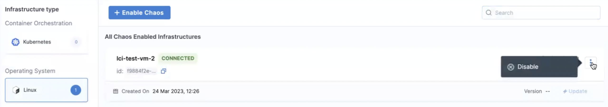

import Tabs from '@theme/Tabs';
import TabItem from '@theme/TabItem';

This topic describes how you can enable and disable a Harness Delegate to use with chaos experiments.

## Before you begin, review the following:

- [Chaos infrastructure and different types](/docs/chaos-engineering/concepts/chaos101#chaos-infrastructure).
- [Why is a chaos infrastructure required?](/docs/chaos-engineering/use-harness-ce/infrastructures/)

## Install Infrastructure

You can install chaos infrastructure as a Kubernetes service, as a Linux daemon, or as a Windows agent, based on the targets. Before creating an infrastructure, [create an environment](/docs/chaos-engineering/use-harness-ce/experiments/create-experiments#create-environment) because a chaos infrastructure is created within an environment.

:::tip
If you want to delete your environment, remove the environment references, that is, the infrastructure(s) associated with it first.
:::

### Enable Chaos

<Tabs>
<TabItem value="Linux">

#### On Linux infrastructure

:::info note
If you're installing the chaos infrastructure alongside SElinux, you must add a policy module to enable `timedatectl`. SElinux is enabled by default in distributions such as **CentOS**, **SUSE Linux**, **RHEL**, and **Fedora** among others.

<details>

If you have enabled SELinux for your OS, you must add a policy module prior to the installation of the infrastructure to access `timedatectl`, which is used in the **linux-time-chaos** fault.

To add the policy module:

1. Create the file `timedatectlAllow.te` in your Linux machine as follows:

  ```te

  module timedatectlAllow 1.0;

  require {
          type systemd_timedated_t;
          type initrc_t;
          class dbus send_msg;
  }

  #============= systemd_timedated_t ==============
  allow systemd_timedated_t initrc_t:dbus send_msg;

  ```

1. Install the utilities that will help in compiling and packaging the policy module for your system. Here, we're using the yum package manager to install them:

  ```bash
  sudo yum install -y policycoreutils-python checkpolicy
  ```

1. After the installation of these packages, compile the policy module with the following command:

  ```bash
  sudo checkmodule -M -m -o timedatectlAllow.mod timedatectlAllow.te
  ```

  This creates the binary policy module file `timedatectlAllow.mod`.

1. Use the policy module file from the previous step to create a policy module package:

  ```bash
  sudo semodule_package -o timedatectlAllow.pp -m timedatectlAllow.mod
  ```

  This creates the policy module package file `timedatectlAllow.pp`.

1. Add the package file from the previous step alongside the other SELinux modules in your system:

  ```bash
  sudo semodule -i timedatectlAllow.pp
  ```

The SELinux policy module is now added, and you can proceed to install the infrastructure.

</details>
:::

To enable chaos on Linux:

1. Go to **Chaos > Environments**, and then select the environment you want to add chaos infrastructure.

1. In the environment details page, under **Infrastructure type**, select **Linux**, and then select **+ Enable Chaos**.

    

1. On the next screen, enter a **Name** for the infrastructure, and optionally, a **Description** and **Tags**. Select **Next**.
You can also specify [different values](/docs/chaos-engineering/concepts/chaos101#chaos-infrastructure) for the infrastructure.

    

1. On the next screen, copy the command to set up Linux chaos access, select **Done**, and then execute the copied command on your Linux machine.

</TabItem>
<TabItem value="Windows">

#### On Windows

:::important
Ensure that you have fulfilled the [prerequisites](/docs/chaos-engineering/use-harness-ce/chaos-faults/windows/prerequisites.md) before connecting to a Windows chaos infrastructure.
:::

1. Go to **Environments** and click **Windows**. click **Enable chaos**.

    

2. Add name (mandatory), and an admin user ("Administrator"). Select **Next**.

3. Copy the command generated. The [prerequisites](/docs/chaos-engineering/use-harness-ce/chaos-faults/windows/prerequisites.md) discusses how you can configure a password. If you have a password, replace it in the `<your-password>` placeholder. Execute this command on your terminal (remember to open the command prompt as an admin if you are not an admin by default). Click **Done** once you finish the execution.

    

This displays the following updates about the installation on your terminal.

```
    Directory: C:\


Mode                 LastWriteTime         Length Name
----                 -------------         ------ ----
d-----          3/7/2024   7:48 AM                HCE
Downloading Testlimit...
Extracting Testlimit...
Accepting Testlimit EULA...
Testlimit EULA accepted.
Downloading windows-chaos-infrastructure binary...
Config file created at C:\\HCE\config.yaml


    Directory: C:\HCE\Logs


Mode                 LastWriteTime         Length Name
----                 -------------         ------ ----
-a----          3/7/2024   7:51 AM              0 windows-chaos-infrastructure.log
[SC] CreateService SUCCESS
Service created and started successfully.

```
</TabItem>

<TabItem value="Helm template">

#### Use Helm Template to Install Chaos Infrastructure

HCE provides Helm support to install chaos infrastructure, in addition to installing with the help of a manifest (as explained earlier).

To use Helm to install a chaos infrastructure,

1. Navigate to **Chaos Experiments** -> **Environment**. Select **New environment** and create an environment and install or upgrade chaos infrastructure. To enable chaos in an existing environment, click the environment.

    

2. Click **Enable chaos**.

    

3. You can use Helm commands to enable chaos on new infrastructure only. Click **On new infrastructures** and **Continue**. Add a name, description (optional), and a tag (optional). Click **Next**.

    

4. Choose the installation type as **Helm**, and one of the access types (namespace or cluster-wide). Specify namespace and service account.

    

5. Depending on the type of access you choose, you will see a set of commands. If you select namespace type, you will need to enter some advanced input values. Click **Next**.

    

6. You will see the following commands that you need to execute on your terminal. Once you are done, click **Completed Command Execution**.

    

7. If you select the namespace scope, you will see some commands that you need to execute on your terminal. One you are done, click **Completed Command Execution**.

</TabItem>

</Tabs>

### Harness Terraform Provider

You can [create Harness Delegate (DDCR)](https://registry.terraform.io/providers/harness/harness/latest/docs/resources/chaos_infrastructure) using [Harness Terraform provider](https://developer.harness.io/docs/platform/automation/terraform/harness-terraform-provider-overview/).

## Validate Chaos Infrastructure Installation

After adding chaos infrastructure, Harness takes some time to set up all the chaos infrastructure resources. On the UI, if you navigate to **Environments** -> **Windows** (or Kubernetes or Linux), you can see the connection status is `CONNECTED`.


That's it! Now you have a dedicated chaos infrastructure and you're all set to inject chaos into your infrastructure.

## Disable Chaos Infrastructure

Disabling a chaos infrastructure removes it from the environment where it resides. It also removes the infrastructure services from the Kubernetes cluster.

Go to the **Environments** under the **Chaos** tab, that lists all the environments created under the current project. Select the environment that has the chaos infrastructure to be deleted.

Based on the infrastructure you have used, you can follow the steps to disconnect [Kubernetes](#remove-kubernetes-infrastructure), [Linux](#remove-linux-infrastructure), and [Windows](#remove-windows-infrastructure) infrastructure, respectively.

  

<Tabs>
<TabItem value="Kubernetes">

#### Kubernetes

1. Select the `⋮` icon against the chaos infrastructure name and select **Disable**.

    

2. Execute the commands displayed in the modal from your terminal to remove the chaos infrastructure components. Finally, select **Confirm**.

</TabItem>
<TabItem value="Linux">

#### Linux

1. Select the `⋮` icon against the chaos infrastructure name and select **Disable**.

    

2. Copy the command displayed in the modal, and execute it in your Linux machine to uninstall the chaos infrastructure components. Finally, select **Confirm**.

</TabItem>
<TabItem value="Windows">

#### Windows

1. Select the `⋮` icon against the chaos infrastructure name and select **Disable**.

    

2. Copy the command displayed in the modal, and execute it in your Windows machine terminal to uninstall the chaos infrastructure components. Finally, select **Confirm**.

</TabItem>
</Tabs>

With that, the chaos infrastructure will be disabled.
