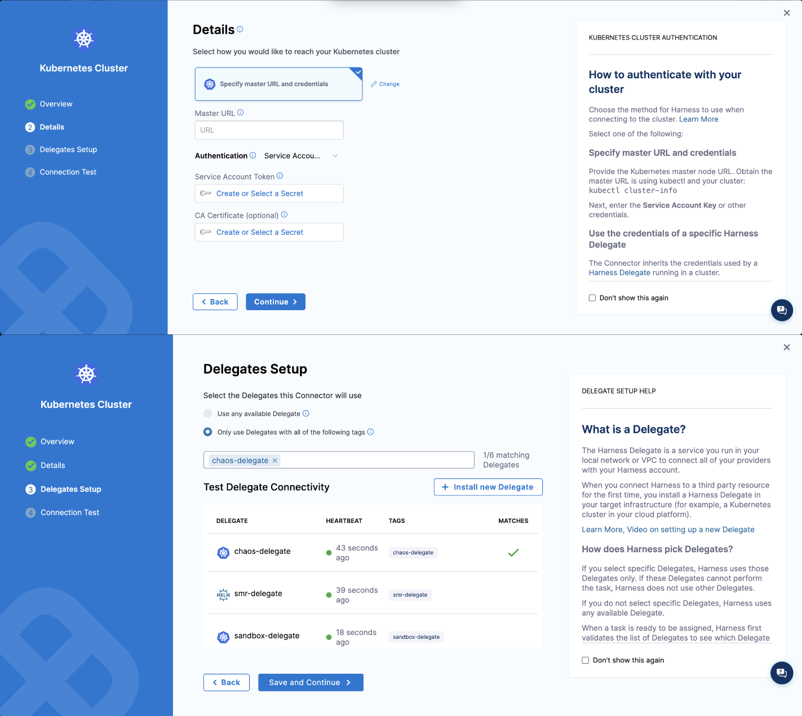
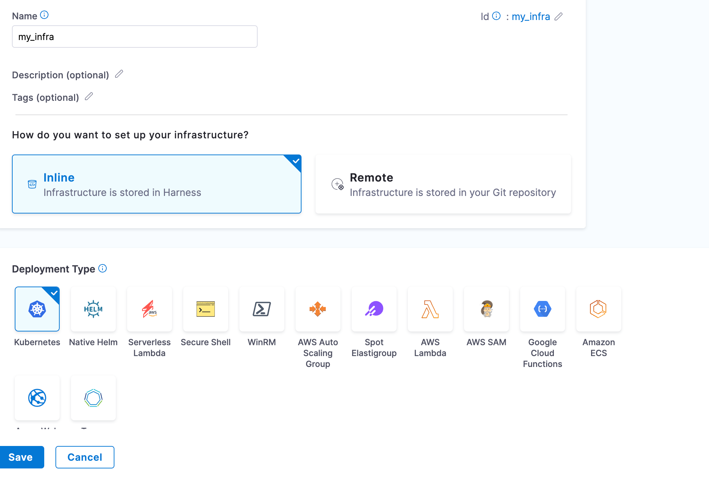
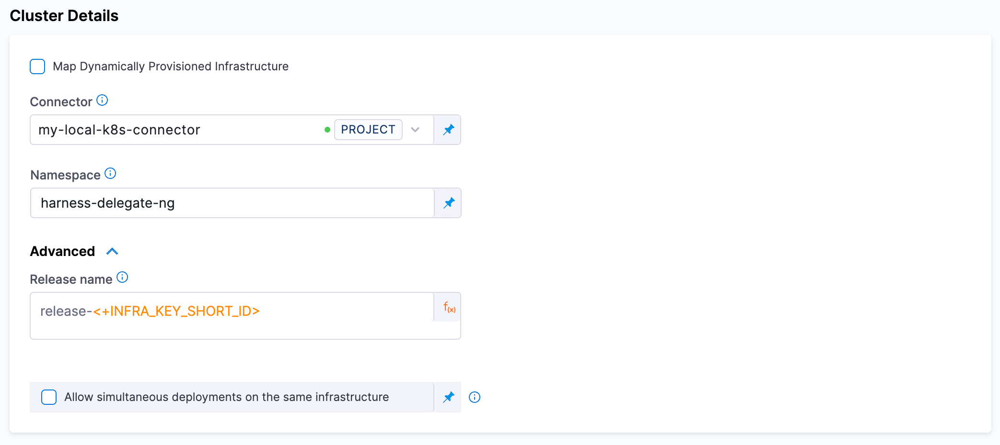

This topic describes the permissions required to execute chaos experiments when the target application and Delegate are running on different clusters. 

## Prerequisites

- The [Delegate must be installed](/docs/chaos-engineering/use-harness-ce/infrastructures/types/ddcr/installation) within your centralized infrastructure.
- Ensure network connectivity between the centralized infrastructure and the target cluster infrastructure where chaos experiments will be executed.

The diagram below describes how the Harness environment and your (user) environment communicate with the help of Harness Delegate to execute chaos experiments.

    


## Permissions to manage Delegate resources

### Step 1: Create Service Account and RBAC

When the target application and Delegate are running on different clusters, create a service account with the given permission in the target cluster to provide permissions for Harness chaos transient pods in a dedicated namespace. Harness recommends you keep the delegate, chaos infrastructure and delegate namespace as same.

While using Harness Delegate, transient pods are created. Delegate manages the resources, that require specific permissions in the dedicated namespace.

```yaml
apiVersion: v1
kind: ServiceAccount
metadata:
  name: chaos-sa
  namespace: harness-delegate-chaos (our recommendation is to create a dedicated namespace in the target cluster for delegate)
---
apiVersion: v1
kind: Secret
metadata:
  name: chaos-sa-secret
  namespace: harness-delegate-chaos
  annotations:
    kubernetes.io/service-account.name: chaos-sa
type: kubernetes.io/service-account-token
---
apiVersion: rbac.authorization.k8s.io/v1
kind: Role
metadata:
  namespace: harness-delegate-chaos
  name: chaosrunner-pod-role
rules:
- apiGroups:
  - apps
  resources:
  - deployments
  - replicasets
  - daemonsets
  - statefulsets
  verbs:
  - create
  - delete
  - get
  - list
  - patch
  - update
  - watch
  - deletecollection
- apiGroups:
  - ""
  resources:
  - pods
  - pods/log
  - pods/exec
  - secrets
  - services
  - configmaps
  verbs:
  - create
  - delete
  - get
  - list
  - patch
  - update
  - watch
  - deletecollection
- apiGroups:
  - batch
  resources:
  - jobs
  - cronjobs
  verbs:
  - create
  - delete
  - get
  - list
  - patch
  - update
  - watch
  - deletecollection
---
apiVersion: rbac.authorization.k8s.io/v1
kind: RoleBinding
metadata:
  name: chaosrunner-pod-rolebinding
  namespace: harness-delegate-chaos
subjects:
- kind: ServiceAccount
  name: chaos-sa
  namespace: harness-delegate-chaos
roleRef:
  kind: Role
  name: chaosrunner-pod-role
  apiGroup: rbac.authorization.k8s.io
```

#### Generate Service Account Token

Use the following kubectl command to get a SA bound token:

```yaml
kubectl -n harness-delegate-chaos get secret chaos-sa-secret -o jsonpath='{.data.token}' | base64 --decode
```

Here, `chaos-sa-secret` is the actual name of the token secret and `harness-delegate-chaos` is the namespace of the token secret, so change it accordingly.


### Step 2. Create Kubernetes Connector

A connector describes how the Delegate communicates with the target cluster.
Create a Kubernetes cluster connector using service account based authentication where the service account token is base64 decoded. You would have obtained the token in the previous step. Obtain the master URL by executing the command `kubectl cluster-info` and get the service account token and secret from the Kubernetes secret.

    

### Step 3. Create Cluster Role 

Create a cluster role and provide cluster-wide access or cluster role binding for selected namespaces using role binding, depending on your usage. You can use this configuration to onboard application namespaces.
To discover the resources and run chaos, use the permissions (described below) in each namespace.

    ```yaml
    apiVersion: rbac.authorization.k8s.io/v1
    kind: ClusterRole
    metadata:
      name: chaos-clusterrole
    rules:
    # Discovery permissions
    - apiGroups:
      - apps
      resources:
      - deployments
      - replicasets
      - daemonsets
      - statefulsets
      verbs:
      - watch
      - list
      - get
    - apiGroups:
      - ""
      resources:
      - pods
      - replicationcontrollers
      - services
      - statefulsets
      - nodes
      - namespaces     #(nodes and namespace permissions are required to autocreate network experiments)
      verbs:
      - watch
      - list
      - get
    - apiGroups:
      - batch
      resources:
      - jobs
      - cronjobs
      verbs:
      - watch
      - list
      - get
    # Chaos permissions
    - apiGroups:
      - ""
      resources:
      - pods
      verbs:
      - create
      - delete
      - get
      - list
      - patch
      - update
      - watch
      - deletecollection
    - apiGroups:
      - networking.k8s.io
      resources:
      - networkpolicies
      verbs:
      - create
      - delete
      - get
      - list
    - apiGroups:    #(Prerequisite: Metrics server should be installed on the cluster. This is required if you are running a custom script in command (CMD) source probe to get the CPU and memory metrics for pods and nodes.)
      - metrics.k8s.io
      resources:
      - pods
      - nodes
      verbs:
      - get
      - list
    - apiGroups:
      - apps
      resources:
      - deployments
      - replicasets
      - daemonsets
      - statefulsets
      verbs:
      - list
      - get
      - update
    - apiGroups:
      - ""
      resources:
      - replicationcontrollers
      - services
      verbs:
      - get
      - list
    - apiGroups:
      - apps.openshift.io
      resources:
      - deploymentconfigs
      verbs:
      - list
      - get
    - apiGroups:
      - argoproj.io
      resources:
      - rollouts
      verbs:
      - list
      - get
    ``` 

### Step 4: Onboard Namespaces

You can onboard [all namespaces](/docs/chaos-engineering/use-harness-ce/infrastructures/types/ddcr/centralized-delegate#access-all-namespaces) or [specific namespaces (one or more)](/docs/chaos-engineering/use-harness-ce/infrastructures/types/ddcr/centralized-delegate#access-specific-namespace) to inject chaos.

#### Access All Namespaces

You can provide access to all the namespaces by creating a role binding in the application namespace.

    ```yaml
    apiVersion: rbac.authorization.k8s.io/v1
    kind: ClusterRoleBinding
    metadata:
      name: chaos-rolebinding
    roleRef:
      apiGroup: rbac.authorization.k8s.io
      kind: ClusterRole
      name: chaos-clusterrole
    subjects:
    - kind: ServiceAccount
      name: chaos-sa
      namespace: harness-delegate-chaos
    ```

#### Access Specific Namespace

To onboard a namespace, create a RoleBinding in the application namespace (for example, `app1`, `app2`, and so on.)

    ```yaml
    apiVersion: rbac.authorization.k8s.io/v1
    kind: RoleBinding
    metadata:
      name: chaos-rolebinding
      namespace: app1
    roleRef:
      apiGroup: rbac.authorization.k8s.io
      kind: ClusterRole
      name: chaos-clusterrole
    subjects:
    - kind: ServiceAccount
      name: chaos-sa
      namespace: harness-delegate-chaos
    ```

:::info note
- For the above setting to work, ensure you update the namespace and the service account in the Harness portal service discovery agent setting and chaos infrastructure settings.
:::

### Step 5. Create Harness Infrastructure Definition 

Create Harness infrastructure definition using the same Kubernetes cluster connector that was created in [Step 2](#step-2-create-kubernetes-connector).

    

    

### Step 6. Edit Infrastructure 

Follow this step only after [enabling chaos](/docs/chaos-engineering/getting-started/onboarding/guided-onboarding) on the infrastructure. Edit the infrastructure you created in [step 5](#step-5-create-harness-infrastructure-definition) to provide the details of the dedicated namespace that was created. This is the namespace where the chaos runner is launched along with the Service Account to ensure that experiments are executed with relevant permissions.

    