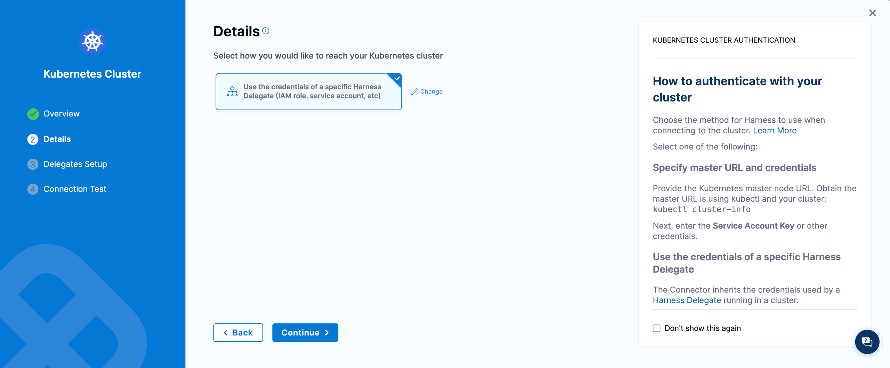

This topic describes the permissions required to deploy Delegate for each target cluster to execute chaos experiments.

## Before you begin, review the following:

- [What is DDCR?](/docs/chaos-engineering/use-harness-ce/infrastructures/#what-is-ddcr)
- [Install Delegate to execute chaos experiments](/docs/chaos-engineering/use-harness-ce/infrastructures/types)

## Why service accounts matter

A service account is required in the Delegate YAML when Delegate is installed in the **target cluster** to execute chaos experiments, because Delegate has to assume a role to execute chaos experiments.

In case the Delegate is deployed in a [**centralized infrastructure**](/docs/chaos-engineering/use-harness-ce/infrastructures/types/ddcr/centralized-delegate) (and connected to the target cluster), service account is not required in the Delegate YAML because the Kubernetes connectors already have the role permissions, and Delegate only orchestrates the tasks.

The diagram below describes the interaction between Harness environment and your (user) environment when using a dedicated Delegate on a target cluster. It is important to note that Harness Delegate is installed in the target cluster where chaos experiment is executed.

  

## Limit Permissions for Delegate

By default, Delegate uses the **cluster admin** role. To limit the permissions for the Delegate, follow the steps below.

### Step 1. Create a dedicated namespace 
Create a dedicated namespace for Harness delegate during installation. For example `harness-delegate-ng`.

### Step 2. Remove Cluster Role Binding 

Remove the cluster role binding from the Delegate manifest, as shown in the diagram.

    

### Step 3. Create New Service Account 

Create a new service account for the Delegate (to which you can assign a role further) in the dedicated namespace where the Delegate is installed.
Here, `chaos-delegate` refers to the name of the service account in the Delegate.

    ```yaml
    apiVersion: v1
    kind: ServiceAccount
    metadata:
      name: chaos-delegate
      namespace: harness-delegate-ng 
    ```

### Step 4. Attach the Service Account 

Attach the service account you created earlier to the Delegate YAML, as shown in the diagram.

    

### Step 5. Apply RBAC

Apply the below RBAC to configure the permissions to create chaos runners (that is, transient pods).

    ```yaml
    apiVersion: rbac.authorization.k8s.io/v1
    kind: Role
    metadata:
      namespace: harness-delegate-ng
      name: chaos-runner-role
    rules:
    - apiGroups:
      - apps
      resources:
      - deployments
      - replicasets
      - daemonsets
      - statefulsets
      verbs:
      - create
      - delete
      - get
      - list
      - patch
      - update
      - watch
      - deletecollection
    - apiGroups:
      - ""
      resources:
      - pods
      - pods/log
      - pods/exec
      - secrets
      - services
      - configmaps
      verbs:
      - create
      - delete
      - get
      - list
      - patch
      - update
      - watch
      - deletecollection
    - apiGroups:
      - batch
      resources:
      - jobs
      - cronjobs
      verbs:
      - create
      - delete
      - get
      - list
      - patch
      - update
      - watch
      - deletecollection
    ---
    apiVersion: rbac.authorization.k8s.io/v1
    kind: RoleBinding
    metadata:
      name: chaos-runner-rolebinding
      namespace: harness-delegate-ng
    subjects:
    - kind: ServiceAccount
      name: chaos-delegate
      namespace: harness-delegate-ng
    roleRef:
      kind: Role
      name: chaos-runner-role
      apiGroup: rbac.authorization.k8s.io
    ```

### Step 6. Create a Cluster Role 

Create a cluster role that will be used later to onboard application namespaces.

    ```yaml
    apiVersion: rbac.authorization.k8s.io/v1
    kind: ClusterRole
    metadata:
      name: chaos-clusterrole
    rules:
    # Discovery permissions
    - apiGroups:
      - apps
      resources:
      - deployments
      - replicasets
      - daemonsets
      - statefulsets
      verbs:
      - watch
      - list
      - get
    - apiGroups:
      - ""
      resources:
      - pods
      - replicationcontrollers
      - services
      - statefulsets
      - nodes
      - namespaces     #(nodes and namespace permissions are required to autocreate network experiments)
      verbs:
      - watch
      - list
      - get
    - apiGroups:
      - batch
      resources:
      - jobs
      - cronjobs
      verbs:
      - watch
      - list
      - get
    # Chaos permissions
    - apiGroups:
      - ""
      resources:
      - pods
      verbs:
      - create
      - delete
      - get
      - list
      - patch
      - update
      - watch
      - deletecollection
    - apiGroups:
      - networking.k8s.io
      resources:
      - networkpolicies
      verbs:
      - create
      - delete
      - get
      - list
    - apiGroups:    #(Prerequisite: Metrics server should be installed on the cluster. This is required if your are running a custom script in command (CMD) source probe to get CPU and memory metrics for pods and nodes.)
      - metrics.k8s.io
      resources:
      - pods
      - nodes
      verbs:
      - get
      - list
    - apiGroups:
      - apps
      resources:
      - deployments
      - replicasets
      - daemonsets
      - statefulsets
      verbs:
      - list
      - get
      - update
    - apiGroups:
      - ""
      resources:
      - replicationcontrollers
      - services
      verbs:
      - get
      - list
    - apiGroups:
      - apps.openshift.io
      resources:
      - deploymentconfigs
      verbs:
      - list
      - get
    - apiGroups:
      - argoproj.io
      resources:
      - rollouts
      verbs:
      - list
      - get
    ```

### Step 7. Create Cluster Role Binding (Optional)

If you wish to provide access to all namespaces, create a cluster role binding.

    ```yaml
    apiVersion: rbac.authorization.k8s.io/v1
    kind: ClusterRoleBinding
    metadata:
      name: chaos-rolebinding
    roleRef:
      apiGroup: rbac.authorization.k8s.io
      kind: ClusterRole
      name: chaos-clusterrole
    subjects:
    - kind: ServiceAccount
      name: chaos-delegate
      namespace: harness-delegate-ng
    ```

  - Now, you can onboard a namespace by creating a role binding in the application namespace (For example, Onboarding app1, app2 and so on)

      ```yaml
      apiVersion: rbac.authorization.k8s.io/v1
      kind: RoleBinding
      metadata:
        name: chaos-rolebinding
        namespace: app1 #for app2, provide namespace as app2
      roleRef:
        apiGroup: rbac.authorization.k8s.io
        kind: ClusterRole
        name: chaos-clusterrole
      subjects:
      - kind: ServiceAccount
        name: chaos-delegate
        namespace: harness-delegate-ng
    ```

### Step 8. Create a Kubernetes connector 

Create a Kubernetes connector using Delegate permissions.

    
    


### Step 9. Create Kubernetes Infrastructure

Finally create the Kubernetes infrastructure using the Kubernetes connectors created in the [step 8](#step-8-create-a-kubernetes-connector).

    
    

### Step 10. Edit Infrastructure 

Edit the infrastructure you created in [step 9](/docs/chaos-engineering/use-harness-ce/infrastructures/types/ddcr/dedicated-delegate#step-9-create-kubernetes-infrastructure) to provide the details of dedicated namespace that was created earlier. This is the namespace where the chaos runner will be launched along with the Service Account to ensure that experiments run with relevant permissions.

    