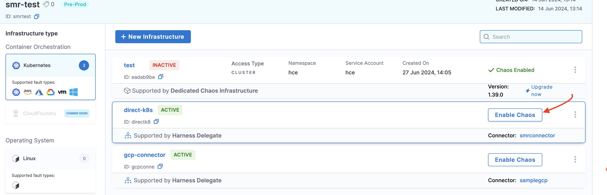
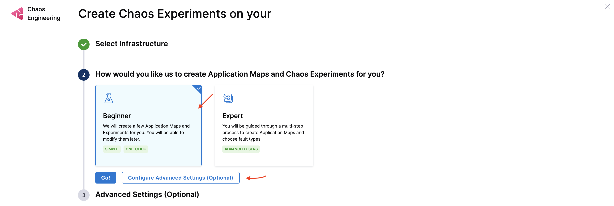
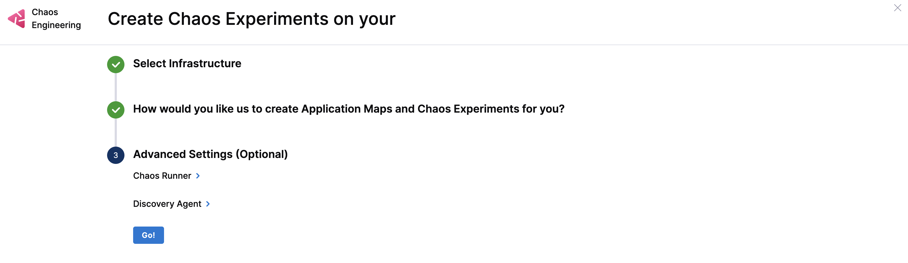

This topic describes how you can install Harness Delegate and enable chaos on it. You can follow the interactive demo or the steps to install Harness Delegate.

## Prerequisites

- [Create an Environment](/docs/chaos-engineering/getting-started/saas/#step-3-create-an-environment)

## Interactive Demo
Navigate through the demo below to see how to create an environment, a new infrastructure, a new connector and a Delegate. 

If you have created a connector and a Harness Delegate earlier, you can find their names in the list that is displayed while selecting the connector and Delegate, respectively. Select it instead of creating a new one.

<iframe 
  src="https://app.tango.us/app/embed/9c5307d6-ec41-4706-bacc-6dfdd84cde49"
  title="Create a Harness Delegate"
  style={{minHeight:'640px'}}
  width="100%" 
  height="100%" 
  referrerpolicy="strict-origin-when-cross-origin" 
  frameborder="0" 
  webkitallowfullscreen="webkitallowfullscreen" 
  mozallowfullscreen="mozallowfullscreen" 
  allowfullscreen="allowfullscreen"></iframe>

## Step-by-Step Installation

1. Select the **Environment** you created, and choose the **Infrastructure type**. In this example, select **Kubernetes** and click **+ New Infrastructure**.

2. To use Harness Delegate, select **Yes**. To use a dedicated chaos infrastructure, select **No**. In this example, select **Yes**, and click **Next**.

3. Provide a **Name**, **Deployment Type**, **Select Infrastructure Type**, and provide **Cluster Details**, such as **Connector**, and **Namespace**. 
  
    a. To create a new connector, go to [Create Kubernetes Connector](/docs/platform/connectors/cloud-providers/add-a-kubernetes-cluster-connector/#add-a-kubernetes-cluster-connector). Harness CE supports creating two types of connectors:         
      - [Kubernetes (Direct Connection)](/docs/platform/connectors/cloud-providers/ref-cloud-providers/kubernetes-cluster-connector-settings-reference) 
      - [GCP](/docs/platform/connectors/cloud-providers/ref-cloud-providers/gcs-connector-settings-reference)

    b. While creating a Kubernetes connector, select or [create a new Delegate](/docs/platform/delegates/install-delegates/overview/#install-the-helm-chart). Once your Delegate shows up in the list, enter its name in the search bar, and select **Save and Continue**. This will test your connection and describe if it was a success or no. Contact [Harness Support](mailto:support@harness.io) if you encounter issues with the verification.

4. To **Enable Chaos** and use **Configure Advanced Settings (Optional)**, navigate to **Environments** and **Enable Chaos** on the infrastructure you created earlier.

    

5. Choose between **Beginner** or **Expert** and click **Go**. 

    

6. You can choose to provide additional configurations in the **Configure Advanced Settings (Optional)** section to configure [chaos runner and Discovery Agent](/docs/platform/service-discovery/customize-agent) and click **Go**. This creates application maps and chaos experiments for you.

    

:::tip
- Ensure your Delegate version is `24.09.83900` or above to support executing chaos experiments using DDCR. 
- Currently, DDCR (or Harness Delegate) can only be installed to execute Kubernetes-based faults. This means you can only create Kubernetes connectors.
- To execute faults on Linux and Windows, install Linux and Windows agents respectively.
- To configure mTLS with DDCR and Discovery Agent, go to [mTLS Support](/docs/chaos-engineering/use-harness-ce/infrastructures/types/ddcr/mtls-support).
- To configure mTLS with DDCR and and Discovery Agent proxy settings, go to [proxy Support](/docs/chaos-engineering/use-harness-ce/infrastructures/types/ddcr/proxy-support).
:::

## Harness Terraform Provider

Go to [create Harness Delegate (DDCR)](https://registry.terraform.io/providers/harness/harness/latest/docs/resources/chaos_infrastructure) to create a Harness Delegate using [Harness Terraform provider](https://developer.harness.io/docs/platform/automation/terraform/harness-terraform-provider-overview/).

## Next Steps

- [Deploy Delegate on a Cluster](/docs/chaos-engineering/use-harness-ce/infrastructures/types/ddcr/dedicated-delegate)
- [Use mTLS with Delegate](/docs/chaos-engineering/use-harness-ce/infrastructures/types/ddcr/mtls-support)