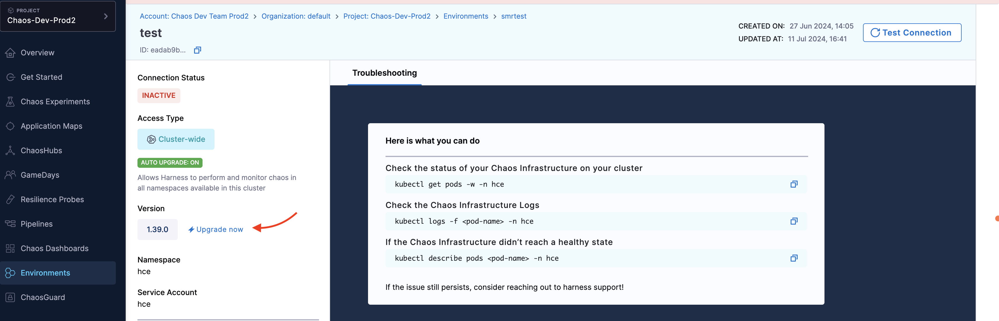
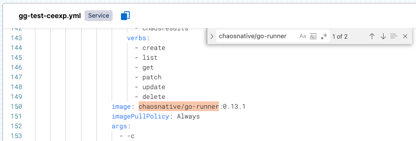
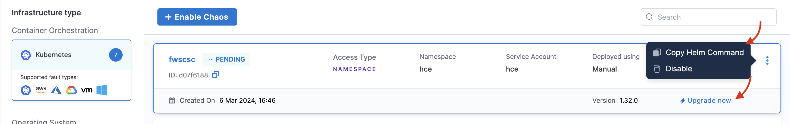
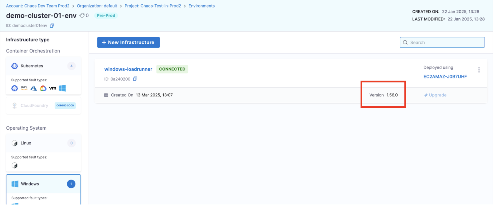

This topic describes how you can upgrade your legacy chaos infrastructure (Dedicated Kubernetes Infrastructure, Helm-based Installation, Linux, and Windows infrastructure).

If a Harness CE release is not backward compatible, upgrade your chaos infrastructure to ensure you can execute all experiments smoothly. This applies only to releases that have breaking changes, which will be clearly indicated in the [release notes](/release-notes/chaos-engineering).

:::warning
- If you don't upgrade your infrastructure for these types of releases, chaos experiments may fail.
- [This video](https://youtu.be/fAnsGqkcdkc) tutorial provides a step-by-step walkthrough to upgrade your chaos infrastructure to 1.38.x or higher].
:::

These are the high-level steps to upgrade your chaos infrastructure, explained in detail later:

1. [Delete the old ChaosEngine CRs](#step-1-delete-the-old-chaosengine) where you've deployed a chaos infrastructure.
1. [Update CRDs](#step-2-upgrade-crds-where-youve-deployed-a-chaos-infrastructure) where you've deployed a chaos infrastructure.
1. [Update the chaos infrastructure in Harness](#step-3-update-the-chaos-infrastructure-in-harness) in environments where you've deployed it.
1. [Edit experiment YAML](#step-4-update-the-chaosnativego-runner-image-in-experiment-yaml) to update the chaosnative/go-runner image to the new version.

## How to tell if an infrastructure upgrade is required?

Go to **Chaos > Environments**, and select an environment where you've installed chaos infrastructure. Select the infrastructure and you will see the infrastructure version. If an upgrade is required, **Upgrade Now** is specified next to the infrastructure.

	


## Upgrade your chaos infrastructure

### Step 1: Delete the old ChaosEngine

This step removes all ChaosEngine custom resources (CRs) in the infrastructure namespace.

1. Connect to the cluster on a console where you can run `kubectl`.
1. Delete the old ChaosEngine CRs from the cluster:

	```
	kubectl delete chaosengines --all -n NAMESPACE_OF_CHAOS_INFRASTRUCTURE
	```

1. If ChaosEngine CRs are not being deleted, remove the finalizer from all the chaosengine CRs.

	```
	kubectl get chaosengine --no-headers -o custom-columns=":metadata.name" -n NAMESPACE_OF_CHAOS_INFRASTRUCTURE | xArgs  kubectl patch chaosengine {}   -p '{"metadata":{"finalizers":[]}}' --type=merge -n NAMESPACE_OF_CHAOS_INFRASTRUCTURE
	```

1. Confirm ChaosEngine CRs are deleted.

	```
	kubectl get chaosengine -n NAMESPACE_OF_CHAOS_INFRASTRUCTURE
	```

### Step 2: Upgrade CRDs where you've deployed a chaos infrastructure

1. Connect to the cluster on a console where you can run `kubectl`.
2. Run this command to upgrade the CRDs:

	```
	kubectl apply -f https://raw.githubusercontent.com/chaosnative/hce-charts/main/hce-saas/hce-saas-crds.yaml
	```

### Step 3: Update the chaos infrastructure in Harness

1. In Harness, go to **Chaos > Environments**, and then select an environment where you've installed chaos infrastructure.

	**UPGRADE NEEDED** is the status displayed next to infrastructures that require an upgrade.

	

1. Select **Update** (next to the old version number), and then follow the instructions on the next screen.

	When the update is complete, the status changes to **CONNECTED**, and the new version number is displayed.

### Step 4: Update the chaosnative/go-runner image in experiment YAML

For existing experiments that use the infrastructure you're upgrading, you must update the version of the chaosnative/go-runner image. You do this by editing the YAML definitions of these experiments. This step is not required for new experiments after the upgrade.

To update the chaosnative/go-runner image version in an experiment:

1. Refer to the [release notes](/release-notes/chaos-engineering) to determine the required version of the chaosnative/go-runner image.

1. In Harness, go to **Chaos > Chaos Experiments**, and then select the experiment you want to update.

1. At the top of the experiment details page, select **YAML**.

1. In the experiments `.yml` file, select **Edit Yaml**.

1. In the edit view, do a browser search (`Ctrl/Cmd + f`) for `chaosnative/go-runner`, and then update its version number.

	For example, this updates chaosnative/go-runner to version 0.13.1.

	

1. Select **Save**.

1. Repeat this procedure to update the relevant existing experiments in any custom chaos hubs that may be connected to your project.

## Use Helm Template to Upgrade Chaos Infrastructure

To upgrade a chaos infrastructure that you installed using the Helm commands, perform the following operations:

1. Navigate to the environment and select the environment that you created, (this environment houses your infrastructure). Select the **Infrastructure Type** and select the infrastructure from the list you see on the screen.

2. Click **Upgrade now** and **Confirm**. This will list the set of commands that you can execute on your terminal.

  

3. If you want to override other values, you can make the changes in the values.yaml file of the respective custom resource in the Helm repository.
1. Download the [helm repository](https://github.com/harness/chaos-infra-helm-chart). This repository contains all the chaos resources required for chaos infrastructure management. The repository also contains resources necessary for the namespace and cluster scope installations. You can use this repository to install and manage the infrastructure.

Based on the scope of installation, you have to execute the commands.

1. If you wish to install the infrastructure in the namespace scope, you will get a helm command to install the CRDs. You have to apply this command separately before installing or upgrading the infrastructure.
2. If you wish to install the infrastructure in cluster scope, apply the helm upgrade command to install the CRDs and other infrastructure components.

:::tip
1. If you install your infrastructure in cluster scope, Harness CE supports auto-upgrade for such an infrastructure.
2. It is important that you remember that the flags in the command are based on the input parameters you provide while installing the infrastructure.
:::

## Upgrade Linux Infrastructure

You can upgrade Linux infrastructure in two ways depending on the platform:
	- [SaaS](#saas)
	- [SMP](#smp)

### SaaS

For SaaS platform, execute the commands in the VM where your infrastructure is installed.

- Execute the following commands to fetch the `INFRA_ID` and the `ACCESS_KEY`.

	```yaml
	INFRA_ID=$(sed -n 's/^infraID: "\(.*\)"/\1/p' /etc/linux-chaos-infrastructure/config.yaml)
	```

	```yaml
	ACCESS_KEY=$(sed -n 's/^accessKey: "\(.*\)"/\1/p' /etc/linux-chaos-infrastructure/config.yaml)
	```

- Execute the below command to uninstall the existing infrastructure.

	```yaml
	/etc/linux-chaos-infrastructure/uninstall.sh
	```

- You can find the URL (which is a binary required for installation) to upgrade the Linux infrastructure by navigating to your account, and accessing the Linux infrastructure from the UI. Execute this command with the `INFRA_ID` and the `ACCESS_KEY` that you got by executing the first command.

	```yaml
	sudo https://app.harness.io/public/shared/tools/chaos/linux/1.50.0/install.sh | bash /dev/stdin --infra-id <INFRA_ID> --access-key <ACCESS_KEY> --server-url https://<YOUR_IP>/chaos/lserver/api
	```

### SMP

- Raise a [Harness support](https://support.harness.io) ticket to get the `offline-linux-installer` tarball.
- Copy and extract the offline installer to your target VM and `cd` (navigate) to the extracted directory.
- Execute the following commands to fetch the `INFRA_ID` and the `ACCESS_KEY`.

	```yaml
	INFRA_ID=$(sed -n 's/^infraID: "\(.*\)"/\1/p' /etc/linux-chaos-infrastructure/config.yaml)
	```

	```yaml
	ACCESS_KEY=$(sed -n 's/^accessKey: "\(.*\)"/\1/p' /etc/linux-chaos-infrastructure/config.yaml)
	```

- Execute the below command to uninstall the existing infrastructure.

	```yaml
	/etc/linux-chaos-infrastructure/uninstall.sh
	```

:::tip
To upgrade the infrastructure in an air-gapped environment, assuming you have downloaded the Linux infrastructure, execute the following command:

```yaml
sudo  ./install.sh --infra-id <INFRA_ID> --access-key <ACCESS_KEY> --server-url https://<YOUR_IP>chaos/lserver/api
```
:::

## Upgrade Windows Infrastructure

To upgrade your Windows infrastructure, perform the following steps:

### Step 1: Uninstall Current Infrastructure

Execute the following command in the command prompt:

The command below upgrades from `1.55.0` to the latest version (`1.56.0` in this case). Based on your current version, the version in the command changes.

```bash
powershell -Command "& { Invoke-WebRequest -Uri 'https://app.harness.io/public/shared/tools/chaos/windows/1.55.0/uninstall.ps1' -OutFile 'uninstall.ps1' -UseBasicParsing; .\uninstall.ps1 }"
```

:::info note
Note down the account user running the `WindowsChaosInfrastructure` service. The same credentials are required for the upgrade.
:::


### Step 2: Install Upgraded Version of Infrastructure

Execute the following command:

```bash
powershell -Command "& { Invoke-WebRequest -Uri 'https://app.harness.io/public/shared/tools/chaos/windows/1.56.0/install.ps1' -OutFile 'install.ps1' -UseBasicParsing; .\install.ps1 -AdminUser '.\<your-account-username> -AdminPass '<your-account-password>' -InfraId 'a975f804-8d91-480d-892b-1b9d74a16f26' -AccessKey '4e29tku7tqovua4q03fgejt6puakkjmu' -ServerUrl 'https://app.harness.io/gratis/chaos/mserver/api' }"
```

Here,

- `your-account-username` is the username and `your-account-password` is the password for the user who launches the Windows infrastructure. 

- `.\` indicates that it is a local account. If you use a domain account, you can update accordingly. You can identify the account from [Step 1](#step-1-uninstall-current-infrastructure).

Fetch the `infraID` and `access key` from `config.yaml` file under `hce` (which is a dedicated chaos directory created during previous installation). By default, it is at `C:\HCE\config.yaml`.

	If you’re using a proxy, provide `infraID` and `access key` as a part of the installation command in [Step 2](#step-2-install-upgraded-version-of-infrastructure) and specify the following proxy flags.

		```bash
		-HttpsProxy <proxy-server> -HttpProxy <proxy-server> -NoProxy <proxy-server>
		```


### Step 3: Verify the Upgrade

Execute the below command to get the status of the service after installation.

```bash
sc query WindowsChaosInfrastructure
```

You can verify the version from the **Environments**->Infrastructure.

	

