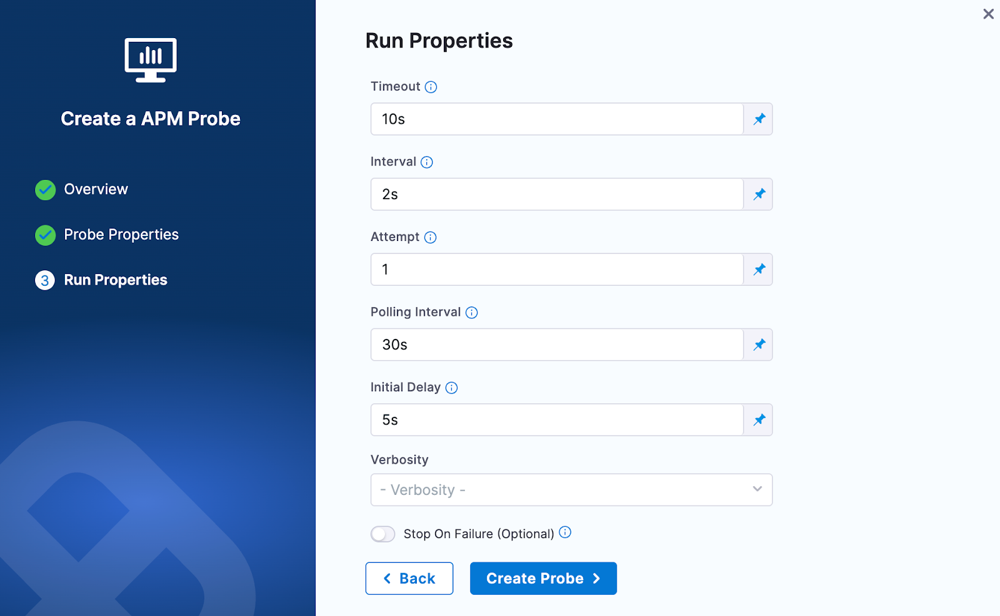

Prometheus probe allows you to run Prometheus queries and match the resulting output against specific conditions. You can define metrics-based SLOs in a declarative way and determine the experiment verdict based on their success. The probe runs the query on a Prometheus server defined by the endpoint and checks whether the output satisfies the specified criteria. The outcome of a PromQL query (that is provided) is used for probe validation.

### Prerequisites
To use the Prometheus APM probe, you need:

* A running Prometheus server
* Access to the Prometheus API endpoint from the kubernetes execution plane
* Proper configuration of your application to expose metrics to Prometheus

### Interactive Setup Guide

Follow along with this interactive guide to learn how to configure Prometheus probe:

<DocVideo src="https://app.tango.us/app/embed/87f20060-9449-4ac1-84ef-e69eefa35e87?skipCover=false&defaultListView=false&skipBranding=false&makeViewOnly=false&hideAuthorAndDetails=true" title="Create Prometheus APM Probe" />

### Steps to configure

1. In Resilience probe section under chaos module, click on **New Probe** button

    

2. Select the **APM Probe**
3. Provide the name of the probe and select **Prometheus** under APM Type

    

4. Under Prometheus connector select connector

5. In Connector settings, you can either choose an existing connector or click **New Connector**

    

6. Provide the credentials of the Prometheus

    

7. Select the delegate and verify the connection and click on **Finish**

    

8. Now connector is created and selected, click on **Configure Details**

    

9. Under Probe Properties pass the value of required parameters
   * **TLS Config**:
     * It offers a mechanism to validate TLS certifications for the Prometheus server. You can supply the `cacert` or the client certificate and client key to perform the validation. Alternatively, you have the option to enable the `insecureSkipVerify` check to bypass certificate validation.
     * For more details, refer to [Prometheus TLS configuration documentation](https://prometheus.io/docs/prometheus/latest/configuration/configuration/#tls_config).
     * **CA File**: The `caFile` holds the file path of the CA certificates utilized for server TLS verification
     * **Cert File**: The `certFile` holds the file path of the client certificates utilized for TLS verification
     * **Key File**: The `keyFile` holds the file path of the client key utilized for TLS verification
     * **Insecure Skip Verify**: The `insecureSkipVerify` setting skips the TLS certificates checks
   * **Query**:
     * The query contains the PromQL query to extract out the desired Prometheus metrics via running it on the given Prometheus endpoint
     * Please Note that all the double quotes need to be parsed in the provided query.
     * **Example**: `avg_over_time(probe_duration_seconds{job=\"prometheus-blackbox-exporter\",instance=\"frontend.boutique.svc.cluster.local:80\"}[60s:1s])*1000`
     * For more details, refer to [Prometheus PromQL documentation](https://prometheus.io/docs/prometheus/latest/querying/basics/)

    

10. Provide the comparison criteria under Prometheus Data Comparison

    

11. Provide the Run Properties

    

12. Then click on **Create Probe**