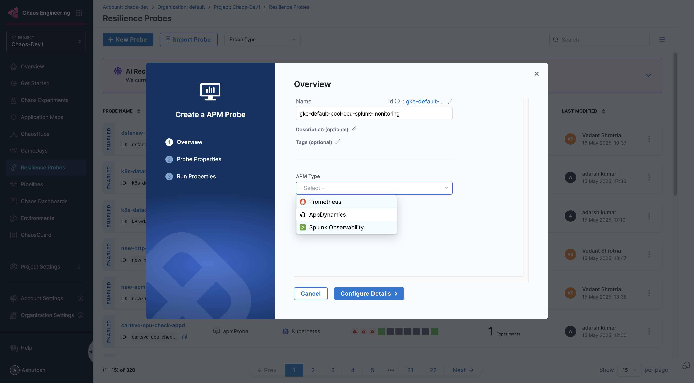
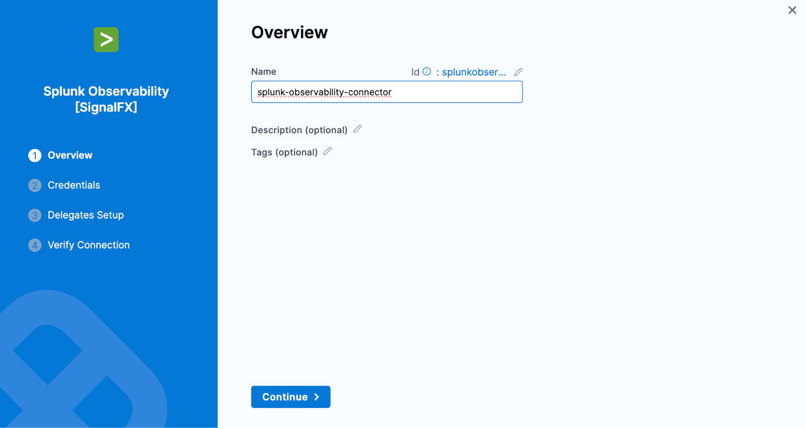
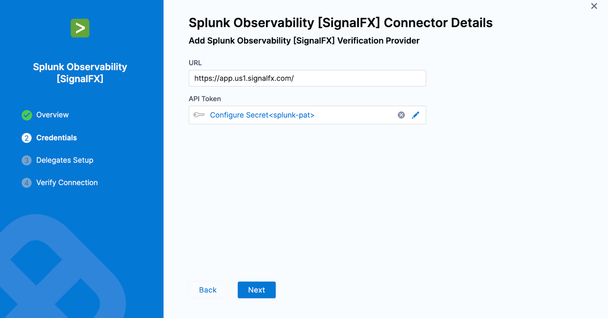
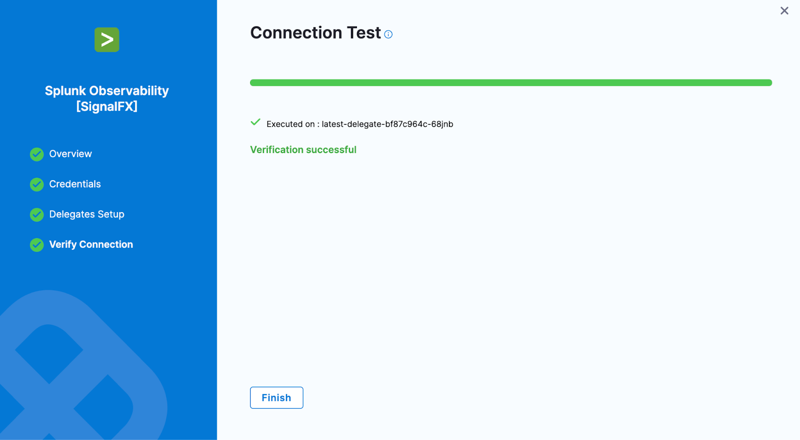
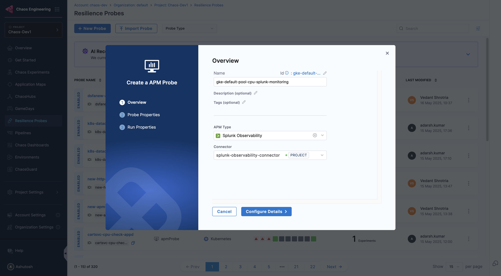
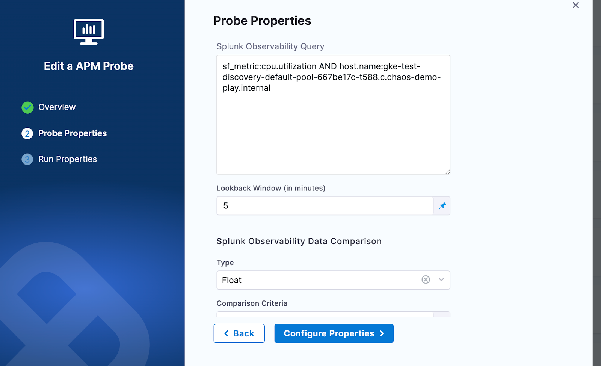
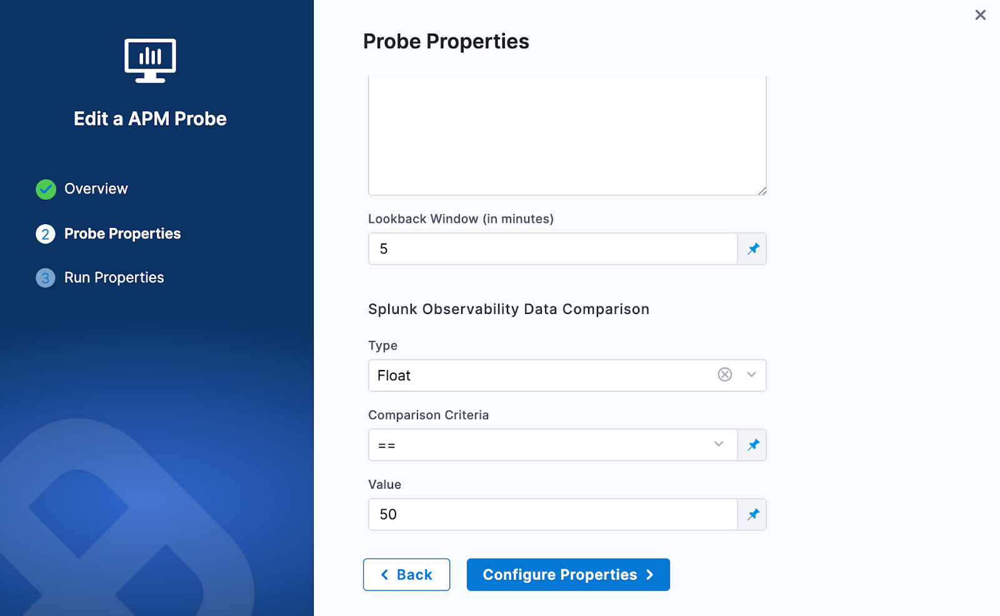

The Splunk Observability probe allows you to query Splunk Observability(Signalfx) metrics and compare the results against specified criteria.

### Prerequisites
To use the Splunk Observability probe, you need:

* An active Splunk Observability(signalfx) account
* Access to the Splunk Observability API from the kubernetes execution plane
* An API token for authentication

### Steps to configure the Splunk Observability Resilience Probe:

1. In Resilience probe section under chaos module, click on New Probe button

    

2. Select the APM Probe
3. Provide the name of the probe and select Splunk Observability under APM Type

    

4. Under Splunk Observability connector select connector
5. In Connector settings, you can either choose an existing connector or click New Connector.

    

6. Provide the credentials of the Splunk Observability

    

7. Select the delegate and verify the connection and click on Finish

    

8. Now connector is created and selected, click on Configure Details

    

9. Under Probe Properties, Pass the value of Splunk Observability Query and Lookback Window
   * **Splunk Observability Query**:
     * The Splunk Observability Query input is a string that specifies the search criteria for the metric time series (MTS) you want to retrieve. It follows a specific syntax that allows you to search for metrics, dimensions, properties, and tags
     * **Example query**: `sf_metric:cpu.utilization AND host.name:gke-default-pool-667be17c-t588.c.test.internal`
     * For more details refer to query section in Splunk Observability doc
   * **LookBack Window (In Minutes)**:
     * The lookback window refers to the time range from a specified number of minutes ago up to the current moment, over which data is aggregated

    

10. Provide the comparison criteria under Splunk Observability Data Comparison

    

11. Provide the Run Properties

    

12. Then click on Create Probe
