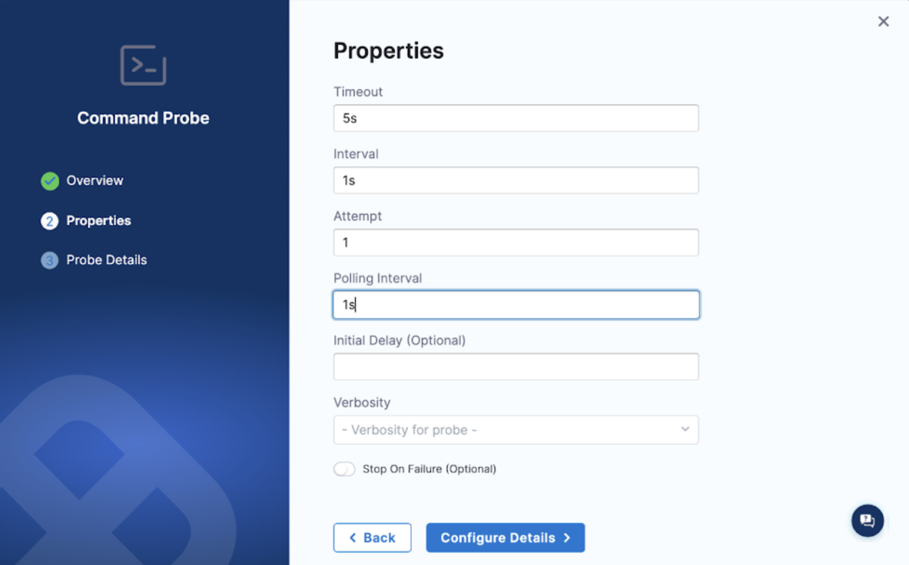
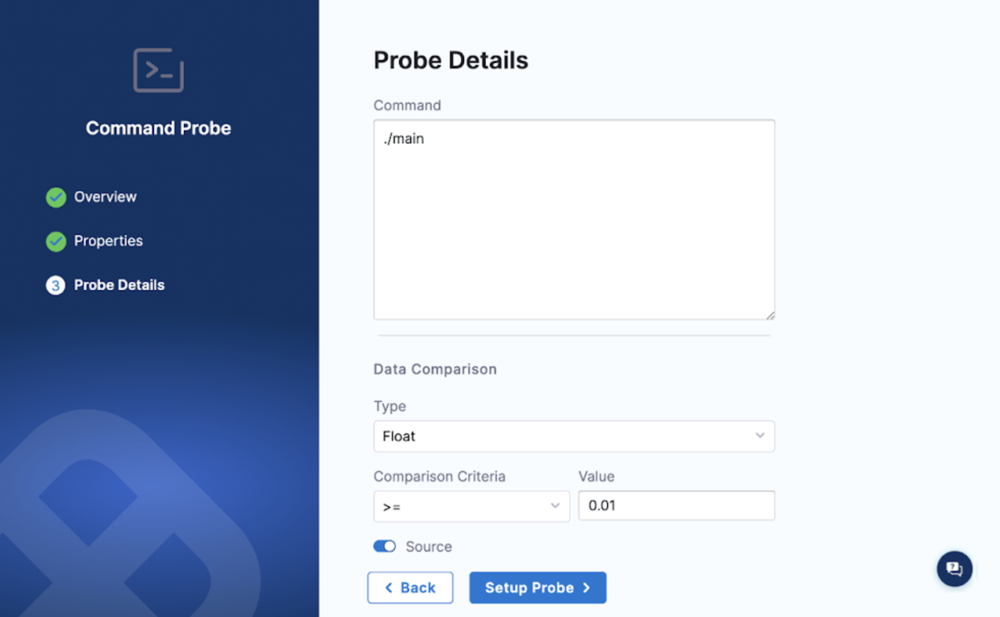

This topic guides you through steps to use the **command probe** in **source mode** to extract and validate the data from the APM tool New Relic.

## Before you begin, review the following

* [Command probe](/docs/chaos-engineering/features/resilience-probes/cmd-probe/cmd-probe.md)
* [Create a command probe](/docs/chaos-engineering/features/resilience-probes/use-probe#create-a-resilience-probe)
* [Command probe in source mode](/docs/chaos-engineering/features/resilience-probes/cmd-probe/cmd-probe-usage#command-probe-in-source-mode)

When you execute a command probe in the source mode, it allows you to provide a custom image, environment variables, and secrets to execute the command.

### Extract Data from New Relic

1. Create a binary file that stores the logic to extract data from New Relic. This file should extract the minimum, maximum, and mean values from the API response.
2. Dockerize the binary. This image contains the logic to query the New Relic GraphQL API and extract the minimum, maximum, and mean values from the API response.
3. [Create a new command probe](/docs/chaos-engineering/use-harness-ce/probes/use-probe#create-a-resilience-probe), add the necessary details, and select **Configure Properties**.

4. Add the necessary details, and select **Configure Details**.

    

5. Specify the command as **./main**. This command runs the dockerized binary that contains the logic to extract data from New Relic.

6. Select the type as **Float** in the **type** sub-field of **Data Comparison** field, because the data extracted from New Relic is expected to be a float value. Specify the **Comparison Criteria** and the expected value. Enable the **Source** button to allow using custom images, environment variables, and secrets.

    

7. Once the **Source** mode is enabled, a YAML text editor appears on the UI. Specify all the details for the source probe that are required to fetch the data from New Relic.
Pass the following parameters as environment variables:

- **NRQL_QUERY** : The NRQL query that is to be fetched from New Relic.
- **NRQL_ACCOUNT** : The account ID of the New Relic account.
- **NRQL_QUERY_METRICS** : The metrics that will be evaluated. The provided **NRQL** query can include multiple metrics.
- **NRQL_API_KEY** : The API key used to query New Relic.
- **NRQL_EVALUATION_TYPE** : The evaluation type, which could be min, max, or mean.

Below is the example configuration where the **NRQL_API_KEY** environment variable is referred from a Kubernetes secret. Ensure that the Kubernetes secret is present in the same namespace where chaos infrastructure is running.

```
image: docker.io/aady12/newrelic-p:3.2
env:
 - name: NRQL_QUERY
   value: SELECT (average(net.rxBytesPerSecond) / 1000) AS `Received KBps`, (average(net.txBytesPerSecond) / 1000) AS `Transmitted KBps`, average(net.errorsPerSecond) AS `Errors / sec` FROM K8sPodSample WHERE (entityGuid = 'NDQ1Mzg5NXxJTkZSQXxOQXwxMjg5MjUwNjUxOTg2MDI1OTA1') TIMESERIES AUTO
 - name: NRQL_ACCOUNT
   value: "12345"
 - name: NRQL_API_KEY
    valueFrom:
      secretKeyRef:
        name: newrelic-sec
        key: NEWRELIC_KEY
 - name: NRQL_QUERY_METRICS
   value: Received KBps
 - name: NRQL_EVALUATION_TYPE
   value: max
```

8. Attach the probe created in the experiment and validate the metrics from New Relic.
