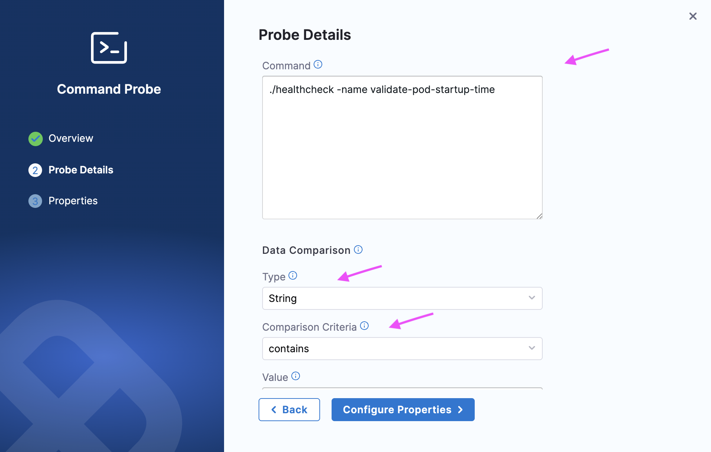
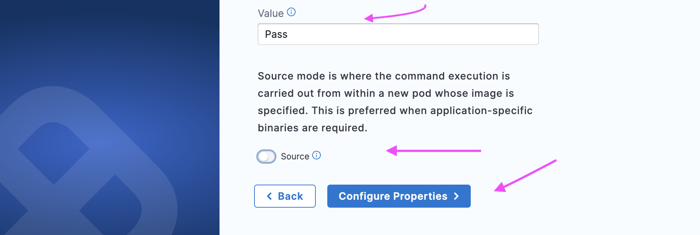
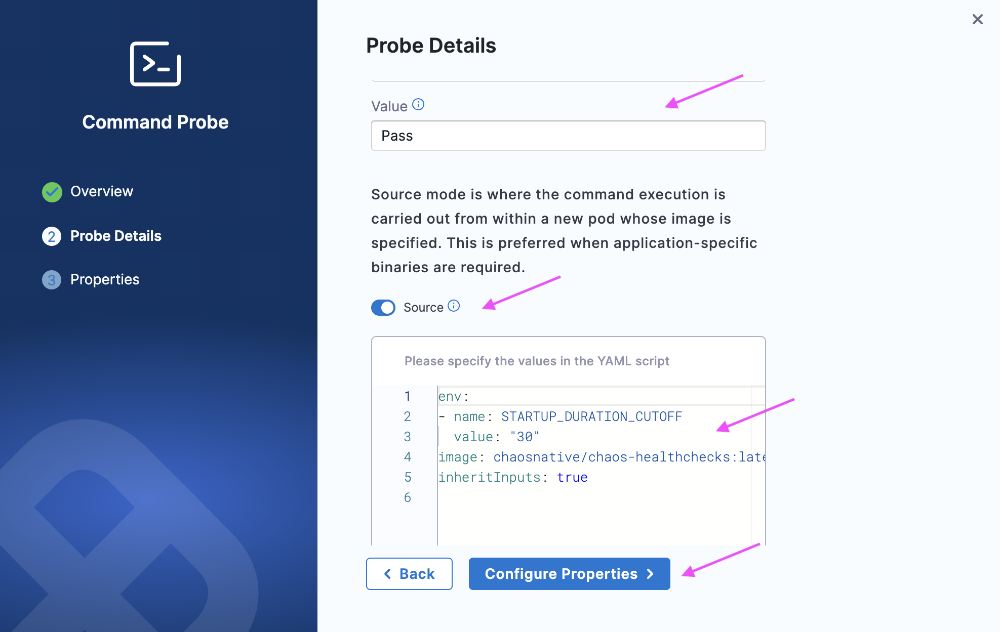

This topic guides you on how to use the **command probe** inline and how to configure source parameter with the command probe. You can follow the same steps for other resilience probes.

## Before you begin, review the following

- [Command Probe](/docs/chaos-engineering/use-harness-ce/probes/command-probe)
- [Create Probe](/docs/chaos-engineering/use-harness-ce/probes/use-probe#create-a-resilience-probe)

In the final step of creating a probe, provide details specific to that resilience probe (such as a command for the command probe, a query to the Prometheus probe, and so on).

### Configure Command Probe

You can configure a probe using the YAML manifest or from the UI. When you use the UI to configure a probe, the probe attributes are minified in the corresponding YAML, and are referred using the **probeID**.

In this example, you will specify details of the command probe from the UI.

1. In the **Probe Details** modal, enter a command in the **Command** field. Enter the **Type**, **Comparison criteria**

    

2. Enter the **Value**. Disable **Source** if command probe is executed directly within the experiment pod and click **Configure Properties**. Go to [source mode configuration](/docs/chaos-engineering/use-harness-ce/probes/command-probe/cmd-probe-usage#configure-command-probe-with-source-parameter) to enable the source parameter and use a custom script along with it.

    

3. Provide other values like **Timeout**, **Interval**, **Attempt**, **Polling Interval**, and **Verbosity**. Click **Setup Probe**.

Go to [sample YAML inline](/docs/chaos-engineering/use-harness-ce/probes/command-probe#inline-mode) to tune a resilience probe from the manifest.

### Configure Command probe with source parameter

The command probe is used in source mode if the command is executed from within a new pod whose image is specified. Use this if you have application-specific binaries.

To configure the command probe by enabling the **Soure** field, follow the steps below. 

1. Enter the **Command** and **Data Comparison** fields such as **Type**, **Comparison criteria**, and **Value**.

    

2. Enable the **Source** mode. Provide the values in the YAML script. Select **Setup probe**.

    

:::tip
Alongside the **source** parameter, you can provide other specifications (for example, `imagePullPolicy`, custom image, environment variables, and so on). You can reference values from the ConfigMap and secret too.
:::

Go to [sample YAML with source parameter](/docs/chaos-engineering/use-harness-ce/probes/command-probe#source-mode) to tune a resilience probe with source field configuration from the manifest.
