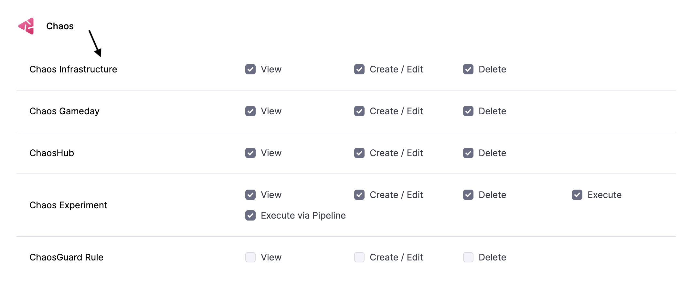

This topic describes the steps you can follow to create and use a resilience probe in your chaos experiment.

Resilience probes (or probes) are pluggable health checkers defined within the chaos engine for any chaos experiment. They are declarative checks that determine the outcome of a fault.

### Permissions required

Resilience probe is created in an infrastructure, hence you need to have access to **create/edit** and **view** the **chaos infrastructure** to use resilience probes. Go to **Project Settings** -> **Access Control** -> **Roles** and create a new role or ask your project admin to create an appropriate role.

To know more, go to [Resilience Probes](/docs/chaos-engineering/concepts/explore-concepts/resilience-probes/).

To get hands-on experience, [create a probe](/docs/chaos-engineering/use-harness-ce/probes/use-probe), [configure command probe](/docs/chaos-engineering/use-harness-ce/probes/cmd-probe-usage), and [use command probe with NewRelic](/docs/chaos-engineering/use-harness-ce/probes/cmd-probe-newrelic).