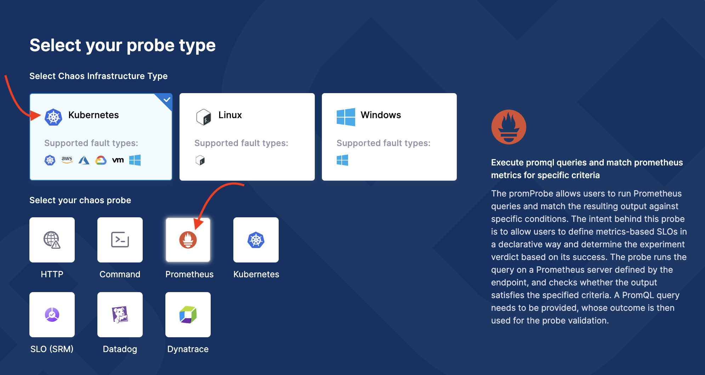
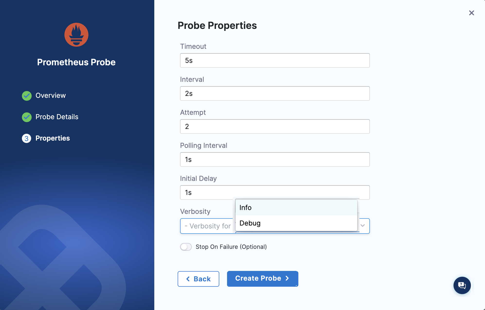

This topic describes the configuration and usage of Prometheus probe.

## Before you begin, review the following:

- [What is a Resilience Probe?](/docs/chaos-engineering/use-harness-ce/probes/#what-is-a-resilience-probe)
- [Prometheus Probe](/docs/chaos-engineering/use-harness-ce/probes/prom-probe/)

### Configuration

1. Go to **Chaos Engineering** module and select **Resilience Probes**. Select **New Probe**.

    

2. Select infrastructure type as **Kubernetes** and chaos probe as **Prometheus**.

    

3. Provide the name, and click **Configure Details**.

    

4. Based on your application's requirements, provide values for the following parameters. 

- **Prometheus Endpoint**: It is the target HTTP/HTTPS endpoint that the probe will send requests to.

    

3. **Authorization** section has the following fields:

    - **Type**: Type of HTTP request to be performed. Supports `GET` and `POST`.
    - **Credentials**: Authentication credentials (username and password) required to access the target URL/endpoint.
    - **Credentials file**: Path of the file that contains authentication credentials to access the HTTP endpoint.

    Go to [Authorization](/docs/chaos-engineering/use-harness-ce/probes/prom-probe/#authentication) for more information.

        **TLS Config** has the following fields:

            - **CA file**: Path of the file to validate the custom certificates for TLS of the target URL.
            - **Cert file**: Client certificate required for mTLS.
            - **Key file**: Client key required for mTLS.
        
    Go to [TLS](/docs/chaos-engineering/use-harness-ce/probes/prom-probe/#tls) for more information.

    

4. Provide the **Prometheus Query** (**Query** or **Query Path** depending on your usage).

    - **Query**: The PromQL query used with the probe to fetch the desired Prometheus metrics.
    - **Query Path**: Path of the PromQL query. Ensure that the strings inside the query are enclosed within backslash ("/").

    Go to [Schema](/docs/chaos-engineering/use-harness-ce/probes/prom-probe/#schema) for more information. 

        

5. Specify the data comparison fields, and click **Configure Properties**.

    The data returned using the PromQL query or **Query Path** is compared to the following fields:

        - **Type**: Type of data compared with result of Prometheus query. Accepts only `float` data type.
        - **Comparison Criteria**: The criteria (`>=`, `<=`, `==`, `<`, `>`, `!=`, and so on) based on which the **value** and the result of Prometheus query are compared.
        - **Value**: The value with which the result of Prometheus query is compared
        
        Go to [Comparator](/docs/chaos-engineering/use-harness-ce/probes/prom-probe/#comparator) for more information.

            

6. Specify general probe properties such as timeout, interval, and so on. Click **Create Probe**.

- **Timeout**: Time limit for the probe to execute the check and return the expected output.
- **Interval**: Duration for which the probe waits between subsequent retries.
- **Attempt**: Number of times a check is executed upon failure in the previous attempts before declaring the probe status as `FAILED`.
- **Polling Interval**: Time interval for which `continuous` and `onchaos` probe should be sleep after each iteration
- **Intitial Delay**: Duration to wait before the probe begins execution.

Go to [Run Properties](/docs/chaos-engineering/use-harness-ce/probes/prom-probe/#run-properties) for more information.

    
