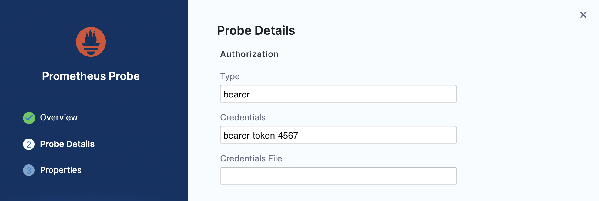

This topic describes the configuration and usage of Prometheus probe.

1. Provide the name, and click **Configure Details**.

    

2. **Prometheus Endpoint** is a mandatory field, when it is not a managed Prometheus. 

    

3. In case of managed Prometheus, populate authorization and TLS config, and skip providing a value for the **Prometheus Endpoint**.

    

4. Provide the **Prometheus Query** type, and query if relevant. Ensure that the strings inside the query are enclosed within backslash ("/").

    

5. Specify the data comparison fields, and click **Configure Properties**.

    

6. Specify probe properties such as timeout, interval, and so on. Click **Create Probe**.

    
