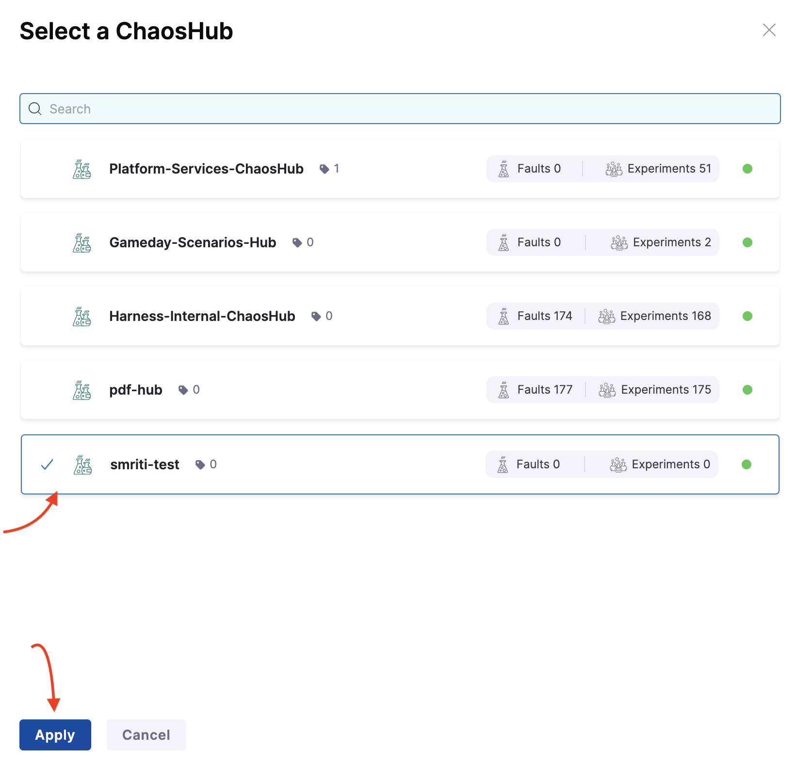
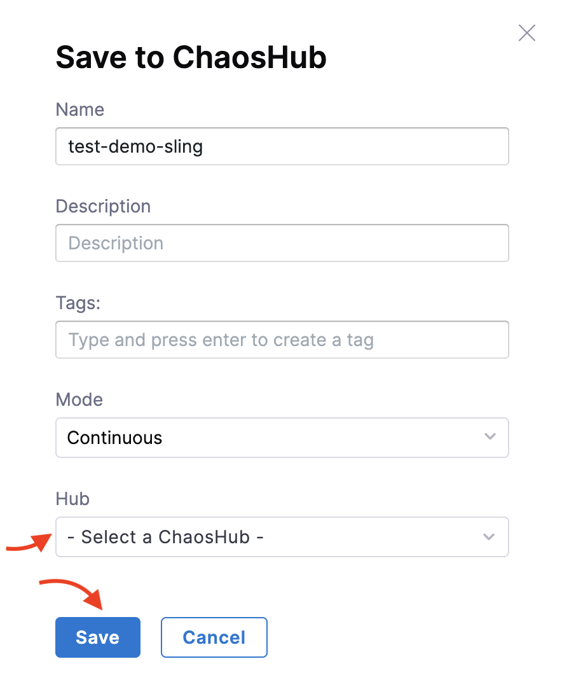

This topic describes the steps you can follow to create and use a resilience probe in your chaos experiment.

## Before you begin, review the following

- Go to [probe overview](/docs/chaos-engineering/concepts/explore-concepts/resilience-probes/) to understand about probes.
- Go to [chaos faults](/docs/chaos-engineering/use-harness-ce/chaos-faults/) to understand where you can use resilience probes.

### Prerequisite
- Permissions to edit a chaos experiment.

:::tip
Currently, resilience probes are behind the feature flag `CHAOS_PROBE_ENABLED`. Contact [Harness support](mailto:support@harness.io) to enable it.
- If you are an existing customer, you will see the old flow of control in resilience probes by default and you have the choice to upgrade to the new flow.
- If you are a new customer, the feature flag is turned on by default and you will see the new flow of control in the resilience probes.
:::

## Create a Resilience Probe

1. Select the **Chaos** module and navigate to **Resilience probes**. Click **New probe**.

    

2. Select the desired infrastructure (Kubernetes or Linux) and the probe type.

    

3. Based on the probe type you choose, the fields will vary. You can find details about every probe in their respective documentation (([Command](/docs/chaos-engineering/concepts/explore-concepts/resilience-probes/cmd-probe), [Datadog](/docs/chaos-engineering/concepts/explore-concepts/resilience-probes/datadog-probe), [Dynatrace](/docs/chaos-engineering/concepts/explore-concepts/resilience-probes/dynatrace-probe), [HTTP](/docs/chaos-engineering/concepts/explore-concepts/resilience-probes/http-probe), [Kubernetes](/docs/chaos-engineering/concepts/explore-concepts/resilience-probes/k8s-probe), [Prometheus](/docs/chaos-engineering/concepts/explore-concepts/resilience-probes/prom-probe), and [SLO](/docs/chaos-engineering/concepts/explore-concepts/resilience-probes/slo-probe))). After you enter the details, click **Configure properties**. Enter further details and click **Configure details**.

    

5. Enter URL, authorization type, and click **Setup Probe**. Click **Confirm** when the screen prompts you to confirm creating the probe with specified details.

    

:::tip
If you are a first-time chaos module user or a Platform user who has not used resilience probes, you can create a resilience probe directly from the Chaos Studio drawer (from within an experiment). For this, you will see an option to add a system probe (which is a health check system probe) as a one-click button. This will not be present if you have configured at least one resilience probe.
:::

## Edit a Resilience Probe

You can edit a resilience probe by navigating to the probe you wish to edit. Click the three vertical dot menu to the extreme right of the probe, and choose **Edit probe**. Modify the properties you wish to, and click **Save**.

  

:::tip
Resilience probe names act as unique identifiers for a probe, which means you can't edit them. If you manually add the name of a probe in the manifest, this same name should be entered in the annotation as ID.
:::

When you want to enter the probe name in the manifest (manually) as a probeRef annotation, follow the below format:

```
probeRef: '[{"probeID":"ID","mode":"SOT"}]'
```
Here, `ID` is the unique ID of your probe.

This step is not required if you use the user interface.

## Use a Resilience Probe

1. Go to the chaos experiment for wish you wish to set up probe/s. Move to **probes** tab and click **+Select or Add new probes**.

    

2. You can choose to [create a new probe](#create-a-resilience-probe) or add a probe that you created earlier.

    

3. Once you select a probe, click **Add to Fault** to associate the resilience probe with a chaos fault.

    

4. Click **Apply changes** or continue to add or create probes based on your requirement.

    

:::tip
- Based on the type of probe you select, enter the values to set up the probe.

	**You can:**
	- Use any number of probes within a chaos experiment.
	- Use the same probes for two faults within the same chaos experiment.
	- Use Kubernetes-based probes for Kubernetes experiments.
	- Use Linux-based probes for Linux experiments.

	**You can't:**
	- Repeat the same probe multiple times in the same fault in the same experiment.
:::

## Add probes to ChaosHub

Adding probes to ChaosHub helps you to templatize the resilience probe. With this, you can import the probes directly from ChaosHub and reference it in a chaos experiment.

1. To add a resilience probe to ChaosHub, go to **Resilience Probes** tab. Go to the resilience probe that you want to add to ChaosHub and click the **:** button. Click **Push to ChaosHub**.

  

2. Choose the ChaosHub to which you want to add the probe, and click **Apply**.

  

3. Click **Save**.

  

## Create probe using YAML

The entire manifest is available as a YAML file, which can be accessed by switching to the YAML view in Chaos Studio. Below is a sample manifest for the pod delete fault.

```yaml
- name: pod-cpu-hog-dqt
      inputs:
        artifacts:
          - name: pod-cpu-hog-dqt
            path: /tmp/chaosengine-pod-cpu-hog-dqt.yaml
            raw:
              data: |
                apiVersion: litmuschaos.io/v1alpha1
                kind: ChaosEngine
                metadata:
                  annotations:
                    probeRef: '[{"mode":"Continuous","probeID":"cart-svc-availability-check"},{"mode":"Edge","probeID":"boutique-website-latency-check"},{"mode":"Edge","probeID":"cart-pods-status-checks"},{"mode":"EOT","probeID":"ping-google"}]'
                  creationTimestamp: null
                  generateName: pod-cpu-hog-dqt
                  labels:
                    context: pod-cpu-hog
                    workflow_name: boutique-cart-cpu-hog
                    workflow_run_id: '{{ workflow.uid }}'
                  namespace: '{{workflow.parameters.adminModeNamespace}}'
                spec:
                  appinfo:
                    appkind: deployment
                    applabel: app=cartservice
                    appns: boutique
                  chaosServiceAccount: litmus-admin
                  components:
                    runner:
                      resources: {}
                  engineState: active
                  experiments:
                  - name: pod-cpu-hog
                    spec:
                      components:
                        env:
                        - name: TOTAL_CHAOS_DURATION
                          value: "61"
                        - name: CPU_CORES
                          value: "2"
                        - name: PODS_AFFECTED_PERC
                          value: "100"
                        - name: CONTAINER_RUNTIME
                          value: containerd
                        - name: SOCKET_PATH
                          value: /run/containerd/containerd.sock
                        resources: {}
                        securityContext:
                          containerSecurityContext: {}
                          podSecurityContext: {}
                        statusCheckTimeouts: {}
                      rank: 0
                  jobCleanUpPolicy: retain
                status:
                  engineStatus: ""
                  experiments: null
```
