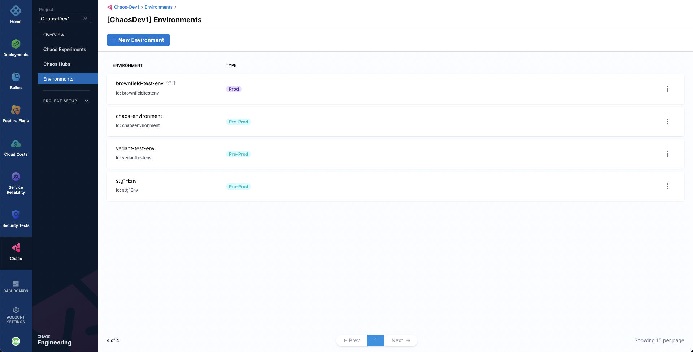
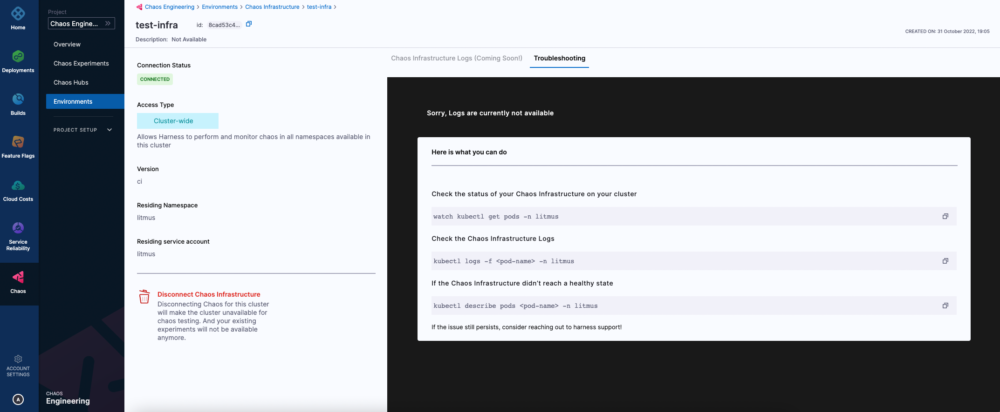

Chaos infrastructure is a service that runs in your target environment and aids Harness Chaos Engineering (HCE) in accessing and injecting chaos at cloud-native scale. There are different types of chaos infrastructure based on the target environments, such as Kubernetes, Linux VMs, etc. These chaos infrastructures can be installed as a Kubernetes service, as a Linux daemon, and so on, based on their type.

:::note
Currently, only Kubernetes chaos infrastructure is available. Other chaos infrastructures will be available soon!
:::

All the chaos infrastructure services adhere to the principle of least privilege, where the services execute with the minimum number of required permissions.

Let us jump into the steps involved in connecting chaos infrastructures. 

## Create an environment
- To add a chaos infrastructure to your target environment, create a new environment where you want the chaos infrastructure to exist. 
- Navigate to the **Environments** page, which lists all the environments added as part of your project. 
- Choose **New Environment**.

- In the **Create a new environment** screen, specify a name for the environment. 
- You can optionally add a description and a tag. Select an **environment type**, that is, **Production** or **Non-Production**. Click **Create**. 

This creates a new environment.

## Add a chaos infrastructure
- To add a chaos infrastructure to your environment, select **New Chaos Infrastructure**.

:::tip
You can either setup a chaos infrastructure on existing infrastructures that uses a Harness cluster connector, that is, Harness Kubernetes connector or install the chaos infrastructure as a new infrastructure.
:::

- To use an existing Harness Kubernetes connector to install your chaos infrastructure, select **On Existing Infrastructures** on the screen. You can use any connector under the **Project**, **Organization**, and **Account** scope.

:::info
1. A Harness Kubernetes connector with cluster-wide read/write access can be used to setup chaos infrastructure in cluster scope and namespace scope.
2. A Harness Kubernetes connector with cluster-wide read access **can't** be used to setup a chaos infrastructure.
3. A Harness Kubernetes connector with specific namespace access can be used to setup a chaos infrastructure in that specific Kubernetes namespace scope only.
:::

- To install the chaos infrastructure on a new infrastructure, select **On New Infrastructures**. Select **Continue**. Provide a name for the infrastructure. Optionally, you can also provide a description and tags. Select **Next**. 
- Under the installation mode, choose either **Cluster Wide** or **Namespace Mode** for installing the chaos infrastructure. 
- By default the installation will take place in the `hce` namespace and uses `hce` service account, which can be configured under the K8s Cluster Details. 
- Optionally, you can also specify node selectors and Kubernetes tolerations for chaos infrastructure deployment.

:::note
- There can only be one cluster-wide chaos infrastructure per cluster.
- There may be multiple namespace-scoped chaos infrastructures per cluster.
:::

- Click **Next**. In the final step, if you are deploying to an existing infrastructure with Harness Kubernetes Delegate, Harness installs the chaos infrastructure on your behalf. 
- If you are setting up the chaos infrastructure on a new infrastructure, you will need to execute the given commands and/or download and apply the installation manifest (YAML file).

Select **Done**.

## Validate chaos infrastructure installation
- After applying the manifest, Harness will take some time to setup all the chaos infrastructure resources. Once everything is set up, the chaos infrastructure's connection state reflects `CONNECTED`.

That's it! Now you are all set to inject chaos into your infrastructure.
