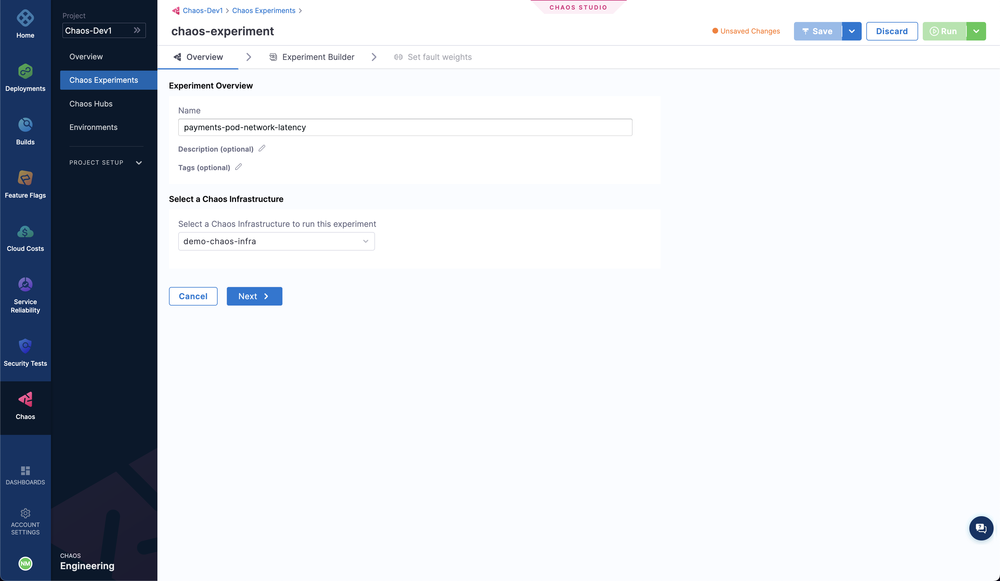
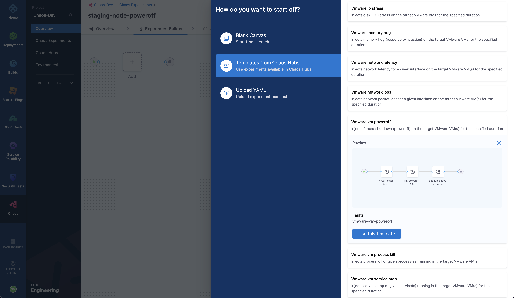

Harness Chaos Engineering provides you the flexibility of creating elaborate chaos experiments that can create complex, real-life failure scenarios for your applications to be validated against. At the same time, the chaos experiments are declarative and can be constructed simply using the Chaos Studio UI with no programmatic intervention.

A chaos experiment is constituted out of chaos faults that are arranged in some specific order to create a failure scenario. The chaos faults can target various aspects of an application, including the constituent microservices and underlying infrastructure, and can be tuned to impart the desired chaos behavior.

## 1. Add Overview

To construct a chaos experiment, select the **Chaos Experiments** sidebar option under the **Chaos** tab, and select **New Experiment**. This will take you to the Chaos Studio. 

The very first step is to add the experiment overview, including experiment name and optionally any description or tags. Then, select a **Chaos Infrastructure** to specify the infrastructure where the target resources lie. If you haven't added a chaos infrastructure yet, check out this doc. Then, click **Next**.

## 2. Construct the Experiment

Under the Experiment Builder tab, first we need to specify the source of the experiment. Here we have the option for:
1. Creating an experiment from scratch (Blank Canvas)
2. Using pre-curated experiment templates available in Chaos Hub (Templates from Chaos Hubs)
3. Using a downloaded experiment manifest file (Upload YAML)

### Blank Canvas
When starting from scratch, you can add individual faults from the available Chaos Hubs and tune them. This allows you to have access to not only the Enterprise Chaos Hub experiments provided by Harness but also any private Chaos Hub faults which you have access to. 

Tuning a fault involves up to three steps:

1. **Specifying target application (Only for Pod-Level Kubernetes faults):** The target application resource needs to be specified in this step so that the corresponding pods can be targeted. This includes specifying the resource namespace, type, and a label to uniquely identify the resource.

2. **Customizing fault parameters:**  Every fault has a set of common parameters such as the chaos duration, ramp time, etc. and a set of unique parameters which may be customized as per the need. It should be noted that default parameters are present wherever applicable, however, the mandatory parameters are strictly required to be input for experiment execution.

3. **Defining chaos probes:** Optionally, you can add chaos probes to automate the chaos hypothesis checking for a fault during the experiment execution. Probes are nothing but declarative checks that aid in the validation of a certain criteria which is deemed necessary to declare an experiment as passed. There are various kinds of probes such as HTTP, Command, Kubernetes and Prometheus (with more of them coming in future) which allow us to define the source of information to be checked. There are various parameters that can be configured as part of these probes to define the exact condition you need to validate.

You can configure the sequence in which each of the faults execute. Also, complemented by the varied faults provided by default in the Enterprise Chaos Hub, you can create entire experiments that validate the resiliency of every aspect of your application.

### Templates from Chaos Hubs
You can use the pre-curated experiment templates provided in the Enterprise Chaos Hub as well while trying to create a new chaos experiments. While these templates may be used as it is for the experiment execution, you can very well edit them to add more faults or update the existing faults.

### Upload YAML
You can also upload an experiment manifest file to create the experiment. In this case as well, you can edit the experiment to update the existing faults or add more of them.

## 3. Set Fault Weights

As a final step before running the experiment, switch to the tab **Set fault weights** to set the weight for each fault in the experiment, which will be used for the calculation of the resiliency score and the outcome of the experiment result.

Now, we can choose to either run the experiment right away by selecting the **Run** button on the top, or we can create a recurring schedule for the experiment execution by selecting the arrow to the right of the Run button and selecting **Create recurring schedule** and then specifying the execution schedule. You can also save the experiment to simply save it but not run it just yet, as well as save the experiment as a template using the **Save** button.