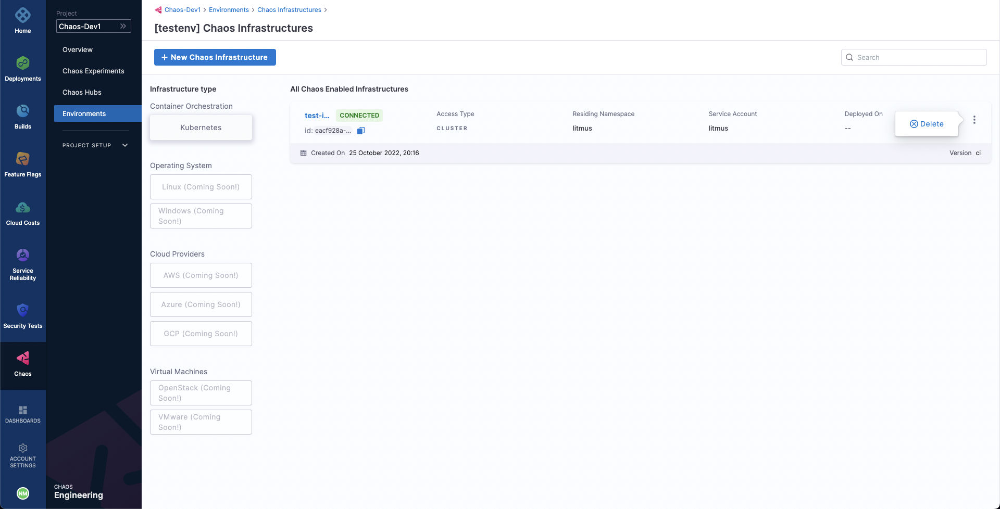

Disconnecting and deleting a chaos infrastructure removes it from the environment in which it resides. It also removes the infrastructure services from the Kubernetes cluster.

To remove the chaos infrastructure, first go to the **Environments** sidebar option under the **Chaos** tab, where all the environments created under the current project are listed. Select the environment in which the chaos infrastructure to be deleted resides.

To delete it, simply select the `⋮` icon against the chaos infrastructure name and select **Delete**. Then select **Confirm** on the popup modal. This will remove the chaos infrastructure.

Please note that you can also do the same operation by selecting the chaos infrastructure and selecting the **Disconnect Chaos Infrastructure** icon.
