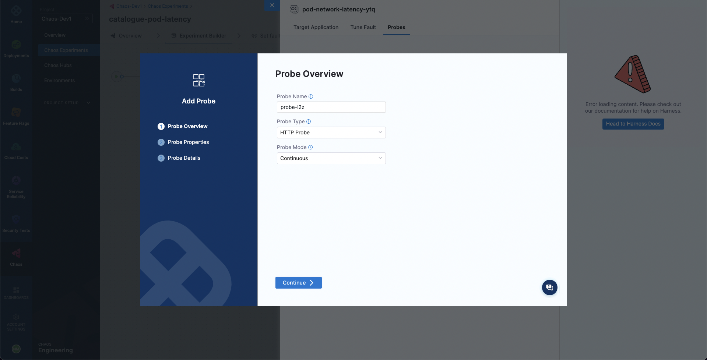

To add a probe for a fault while constructing an experiment, once you add a fault to the experiment you'll be prompted to configure it. You can simply switch to the **Probes** tab to access the list of probes for the fault. By default, most of the experiments will have a default target application health check.

Select **Deploy new Probe** to add a new probe. Next, you will need to specify the name, type, and mode of the probe.Select **Continue**. Then specify the probe properties. Select **Continue**. Finally, specify the probe specific details and select **Setup the Probe** to add the probe. 

