Harness Cloud Cost Management (CCM) monitors and provides visibility into the cloud costs of your Amazon Web Services (AWS) across your cloud infrastructure and AWS services, such as EC2, S3, RDS, Lambda, and so on. CCM also allows you to optimize your instances, auto-scaling groups (ASGs), and EKS clusters using intelligent cloud AutoStopping rules.

You can set up CCM for your AWS resources in a simple two-step process:

1. Create a Cost and Usage Report (CUR) — Harness CCM uses a secure, cross-account role with a restricted policy to access the cost and usage reports and resources for cost analysis.
2. Create a Cloudformation stack to provision IAM Roles and corresponding policies to grant access for the required features.

> **☆ NOTE —** After enabling CCM, it takes about 24 hours for the data to be available for viewing and analysis.### AWS Connector requirements

* The same connector cannot be used in NextGen and FirstGen. 
* For CCM, AWS connectors are available only at the Account level in Harness.
* You can create multiple connectors per AWS account. 
* Review the AWS connector requirements for different CCM features:
	+ **Cost Visibility**: You can create an AWS connector for the master or linked account. CCM requires one connector per AWS account (master or linked) for cost visibility.
	+ **AWS ECS and Resource Inventory Management**: You need to create an AWS connector for each linked account. For inventory management, CCM requires a connector for all the linked accounts.
	+ **AWS Resource Optimization Using AutoStopping Rules**: You need to create an AWS connector for each linked account. For resource optimization using AutoStopping Rules, CCM requires a connector for all the linked accounts.

## Cost and Usage Reports (CUR) and CCM requirements

* If you have a [consolidated billing process](https://docs.aws.amazon.com/awsaccountbilling/latest/aboutv2/useconsolidatedbilling-procedure.html) enabled, then CCM needs read-only access to the cost and usage reports (CUR) stored in the S3 bucket in the master or payer account. This gives access to the cost data for all the accounts (linked/member) in the organization.
* If you don't have consolidated billing enabled at the organization level then you can create the CUR at a linked account level.
* If you have provided CUR access to the master account then you do not need to provide billing details for each linked account. CCM requires one connector per AWS account (master or linked).  
  It is recommended to create a CUR at the master account to avoid the CUR creation step for each linked account.
* If you do not have access to the master account, you can create an AWS connector in the linked account for which you have the required access.
* If you have created a billing report for your [AWS account ID](https://docs.aws.amazon.com/IAM/latest/UserGuide/console_account-alias.html#FindingYourAWSId) once, then you can use the same CUR again for the AWS connector. You do not need to create CUR again for the same account.
  
  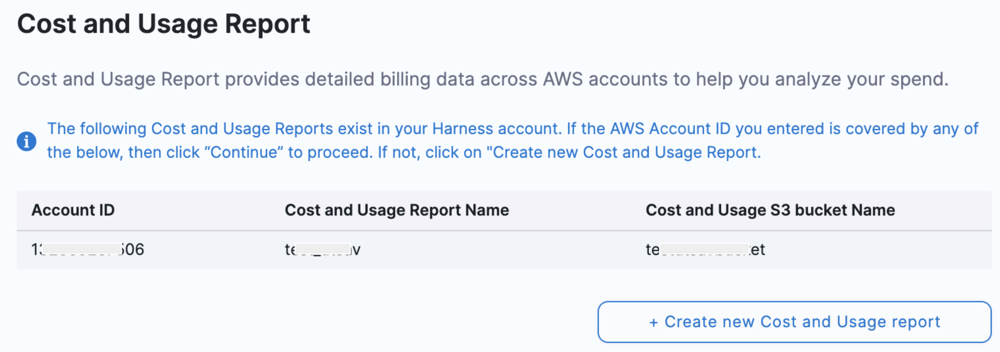

## AWS access permissions

CCM requires the following permissions:

> **☆ NOTE —** If you don't have access to create a cost and usage report or run a CloudFormation template, contact your IT or security teams to provide the required permissions.

### Cost Visibility

The cost visibility policy performs the following actions:

* List CUR reports and visibility into the organization's Structure
* Get objects from the S3 bucket configured in the CUR
* Put objects into the Harness S3 bucket
```
  HarnessBillingMonitoringPolicy:  
    Type: 'AWS::IAM::ManagedPolicy'  
    Condition: CreatingHarnessBillingMonitoringPolicy  
    Properties:  
      Description: Policy granting Harness Access to Collect Billing Data    
      PolicyDocument:  
        Version: 2012-10-17  
        Statement:  
          - Effect: Allow  
            Action:  
              - 's3:GetBucketLocation'  
              - 's3:ListBucket'  
              - 's3:GetObject'  
            Resource:  
              - !Join  
                - ''  
                - - 'arn:aws:s3:::'  
                  - !Ref BucketName  
              - !Join   
                - /  
                - - !Join  
                    - ''  
                    - - 'arn:aws:s3:::'  
                      - !Ref BucketName  
                  - '*'  
          - Effect: Allow  
            Action:  
              - 's3:ListBucket'  
              - 's3:PutObject'  
              - 's3:PutObjectAcl'  
            Resource:  
              - 'arn:aws:s3:::ce-customer-billing-data-prod*'  
              - 'arn:aws:s3:::ce-customer-billing-data-prod*/*'  
          - Effect: Allow  
            Action:   
              - 'cur:DescribeReportDefinitions'  
              - 'organizations:Describe*'  
              - 'organizations:List*'  
            Resource: "*"  
      Roles:  
        - !Ref HarnessCloudFormationRole
```

If the `cur:DescribeReportDefinitions`, `organizations:Describe`, and `organizations:List*` permissions are too wide, you can modify these to the following:


```
{  
    "Version": "2012-10-17",  
    "Statement": [  
        {  
            "Sid": "VisualEditor0",  
            "Effect": "Allow",  
            "Action": [  
                "organizations:ListAccounts",  
                "organizations:ListTagsForResource"  
            ],  
            "Resource": "*"  
        }  
    ]  
}
```
* `organizations:ListAccounts`: fetches a list of all the accounts present in the organization, and also fetches the accountID to Account Name mapping.
* `organizations:ListTagsForResource`: fetches the AWS Account level tags. Harness supports account tags within CCM that can be used for reporting and analysis.

### AWS ECS and Resource Inventory Management

The inventory management policy performs the following actions:

* ECS Visibility - For Granular Cluster Cost Breakdown
* EC2, EBS, RDS Visibility - Inventory Management  

```
HarnessEventsMonitoringPolicy:  
  Type: 'AWS::IAM::ManagedPolicy'  
  Condition: CreateHarnessEventsMonitoringPolicy  
  Properties:  
    Description: Policy granting Harness Access to Enable Event Collection  
    PolicyDocument:  
      Version: 2012-10-17  
      Statement:  
        - Effect: Allow  
          Action:  
              - 'ecs:ListClusters*'  
              - 'ecs:DescribeClusters'  
              - 'ecs:ListServices'  
              - 'ecs:DescribeServices'  
              - 'ecs:DescribeContainerInstances'  
              - 'ecs:ListTasks'  
              - 'ecs:ListContainerInstances'  
              - 'ecs:DescribeTasks'  
              - 'ec2:DescribeInstances*'  
              - 'ec2:DescribeRegions'  
              - 'cloudwatch:GetMetricData'  
              - 'ec2:DescribeVolumes'  
              - 'ec2:DescribeSnapshots'  
              - 'rds:DescribeDBSnapshots'  
              - 'rds:DescribeDBInstances'  
              - 'rds:DescribeDBClusters'  
              - 'rds:DescribeDBSnapshotAttributes'  
          Resource: '*'  
    Roles:  
      - !Ref HarnessCloudFormationRole
```

### Insight into RDS instances

This feature provides visibility into your EC2, EBS volumes, and ECS costs. The insights provided by inventory management can be consumed by finance teams to understand resource utilization across the board.

* Breakdown by ECS cluster cost, Service, Task, and Launch Type (EC2, Fargate).
* Insight into EC2 instances and their utilization.
* Access to AWS EC2 Inventory Cost and EBS Volumes and Snapshots inventory dashboards. For more information, see [View AWS EC2 Inventory Cost Dashboard](https://developer.harness.io/docs/cloud-cost-management/use-cloud-cost-management/8-ccm-dashboards-and-access-control/ccm-dashboards-by-harness/view-aws-ec-2-inventory-cost-dashboard), [Orphaned EBS Volumes and Snapshots Dashboard](https://developer.harness.io/docs/cloud-cost-management/use-cloud-cost-management/8-ccm-dashboards-and-access-control/ccm-dashboards-by-harness/orphaned-ebs-volumes-and-snapshots-dashboard), and [View AWS EC2 Instance Metrics Dashboard](https://developer.harness.io/docs/cloud-cost-management/use-cloud-cost-management/8-ccm-dashboards-and-access-control/ccm-dashboards-by-harness/view-aws-ec-2-instance-metrics).

### AWS Resource optimization using AutoStopping rules

The AutoStopping policy performs the following actions:

* Create an IAM role for optimization
* Permissions for creating AutoStopping Rules
```
 HarnessOptimizationLambdaExecutionRole:  
    Type: 'AWS::IAM::Role'  
    Condition: CreateHarnessOptimisationPolicy  
    Properties:  
      RoleName: !Ref LambdaExecutionRoleName  
      AssumeRolePolicyDocument:  
        Version: 2012-10-17  
        Statement:  
          - Effect: Allow  
            Principal:  
              Service: "lambda.amazonaws.com"  
            Action: 'sts:AssumeRole'  
      Path: /ce-optimization-service-role/
```

```
HarnessOptimsationLambdaPolicy:  
    Type: 'AWS::IAM::ManagedPolicy'  
    Condition: CreateHarnessOptimisationPolicy  
    Properties:  
      Description: Policy granting Harness Access to Enable Cost Optimisation  
      PolicyDocument:  
        Version: 2012-10-17  
        Statement:  
          - Effect: Allow  
            Action:  
              - 'ec2:CreateNetworkInterface'  
              - 'ec2:CreateNetworkInsightsPath'  
              - 'ec2:CreateNetworkInterfacePermission'  
              - 'ec2:CreateNetworkAcl'  
              - 'ec2:*'  
              - 'ec2:CreateNetworkAclEntry'  
              - 'logs:CreateLogGroup'  
              - 'logs:CreateLogStream'  
              - 'logs:PutLogEvents'  
            Resource: "*"  
      Roles:  
        - !Ref HarnessOptimizationLambdaExecutionRole
```

```
HarnessOptimisationPolicy:  
    Type: 'AWS::IAM::ManagedPolicy'  
    Condition: CreateHarnessOptimisationPolicy  
    Properties:  
      Description: Policy granting Harness Access to Enable Cost Optimisation  
      PolicyDocument:  
        Version: 2012-10-17  
        Statement:  
              - Effect: Allow  
                Action:  
                  - elasticloadbalancing:*  
                  - ec2:StopInstances  
                  - autoscaling:*  
                  - ec2:Describe*  
                  - iam:CreateServiceLinkedRole  
                  - iam:ListInstanceProfiles  
                  - iam:ListInstanceProfilesForRole  
                  - iam:AddRoleToInstanceProfile  
                  - iam:PassRole  
                  - ec2:StartInstances  
                  - ec2:*  
                  - iam:GetUser  
                  - ec2:ModifyInstanceAttribute  
                  - iam:ListRoles  
                  - acm:ListCertificates  
                  - lambda:*  
                  - cloudwatch:ListMetrics  
                  - cloudwatch:GetMetricData  
                  - route53:GetHostedZone  
                  - route53:ListHostedZones  
                  - route53:ListHostedZonesByName  
                  - route53:ChangeResourceRecordSets  
                  - route53:ListResourceRecordSets  
                  - route53:GetHealthCheck  
                  - route53:GetHealthCheckStatus  
                  - cloudwatch:GetMetricStatistics  
                Resource: "*"  
      Roles:  
        - !Ref HarnessCloudFormationRole 
```

## Connect CCM to your AWS account

To enable CCM for your AWS services (such as EC2, S3, RDS, Lambda, and so on), you simply need to connect Harness to your AWS accounts.

Perform the following steps to connect CCM to the AWS cloud provider.

### Overview

1. In **Account Setup**, in **Account Resources**, click **Connectors**.
   
     
2. In **Connectors**, click **+ Connector**.
3. In **Cloud Costs**, click **AWS**.
   
     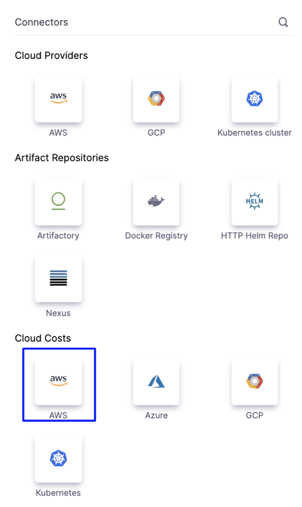
4. In **AWS Connector**, in **Overview**, enter the **Connector** **Name**. The name will appear in CCM Perspectives to identify this cloud provider.
5. In **Specify the AWS account ID**, enter your AWS account ID and click **Continue**. To find your AWS account ID, see [Finding your AWS account ID](https://docs.aws.amazon.com/IAM/latest/UserGuide/console_account-alias.html#FindingYourAWSId).
   
     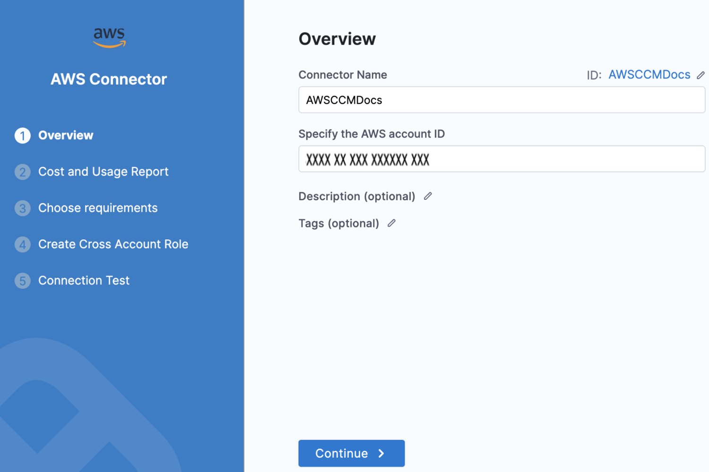

### Cost and Usage Report

Cost and Usage Report (CUR) provides detailed billing data across AWS accounts to help you analyze your spending. You need to enter the **cost and usage report name** and **cost and usage S3 bucket name** in Harness. To get these details, do the following:

1. In **Cost and Usage Report**, click **Launch AWS console** to log into your AWS account.
2. In **AWS Cost and Usage Reports**, click **Create Report**.
   
     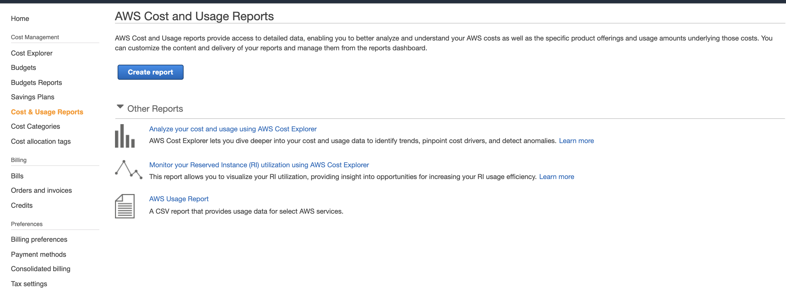
3. Enter the **Report Name**. This is the CUR name that you need to enter in Harness.
4. In **Additional report details**, select the checkbox **Include resource IDs** to include the IDs of each individual resource in the report.
5. In **Data refresh settings**, select the checkbox **Automatically refresh your Cost & Usage Report when charges are detected for previous months with closed bills**.
6. Click **Next**.  
When you are done with the **Report content** step, it will look something like this:

  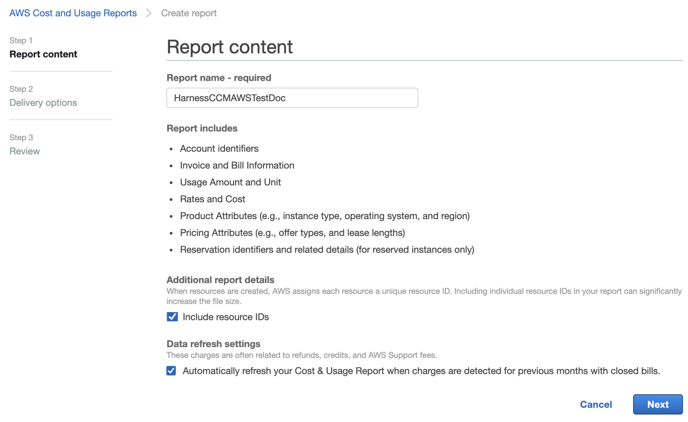
7. In the **S3 bucket**, click **Configure**.
8. In **Configure S3 Bucket**, in **Create a bucket**, enter the **S3 bucket name**. This is the cost and usage S3 bucket name that you need to enter in Harness. For more information on S3 bucket naming requirements, see [Amazon S3 Bucket Naming Requirements](https://docs.aws.amazon.com/awscloudtrail/latest/userguide/cloudtrail-s3-bucket-naming-requirements.html).
9. Select **Region** from the drop-down list and click **Next**. It is recommended to select **US East** (**N. Virginia**).
    
      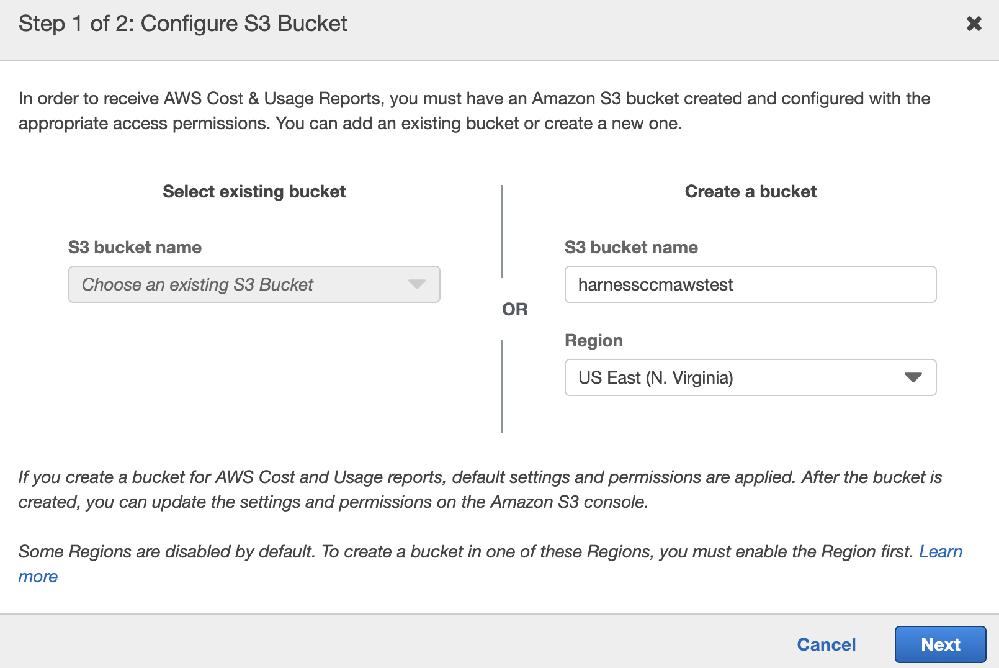
10. In **Verify policy**, select the checkbox **I have confirmed that this policy is correct** and click **Save**.
    
      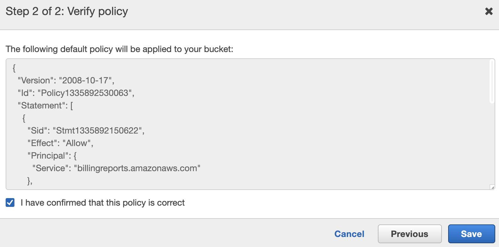
11. Enter the report path prefix that you want to be prepended to the name of your report.
12. Select **Hourly** in **Time granularity**.
13. Select **Overwrite Existing Report** in **Report versioning**.
14. Do not select any value in **Enable report data integration for**.
15. Select **GZIP** in the **Compression type**.
16. Click **Next**.  
When you are done with the **Delivery options** step, it will look something like this:

  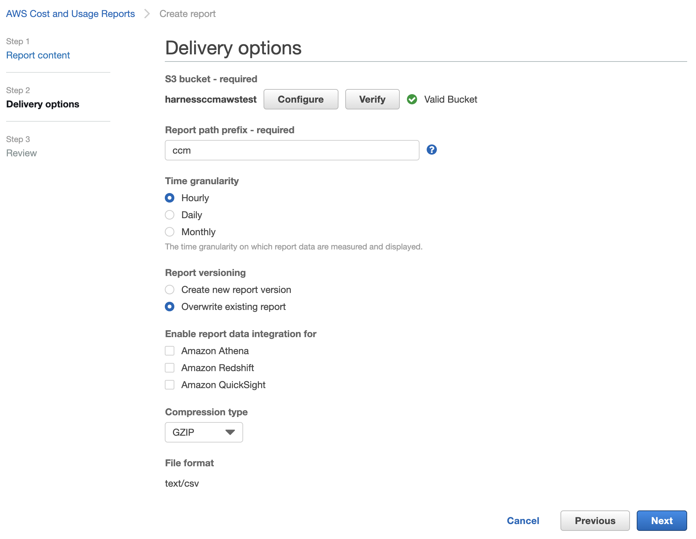
17. Review your report details and click **Review and Complete**.
  
    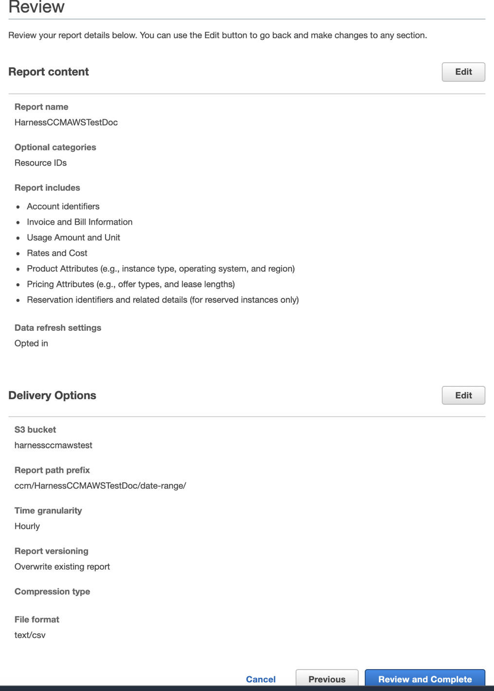
    
    Your report is listed in AWS Cost and Usage Reports.
    
      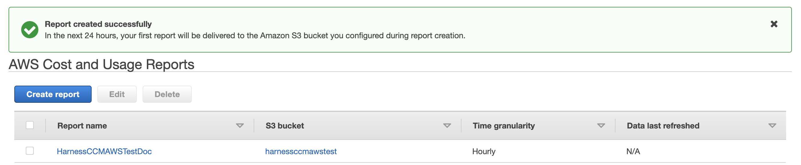
18. Enter the **Cost and Usage Report Name** (as entered in step 3) and **Cost and Usage S3 Bucket Name** (as entered in step 8) in Harness.
  
    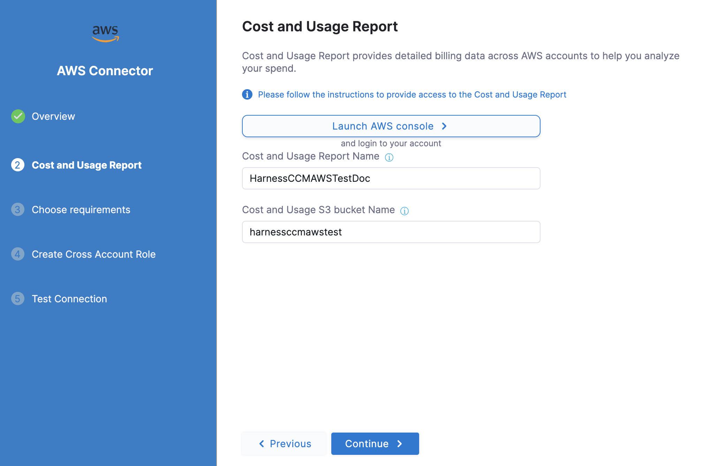

### Choose Requirements

Select the Cloud Cost Management features that you would like to use on your AWS account. Based on your selection Harness requires specific permissions for the cross-account role. 

  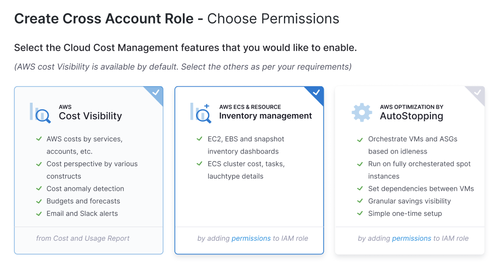
  
  CCM offers the following features:


| **Features**  | **Capabilities** | 
| --- | --- | 
| **Cost Visibility** (Required)| This feature is available by default and requires access to the CUR report. Provides the following capabilities:<ul><li>Insights into AWS costs by services, accounts, etc. </li><li>Root cost analysis using cost perspectives</li><li>Cost anomaly detection</li><li>Governance using budgets and forecasts</li><li>Alert users using Email and Slack notification</li></ul> This feature will give you cost insights that are derived from the CUR. For deep Kubernetes visibility and rightsizing recommendations based on the historical utilization and usage metrics, set up Kubernetes connectors. See [Set Up Cloud Cost Management for Kubernetes](set-up-cost-visibility-for-kubernetes.md). |
| **AWS ECS and Resource Inventory Management** (Optional)| This feature provides visibility into your EC2, EBS volumes, and ECS costs. The insights provided by inventory management can be consumed by Finance teams to understand resource utilization across the board. <ul><li>Breakdown by ECS cluster cost, Service, Task, and Launch Type (EC2, Fargate) </li><li>Insight into EC2 instances and their utilization</li><li>Access to AWS EC2 Inventory Cost and EBS Volumes and Snapshots inventory dashboards. For more information, see View AWS EC2 Inventory Cost Dashboard, Orphaned EBS Volumes and Snapshots Dashboard, and View AWS EC2 Instance Metrics Dashboard.</li></ul> |
| **AWS resource optimization using AutoStopping rules** (Optional)| This feature allows you to enable Intelligent Cloud AutoStopping for your AWS instances and auto-scaling groups. For more information, see Create AutoStopping Rules for AWS. <ul><li>Orchestrate VMs and ASGs based on idleness</li><li>Run your workloads on fully orchestrated spot instances</li><li>Granular savings visibility</li></ul> |


Make your selection and click **Continue**.

> **☆ NOTE —** The Cloudformation template has policies corresponding to all the permissions (Visibility, Inventory, and Optimization). However, it is important to note that only the permissions (policies) of the selected features are applied.

### Create Cross-Account Role

Harness uses the secure cross-account role to access your AWS account. The role includes a restricted policy to access the cost and usage reports and resources for the sole purpose of cost analysis and cost optimization.

1. In **Create Cross Account Role**, click **Launch Template in AWS console**.
2. In **Quick create stack**, in **Capabilities**, select the acknowledgment, and click **Create stack**.
  > **☆ NOTE —**It is recommended that you do not modify any value in the **Quick create stack** page.  
  The value for `BillingEnabled`, `EventsEnabled`, and `OptimizationEnabled` varies depending on the features that you have selected in the **Choose Requirements** step.
  
  
  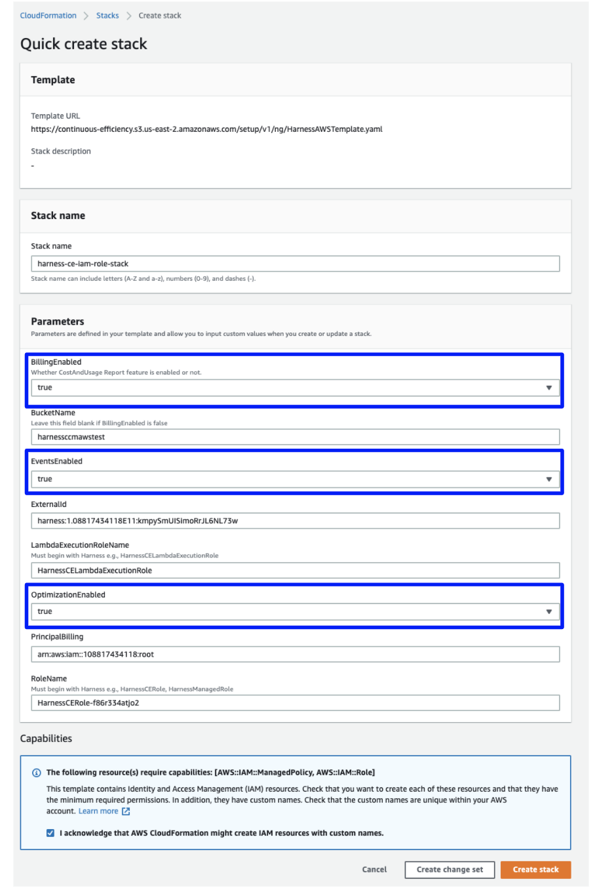
3. In the **Stacks** page, from the **Outputs** tab copy the **Value** of **CrossAccountRoleArn Key**.
   
     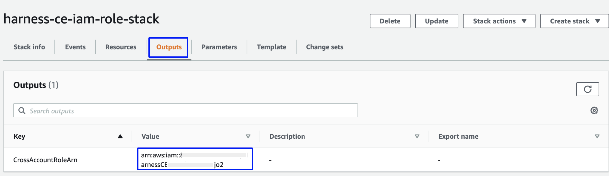
4. In **Role ARN**, enter the **Cross-Account Role ARN** that you copied from the **Output**s tab (previous step) in Harness.
5. The **External ID** is generated dynamically for your account. For example, `harness:111111111111:lnFZRF6jQO6tQnB9xxXXXx` . 
> **☆ NOTE —** Do not modify the value of **External ID**.

  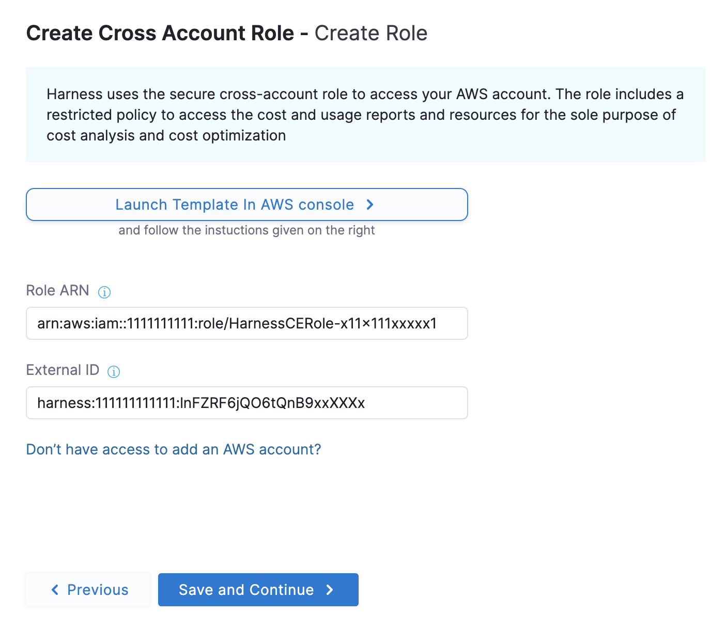
6. Click **Save and Continue**.

### Test Connection

The connection is validated, and verified in this step. After successful validation, click **Finish**.

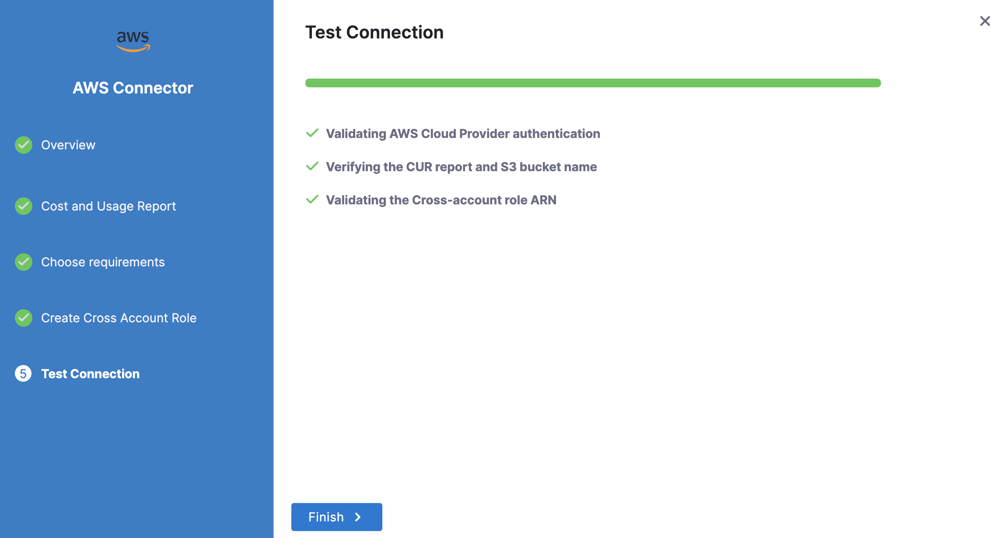Your connector is now listed in the **Connectors**.

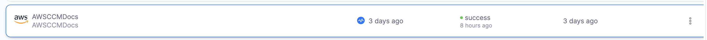

## Create Multiple Connectors in an AWS Account

Harness CCM also provides the flexibility to create multiple Connectors using a stack set configured at the master account level. It involves the following steps:

* Create a stack set
* Create an API Key in Harness
* Add an Admin Role
* Run the cURL Command to create connectors using the Roles created in the AWS accounts via API

### Create a Stack Set in AWS

Perform the following steps to create a stack set in AWS:

1. Launch create stack set template using the following link:  
<https://console.aws.amazon.com/cloudformation/home?region=us-east-1#/stacksets/create>
2. In **Choose a template**, in **Permissions**, select **Service-managed permissions**.
3. In **Prerequisite - Prepare template**, select **Template is ready**.
4. In the **Specify template**, in the **Template source**, select **Amazon S3 URL**.
5. In the **Amazon S3 URL** enter the following URL and click **Next**.  
`https://continuous-efficiency-prod.s3.us-east-2.amazonaws.com/setup/ngv1/HarnessAWSTemplate.yaml`

  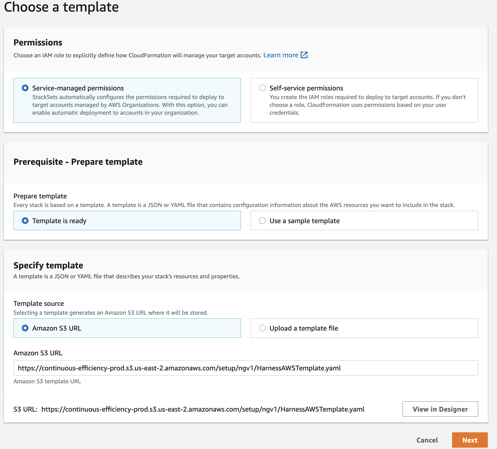
6. In **Specify StackSet details**, in **StackSet** **name**, enter a stack set name. For example, `harness-ce-iam-stackset`.
7. In **Parameters**, specify the following details:
	1. Set **BillingEnabled** to false.
	2. Leave the **BucketName** empty.
	3. Set **EventsEnabled** to true.
	4. In **ExternalID** enter your <*Harness Account ID>*, for example, `harness:111122225555` .
	5. In **LambdaExecutionRoleName**, enter Lambda execution role name, for example, `HarnessCELambdaExecutionRole`. The Lambda execution role name must begin with `Harness`.
	6. Set **OptimizationEnabled** to true.
	7. **PrincipalBilling** is auto-generated for your AWS account. Do not edit the Principal Billing details. For example, `arn:aws:iam::123451231355:root`.
	8. In **RoleName**, enter the role name, for example, `HarnessCERole`. The role name must begin with Harness e.g., HarnessCERole, HarnessManagedRole.
   
     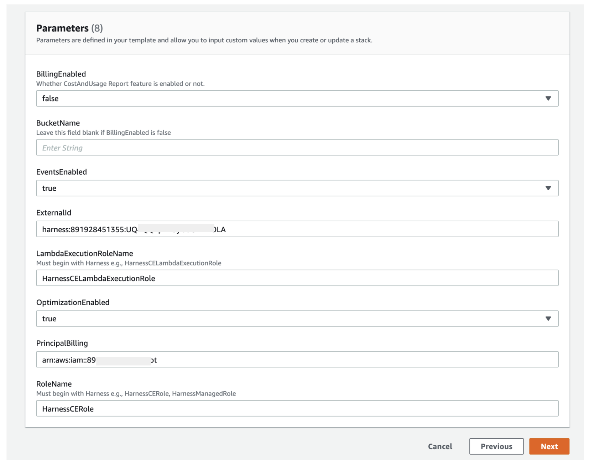
8. After entering all the details, click **Next**.
9. In **Configure StackSet options**, in **Managed execution**, select **Active** and click **Next**.
    
      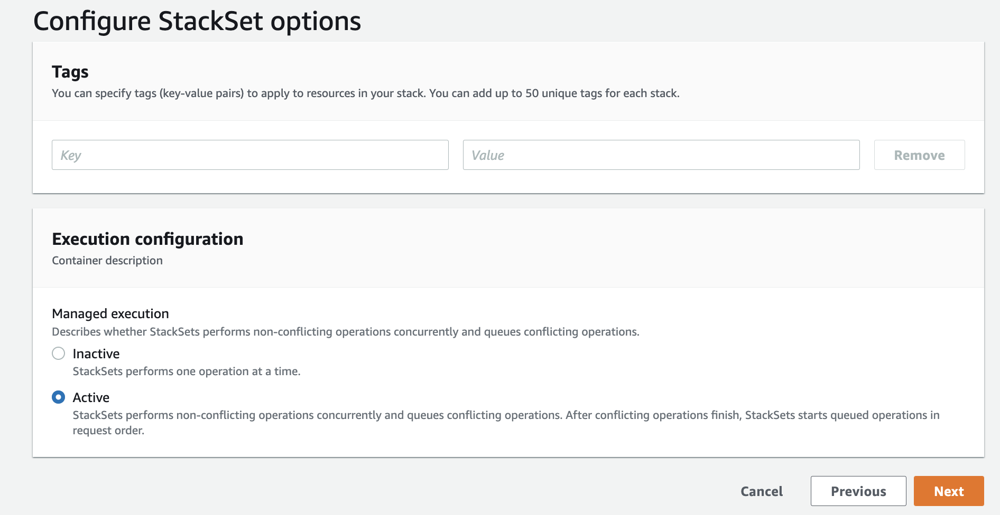
10. In **Set deployment options**, in **Add stacks to stack set**, select **Deploy new stacks**.
11. In **Deployment targets**, select **Deploy to organization** (recommended). You can select **Deploy to Organizational Units (OUs)** to limit the monitoring clusters to a particular OU or a subset of linked accounts.
12. In **Automatic deployment**, select **Enabled**.
13. In **Account removal behavior**, select **Delete Stacks**.
14. Select a **region** from the drop-down list and click **Next**.
15. In **Deployment Options**, in **Region Concurrency**, select **Sequential**.
    
      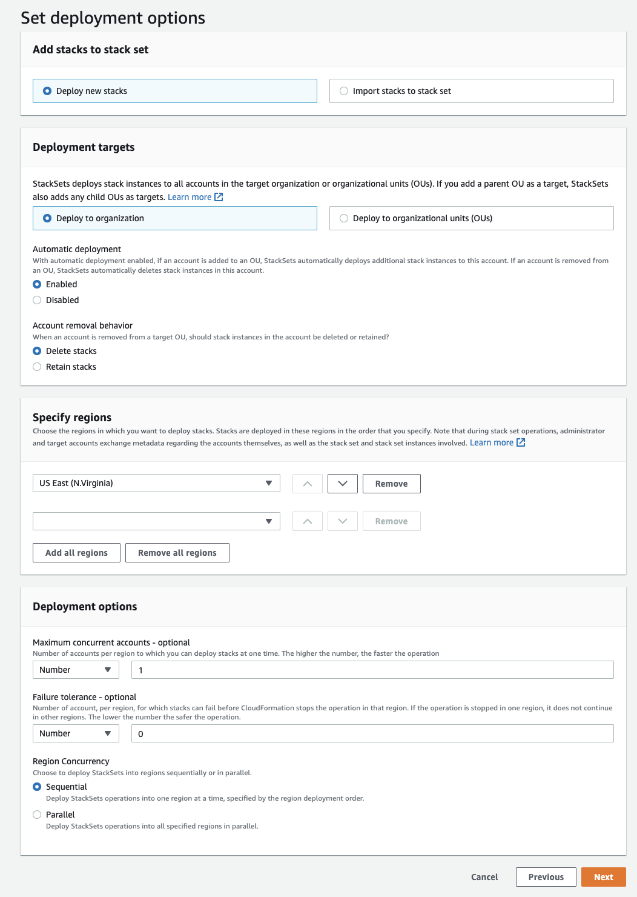
16. Review the details, select acknowledgment, and click **Submit**.

### Create an API Key in Harness

1. In Harness, click **Home**.
2. In **Account Setup**, click **Access Control**.
3. Click **Service Accounts** and then click the service account to which you want to add a new API Key. For step-by-step instructions to add a new Service Account, see [Add and Manage Service Accounts](https://ngdocs.harness.io/article/e5p4hdq6bd).
4. In the Service Account's settings page, click **API Key**.
5. In the **New API Key** settings, enter **Name, Description,** and **Tags**.
6. Click **Save**. The new API Key is created.  
After creating an API Key for your Service Account, generate a Token for this API Key.
7. To generate a Token for this API Key, click **Token** below the API Key you just created.
	1. In the **New Token** settings, enter Name, Description, and Tags.
	2. To set an expiration date for this token, select **Set Expiration Date**.
	3. Enter date in **Expiration Date (mm/dd/yyyy)**.
	4. Click **Generate Token**.
	5. Your new Token is generated.
     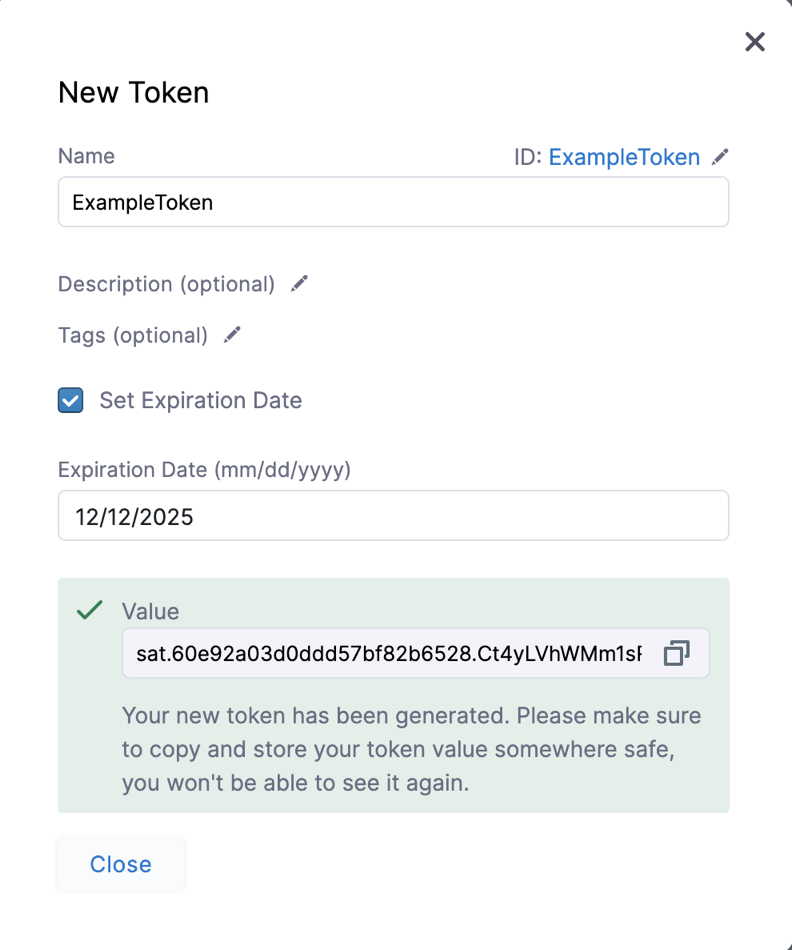
   
   You cannot see this token value after you close this dialog. Make sure to copy and store the generated token value securely.

   You need to enter this Token when running your cURL command.

### Add an Admin Role to the Service Account

Ensure that you've added the Admin role to this Service Account. For more information, see **Harness Platform** > **Role-based Access Control** > **Add and Manage Roles** section.

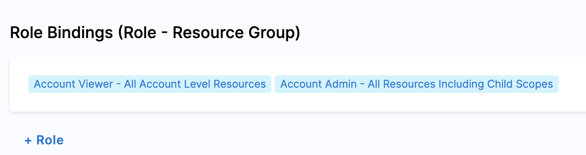

### Run the cURL Command

Run the following command for each AWS Account ID and IAM Role Pair:


```
curl -i -X POST \  
  'https://app.harness.io/gateway/ng/api/connectors?accountIdentifier=<CustomerHarnessAccountID>' \  
  -H 'Content-Type: application/json' \  
  -H 'x-api-key: <Enter your API Key Token>' \  
  -d '{  
  "connector":{  
    "name":"AWSConnector-<AWSAccountId>",  
    "identifier":"AWSConnector_<AWSAccountId>",  
    "spec":{  
      "crossAccountAccess":{  
        "crossAccountRoleArn":"<Enter the Role Created in the Account>",  
        "externalId":"<Enter ExternalID oused when creating the IAM Role>"  
      },  
      "awsAccountId":"<AWSAccountId>",  
      "curAttributes":{  
        "reportName":"",  
        "s3BucketName":""  
      },  
      "featuresEnabled":[  
        "VISIBILITY",  
        "OPTIMIZATION"  
      ]  
    },  
    "type":"CEAws"  
  }  
}'
```
## Next Steps

* [Create Cost Perspectives](../../2-use-cloud-cost-management/2-ccm-perspectives/1-create-cost-perspectives.md)
* [Analyze Cost for AWS Using Perspectives](../../2-use-cloud-cost-management/4-root-cost-analysis/analyze-cost-for-aws.md)

