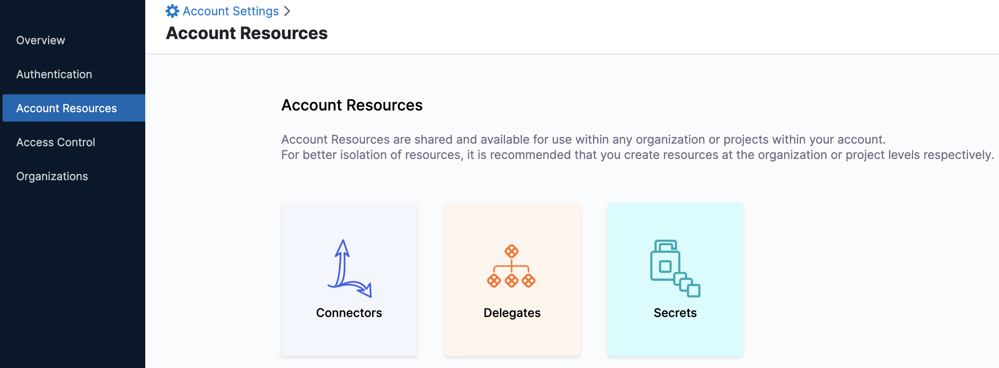

```mdx-code-block
import select_azure from './static/set-up-cost-visibility-for-azure-02.png'
import tenant_info from './static/set-up-cost-visibility-for-azure-03.png'
import run_now from './static/set-up-cost-visibility-for-azure-09.png'
```

Harness Cloud Cost Management (CCM) monitors the cloud costs of your Azure services. Connect your Azure account and set up Billing Export to get insights into your cloud infrastructure and Azure services such as Storage accounts, Virtual machines, Containers, and so on. CCM also allows you to optimize your instances and AKS clusters using intelligent cloud [AutoStopping rules](/docs/cloud-cost-management/2-use-cloud-cost-management/1-optimize-cloud-costs-with-intelligent-cloud-auto-stopping-rules/3-create-auto-stopping-rules/create-auto-stopping-rules-for-azure.md)

> **☆ NOTE —** After enabling CCM, it takes about 24 hours for the data to be available for viewing and analysis.


## Azure Connector requirements

* The same connector cannot be used in NextGen and FirstGen. For information on creating an Azure connector in the FirstGen see [Set Up Cost Visibility for Azure](https://docs.harness.io/article/7idbmchsim-set-up-cost-visibility-for-azure).
* For CCM, Azure connectors are available only at the Account level in Harness.
* You can create multiple Azure connectors for each Harness Account.
* You can create multiple Azure connectors per Azure Tenant with unique subscription IDs. You have to create separate connectors for subscriptions that 
* If you have separate billing exports for each of your subscriptions in your Azure account, set up separate connectors in Harness to view the cloud cost of all the subscriptions in CCM.

## Prerequisites

* Make sure that you have the **Application Administrator** role assigned to your Azure AD. Users in this role can create and manage all aspects of enterprise applications, application registrations, and application proxy settings. See [Application Administrator](https://docs.microsoft.com/en-us/azure/active-directory/roles/permissions-reference#application-administrator).
* Many Azure CLI commands act within a subscription. Make sure that you have selected the right subscription before executing the commands. If you need to switch subscription, use the following command:  
`az account set -s <`*`subs id/name`*`>`  
For more information, see [Manage Subscriptions](https://docs.microsoft.com/en-us/cli/azure/manage-azure-subscriptions-azure-cli).

## Connect CCM to your Azure Account

To enable CCM for your Azure services (such as storage accounts, virtual machines, containers, and so on), you need to connect Harness to your Azure account.

Perform the following steps to connect to your Azure account:

### Overview

1. In **Account Settings**, under **Account Resources**, click **Connectors**.

  
2. Click **+ New Connector**.
3. Under **Cloud Costs**, click **Azure**.
   ```mdx-code-block

	 
4. In the **Azure Connector** wizard, in the **Overview** section, enter the following details:
	1. **Connector name**: Enter a name for the connector
	2. **Azure Tenant ID**: Enter the Tenant ID of your Azure AD account. A tenant represents an organization. It's a dedicated instance of Azure AD that an organization or app developer receives at the beginning of a relationship with Microsoft. Each Azure AD tenant is distinct and separate from other Azure AD tenants. To find your tenant ID, do the following:
		1. Launch Azure Active Directory.
		2. Copy the tenant ID from the Tenant information.
		
    	
	

	 If you don't find the tenant ID in the Azure console, run the `az account show` command using the Azure CLI.

	3. **Azure Subscription ID**: Enter the Azure subscription ID. To find your Subscription ID, do the following:
   
		1. Launch Azure **Cost Management** page.
		2. Under **Product + services**, click **Azure subscriptions**.
		3. Copy the **Subscription ID** for your subscription.
   
     
	 
	 If you don't find the Subscription ID in the Azure console, you can use Azure CLI. See [List your Azure subscriptions with CLI](https://docs.microsoft.com/en-us/azure/media-services/latest/setup-azure-subscription-how-to?tabs=cli).
	4. **Description** (optional): Enter a brief description that conveys the purpose of this connector.
	5. **Tag** (optional): Enter text to create a tag for this connector.
5. Click **Continue**.

### Azure Billing Exports

Billing export is used to get insights into your cloud infrastructure and Azure services such as Storage accounts, Virtual machines, Containers, etc.

1. In **Azure Billing Exports**, click **Launch Azure Billing Exports**.
   
     
2. In the Azure **Cost Management** portal, under **Settings**, in **Exports**, click **Add** to create a new export.
3. In **Export details**, provide the following details:
	1. Enter a name for your export.
	2. In **Export type**, select **Daily export of month-to-date costs**.
	3. In the **Start date**, leave the date as the current date.  
	For example, if you are creating a new export on March 1, 2021, select the date as **Mon Mar 01 2021**.
4. In **Storage**, you can select **Use existing** or **Create new**.
	1. If you select **Use existing**, enter the following details:
		1. In **Subscription**, select the **Subscription** of your storage account.
		2. In the **Storage account**, select the storage account where the data needs to be exported.
		3. In **Container**, enter the container name where the report is to be stored.
		4. In **Directory**, enter the directory path where the export is to be stored.
   
       
	2. If you select **Create new**, enter the following details:
		1. In **Subscription**, select the **Subscription** of your storage account.
		2. In the **Resource group**, select the group to place the storage account. You can also create a new resource group.  
		A resource group is a container that holds related resources for an Azure solution.
		3. In **Account name**, enter the name for your storage account.
		4. In **Location**, select the region for your storage account.
		5. In **Container**, enter the container name where the report is to be stored.
		6. In **Directory**, enter the directory path where the export is to be stored.
   
       > **☆ NOTE —** Make a note of the **Storage account** name. You will need it while assigning permissions to the storage account.
   
     
		7. Click **Create**.  
		Your export report is listed in the **Exports** list.
					

5. Select the export that you created in the previous step and click **Run now**.
   


1. In the Azure **Cost Management** portal, click the billing export that you created in the enable export billing step.
   
     
2. Enter the following details in Harness:
	1. In the **Storage account name**, enter the account name.
	2. In **Storage Container**, enter the container name.
	3. In **Storage Directory**, enter the directory name.
	4. In **Report Name**, enter the report name.
   
     
3. Click **Continue**.

### Choose Requirements

1. Select **Cost Visibility** and **Azure resource optimization using AutoStopping rules** in **Create Cross Account Role**. Make sure to add the required permissions to the service principal.  

  CCM offers the following features:
  
    


| **Features**  | **Capabilities** | 
| --- | --- | 
| **Cost Visibility** (Required)| This feature is available by default and requires access to the billing export. Provides the following functionalities:<ul><li>Insights into Azure costs by services, accounts, etc.</li><li>Root cost analysis using cost perspectives </li><li>Cost anomaly detection</li><li>Governance using budgets and forecasts</li><li>Alert users using Email and Slack notification</li></ul>|
| **Azure Inventory Management** (Optional)| This feature provides visibility into your Azure VM inventory dashboard and metrics dashboard. The insights provided by inventory management can be used by finance teams to understand resource utilization across the board.|
| **Azure optimization using AutoStopping rules** (Required for AutoStopping Rules)| This feature allows you to enable Intelligent Cloud AutoStopping for your Azure instances with a simple one-time setup. For more information, see [Create AutoStopping Rules for Azure](../2-use-cloud-cost-management/1-optimize-cloud-costs-with-intelligent-cloud-auto-stopping-rules/3-create-auto-stopping-rules/create-auto-stopping-rules-for-azure.md).<ul><li>Orchestrate GCE VMs based on idleness</li><li>Set dependencies between VMs</li><li>Granular savings visibility</li><li>Simple one-time setup</li></ul>|
 
2. Make your selection and click **Continue**.

### Create Service Principal and Assign Permissions

Harness uses a multi-tenant app to sync billing export data from the source storage account to Harness and to perform cost optimization functions. This involves the following steps:

* Register the Harness CCM application into your Azure account.
* Provide read permissions to the storage account in which the billing data export is available and/or contributor role on the subscription where the optimization feature is to be performed.

Create a service principal and assign permissions by running the following commands in the bash terminal or in the Azure cloud shell.

#### Register the Harness Application

Run the following **bash** commands using your **bash** terminal or Azure cloud shell:

`az ad sp create``10034206-24bf-442b-968c-70a9c896a2f6`  
See **Azure client application ID**  in **Harness Platform** > **Connectors** > **Add a Microsoft Azure Cloud Connector** for more information.
> **☆ NOTE —** If you encounter the following error message, proceed with assigning permissions to the storage account.  
  `Another object with the same value for property servicePrincipalNames already exists.`  
  The error means that your Harness CCM application is already registered into your Azure account.
  
  
#### Assign Permissions to the Storage Accounts
Run the following **bash** commands using your **bash** terminal or Azure cloud shell:

```
SCOPE=`az storage account show --name <storage account name> --query "id" | xargs`
```

Provides scope for your storage account. Each role assignment in Azure needs a scope on which the permissions or role is applied. The output of this command is used in the next step.

  **Required Parameter**
   
   --name

  **Response**
```
$ SCOPE=`az storage account show --name test --query "id" | xargs`  
  
$ echo $SCOPE  
/subscriptions/XXXXXXX-XXXX-XXXX-XXXX-XXXXXXXXXXXX/resourceGroups/<resourcegroupname>/providers/Microsoft.Storage/storageAccounts/<storage account name>
```
1. `az role assignment create --assignee 10034206-24bf-442b-968c-70a9c896a2f6 --role 'Storage Blob Data Reader' --scope $SCOPE`: Provides Storage Blob Data Reader permission to the Harness application on the scope fetched in the previous step.  
This is the ID of the Harness CCM client application. Use `10034206-24bf-442b-968c-70a9c896a2f6`
4. (Optional) You need to run this command only if you have selected **Azure Optimization by AutoStopping** in the Choosing Requirements step.
```
az role assignment create --assignee 10034206-24bf-442b-968c-70a9c896a2f6 --role 'Contributor' --scope /subscriptions/123e4567-e89b-12d3-a456-9AC7CBDCEE52
```
5. Cick **Continue** in Harness.

### Test Connection

The connection is validated and verified in this step. After successful validation, and verification, click **Finish**.

Your connector is listed in the **Connectors**.


### Troubleshooting

1. If you get the `When using this permission, the backing application of the service principal being created must in the local tenant` error, check if you have the **Application Administrator** role assigned for your Azure AD. Users in this role can create and manage all aspects of enterprise applications, application registrations, and application proxy settings. For more information, see [Application Administrator](https://docs.microsoft.com/en-us/azure/active-directory/roles/permissions-reference#application-administrator).

### Next Steps

* [Analyze Cost for Azure Using Perspectives](../../2-use-cloud-cost-management/4-root-cost-analysis/analyze-cost-for-azure.md)
* [Create Cost Perspectives](../../2-use-cloud-cost-management/2-ccm-perspectives/1-create-cost-perspectives.md)

