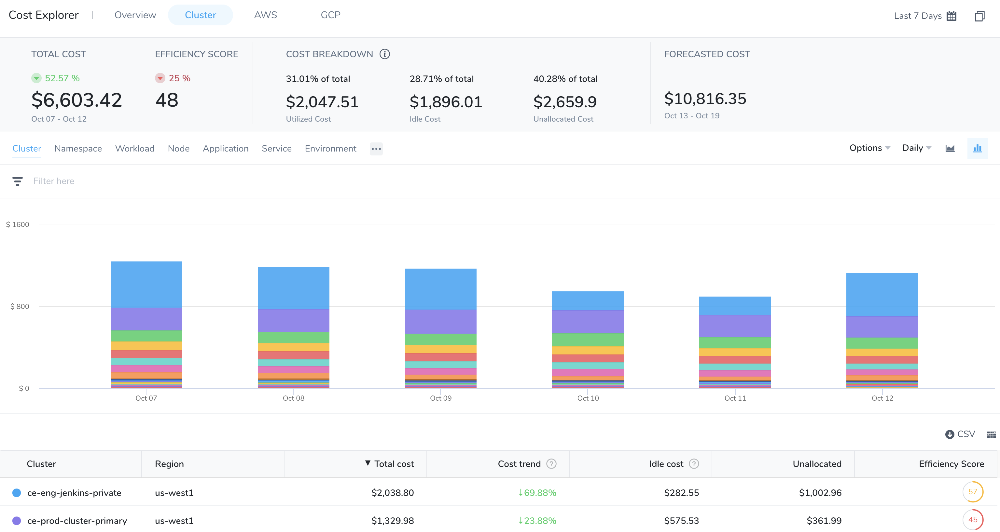
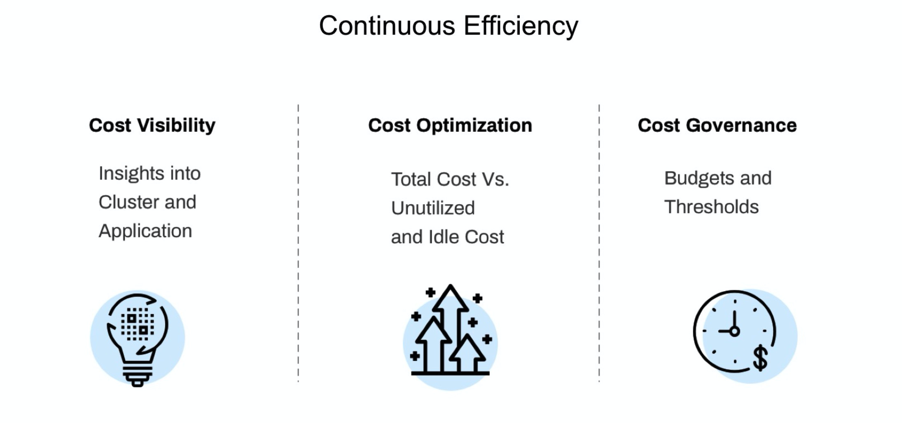
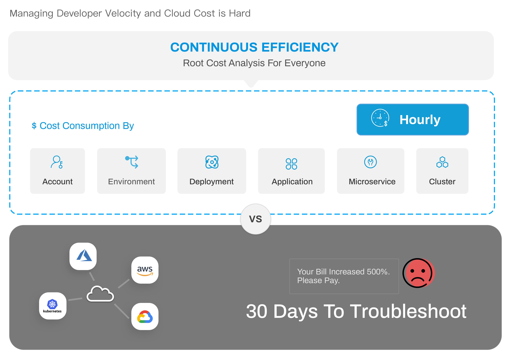

In today's world, it's pertinent to understand and manage costs associated with your cloud resources. Optimum utilization of cloud resources saves costs. As the complexity increases, it becomes challenging to keep track of cloud expenses.

The cloud cost management tools available today provide insights only into costs at the project, service, instance type, or tag. This limited insight is insufficient for development and DevOps teams looking to view and forecast the costs of their deployments and active clusters' resources (namespaces, nodes, pods, and so on).

Furthermore, typical cost management tools are designed to provide monthly billing for CFO/CIO/CTO audiences. But for the engineers and DevOps teams consuming resources, there's no access or ability to analyze their costs quickly.

Harness Cloud Cost Management (formerly Continuous Efficiency) is a solution that provides engineers and DevOps granular detail of their resource consumption hourly. Harness Cloud Cost Management (CCM) is designed to bring cloud cost analysis and management into the hands of the engineers consuming cloud resources.

### Visual Summary
<!-- Video:
https://harness-1.wistia.com/medias/rpv5vwzpxz-->
<docvideo src="https://www.youtube.com/watch?v=xnbTUNet5gw" />

### What is Cloud Cost Management?

CCM provides insight and visibility into your cloud infrastructure costs. CCM provides the following benefits:

* **Cost Visibility**: Insights into the costs of your Harness Applications and clusters. Provides granular cost details of your cluster namespaces, workloads, nodes, pods, and labels. Details of total cost versus utilized, idle, and unallocated cost. Forecasts future spend based on historical data.
* **Cost Optimization**: Optimize and minimize the costs associated with utilizing cloud resources. The AutoStoppiing rules, Recommendations, and the Asset Governance features help you identify cloud resources and services that are idle or underutilized and take required action to ensure optimum utilization.
* **Cost Governance**: Enables you to set a budget and configure notifications based on thresholds.

### Why Harness' Cloud Cost Management?

The following illustration explains the different challenges that an engineering organization faces with cloud cost management and how Harness CCM can help you resolve them.

Some of the unique challenges that CCM addresses are:

* Lack of visibility into the cost of their Application or clusters
* Unable to detect and resolve cost spikes
* Percentage of cloud spend wasted

### Why is this Important?

Teams lack visibility into the cost drivers. CCM can help you gain visibility into your costs. The following table lists the needs and pain points of different teams, and how CCM resolves these issues and provides opportunities for improvement:

|  | **Engineer** | **DevOps** | **CTO/CIO** | **CFO** |
| --- | --- | --- | --- | --- |
| **Need Context and  Visibility** | <li>Applications</li><li>Microservices</li><li>Clusters/Nodes</li> | <li>Applications</li><li>Environment</li><li>Clusters</li><li>Nodes</li><li>Namespaces</li><li>Workloads</li><li>Labels</li> | <li>Cloud Provider</li><li>Applications</li><li>Teams</li> | <li>Cloud Provider</li><li>Cloud Account</li><li>Cost per Customer</li> |
| **Pain Points** | <li>Lack of context or visibility</li><li>Reactive troubleshooting</li> | <li>Lack of context or visibility</li><li>Tagging cloud resource</li><li>Reactive troubleshooting</li> | Increasing cloud spend | Increasing cloud spend |
| **Why Harness?** | <li>Complete visibility</li><li>Root cost analysis</li><li>Cost optimization opportunities</li><li>Identify cost triggers, for example, CPU and memory spikes</li><li>Manage multiple clouds</li> | <li>Complete visibility</li><li>Embed cost into pipeline</li><li>No Tagging</li><li>Manage multiple clouds efficiently</li> | Shift cloud cost management to Dev teams | Shift cloud cost management to Dev teams |

### CCM Coverage

The following section lists where you can use CCM:

* Cloud Platforms
	+ AWS
	+ GCP
	+ Azure
* Container Orchestration
	+ Kubernetes: EKS (AWS), GKE (GCP), AKS (Azure)
	+ ECS Clusters
* Harness SaaS

### Supported Kubernetes Management Platform

The following section lists the support for Kubernetes management platform for CCM:

| **Technology** | **Supported Platform** | **Pricing** |
| --- | --- | --- |
| OpenShift 3.11 | GCP | GCP |
| OpenShift 4.3 | AWSOn-Prem | AWSCustom-rate\* |
| Rancher | AWS | Custom-rate\*\* |
| Kops (Kubernetes Operations) | AWS | AWS |

\*Cost data is supported for On-Prem OpenShift 4.3. This uses a custom rate.

\*\*Cost data is supported for K8s workloads on AWS managed by Rancher, but the cost falls back to the custom rate.

### Blog Post

The following blog post walks you through Optimizing Kubernetes Cluster Costs:

[Cost Management Strategies for Kubernetes](https://harness.io/learn/ebooks/ebook-cost-management-kubernetes/)

### Harness CCM FAQs

Here is the list of frequently asked questions for Harness CCM.

**Cost is** **my CFO’s problem.**

If your CFO is managing your cost, you’re being reactive to cloud changes. Your team can be proactive and mitigate any cost spikes.

**My cloud platform already gives me visibility into the cost.**

Cloud platforms don’t let you see the cost at a granular level, for example, application, clusters, nodes, workloads, namespaces.

**I have already tagged everything, why would I need Cloud Cost Management?**

You will have to re-tag everything if you:

* Create a new application
* Deploy a new microservice
* Or your company, team, or project is re-organized

**After I reduce my costs, I won’t need** **Cloud Cost Management.**

Reducing cost isn’t a one-time event. Engineering and finance need constant feedback to innovate and change. Hence **Cloud Cost Management**.

**After we’ve identified our costs, will Continuous Efficiency help us reduce them?**

Budgeting and alert thresholds are built into CE, with more features on the way.

**Can your tool create custom reports and alerts?**

Yes. CE provides alerts, reports, and forecasts you can fine-tune.

**I know my cloud platform is accurate, how do I know your tool is accurate?**

CE uses the same cost and usage report as your cloud platform.

