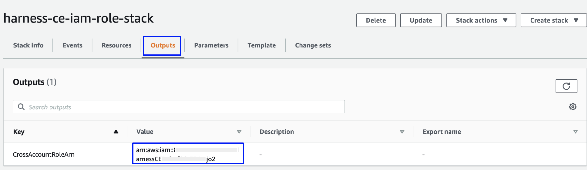

# Set up CCM for AWS
Harness Cloud Cost Management (CCM) offers comprehensive solutions to manage and optimize the cloud costs of your Amazon Web Services (AWS) infrastructure. CCM provides visibility, governance, and optimization of AWS services such as EC2, S3, RDS, Lambda, and others. CCM provides recommendations to effectively right-size your cloud resources to match the workload demands and optimizes the auto-scaling groups (ASGs), and EKS clusters using intelligent cloud AutoStopping rules.

> **☆ NOTE —** After enabling CCM, it takes about 24 hours for the data to be available for viewing and analysis.

## AWS Connector requirements

* The same connector cannot be used in NextGen and FirstGen. 
* For CCM, AWS connectors are available only at the Account level in Harness.
* If you have multiple AWS accounts, you may need to create multiple AWS connectors depending on desired functionality:
	+ **Cost Visibility**: You may need to create one or multiple AWS connectors depending on the availability of consolidated billing. Go to **Cost and Usage Reports (CUR)** for more information. 
	+ **Resource Inventory Management**: You need to create an AWS connector for each account.
	+ **Optimization by AutoStopping**: You need to create an AWS connector for each account.

## Cost and Usage Reports (CUR)

```mdx-code-block
import Tabs from '@theme/Tabs';
import TabItem from '@theme/TabItem';
```

```mdx-code-block
<Tabs queryString="tab-number">
<TabItem value="1" label="Multiple Accounts with Consolidated Billing">
```
* If you have [consolidated billing process](https://docs.aws.amazon.com/awsaccountbilling/latest/aboutv2/useconsolidatedbilling-procedure.html) enabled, then you need to create only a single CUR for the management account. This provides cost data for all member accounts in the organization.

* For the Cost Visibility feature alone, you will only need a single AWS connector configured with the management account CUR.

* In order to take advantage of other features such as Inventory Management and AutoStopping, you need to create a connector for each member account:
  * If you are using the UI to create the additional connectors, configure all connectors with the same management account CUR.
  * If you are using the API to create the additional connectors, you can omit billing information altogether.

```mdx-code-block
</TabItem>

<TabItem value="2" label="Multiple Accounts">
```
* If you do not have [consolidated billing process](https://docs.aws.amazon.com/awsaccountbilling/latest/aboutv2/useconsolidatedbilling-procedure.html) enabled, then you need to create a CUR for each linked account.

* Create an AWS connector for each AWS account, configured with the CUR for that account.

```mdx-code-block
</TabItem>
<TabItem value="3" label="Single Account">
```
* Create a single CUR for your AWS account.

* Create a single AWS connector configured with the CUR for your account.

```mdx-code-block
</TabItem>
</Tabs>
```

## Connect CCM to your AWS account

To enable CCM for your AWS services (such as EC2, S3, RDS, Lambda, and so on), you simply need to connect Harness to your AWS accounts.

Perform the following steps to connect CCM to the AWS account.

1. Create a new AWS connector using one of the two options below:

```mdx-code-block
<Tabs queryString="tab-number">
<TabItem value="4" label="From Account Settings">
```
2. Go to **Account Resources** > **Connectors**.
3. Select **+ New Connector**.
4. Under **Cloud Costs**, select **AWS**.
```mdx-code-block
</TabItem>
<TabItem value="5" label="From Cloud Costs">
```
2. Go to **Setup** > **Cloud Integration**.  
3. Select **New Cluster/Cloud account**.
4. Select **AWS**.
```mdx-code-block
</TabItem>
</Tabs>
```
5. Perform the following tasks in the **AWS Connector** wizard.

### Overview

1. Enter the following details and select **Continue**.

| **Field** | **Description** |
| --- | --- |
| **Connector Name** | Enter any name for the connector. This name will appear throughout the product to identify this AWS account. |
| **Specify the AWS account ID** | The Account ID of the AWS account to connect to. To find your AWS account ID, see [Finding your AWS account ID](https://docs.aws.amazon.com/IAM/latest/UserGuide/console_account-alias.html#FindingYourAWSId). |
| **Is this an AWS GovCloud account?** | Select **Yes** if connecting to a GovCloud account. |


### Cost and Usage Report

Launch the AWS console and perform the following steps:


1. Log into your AWS account if not already logged in.
2. Select **Create Report**.   
4. In the **Specify report details** step, enter the following values, and then select **Next**.

| **Field** | **Description** |
| --- | --- |
| **Report Name** | Enter a name for the report. Make sure to copy this name, as you will need it to continue configuring the Harness connector in the steps below. |
| **Include resource IDs** | Make sure this option is selected. |
| **Split cost allocation data** | Make sure this option is unchecked. |
| **Refresh automatically** | Make sure this option is selected. |

5. In the **Set delivery options** step, enter the following values, and then select **Next**.

| **Field** | **Description** |
| --- | --- |
| **Configure S3 Bucket** | Select an existing bucket or create a new one. Make sure to copy this name, as you will need it to continue configuring the Harness connector in the steps below. |
| **S3 path prefix - required** | Enter any path prefix. Harness will automatically scan and find this prefix. |
| **Report data time granularity** | Select **Hourly**. |
| **Report versioning** | Select **Overwrite existing report**. |
| **Amazon Athena** | Make sure this option is unchecked. |
| **Amazon Redshift** | Make sure this option is unchecked. |
| **Amazon QuickSight** | Make sure this option is unchecked. |
| **Compression type** | Select **GZIP**. |

6. In the **Review and create** step, select **Create Report**.


7. In the Harness connector dialog, enter the following values, and then select **Continue**.

| **Field** | **Description** |
| --- | --- |
| **Cost and Usage Report Name** | Enter the report name you copied earlier. |
| **Cost and Usage S3 Bucket Name** | Enter the bucket name you specified earlier. |


### Choose Requirements

Select your desired features, and then select **Continue**. 

Details about the features are listed below. Note that the permissions required as part of the AWS cross-account role will be based on your selections. Those permissions are listed out in the **Reference - AWS Access Permission** section below.

| **Features**  | **Capabilities** | 
| --- | --- | 
| **Cost Visibility** (Required)| This feature is available by default and requires access to the CUR report. Provides the following capabilities:<ul><li>Insights into AWS costs by services, accounts, etc. </li><li>Root cost analysis using cost perspectives</li><li>Cost anomaly detection</li><li>Governance using budgets and forecasts</li><li>Alert users using Email and Slack notification</li></ul> This feature will give you cost insights that are derived from the CUR. For deep Kubernetes visibility and rightsizing recommendations based on the historical utilization and usage metrics, set up Kubernetes connectors. See [Set Up Cloud Cost Management for Kubernetes](set-up-cost-visibility-for-kubernetes.md). |
| **Resource Inventory Management** (Optional)| This feature provides visibility into your EC2, EBS volumes, and ECS costs. The insights provided by inventory management can be consumed by Finance teams to understand resource utilization across the board. <ul><li>Breakdown by ECS cluster cost, Service, Task, and Launch Type (EC2, Fargate) </li><li>Insight into EC2 instances and their utilization</li><li>Access to AWS EC2 Inventory Cost and EBS Volumes and Snapshots inventory dashboards. For more information, see View AWS EC2 Inventory Cost Dashboard, Orphaned EBS Volumes and Snapshots Dashboard, and View AWS EC2 Instance Metrics Dashboard.</li></ul> |
| **Optimization by AutoStopping** (Optional)| This feature allows you to enable Intelligent Cloud AutoStopping for your AWS instances and auto-scaling groups. For more information, see [Create AutoStopping Rules for AWS](../../4-use-ccm-cost-optimization/1-optimize-cloud-costs-with-intelligent-cloud-auto-stopping-rules/4-create-auto-stopping-rules/autostopping-dashboard.md). <ul><li>Orchestrate VMs and ASGs based on idleness</li><li>Run your workloads on fully orchestrated spot instances</li><li>Granular savings visibility</li></ul> |
| **Cloud Governance** (Optional)| This feature allows you to optimize your cloud spend and avoid unnecessary costs by rightsizing resources and decommissioning unused instances. For more information, see [Asset governance](../../5-use-ccm-cost-governance/asset-governance/1-asset-governance.md). <ul><li>Asset Management (EC2, EBS, RDS, S3)</li><li>Automated Actions</li></ul> |


### Create Cross Account Role

Harness uses the secure cross-account role to access your AWS account. The role includes a restricted policy based on the features selected above.

1. In **Create Cross Account Role**, select **Launch Template on AWS console**.

Perform the following steps in the AWS Console.

2. In **Quick create stack**, in **Capabilities**, select the acknowledgment, and then select **Create stack**.
  > **☆ NOTE** - The values on this page are based on your previous selections. Do not modify any values before creating the stack.  
    
3. In the stack's page, go to the **Outputs** tab  and copy the **Value** of **CrossAccountRoleArn Key**.
   
     


4. In the Harness connector dialog, enter the following values, and then select **Save and Continue**.

| **Field** | **Description** |
| --- | --- |
| **Cross Account Role ARN** | Enter the value that you copied in step 3. |
| **External ID** | Do not modify. If you intend to create multiple AWS connectors via API, be sure to copy this value as you will need to reference it later.|

### Connection Test

The connection is validated, and verified in this step. After successful validation, select **Finish**.


:::important
Creating a new CUR (Cost and Usage Report) in AWS typically takes 6-8 hours. During this period, you might encounter an error message stating that Harness CCM is unable to find a CUR file.
:::


## Create Connectors for multiple AWS accounts

Harness CCM also provides the ability to create connectors via API using a StackSet configured at the management account. It involves the following steps:

* Create a Service Account and API Key in Harness
* Create a StackSet in AWS
* Create an AWS Connector via API (performed once for each AWS account)

> **☆ NOTE —** You should manually create a connector via the UI for the management account before using the API method described here to create connectors for the member accounts.

### Create a Service Account and API key in Harness

1. At the Account level, [create a service account](/docs/platform/role-based-access-control/add-and-manage-service-account) with the **Admin** role for **All Account Level Resources** or **All Resources Including Child Scopes**.
2. [Create a service account token](/docs/platform/Resource-Development/APIs/add-and-manage-api-keys#create-service-account-api-keys-and-tokens). Save the API Key, which will be used when creating AWS connectors via the API below.

### Create a StackSet in AWS

Perform the following steps to create a StackSet in AWS:

1. Select the following link to start creating the StackSet:  
<https://console.aws.amazon.com/cloudformation/home?region=us-east-1#/stacksets/create>
2. In the **Choose a template** step, enter the following values, and then select **Next**.

| **Field** | **Description** |
| --- | --- |
| **Permissions** | Optional, configure if necessary based on your AWS policies. |
| **Prerequisite - Prepare template** | Select **Template is ready**. |
| **Specify template** | Select **Amazon S3 URL**. |
| **Amazon S3 URL** | Enter `https://continuous-efficiency-prod.s3.us-east-2.amazonaws.com/setup/ngv1/HarnessAWSTemplate.yaml` |

3. In the **Specify StackSet details** step, enter the following values, and then select **Next**.

| **Field** | **Description** |
| --- | --- |
| **StackSet name** | Enter any name. For example, `harness-ce-iam-stackset` .|
| **BillingEnabled** | Select **false**. |
| **BucketName** | Leave empty. |
| **EventsEnabled** | Select **true**. |
| **ExternalId** | The External ID value copied in step 4 of [Create Cross Account Role](#create-cross-account-role). |
| **GovernanceEnabled** | Select **true** to enable Governance. Otherwise, select **false**. |
| **LambdaExecutionRoleName** | Leave as is unless your AWS policies required a different naming convention. |
| **OptimizationEnabled** | Select **true** to enable AutoStopping. Otherwise, select **false**. |
| **PrincipalBilling** | Do not modify. |
| **RoleName** | Leave as is unless your AWS policies required a different naming convention. |
   
4. In the **Configure StackSet options** step, enter the following values and select **Next**

| **Field** | **Description** |
| --- | --- |
| **Managed execution** | Select **Active**. |
    
5. In the **Set deployment options** step, enter the following values, and then select **Next**.

| **Field** | **Description** |
| --- | --- |
| **Add stacks to StackSet** | Select **Deploy new stacks**. |
| **Deployment locations** | Configure the accounts or organization units that you want to deploy to. |
| **Specify regions** | Configure the regions that you want to deploy to. |
| **Region Concurrency** | Select **Sequential**. |

6. In the **Review** step, select the acknowledgment, and then select **Submit**.

### Create an AWS Connector via API

Use the Harness API's [Create a Connector](https://apidocs.harness.io/tag/Connectors#operation/createConnector) endpoint to create an AWS connector for each member account. Below is a sample cURL command to create an AWS connector. Replace the following placeholders with your values:

| **Placeholder** | **Description** |
| --- | --- |
| **API TOKEN** | The API Key created in the [Create a Service Account and API Key in Harness](#create-a-service-account-and-api-key-in-harness) section. |
| **CONNECTOR NAME** | Enter any name. This will be visible in the UI, perspectives, dashboards, etc. |
| **CONNECTOR ID** | Enter a unique ID for the connector. The ID must meet the [Entity Identifier Reference](/docs/platform/references/entity-identifier-reference/) specification. |
| **CROSS ACCOUNT ROLE ARN** | The ARN value copied in step 3 of [Create Cross Account Role](#create-cross-account-role). |
| **EXTERNAL ID** | The External ID value copied in step 4 of [Create Cross Account Role](#create-cross-account-role). |
| **AWS ACCOUNT ID** | The ID of the AWS member account. |
| **FEATURES** | A comma separated list of features to enable. Enter `"VISIBILITY", "OPTIMIZATION", "GOVERNANCE"` removing any features that you do not want to enable. |


```
curl -i -X POST 'https://app.harness.io/gateway/ng/api/connectors' \
  -H 'Content-Type: application/json' \
  -H 'x-api-key: <API TOKEN>' \
  -d '{
  "connector":{
    "name":"<CONNECTOR NAME>",
    "identifier":"<CONNECTOR ID>",
    "type":"CEAws",
    "spec":{
      "crossAccountAccess":{
        "crossAccountRoleArn":"<CROSS ACCOUNT ROLE ARN>",
        "externalId":"<EXTERNAL ID>"
      },
      "awsAccountId":"<AWS ACCOUNT ID>",
      "curAttributes":{
        "reportName":"",
        "s3BucketName":""
      },
      "featuresEnabled":[
        <FEATURES>
      ]
    }
  }
}'
```

## Enable EC2 recommendations

:::note
If you are an existing customer, you need to:
* Edit the IAM role used by the Harness AWS Connector corresponding to the AWS account.
* In the IAM role, add the `ce:GetRightsizingRecommendation` permission to the **HarnessEventsMonitoringPolicy**.
:::

Once you have the `ce:GetRightsizingRecommendation` permission added to the **HarnessEventsMonitoringPolicy** in the IAM role, perform the following tasks on your AWS console to enable recommendations.

1. On your AWS console, go to the **Cost Explorer** service.

  <docimage path={require('./static/ec2-recom-aws-screen-1.png')} width="50%" height="50%" title="Click to view full size image" />

2. Click **Preferences** on the left pane.
3. Enable the following recommendations:
 * Receive Amazon EC2 resource recommendations 
 * Recommendations for linked accounts
  
  <docimage path={require('./static/ec2-recom-aws-screen-2.png')} width="50%" height="50%" title="Click to view full size image" />

4. Verify that you have enabled these recommendations correctly. 

  Open AWS CloudShell and run the following command: 

```
  aws ce get-rightsizing-recommendation --service AmazonEC2
```
 
 If the recommendations are not enabled, the following error message is displayed:

     
  "An error occurred (AccessDeniedException) when calling the GetRightsizingRecommendation operation: Rightsizing EC2 recommendation is an opt-in only feature. You can enable this feature from the PAYER account’s Cost Explorer Preferences page. Normally it may take up to 24 hours in order to generate your rightsizing recommendations."

5. You must install the Amazon CloudWatch agent on your EC2 instance to enable memory metrics.
   
## Reference - AWS access permissions

CCM requires the following permissions which are automatically created via a StackSet based on the features you select during configuration.

> **☆ NOTE —** If you don't have access to create a cost and usage report or run a CloudFormation template, contact your IT or security teams to provide the required permissions.

### Cost visibility

The cost visibility policy grants the following permissions:

* List CUR reports and visibility into the organization's Structure
* Get objects from the S3 bucket configured in the CUR
* Put objects into the Harness S3 bucket
```
  HarnessBillingMonitoringPolicy:  
    "Type": "AWS::IAM::ManagedPolicy"  
    "Condition": "CreatingHarnessBillingMonitoringPolicy"  
    "Properties":  
      "Description": "Policy granting Harness Access to Collect Billing Data"    
      "PolicyDocument":  
        "Version": "2012-10-17"  
        "Statement":  
          - "Effect": "Allow"  
            "Action":  
              - "s3:GetBucketLocation"
              - "s3:ListBucket" 
              - "s3:GetObject" 
            Resource:  
              - !Join  
                - ''  
                - - 'arn:aws:s3:::'  
                  - !Ref BucketName  
              - !Join   
                - /  
                - - !Join  
                    - ''  
                    - - "arn:aws:s3:::"
                      - !Ref BucketName  
                  - '*'  
          - "Effect": "Allow"  
            "Action":  
              - "s3:ListBucket"
              - "s3:PutObject"
              - "s3:PutObjectAcl"  
            "Resource":  
              - "arn:aws:s3:::ce-customer-billing-data-prod*"
              - "arn:aws:s3:::ce-customer-billing-data-prod*/*"
          - "Effect": "Allow"  
            "Action":   
              - "cur:DescribeReportDefinitions" 
              - "organizations:Describe*"
              - "organizations:List*"  
            "Resource": "*"  
      "Roles":  
        - "!Ref HarnessCloudFormationRole"
```

If the `cur:DescribeReportDefinitions`, `organizations:Describe`, and `organizations:List*` permissions are too wide, you can modify these to the following:


```
{  
    "Version": "2012-10-17",  
    "Statement": [  
        {  
            "Sid": "VisualEditor0",  
            "Effect": "Allow",  
            "Action": [  
                "organizations:ListAccounts",  
                "organizations:ListTagsForResource"  
            ],  
            "Resource": "*"  
        }  
    ]  
}
```
* `organizations:ListAccounts`: fetches a list of all the accounts present in the organization, and also fetches the accountID to Account Name mapping.
* `organizations:ListTagsForResource`: fetches the AWS Account level tags. Harness supports account tags within CCM that can be used for reporting and analysis.

### Resource inventory management

The inventory management policy performs the following actions:

* ECS Visibility - For Granular Cluster Cost Breakdown
* EC2, EBS, RDS Visibility - Inventory Management  

```
HarnessEventsMonitoringPolicy:  
  "Type": "AWS::IAM::ManagedPolicy"  
  "Condition": "CreateHarnessEventsMonitoringPolicy"  
  "Properties":  
    "Description": "Policy granting Harness Access to Enable Event Collection"  
    "PolicyDocument":  
      "Version": "2012-10-17"  
      "Statement":  
        - "Effect": "Allow"  
          "Action":  
              - "ecs:ListClusters*"  
              - "ecs:DescribeClusters"
              - "ecs:ListServices"
              - "ecs:DescribeServices"
              - "ecs:DescribeContainerInstances" 
              - "ecs:ListTasks"
              - "ecs:ListContainerInstances"  
              - "ecs:DescribeTasks"
              - "ec2:DescribeInstances*"
              - "ec2:DescribeRegions"
              - "cloudwatch:GetMetricData"
              - "ec2:DescribeVolumes"
              - "ec2:DescribeSnapshots"
              - "rds:DescribeDBSnapshots"  
              - "rds:DescribeDBInstances"  
              - "rds:DescribeDBClusters" 
              - "rds:DescribeDBSnapshotAttributes"
          "Resource": "*" 
    "Roles":  
      - "!Ref HarnessCloudFormationRole"
```

### Insight into RDS instances

This feature provides visibility into your EC2, EBS volumes, and ECS costs. The insights provided by inventory management can be consumed by finance teams to understand resource utilization across the board.

* Breakdown by ECS cluster cost, Service, Task, and Launch Type (EC2, Fargate).
* Insight into EC2 instances and their utilization.
* Access to AWS EC2 Inventory Cost and EBS Volumes and Snapshots inventory dashboards. For more information, see [View AWS EC2 Inventory Cost Dashboard](../../3-use-ccm-cost-reporting/6-use-ccm-dashboards/view-aws-ec-2-inventory-cost-dashboard.md), [Orphaned EBS Volumes and Snapshots Dashboard](../../3-use-ccm-cost-reporting/6-use-ccm-dashboards/orphaned-ebs-volumes-and-snapshots-dashboard.md), and [View AWS EC2 Instance Metrics Dashboard](../../3-use-ccm-cost-reporting/6-use-ccm-dashboards/view-aws-ec-2-instance-metrics.md).


### AutoStopping rules

The AutoStopping policy performs the following actions:

* Create an IAM role for optimization
* Permissions for creating AutoStopping Rules
```
 HarnessOptimizationLambdaExecutionRole:  
    Type: "AWS::IAM::Role"
    Condition: CreateHarnessOptimisationPolicy  
    Properties:  
      RoleName: !Ref LambdaExecutionRoleName  
      AssumeRolePolicyDocument:  
        Version: 2012-10-17  
        Statement:  
          - Effect: Allow  
            Principal:  
              Service: "lambda.amazonaws.com"  
            Action: 'sts:AssumeRole'  
      Path: /ce-optimization-service-role/
```

```
HarnessOptimsationLambdaPolicy:  
    "Type": "AWS::IAM::ManagedPolicy" 
    "Condition": "CreateHarnessOptimisationPolicy"  
    "Properties":  
      "Description": "Policy granting Harness Access to Enable Cost Optimisation"  
      "PolicyDocument":  
        "Version": "2012-10-17"  
        "Statement":  
          - "Effect": "Allow"  
            "Action":  
              - "ec2:CreateNetworkInterface"
              - "ec2:CreateNetworkInsightsPath" 
              - "ec2:CreateNetworkInterfacePermission"  
              - "ec2:CreateNetworkAcl"
              - "ec2:*"
              - "ec2:CreateNetworkAclEntry"  
              - "logs:CreateLogGroup"
              - "logs:CreateLogStream"  
              - "logs:PutLogEvents"
            "Resource": "*"  
      "Roles":  
        - "!Ref HarnessOptimizationLambdaExecutionRole"
```

```
HarnessOptimisationPolicy:  
    "Type": "AWS::IAM::ManagedPolicy"
    "Condition": "CreateHarnessOptimisationPolicy"  
    "Properties":  
      "Description": "Policy granting Harness Access to Enable Cost Optimisation"  
      "PolicyDocument":  
        "Version": "2012-10-17"  
        "Statement":  
              - "Effect": "Allow"  
                "Action":  
                  - "elasticloadbalancing:*"  
                  - "ec2:StopInstances"  
                  - "autoscaling:*"  
                  - "ec2:Describe*"  
                  - "iam:CreateServiceLinkedRole"  
                  - "iam:ListInstanceProfiles"  
                  - "iam:ListInstanceProfilesForRole"  
                  - "iam:AddRoleToInstanceProfile"  
                  - "iam:PassRole"  
                  - "ec2:StartInstances"  
                  - "ec2:*"  
                  - "iam:GetUser"  
                  - "ec2:ModifyInstanceAttribute"  
                  - "iam:ListRoles"  
                  - "acm:ListCertificates"  
                  - "lambda:*"  
                  - "cloudwatch:ListMetrics"  
                  - "cloudwatch:GetMetricData"  
                  - "route53:GetHostedZone"  
                  - "route53:ListHostedZones"  
                  - route53:ListHostedZonesByName"  
                  - "route53:ChangeResourceRecordSets"  
                  - "route53:ListResourceRecordSets"  
                  - "route53:GetHealthCheck"  
                  - "route53:GetHealthCheckStatus"  
                  - "cloudwatch:GetMetricStatistics"  
                "Resource": "*"  
      "Roles":  
        - !Ref HarnessCloudFormationRole 
```
### Cloud asset governance rules
Enable the following permissions in AWS to execute cloud governance rules:

```
{
    "Version": "2012-10-17",
    "Statement": [
        {
            "Action": [
                "ec2:Describe*",
                "ec2:DeleteSnapshot",
                "ec2:DeleteVolume",
                "ec2:Get*",
                "ec2:ListImagesInRecycleBin",
                "ec2:ListSnapshotsInRecycleBin",
                "elasticbeanstalk:Check*",
                "elasticbeanstalk:Describe*",
                "elasticbeanstalk:List*",
                "elasticbeanstalk:Request*",
                "elasticbeanstalk:Retrieve*",
                "elasticbeanstalk:Validate*",
                "elasticloadbalancing:Describe*",
                "rds:Describe*",
                "rds:List*",
                "autoscaling-plans:Describe*",
                "autoscaling-plans:GetScalingPlanResourceForecastData",
                "autoscaling:Describe*",
                "autoscaling:GetPredictiveScalingForecast",
                "s3:DescribeJob",
                "s3:Get*",
                "s3:List*"
            ],
            "Resource": "*",
            "Effect": "Allow"
        }
    ]
}
```

:::info
* This is not an exhaustive list; you may require additional permissions to support custom rules.
* A yellow underline in a custom policy indicates that you need permission to support the underlined filters and/or actions.
:::

#### Add permissions
If you come across an error message indicating missing permissions, as displayed in the following screenshot, you need to add the missing permission [here](https://us-east-1.console.aws.amazon.com/iamv2/home#/roles). 


<docimage path={require('./static/asset-governance-test-output-error.png')} width="50%" height="50%" title="Click to view full size image" />

1. Copy the role specified in the error message that requires permission to execute the rule.
2. Enter the role in IAM > Roles search box to filter the roles. The policies are displayed. 

  <docimage path={require('./static/aws-missing-permission-role.png')} width="50%" height="50%" title="Click to view full size image" />

3. In the list of policies, select the policy to edit.
    <docimage path={require('./static/aws-select-policy.png')} width="50%" height="50%" title="Click to view full size image" />

4. In the **Permissions** tab, select **Edit policy**, and then go to the **JSON** tab.

      <docimage path={require('./static/aws-edit-json.png')} width="50%" height="50%" title="Click to view full size image" />

5. Add the missing permissions. You can use a wildcard (asterisk) to grant multiple permissions. For example, `s3:Get*` permission would allow multiple S3 actions that start with "Get". 
6. Save changes.

For more information, go to [Editing IAM policies](https://docs.aws.amazon.com/IAM/latest/UserGuide/access_policies_manage-edit.html).

## Next steps

* [Create Cost Perspectives](../../3-use-ccm-cost-reporting/1-ccm-perspectives/1-create-cost-perspectives.md)
* [Analyze Cost for AWS Using Perspectives](../../3-use-ccm-cost-reporting/3-root-cost-analysis/analyze-cost-for-aws.md)
