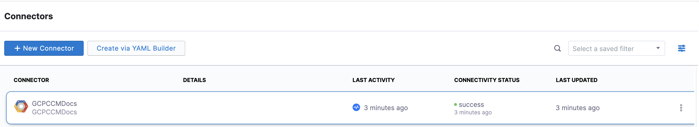

# Set up CCM for GCP

```mdx-code-block
import select_gcp from './static/set-up-cost-visibility-for-gcp-01.png'
import create_dataset from './static/set-up-cost-visibility-for-gcp-02.png'
import dataset_name from './static/set-up-cost-visibility-for-gcp-03.png'
import dataset_permissions from './static/data-permissions-gcp.png'
```

Harness Cloud Cost Management (CCM) monitors the cloud costs of your GCP products, projects, SKUs, and location. As a first step, you need to connect Harness to your GCP account to get insights into your cloud infrastructure, and GCP services, Compute Engine, Cloud Storage, BigQuery, etc. CCM offers a wide range of features to track and control costs associated with your cloud resources.

> **☆ NOTE —** After enabling CCM, it takes about 24 hours for the data to be available for viewing and analysis.

## Before you begin

* The same connector cannot be used in NextGen and FirstGen. For information on creating a GCP connector in the FirstGen see [Set Up Cost Visibility for GCP](../../../first-gen/cloud-cost-management/setup-cost-visibility/enable-cloud-efficiency-for-google-cloud-platform-gcp.md).
* Review [Required permissions and roles](https://cloud.google.com/iam/docs/understanding-custom-roles#required_permissions_and_roles) to create an IAM role at the organization level
* Ensure that you have the following permissions to enable and configure the export of Google Cloud billing data to a BigQuery dataset:
	+ **Billing Account Administrator** role for the target Cloud Billing account
	+ [BigQuery User role for the Cloud project](https://cloud.google.com/bigquery/docs/dataset-access-controls) that contains the BigQuery dataset that will be used to store the Cloud Billing data

## Connect Harness to Google Cloud Platform (GCP) Account

Connect Harness to your GCP account to gain access your GCP services, Compute Engine, Cloud Storage, BigQuery, etc. Harness CCM gives you cost insights that are derived from the billing export. For deep Kubernetes visibility and rightsizing recommendations based on the historical utilization and usage metrics, set up Kubernetes connectors. See [Set Up Cloud Cost Management for Kubernetes](set-up-cost-visibility-for-kubernetes.md).

> **☆ NOTE —** Time periods in the GCP Cloud Billing report use the Pacific Time Zone (PST) and observe daylight saving time shifts. However, Harness CCM explorer uses the UTC time zone. You may notice some cloud cost differences between Harness CCM explorer and the GCP Cloud Billing report due to the time zone difference.

1. Create a new Kubernetes connector using one of the two options below:
```mdx-code-block
import Tabs from '@theme/Tabs';
import TabItem from '@theme/TabItem';
```

```mdx-code-block
<Tabs queryString="tab-number">
<TabItem value="4" label="From Account Settings">
```
1. Go to **Account Resources** > **Connectors**.
2. Select **+ New Connector**.
3. Under **Cloud Costs**, select **GCP**.
```mdx-code-block
</TabItem>
<TabItem value="5" label="From Cloud Costs">
```
1. Go to **Setup** > **Cloud Integration**.  
2. Select **New Cluster/Cloud account**.
3. Select **GCP**.
```mdx-code-block
</TabItem>
</Tabs>
```
 
2. Perform the following tasks in the **GCP Connector** wizard.
### Overview
1. In **Overview**, in **Connector Name**, enter a name that describes this account.
2. In **Specify Project ID**, enter the project ID and select **Continue**. For more information on how to get a project ID, go to [Create a BigQuery dataset](https://cloud.google.com/billing/docs/how-to/export-data-bigquery-setup#create-bq-dataset).

### GCP Billing Export

Cloud Billing export to BigQuery enables you to export detailed Google Cloud billing data (such as usage and cost estimate data) automatically throughout the day to a BigQuery dataset that you specify.


:::important
Make sure that you have enabled **Detailed Usage Cost** on the **Billing Export** page on your GCP console. For more information, see [ Enable Cloud Billing export to the BigQuery dataset](https://cloud.google.com/billing/docs/how-to/export-data-bigquery-setup#enable-bq-export).
:::


1. In **GCP Billing Export**, select **Launch GCP console**.
2. In the GCP **Explorer** window, in the pinned projects section, select **your project ID** to open the project. If you see an overflow menu (:) next to your project ID, select the menu and select **Open**.
3. Select **Create dataset**. For more information, go to [Create a BigQuery dataset](https://cloud.google.com/billing/docs/how-to/export-data-bigquery-setup#create-bq-dataset).
  
  
  ```mdx-code-block


4. Enter a **Dataset Name**.  
You need to enter Dataset Name in Harness.
5. Select a **Data location**.
6. Set the **Default table expiration** to **Never**.
7. Set the **Encryption** option to **Google-managed key**.
8. To save, select **CREATE DATASET**.
9. Enter the **Dataset Name** in Harness.

  ```mdx-code-block


10. Next, you need to enter the table name in Harness. From the GCP console, copy the table name where the billing export is available. In your BigQuery dataset, the table is named `gcp_billing_export_v1_<BILLING_ACCOUNT_ID>`.
  
    
11. Enter the **Table Name** in Harness.
12. Select **Continue**. 
  

### Choose Requirements

Select the Cloud Cost Management features that you would like to use on your GCP account.

CCM offers the following features:

| **Features**  | **Capabilities** | 
| --- | --- | 
| **Cost Visibility** (Required)| This feature is available by default. Make sure you have set up the GCP Billing Export. Provides the following capabilities:<ul><li>Insights into GCP costs by projects, products, etc.</li><li>Root cost analysis using cost perspectives </li><li>Cost anomaly detection</li><li>Governance using budgets and forecasts</li><li>Alert users using Email and Slack notification</li></ul>|
| **GCP Inventory Management** (Optional)| This feature provides visibility into your GCE VMs and unused disks and snapshots. The insights provided by inventory management can be used by Finance teams to understand resource utilization across the board.|
| **GCP optimization using AutoStopping rules** (Required for AutoStopping Rules)| This feature allows you to enable Intelligent Cloud AutoStopping for your GCP cloud resources. For more information, see **Create AutoStopping Rules for GCP**.<ul><li>Orchestrate GCE VMs based on idleness</li><li>Set dependencies between VMs</li><li>Granular savings visibility</li><li>Simple one-time setup</li></ul>|


Make your selection and select **Continue**.

### Grant Permissions

Cloud Billing Export to BigQuery helps you export detailed Google Cloud billing data (such as usage and cost estimate data) to a BigQuery dataset that you specify. The export happens throughout the day automatically. 

1. In **Grant permissions**, select **Open BigQuery Page**.
2. Log into the GCP console and go to the BigQuery page.
3. Select your project in the left panel.
4. Select your dataset. For more information on creating a dataset, see [Creating datasets](https://cloud.google.com/bigquery/docs/datasets).

  
5. Select the **more actions** icon (three vertical dots) against the dataset, and then select **Share.**

   

6. In **Dataset permissions**, in **Add Principals**, enter the Harness service account as a member.  
    Copy the service account detail from Harness. The service account is generated dynamically for your account.

  
    

7. In **Select a role**, select **BigQuery Data Viewer**, and then select **Add**.
8. Select **Done**.  
    When you are done, the following screen is displayed:
  
  ```mdx-code-block


:::note
To enable AutoStopping rules, you need to add more permissions. For more information, see [Create a GCP Connector for AutoStopping Rules](https://developer.harness.io/docs/cloud-cost-management/use-ccm-cost-optimization/optimize-cloud-costs-with-intelligent-cloud-auto-stopping-rules/add-connectors/create-a-gcp-connector-for-auto-stopping-rules).
:::
  
   
9. Select **Continue** in Harness.


### Connection Test

The connection is validated and verified in this step. After successfully testing the connection, select **Finish**.


Your connector is now listed in the **Connectors**.



### Next Steps

* [Analyze Cost for GCP ​Using Perspectives](https://developer.harness.io/docs/cloud-cost-management/use-ccm-cost-reporting/root-cost-analysis/analyze-cost-for-gcp-using-perspectives)
* [Create Cost Perspectives](https://developer.harness.io/docs/cloud-cost-management/use-ccm-cost-reporting/ccm-perspectives/create-cost-perspectives)

