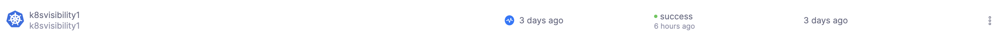
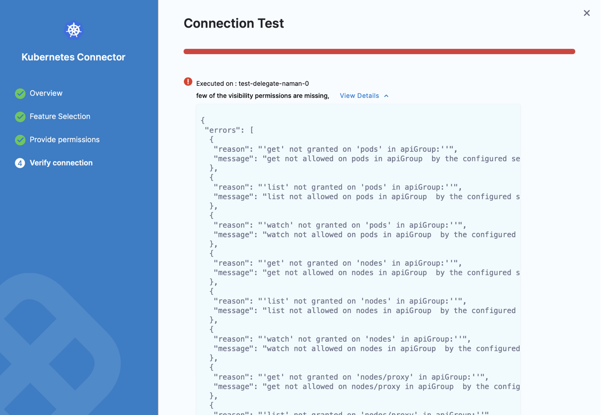

# Set up CCM for Kubernetes cluster

Harness Cloud Cost Management (CCM) monitors the cloud costs of your Kubernetes clusters, namespaces, nodes, workloads, and labels. CCM also allows you to optimize your Kubernetes cluster resources using intelligent cloud AutoStopping rules.

This topic describes how to connect your Kubernetes cluster to CCM.

:::note
After you enable CCM, for the first cluster, the data is available within a few minutes for viewing and analysis. However, you would not be able to see the idle cost because of the lack of utilization data. CCM generates the last 30 days of the cost data based on the first events. From the second cluster onwards, it takes about 2–3 hours for the data to be available for viewing and analysis.

If you are using an EKS connector, the data generation is delayed. AWS ingests data at the source (S3 bucket) four times a day. CCM takes about two hours to make the data available for viewing and analysis once it is available at the source.
:::
 

## Kubernetes Connector requirements and workflow

For CCM, Kubernetes connectors are available only at the Account level in Harness. To set up the CCM K8s Connector, you need to perform the following tasks:

## Create a cloud provider Kubernetes connector
You need to have completed the following tasks before creating a CCM connector for your Kubernetes cluster:
* You need to set up Harness Delegate for each Cloud Provider (K8s cluster) connector. Delegate is installed when adding a Connector. For more information, go to [Install a Kubernetes Delegate](https://developer.harness.io/tutorials/platform/install-delegate/). The Delegate is responsible for collecting metrics from the K8s connector.

  ### Delegate role requirements for CCM visibility features and recommendations:
  
    The YAML provided for the Harness Delegate defaults to the `cluster-admin` role. If you can't use cluster-admin because you are using a cluster in your company, you'll need to edit the delegate YAML.
	
```
apiVersion: rbac.authorization.k8s.io/v1
kind: ClusterRole
metadata:
  name: ce-clusterrole
rules:
- apiGroups:
  - ""
  resources:
  - pods
  - nodes
  - nodes/proxy
  - events
  - namespaces
  - persistentvolumes
  - persistentvolumeclaims
  verbs:
  - get
  - list
  - watch
- apiGroups:
  - apps
  - extensions
  resources:
  - statefulsets
  - deployments
  - daemonsets
  - replicasets
  verbs:
  - get
  - list
  - watch
- apiGroups:
  - batch
  resources:
  - jobs
  - cronjobs
  verbs:
  - get
  - list
  - watch
- apiGroups:
  - metrics.k8s.io
  resources:
  - pods
  - nodes
  verbs:
  - get
  - list
- apiGroups:
  - storage.k8s.io
  resources:
  - storageclasses
  verbs:
  - get
  - list
  - watch
```
  
* You need to create a Kubernetes Cloud Provider Connector for each Kubernetes cluster. One connector can access only one cluster. See [Add a Kubernetes Cluster Connector](/docs/platform/Connectors/Cloud-providers/add-a-kubernetes-cluster-connector).
 
## Create CCM Connector
For the CCM Kubernetes connector, you need to reference an existing Cloud Provider Kubernetes Connector. Otherwise, you need to create one.
For each cluster, you need to create a CCM Kubernetes connector. CCM can now connect to the K8s connector and collect CCM metrics for deep cloud cost visibility.


:::note
In Harness, the ratio of Delegates to Connectors is 1:2. If you have 20 clusters you need 20 Delegates and 40 Connectors (1 Cloud Provider K8s Connector and 1 CCM Connector each).  
  
Alternatively, if you wish to use a single Delegate to access multiple Kubernetes clusters, you need to specify the Kubernetes master node URL.
:::


## Visual summary

Here's a visual representation of the CCM Kubernetes connector requirements and workflow:


## Prerequisites

Make sure you have the following set up before you create a Kubernetes connector for CCM:

- **Kubernetes cluster**:
You need a target Kubernetes cluster for the Harness Delegate and deployment. Make sure your cluster meets the following requirements:
  * **Number of nodes**: 2
  * **vCPUs, Memory, Disk Size**: 4vCPUs, 16GB memory, 100GB disk. In GKE, the **e2-standard-4** machine type is enough for this quickstart.
  * **Networking**: outbound HTTPS for the Harness connection to **app.harness.io**, **github.com**, and **hub.docker.com**. Allow TCP port 22 for SSH.
  * **Kubernetes service account** with permission to create entities in the target namespace is required. The set of permissions should include `list`, `get`, `create`, and `delete` permissions. In general, the cluster-admin permission or namespace admin permission is enough.  
	For more information, see [User-Facing Roles](https://kubernetes.io/docs/reference/access-authn-authz/rbac/#user-facing-roles) from Kubernetes.
	
	
:::note
You must not rename the cluster. If you're setting up a new connector with this cluster, it is identified by the `clustername`. Renaming the cluster results in duplicate entries in the dashboard.
:::
 
	
- **Delegate size**: 
Your Kubernetes cluster must have unallocated resources required to run the Harness Delegate workload:

  - Laptop - 1.6GB memory, 0.5CPU
  - Small - 3.3GB memory, 1CPU
  - Medium - 6.6GB memory, 2CPU
  - Large - 13.2GB memory, 4CPU
  
  
:::important
These sizing requirements are for the Delegate only. Your cluster will require more memory for Kubernetes, the operating system, and other services. Ensure that the cluster has enough memory, storage, and CPU for all of its resource consumers.
:::

- **Delegate permissions**: You can choose one of the following permissions for CCM:

 **Install Delegate with cluster-wide read/write access**

	Creates a new namespace called "harness-delegate-ng" with the service account bound to Cluster Admin role. This Delegate will be able to read tasks (capture change events etc., needed for Harness Cloud Cost Management) anywhere on the K8s cluster where the Delegate is installed.

 **Install Delegate with cluster-wide read access**

	(Requires read-only Cluster Admin role) Creates a new namespace called "harness-delegate-ng" with the service account bound to Cluster Admin role. This Delegate will be able to perform read-only tasks (capture change events etc., needed for Harness Cloud Cost Management) anywhere on the K8s cluster where the Delegate is installed.

- **Metrics Server**: Metrics Server must be running on the Kubernetes cluster where your Harness Kubernetes Delegate is installed. Before enabling CCM for Kubernetes, you must make sure the utilization data for pods and nodes is available.


:::important note
Metrics Server is installed by default on GKE and AKS clusters; however, you need to install it on the AWS EKS cluster.
:::

The Metrics Server is a cluster-wide aggregator of resource usage data. It collects resource metrics from kubelets and exposes them in the Kubernetes API server through Metrics API. CCM polls the utilization data every minute on the Delegate. The metrics are aggregated for 20 minutes and then CCM keeps one data point per 20 minutes. For more information, see [Installing the Kubernetes Metrics Server](https://docs.aws.amazon.com/eks/latest/userguide/metrics-server.html) from AWS.  
To install the metrics server on your EKS clusters, run the following command:
```
kubectl apply -f https://github.com/kubernetes-sigs/metrics-server/releases/download/v0.5.0/components.yaml  

```
Resources can be adjusted proportionally based on number of nodes in the cluster. For clusters exceeding 100 nodes, allocate the following additional resources:

  * 1m core per node
  * 2MiB memory per node

## Connect Your Kubernetes Cluster to CCM

Perform the following steps to connect your Kubernetes cluster to CCM.

1. Create a new Kubernetes connector using one of the two options below:
```mdx-code-block
import Tabs from '@theme/Tabs';
import TabItem from '@theme/TabItem';
```

```mdx-code-block
<Tabs queryString="tab-number">
<TabItem value="4" label="From Account Settings">
```
1. Go to **Account Resources** > **Connectors**.
2. Select **+ New Connector**.
3. Under **Cloud Costs**, select **Kubernetes**.
```mdx-code-block
</TabItem>
<TabItem value="5" label="From Cloud Costs">
```
1. Go to **Setup** > **Cloud Integration**.  
2. Select **New Cluster/Cloud account**.
3. Select **Kubernetes**.
4. Select **Advanced**.

:::note
   For the Quick Create option, go to [Kubernetes Quick Create](../4-set-up-cloud-cost-management/use-quick-create-k8s.md).
:::
```mdx-code-block
</TabItem>
</Tabs>
```

### Overview
 
1. In the **Kubernetes Connector** wizard, in the **Overview** section, from the **Reference an existing connector** drop-down list, select your Cloud Provider Kubernetes Connector.  
If you do not have Cloud Provider Kubernetes Connector already created, select **Create a new connector**. See [Add a Kubernetes Cluster Connector](/docs/platform/Connectors/Cloud-providers/add-a-kubernetes-cluster-connector).
2. The name for your connector is automatically populated. You can choose to edit the name. This name appears on the **Perspectives** page to identify this cluster.
   
3. Select **Save and Continue**.

### Choose Requirements

In **Choose Requirements**, select the Cloud Cost Management features that you would like to enable for your Kubernetes clusters. Based on your selection Harness requires specific permissions.

You need to provide different permissions depending on the features that you enable for your Kubernetes clusters. CCM offers the following features:

| **Features**  | **Capabilities** | 
| --- | --- | 
| **Cost Visibility** (Required)| This feature is available by default. Provides the following capabilities:<ul><li>Insights into cluster costs by pods, namespace, workloads, etc.</li><li>Idle and unallocated cluster costs</li><li><li>Workload recommendations</li>Root cost analysis using cost perspectives </li><li>Cost anomaly detection</li><li>Governance using budgets and forecasts</li><li>Alert users using Email and Slack notification</li></ul>|
| **Kubernetes optimization using AutoStopping rules** (Required for AutoStopping Rules)| This feature allows you to enable Intelligent Cloud AutoStopping for Kubernetes. For more information, see [Create AutoStopping Rules for AWS](../../4-use-ccm-cost-optimization/1-optimize-cloud-costs-with-intelligent-cloud-auto-stopping-rules/4-create-auto-stopping-rules/create-autostopping-rules-aws.md).<ul><li>Orchestrate GCE VMs based on idleness</li><li>Set dependencies between VMs</li><li>Granular savings visibility</li><li>Simple one-time setup</li></ul>|


:::note
For [AWS](set-up-cost-visibility-for-aws.md) and [Azure](set-up-cost-visibility-for-azure.md), if the cloud connectors are set up, then the cost will be trued-up to the pricing received from the CUR/billing export. However, for [GCP](set-up-cost-visibility-for-gcp.md) the list pricing is used.
:::

Make your selection and select **Continue**.

### (Optional) Create a Secret

The secret creation settings appear only if you have selected **Kubernetes Optimization by AutoStopping** feature in the **Feature Selection** step. In this step, you are providing permissions for intelligent cloud AutoStopping rules. For more information, see [Create AutoStopping Rules for AWS](../../4-use-ccm-cost-optimization/1-optimize-cloud-costs-with-intelligent-cloud-auto-stopping-rules/4-create-auto-stopping-rules/create-autostopping-rules-aws.md).

1. In **Secret creation**, select create an API key here and create an API key. Go to [Create an API Key](/docs/platform/Resource-Development/APIs/add-and-manage-api-keys) for more information.
2. Run the following commands in your Kubernetes cluster:
	1. Create a namespace.  
	
	```
	kubectl create namespace harness-autostopping
	```
	2. In the following YAML, add the API token that you created (in step 1) and run the command in your K8s cluster.  
	
	```
	apiVersion: v1  
	data:  
	    token: <*paste token here*>  
	kind: Secret  
	metadata:  
	    name: harness-api-key  
	    namespace: harness-autostopping  
	type: Opaque
	```
	3. Run the following command:  
	
	```
	kubectl apply -f secret.yaml
	```
3. Select **Continue**.

### Provide Permissions

If the cluster does not already have additional permissions, you will apply them in this step. See Delegate Permissions in the Prerequisites section for additional details.

1. In **Provide Permissions**, select **Download YAML**.
2. Copy the downloaded YAML to a machine where you have `kubectl`installed and have access to your Kubernetes cluster.
3. Run the following command to apply the Harness Delegate permissions to your Kubernetes Cluster.  
  

```
$ kubectl apply -f ccm-kubernetes.yaml
```
4. Select **Done** and **Continue**.
5. In **Verify connection**, once the Test Connection succeeds, select **Finish**.  
  
The Connector is now listed in **Connectors**.

  

### Troubleshooting

In **Verify connection** step if you get `few of the visibility permissions are missing` error message, you need to review the CCM permissions required for Harness Delegate.

Verify that you have all the required permissions for the Service account using the following commands:


```
kubectl auth can-i watch pods   
--as=system:serviceaccount:<your-namespace>:<your-service-account>   
--all-namespaces  
kubectl auth can-i watch nodes   
--as=system:serviceaccount:<your-namespace>:<your-service-account>   
--all-namespaces
```

```
  
kubectl auth can-i get nodemetrics   
--as=system:serviceaccount:<your-namespace>:<your-service-account>   
--all-namespaces  
kubectl auth can-i get podmetrics   
--as=system:serviceaccount:<your-namespace>:<your-service-account>   
--all-namespaces
```
Here is an example showing the commands and output using the default Delegate Service account name and namespace:


```
$ kubectl auth can-i watch pods --as=system:serviceaccount:harness-delegate:default --all-namespaces  
yes  
$ kubectl auth can-i watch nodes --as=system:serviceaccount:harness-delegate:default --all-namespaces                                                                      
yes  
$ kubectl auth can-i watch nodemetrics --as=system:serviceaccount:harness-delegate:default --all-namespaces                                                                
yes  
$ kubectl auth can-i watch podmetrics --as=system:serviceaccount:harness-delegate:default --all-namespaces   
yes
```
## Next Steps

* [Optimize Cloud Costs with AutoStopping Rules](../../4-use-ccm-cost-optimization/1-optimize-cloud-costs-with-intelligent-cloud-auto-stopping-rules/4-create-auto-stopping-rules/autostopping-dashboard.md)
* [Root Cost Analysis](../../3-use-ccm-cost-reporting/3-root-cost-analysis/perform-root-cost-analysis.md)
* [Create Cost Perspectives](../../3-use-ccm-cost-reporting/1-ccm-perspectives/1-create-cost-perspectives.md)

