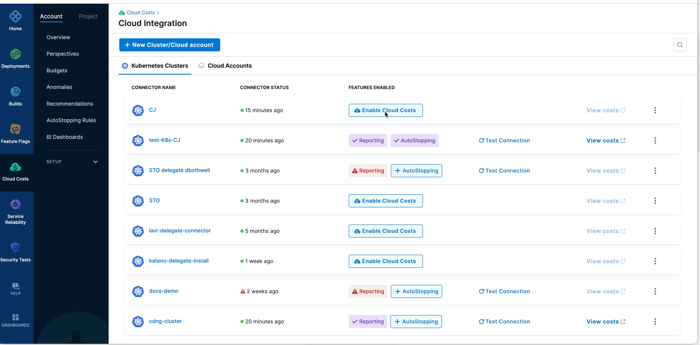

# Set up CCM for Kubernetes cluster by using the Quick Create option
The Kubernetes Quick Create feature allows you to seamlessly set up your Harness CCM with a single click for your existing Kubernetes clusters.

## Prerequisites and Permissions

* See [Roles and Policies for the Connector](/docs/platform/Connectors/Cloud-providers/add-a-kubernetes-cluster-connector#review-roles-and-policies-for-the-connector) to learn about the IAM roles and policies that you need to be assigned to be able to create a connector.
* See [Prerequisites](set-up-cost-visibility-for-kubernetes.md#prerequisites) to learn about the tasks that you need to perform before setting up Cloud Costs Management for your Kubernetes cluster.


## Create the Kubernetes connector using the Quick Create option

The Kubernetes **Quick Create** option is recommended especially for first-time users and for users who would like to test Harness CCM on their Kubernetes clusters. You can set up Harness CCM on your cluster effortlessly using this option. The following entities are created in this process:

* A Kubernetes delegate of medium size with cluster admin permissions.
* A Kubernetes connector which can also be used for other Harness modules such as CI, CD, and so on.
* Cost Visibility is enabled on this Kubernetes connector.

To use the **Quick Create** option, perform the following steps:

1. In your Harness application, select **Cloud Costs.** Under **Setup**, select **Cloud Integration**.  
The **Cloud Integration** page displays the existing connectors for the Kubernetes clusters and the cloud accounts.
2. Select **New Cluster/Cloud account**.
3. Select **Kubernetes**.
4. Select **Quick Create**.
5. In the **Kubernetes Connector** wizard, enter a **name** for the connector.
6. If the cluster does not already have additional permissions, you need to apply them now. See Delegate Permissions in [Prerequisites](set-up-cost-visibility-for-kubernetes.md#prerequisites) for additional details.
	1. In **Provide Permissions**, select **Download YAML**.
	2. Copy the downloaded YAML to a machine where you have `kubectl`installed and have access to your Kubernetes cluster.
	3. Run the following command to create a Kubernetes Delegate with Cluster Admin Role and a connector referencing the delegate.
	```
	$ kubectl apply -f harness-delegate.yml
	```
	4. Select **Continue**.
	5. In **Create and Test connection**, after the successful creation of delegate and the connectors, and verification of permissions, Select **Finish**. The connector is now listed in the Kubernetes clusters table.

## Enabling cloud cost on your cluster

To enable cloud cost for your Kubernetes clusters, perform the following steps:

1. In your Harness application, select **Cloud Costs**. Under **Setup**, select **Cloud Integration**.  
The **Cloud Integration** page displays the existing connectors for the Kubernetes clusters and the cloud accounts.
2. To enable cloud costs for a Kubernetes cluster, select **Enable Cloud Costs** for the Kubernetes Connector.  
The required permissions and components are verified. On successful verification, the cost management features are enabled on the cluster.

  
1. (Optional) To enable the AutoStopping feature, select **Enable AutoStopping** before selecting **Finish** and continue to follow the steps in the wizard, or you could choose to enable this feature later if required. To learn how to enable AutoStopping, go to [Create a secret and provide permissions for AutoStopping](set-up-cost-visibility-for-kubernetes.md#optional-create-a-secret).

### Viewing Cloud Costs

To view the cloud spend data for the Kubernetes cluster, select **View costs** for the cluster on the **Cloud Integration** page. The Perspective page displays your cloud costs data along with recommendations to reduce your spend. For more information, see [Cost Perspectives](../../3-use-ccm-cost-reporting/1-ccm-perspectives/1-create-cost-perspectives.md).

### Editing a Kubernetes connector

To edit an existing connector, perform the following steps:

1. In your Harness application, select **Cloud Costs**. Under **Setup**, select **Cloud Integration**.  
The **Cloud Integration** page displays the existing connectors for the Kubernetes clusters and the cloud accounts.
2. Select the three dots against the cluster and select **Edit Connector**.  
The **Kubernetes cluster** wizard opens.
3. After updating the required details, select **Save and Continue** to test the connection.
4. Select **Finish** after successful verification of the connection.

### Disabling Cost Reporting and AutoStopping on your cluster

To disable cost reporting on your Kubernetes cluster, perform the following steps:

1. In your Harness application, select **Cloud Costs**. Under **Setup**, select **Cloud Integration**.  
The **Cloud Integration** page displays the existing connectors for the Kubernetes clusters and the cloud accounts.
2. Select the three dots against the cluster and select **Edit cost access features**.  
The **Enable Cloud Costs** wizard opens.
3. Select **Disable Cost Reporting**.
4. If you want to disable AutoStopping, select **Manage AutoStopping** and then, select **Disable AutoStopping**.

### Deleting a Kubernetes connector

To delete a connector, perform the following steps:

1. In your Harness application, select **Cloud Costs**.  Under **Setup**, select **Cloud Integration**.  
The **Cloud Integration** page displays the existing connectors for the Kubernetes clusters and the cloud accounts.
2. Select the three dots against the cluster and select **Delete Connector**.
3. Select **Delete** in the confirmation dialog box.

