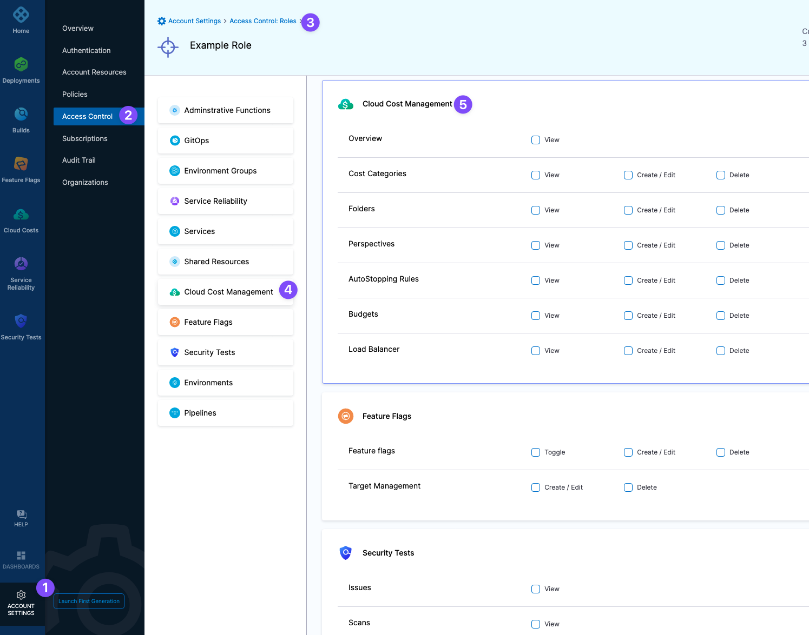
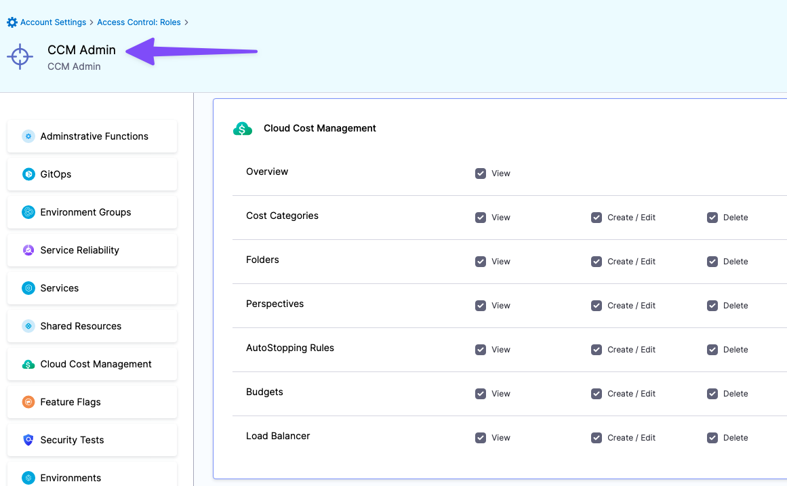
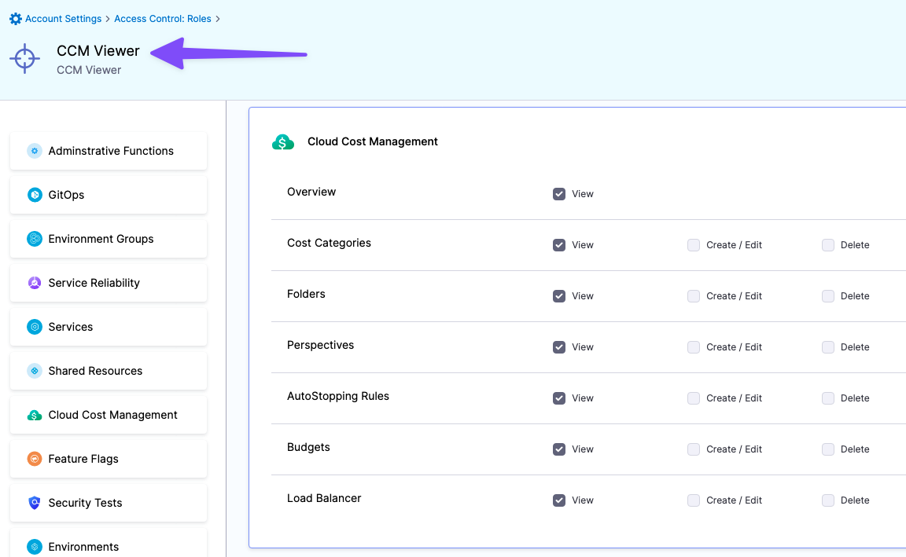

# CCM Roles and Permissions
Harness RBAC includes Roles and Permissions that enable you to control access to the CCM resources in your Harness account.

## CCM Roles and Permissions are Account Level Only

Most Roles and Permissions can be set at the Project, Org, and Account levels. CCM Roles and Permissions can be set at the Account level only.

1. In your Harness Account, click **Account Settings >** **Access Control >** **Roles**. 
2. Add or open a Role.
3. In the Role, click **Cloud Cost Management**. The CCM Permissions are displayed.

## Default Roles

You can configure CCM Permissions for any Role, but there are two default Roles related to CCM that you can assign without having to set anything up.

### CCM Admin

The default CCM Admin Role has full permissions on all CCM resources.

### CCM Viewer

The default CCM Viewer Role has read-only permissions on all CCM resources.

## Permissions

The following table describes the Permissions enabled in the default Harness Roles, including the two CCM default Roles.

| **CCM Resource** | **Permission** | **Account Admin** | **Account Viewer** | **Account Basic** | **CCM Admin** | **CCM Viewer** | **What a User can do?** |
| --- | --- | --- | --- | --- | --- | --- | --- |
| Overview Page | Overview | Y | Y | N | Y | Y | View the Overview page |
| Folders | Folders: View | Y | Y | N | Y | Y | View all the folders |
| Folders | Folders: Edit | Y | N | N | Y | N | Create a new folder, clone/edit existing folders |
| Folders | Folders: Delete | Y | N | N | Y | N | Delete a folder |
| Perspectives | Perspectives: View | Y | Y | N | Y | Y | View all the perspectives |
| Perspectives | Perspectives: Edit | Y | N | N | Y | N | Create a new perspective, clone/edit an existing a perspective and move the perspective to a different folder |
| Perspectives | Perspectives: Delete | Y | N | N | Y | N | Delete a perspective |
| Budgets | Budgets: View | Y | Y | N | Y | Y | View the budgets page |
| Budgets | Budgets: Edit | Y | N | N | Y | N | Create a perspective budget and edit existing |
| Budgets | Budgets: Delete | Y | N | N | Y | N | Delete a budget |
| Cost Categories | Cost Categories: View | Y | Y | N | Y | Y | View all the cost categories |
| Cost Categories | Cost Categories: Edit | Y | N | N | Y | N | Create a new cost category and edit existing cost categories |
| Cost Categories | Cost Categories: Delete | Y | N | N | Y | N | Delete a cost category |
| Auto Stopping Rules | AutoStopping Rules: View | Y | Y | N | Y | Y | View all the AutoStopping rules |
| Auto Stopping Rules | AutoStopping Rules: Edit | Y | N | N | Y | N | Create a new AutoStopping rule and edit existing rules |
| Auto Stopping Rules | AutoStopping Rules: Delete | Y | N | N | Y | N | Delete an AutoStopping rule |
| Load Balancer | Load Balancer: View | Y | Y | N | Y | Y | View all the load balancers |
| Load Balancer | Load Balancer: Edit | Y | N | N | Y | N | Create a new load balancer and edit configuration of existing load balancers |
| Load Balancer | Load Balancer: Delete | Y | N | N | Y | N | Delete a load balancer |

