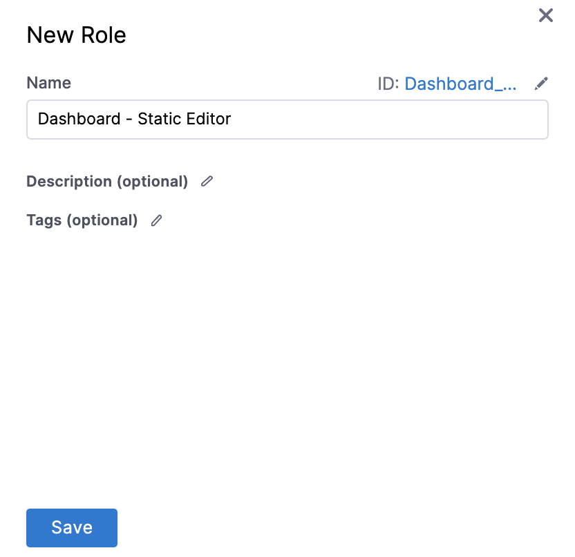
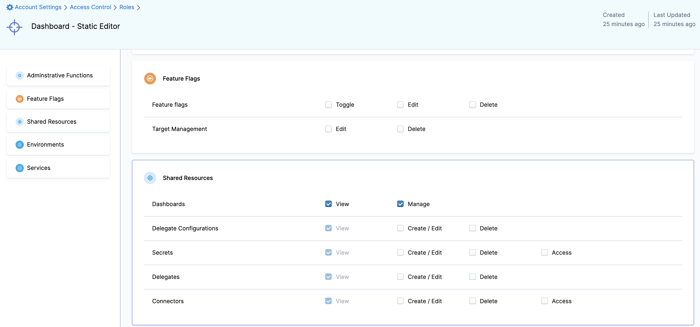
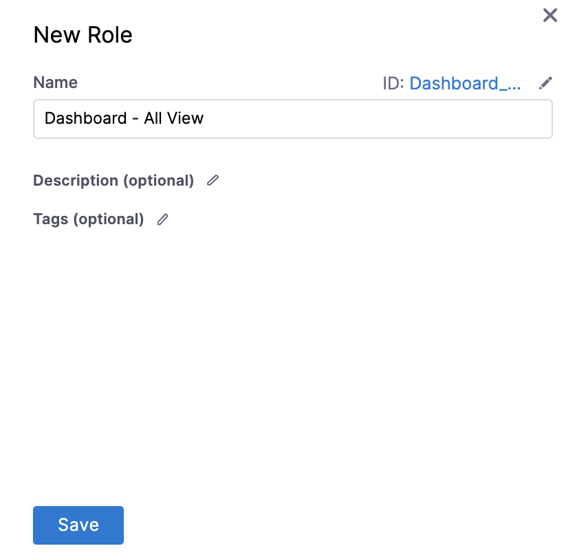
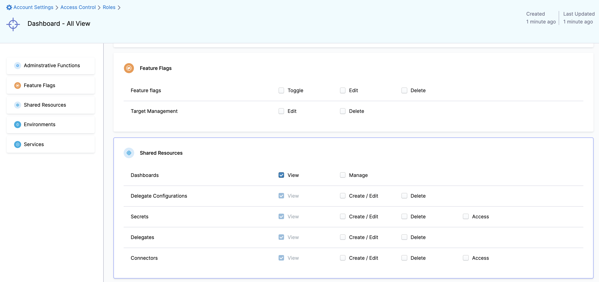
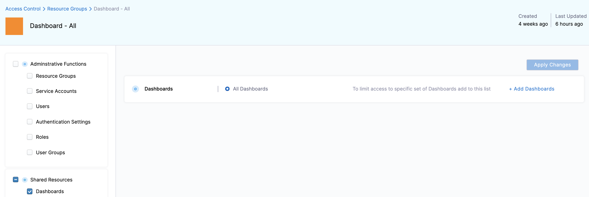
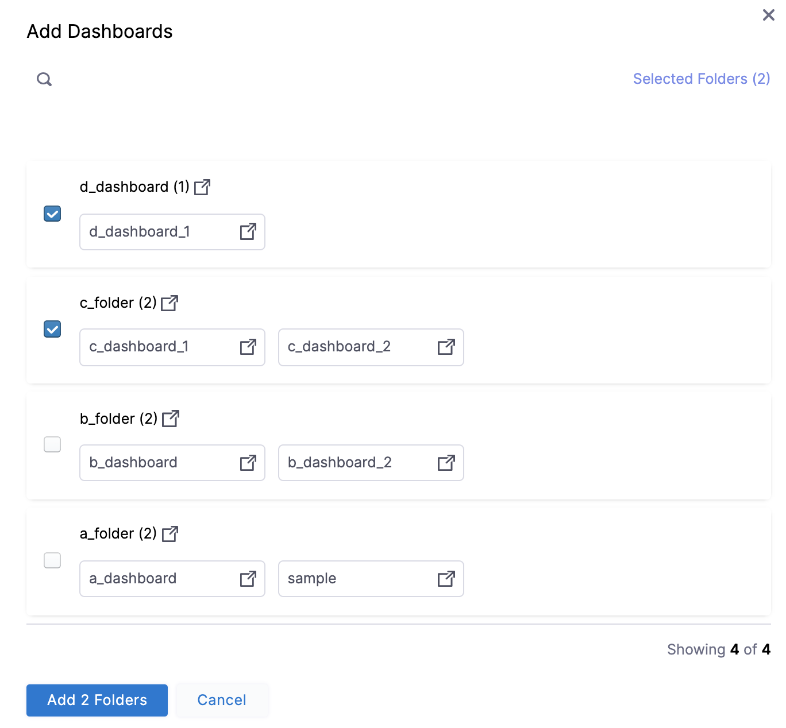
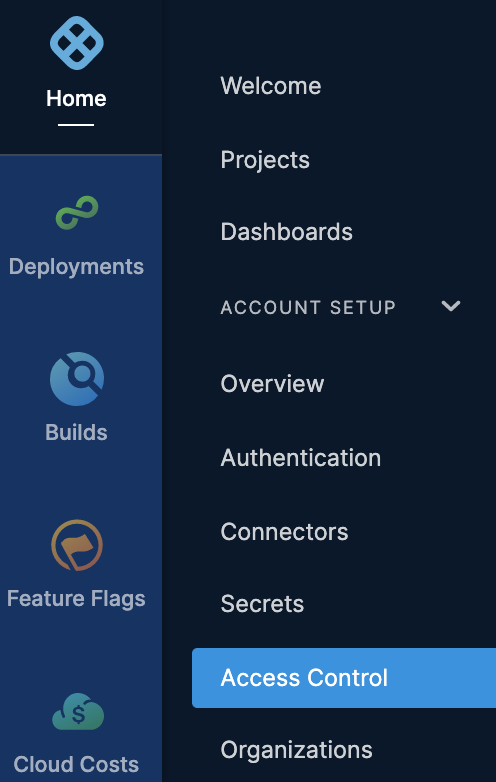
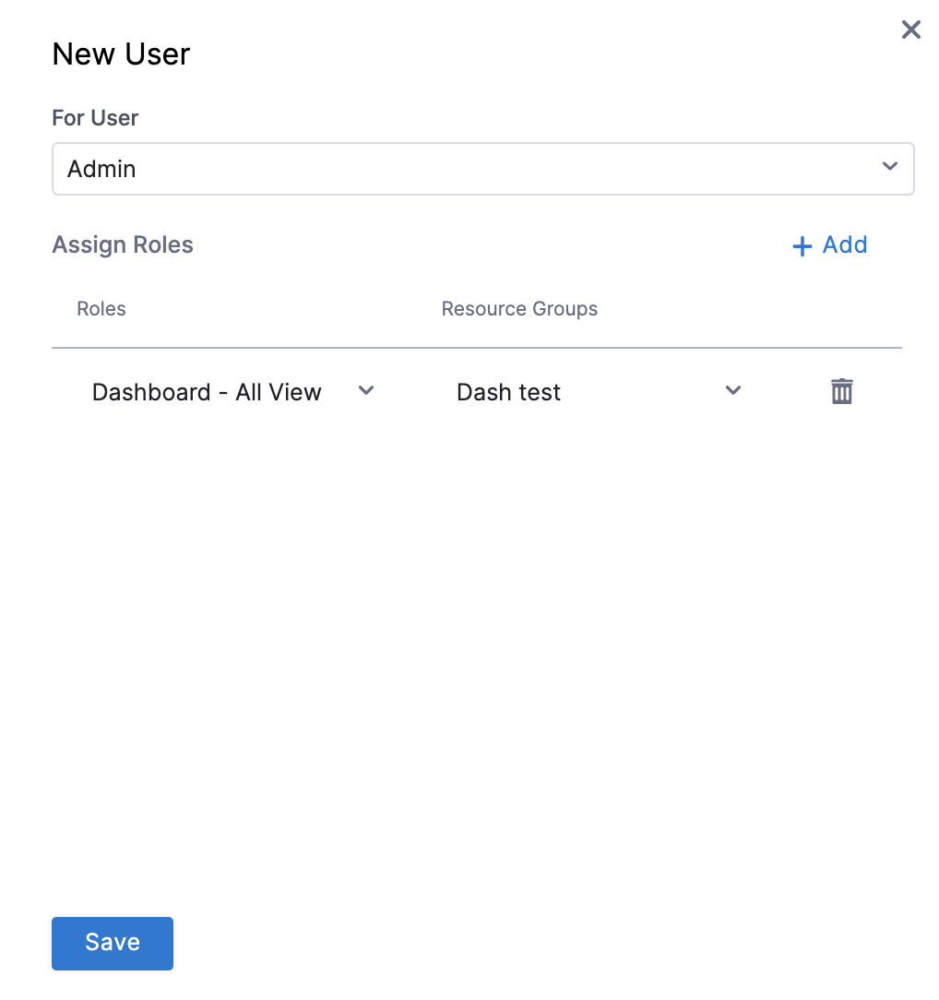

# Manage access control for CCM dashboards

Harness provides Role-Based Access Control (RBAC) that enables you to control user and group access to Harness Resources according to their role assignment.

This topic describes how to add and manage access control for CCM Dashboards.

## Before You Begin

* [RBAC in Harness](/docs/platform/role-based-access-control/rbac-in-harness)

## CCM Dashboards Roles and Permissions

The following roles are needed for CCM Dashboards:

* **Dashboard - Static Editor**: To add, edit, and delete CCM Dashboards
* **Dashboard - All View**: To view all the **By Harness** and **Custom** dashboards

|  **Roles**| **Scope** |**Permissions** |
| --- | --- | --- |
| Dashboard - Static Editor | Folder | <ul><li>Add Dashboard</li><li> Add Tile</li><li> Edit Dashboard</li><li>Delete Dashboard</li></ul>|
| Dashboard - All View | Folder | View CCM Dashboards|
 

## Add and Manage Dashboard - Static Editor Role

Perform the following steps to add and manage permissions **Dashboard - Static Editor** role.

1. In **Harness**, click **Account Settings**, and then click **Access Control**.
2. Click **Roles**.
3. Click **New Role**. The New Role settings appear.
4. In **Name**, enter **Dashboard - Static Editor** and click **Save**.
   
     
5. Click **Shared Resources** for the role that you created.
6. Select the **View** and **Manage** checkbox. This allows you to add dashboards, add tiles, edit dashboards, and delete dashboards.
   
     
7. Click **Apply Changes**.

## Add and Manage Dashboard - All View Role

Perform the following steps to add and manage permissions **Dashboard - All View** role.

1. In **Harness**, click **Account Settings**, and then click **Access Control**.
2. Click **Roles**.
3. Click **New Role**. The New Role settings appear.
4. In **Name**, enter **Dashboard - All View** and click **Save**.
   
     
5. Click **Shared Resources** for the role that you created.
6. Select the **View** checkbox. This will allow you to view all the dashboards.
   
     
7. Click **Apply Changes**.

## Add and Manage Access Control for Resource Groups

Perform the following steps to limit access to specific Dashboards.

1. In **Harness**, click **Account Settings**, and then click **Access Control**.
   
     
2. In **Resource Groups**, click your Resource Group. For more information on adding and managing resource groups, see [Manage Resource Groups](/docs/platform/role-based-access-control/add-resource-groups).  
  
     This section uses **Dashboard - All** as an example.

 1. In **Shared Resources**, select **Dashboards**.  
  
By default, **All Dashboards** is selected.

  

 4. Click **Add Dashboards**.
 5. In **Add Dashboards**, select the folders for which you want to limit the access.  
  
The selected folder may have more than one dashboard. All the dashboards in the selected folders will have the same access.

  
6. Click **Apply Changes**.

## Add and Manage Access Control for Users

Perform the following steps to limit the access to specific Dashboards for different users.

1. In **Harness**, click **Access Control**.
   
     
2. In **User**, in **New User**, select the User for which you want to add or modify the access control. For more information on adding and managing resource groups, see [Manage users](/docs/platform/role-based-access-control/add-users).
3. In **Assign Roles**, select the **Role** from the drop-down list. You can select either **Dashboard - Static Editor** or **Dashboard - All View**.
4. In **Resource Groups**, select the resource group for which you want to add or modiy the access control.
   
     
     
5. Click **Save**.

